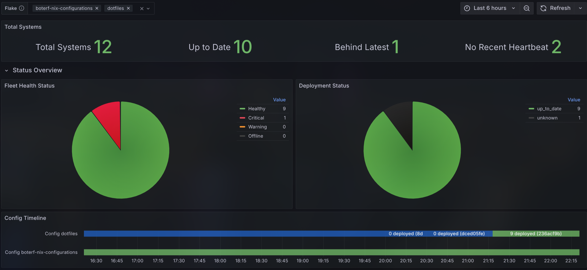
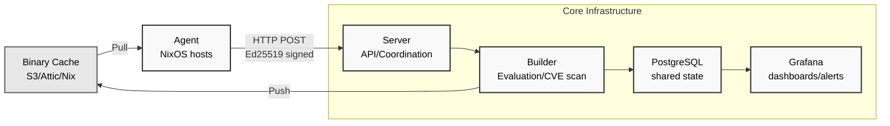

<p align="center">
    
</p>

<p align="center">
  <strong>Compliance and build coordination for NixOS in regulated environments</strong>
</p>

---

## What is Crystal Forge?

Crystal Forge is a self-hosted monitoring, compliance, and build system purpose-built for NixOS fleets. It provides cryptographically-verified system state tracking, automated build coordination, CVE scanning, and policy-based deployment management—designed for organizations that need auditability and control.

**Current Status**: Active development. Core monitoring, build coordination, CVE scanning, and system fingerprinting are functional. Deployment management and advanced compliance features are in progress.



## Key Features

### System Monitoring & Compliance

- **Cryptographic verification**: Ed25519 signatures on all agent communications
- **System fingerprinting**: Hardware, software, network interfaces, and security status tracking
- **Configuration drift detection**: Compare running systems against evaluated configurations
- **Intelligent heartbeats**: Distinguish between liveness signals and actual state changes
- **Agent health monitoring**: Track agent connectivity and state reporting frequency
- **STIG Compliance Modules**: Declarative security controls with 30+ NixOS-native STIG implementations, "secure by default" design, and mandatory justification for disabling controls

### Build Coordination

- **Automatic NixOS evaluation**: Track derivations from Git commits
- **Parallel build processing**: Concurrent derivation evaluation and building with resource limits
- **Binary cache integration**: Push to S3, Attic, or standard Nix caches
- **CVE scanning**: Automated vulnerability assessment with vulnix integration
- **Resource isolation**: SystemD-scoped builds with configurable memory and CPU limits
- **Build queue management**: Track in-progress and completed builds with status visibility

### Deployment Management (In Development)

- **Deployment policies**: Manual, auto_latest, or pinned deployment strategies
- **Fleet tracking**: Monitor which systems are running which configurations
- **Flake integration**: Native support for NixOS flakes and Git repositories
- **Crystal Forge assertion**: Prevent deployments that would disconnect agents

### Infrastructure

- **PostgreSQL backend**: Optimized schema with comprehensive views for compliance data
- **Horizontal scaling**: Multiple servers/builders can share PostgreSQL instance
- **Git webhook integration**: Automatic evaluation on configuration updates
- **Grafana dashboards**: Compliance monitoring and alerting integration

## Architecture



### Components

**Agent (Rust)**

- Runs on each monitored NixOS system
- Monitors configuration changes via inotify
- Collects and reports system fingerprints
- Sends Ed25519-signed state reports to server
- Receives and validates deployment instructions

**Server (Rust)**

- Receives and verifies agent reports
- Processes Git webhooks for configuration updates
- Coordinates build requests with builders
- Provides HTTP API for compliance queries
- Manages deployment policies and state

**Builder (Rust)**

- Evaluates NixOS flakes on demand
- Builds derivations for CVE scanning
- Runs vulnix for vulnerability assessment
- Tracks configuration drift (current vs. latest)
- Manages binary cache uploads

**PostgreSQL**

- Centralized state for system compliance data
- Enables horizontal scaling of servers and builders
- Tracks commits, derivations, systems, and vulnerabilities
- Provides comprehensive views for compliance reporting

## Quick Start

### NixOS Module Configuration

```nix
{
  services.crystal-forge = {
    enable = true;

    # Database configuration
    database = {
      host = "localhost";
      user = "crystal_forge";
      name = "crystal_forge";
      passwordFile = "/run/secrets/db_password";
    };

    # Server component (coordination & API)
    server = {
      enable = true;
      host = "0.0.0.0";
      port = 3000;
    };

    # Builder component (evaluation & builds)
    build = {
      enable = true;
      cores = 12;
      max_jobs = 6;
      max_concurrent_derivations = 8;
      systemd_memory_max = "32G";
      systemd_cpu_quota = 800;  # 8 cores
    };

    # Agent component (system monitoring)
    client = {
      enable = true;
      server_host = "crystal-forge.example.com";
      server_port = 3000;
      private_key = "/var/lib/crystal-forge/host.key";
    };

    # Flakes to monitor
    flakes.watched = [
      {
        name = "infrastructure";
        repo_url = "git+ssh://git@gitlab.com/company/nixos-configs";
        auto_poll = true;
        initial_commit_depth = 10;
      }
    ];

    # Systems to track
    systems = [
      {
        hostname = "server1";
        public_key = "base64-encoded-ed25519-pubkey";
        environment = "production";
        flake_name = "infrastructure";
        deployment_policy = "manual";  # or "auto_latest" or "pinned"
      }
    ];

    # Binary cache configuration
    cache = {
      cache_type = "S3";  # or "Attic" or "Nix"
      push_after_build = true;
      push_to = "s3://my-bucket?region=us-east-1";
      parallel_uploads = 4;
    };
  };
}
```

### Environment-Based Configuration

Crystal Forge can also be configured via environment variables:

```bash
# Server
CRYSTAL_FORGE__SERVER__HOST=0.0.0.0
CRYSTAL_FORGE__SERVER__PORT=3000
CRYSTAL_FORGE__DATABASE__HOST=localhost
CRYSTAL_FORGE__DATABASE__NAME=crystal_forge

# Agent
CRYSTAL_FORGE__CLIENT__SERVER_HOST=crystal-forge.example.com
CRYSTAL_FORGE__CLIENT__PRIVATE_KEY=/var/lib/crystal-forge/host.key

# Builder
CRYSTAL_FORGE__BUILD__CORES=12
CRYSTAL_FORGE__BUILD__MAX_JOBS=6
```

## STIG Compliance Modules

Crystal Forge provides declarative STIG compliance modules that can be imported into downstream NixOS flakes. These modules implement 30+ security controls with "secure by default" design and mandatory justification for deviations.

### Importing STIG Modules

Add Crystal Forge to your flake inputs:

```nix
{
  inputs = {
    crystal-forge = {
      url = "gitlab:crystal-forge/crystal-forge";
      inputs.nixpkgs.follows = "nixpkgs";
    };
  };
}
```

Add STIG modules to your `systems.modules.nixos`:

```nix
systems.modules.nixos = with inputs; [
  crystal-forge.nixosModules.crystal-forge
]
++ (lib.attrValues (lib.filterAttrs (name: _: lib.hasPrefix "stig" name) crystal-forge.nixosModules));
```

### Configuring STIG Controls

**Using presets** (quick compliance posture):

```nix
# Disable all STIG controls with standard justification
crystal-forge.stig-presets.off.enable = true;

# Enable specific preset levels
crystal-forge.stig-presets.low.enable = true;    # Low-severity controls
crystal-forge.stig-presets.medium.enable = true; # Medium-severity controls
crystal-forge.stig-presets.high.enable = true;   # High-severity controls
```

**Fine-grained control** (individual controls):

```nix
crystal-forge.stig = {
  banner.enable = true;
  account_expiry = {
    enable = false;
    justification = [
      "Not applicable in development environment"
      "Reviewed by security team on 2025-01-15"
    ];
  };
};
```

### Control Tracking

All active and inactive controls are automatically tracked for compliance reporting:

```nix
config.crystal-forge.stig.active.banner = {
  srg = ["SRG-OS-000023-GPOS-00006"];
  cci = ["CCI-000048"];
  config = { /* applied NixOS config */ };
};

config.crystal-forge.stig.inactive.account_expiry = {
  srg = ["SRG-OS-000002-GPOS-00002"];
  cci = ["CCI-000016"];
  justification = ["Not applicable in dev environment"];
  config = { /* unapplied config */ };
};
```

## Development

### Dev Environment

```bash
nix develop
```

This provides a complete development environment with:

- PostgreSQL database with all migrations
- Ed25519 keypair generation tools
- Crystal Forge binaries (server, agent, builder)
- Testing infrastructure and pytest environment

### Running Components

```bash
# Start database and server
process-compose up

# In another terminal, run agent
run-agent

# Run in development mode (live code changes)
run-server --dev
run-agent --dev
run-builder --dev
```

### Testing

Crystal Forge includes comprehensive test suites:

```bash
# Run all tests
nix flake check

# Specific test suites
nix build .#checks.x86_64-linux.database    # Database tests
nix build .#checks.x86_64-linux.server      # Server tests
nix build .#checks.x86_64-linux.builder     # Builder tests
nix build .#checks.x86_64-linux.s3-cache    # S3 cache tests
nix build .#checks.x86_64-linux.attic-cache # Attic cache tests

# Run database tests in dev shell
nix develop
server-stack up
run-db-test -vvv -m database
```

## System Requirements

- **Server/Builder**: Linux with Nix and PostgreSQL 12+
- **Agent**: NixOS systems (any recent stable release)
- **Network**: HTTPS recommended for production deployments
- **Resources**: Builder requires sufficient CPU/memory for concurrent evaluations (configurable)

## Data Model

Crystal Forge tracks:

- **Commits**: Git commits in monitored flakes
- **Derivations**: NixOS configurations evaluated from commits (system, dependency types)
- **Systems**: Monitored NixOS hosts with their configurations and policies
- **System States**: Periodic snapshots of running system state (fingerprints, changes)
- **Agent Heartbeats**: Connectivity and health signals from agents
- **CVE Data**: Vulnerabilities found in evaluated configurations
- **Deployment Status**: Current vs. desired configuration state
- **STIG Controls**: Active and inactive compliance controls with justifications

All data is cryptographically verified and immutably logged for audit compliance.

## Compliance Features

- **Audit trails**: Cryptographic proof of system state and changes
- **Configuration tracking**: Git-backed flake versioning with commit history
- **Vulnerability scanning**: Automated CVE detection across fleet
- **Drift detection**: Unauthorized configuration changes identified
- **STIG compliance**: Declarative security control implementation with tracking
- **Fleet dashboards**: Grafana integration for compliance reporting

## Security Model

- **Ed25519 signatures**: All agent-server communication cryptographically verified
- **Hardware fingerprints**: Unique system identification for tamper detection
- **Minimal attack surface**: Agents run with least privilege
- **Encrypted transport**: HTTPS for all network communication
- **Database security**: PostgreSQL with standard access controls and audit logging
- **Secure by default**: STIG modules enabled unless explicitly disabled with justification

## Roadmap

See project issues and pull requests for detailed development plans:

1. **v0.2.0**: Deployment execution and policy enforcement
2. **v0.3.0**: Web-based dashboard (replacing Grafana for core features)
3. **v0.4.0**: Advanced compliance reporting (STIG, NIST, SOC2)
4. **v0.5.0**: Multi-tenant support for managed service providers
5. **Future**: Tvix integration for Rust-native Nix evaluation

## Contributing

Contributions are welcome! Please see project repository for:

- Contribution guidelines
- Development workflow documentation
- Code review process
- Testing requirements

## License

See LICENSE file for details.
