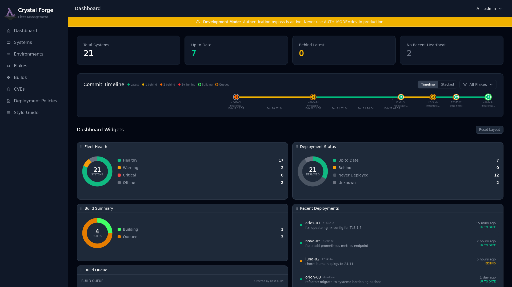
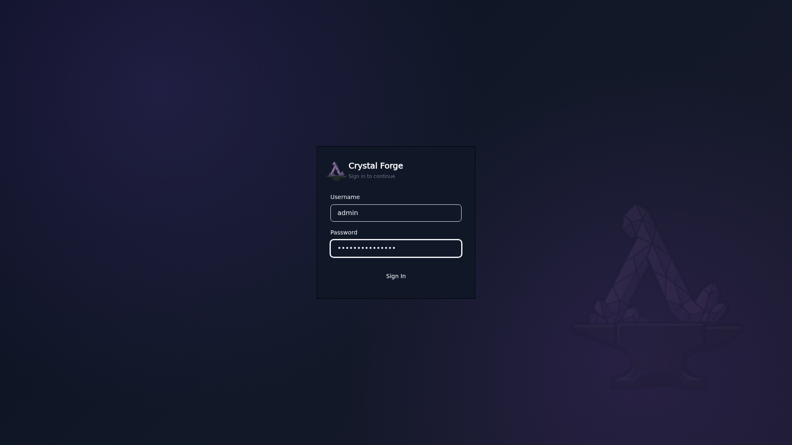
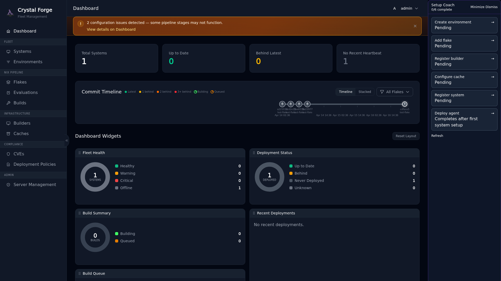
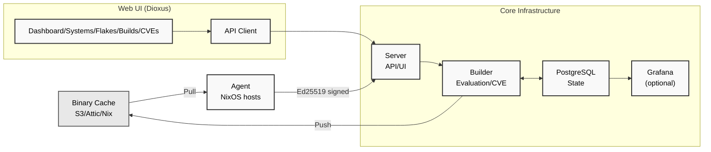

<p align="center">
    
</p>

<p align="center">
  <strong>Monitoring, build coordination, and compliance tooling for NixOS fleets</strong>
</p>

---

## What's New in v0.3.0

Crystal Forge now has a **web-based dashboard** built with Dioxus. The UI is functional and covers the core workflows, but it's still being polished — expect rough edges. This release is aimed at homelabbers and NixOS enthusiasts who want to kick the tires, not regulated production deployments.



### Web UI Views

| View              | Screenshot                                                  | Description                                              |
| ----------------- | ----------------------------------------------------------- | -------------------------------------------------------- |
| **Login**         | [01-login](./docs/screenshots/01-login-page.png)            | Unified login supporting OIDC, Local auth, or Dev mode   |
| **Registration**  | [02-register](./docs/screenshots/02-registration.png)       | First-time admin setup flow                              |
| **Dashboard**     | [06-dashboard](./docs/screenshots/06-dashboard.png)         | Fleet health, build queue, deployments, CVE summary      |
| **Systems**       | [12-systems](./docs/screenshots/12-systems.png)             | Table/card toggle, filtering, status badges, CVE chips   |
| **Flakes**        | [13-flakes](./docs/screenshots/13-flakes.png)               | Git commit timeline, add/remove management               |
| **Environments**  | [14-environments](./docs/screenshots/14-environments.png)   | Color-coded environments with policies                   |
| **Builds**        | [15-builds](./docs/screenshots/15-builds.png)               | Build queue, worker status, history, cancel/force-cancel |
| **Evaluations**   | [26-evaluations](./docs/screenshots/26-evaluations.png)     | Eval queue with cancel buttons, history tab with filters |
| **CVEs**          | [16-cves](./docs/screenshots/16-cves.png)                   | Vulnerability scanning results, severity filters         |
| **Style Guide**   | [17-style-guide](./docs/screenshots/17-style-guide.png)     | Design system reference                                  |

### Authentication Modes

The server supports three authentication modes configured via `services.crystal-forge.server.auth_mode`:

```nix
# Option 1: OIDC (default for production)
services.crystal-forge.server = {
  auth_mode = "oidc";
  oidc = {
    issuerUrl = "https://keycloak.example.com/realms/crystal-forge";
    clientId = "crystal-forge-web";
    clientSecretFile = "/run/secrets/oidc-client-secret";
    redirectUri = "https://forge.example.com/api/auth/oidc/callback";
  };
};

# Option 2: Local username/password (self-hosted)
services.crystal-forge.server.auth_mode = "local";

# Option 3: Dev mode (local development only - NEVER use in production!)
services.crystal-forge.server.auth_mode = "dev";  # Use local, not dev!
```



### Guided Onboarding Coach

First-time admins are greeted with a **non-blocking guided setup coach** that walks through the 6 essential configuration steps:



- **6-Step Guided Tour**: Environment → Flake → Builder → Cache → System → Agent
- **Progressive Field Callouts**: In-context guidance as you fill in each form
- **Progress Tracking**: Live completion status with checkmarks
- **Non-Blocking**: Navigate freely while the coach remains available
- **Minimize/Dismiss**: Collapsible panel with relaunch from Server Management

See the **[Onboarding Guide](./docs/onboarding-guide.md)** for a complete walkthrough.

### Role-Based Access Control

- **Admin**: Full access to all features and settings
- **Operator**: Can manage systems, deployments, and view all data
- **Viewer**: Read-only access to dashboards and reports

### Evaluation Cancellation & History

Cancel stuck or unwanted evaluations without restarting the server:

- **Cancel pending evals**: Immediately remove from the queue
- **Cancel in-progress evals**: Cooperative cancellation — flags the running subprocess which terminates within ~2s
- **Force-cancel**: For evals stuck in the cancelling state
- **Eval history tab**: Paginated view of all completed, failed, and cancelled evaluations with duration, status chips, error details, and re-evaluate action

### CVE Count Accuracy

Evaluation CVE counts in system list, system detail, and all dashboard surfaces now reflect unique CVE IDs per system, preventing inflation from package-derivation fanout where the same CVE appeared across multiple package paths.

### Testing Infrastructure

- **Web UI Integration Tests**: Playwright-based with automated screenshots
- **OIDC VM Tests**: Real Keycloak integration in NixOS VMs
- **Code Metrics**: Complexity and coverage CI jobs

---

## What is Crystal Forge?

Crystal Forge is a self-hosted monitoring, compliance, and build system purpose-built for NixOS fleets. It provides cryptographically-verified system state tracking, automated build coordination, CVE scanning, and policy-based deployment management—built toward the goal of auditability and control in regulated environments.

**Current Status**: v0.3.0 — The core backend is solid and the web UI covers the main workflows, but the UI still has rough edges and a number of planned features aren't implemented yet. Aimed at homelabbers and NixOS enthusiasts who want to run it and help shape it; the compliance and regulated-environment story is still in progress.

---

## Key Features

### System Monitoring & Compliance

- **Cryptographic verification**: Ed25519 signatures on all agent communications
- **System fingerprinting**: Hardware, software, network interfaces, and security status tracking
- **Configuration drift detection**: Compare running systems against evaluated configurations
- **Intelligent heartbeats**: Distinguish between liveness signals and actual state changes
- **Agent health monitoring**: Track agent connectivity and state reporting frequency
- **STIG Compliance Modules**: Declarative security controls with 30+ NixOS-native STIG implementations

### Build Coordination

- **Automatic NixOS evaluation**: Track derivations from Git commits
- **Parallel build processing**: Concurrent derivation evaluation and building with resource limits
- **Binary cache integration**: Push to S3, Attic, or standard Nix caches
- **CVE scanning**: Automated vulnerability assessment with vulnix integration
- **Resource isolation**: SystemD-scoped builds with configurable memory and CPU limits
- **Build queue management**: Track in-progress and completed builds with status visibility

### Deployment Management

- **Deployment policies**: `manual`, `auto_latest`, or `pinned` deployment strategies
- **Deployment strategies**: `immediate_persist` (default) or `boot_only`
- **Fleet tracking**: Monitor which systems are running which configurations
- **Flake integration**: Native support for NixOS flakes and Git repositories
- **Crystal Forge assertion**: Prevent deployments that would disconnect agents
- **Generation tracking**: NixOS generation creation and verification

### Authentication & Authorization

- **OIDC/OAuth2**: Connect to Keycloak, Authentik, Okta, Azure AD, Google, etc.
- **Local auth**: Username/password for self-hosted deployments
- **Dev mode**: Bypass authentication for local development
- **RBAC**: Admin, Operator, Viewer roles with permission guards
- **Session security**: HttpOnly secure cookies, CSRF protection, JIT provisioning

---

## Architecture


```mermaid
flowchart LR
    C["Binary Cache<br/>S3/Attic/Nix"]
    A["Agent<br/>NixOS hosts"]

    subgraph "Core Infrastructure"
        S["Server<br/>API/UI"]
        B["Builder<br/>Evaluation/CVE"]
        P["PostgreSQL<br/>State"]
        G["Grafana<br/>(optional)"]
    end

    subgraph "Web UI (Dioxus)"
        UI["Dashboard/Systems/Flakes/Builds/CVEs"]
        API["API Client"]
    end

    A -->|Ed25519 signed| S
    S --> B
    B -->|Push| C
    C -->|Pull| A
    B <--> P
    P --> G
    UI --> API
    API --> S

    classDef default fill:#f9f9f9,stroke:#333,stroke-width:2px,color:#000
    classDef external fill:#e8e8e8,stroke:#666,stroke-width:2px,color:#000
    class C external
```

### Components

| Component      | Description                                                            |
| -------------- | ---------------------------------------------------------------------- |
| **Agent**      | Runs on each NixOS host, monitors config changes, reports fingerprints |
| **Server**     | API, web UI, coordinates builds, manages deployments                   |
| **Builder**    | Evaluates NixOS flakes, builds derivations, runs CVE scans             |
| **PostgreSQL** | Centralized state, user/role data, compliance history                  |

---

## Quick Start

**New to Crystal Forge?** See the **[Onboarding Guide](./docs/onboarding-guide.md)** for a complete step-by-step walkthrough using the built-in guided setup coach.

### NixOS Module Configuration

```nix
{
  services.crystal-forge = {
    enable = true;

    # Database
    database = {
      host = "/run/postgresql";
      user = "crystal_forge";
      name = "crystal_forge";
      passwordFile = "/run/secrets/db_password";
    };

    # Server (API + Web UI)
    server = {
      enable = true;
      host = "0.0.0.0";
      port = 3000;
      auth_mode = "local";  # or "oidc" for production
    };

    # Builder
    build = {
      enable = true;
      max_concurrent_derivations = 4;
      max_jobs = 4;
      cores_per_job = 4;
      systemd_memory_max = "16G";
    };

    # Agent (on each monitored system)
    client = {
      enable = true;
      server_host = "crystal-forge.example.com";
      server_port = 3000;
      private_key = "/var/lib/crystal-forge/host.key";
    };

    # Flakes to monitor
    flakes.watched = [
      {
        name = "infrastructure";
        repo_url = "git+ssh://git@gitlab.com/company/nixos-configs";
        auto_poll = true;
        initial_commit_depth = 10;
      }
    ];

    # Systems to track
    systems = [
      {
        hostname = "server1";
        public_key = "base64-encoded-ed25519-pubkey";
        environment = "production";
        flake_name = "infrastructure";
        deployment_policy = "manual";
      }
    ];

    # Binary cache
    cache = {
      cache_type = "S3";
      push_after_build = true;
      push_to = "s3://my-bucket?region=us-east-1";
    };
  };
}
```

### OIDC Configuration Example

```nix
services.crystal-forge.server = {
  auth_mode = "oidc";
  oidc = {
    issuerUrl = "https://keycloak.company.com/realms/prod";
    clientId = "crystal-forge";
    clientSecretFile = "/run/secrets/oidc-secret";
    redirectUri = "https://forge.company.com/api/auth/oidc/callback";
    scopes = ["openid" "profile" "email"];
    # Optional: map claims from your provider
    rolesClaim = "groups";
    emailClaim = "email";
    nameClaim = "name";
  };
};
```

### Environment Variables

```bash
# Server
CRYSTAL_FORGE__SERVER__HOST=0.0.0.0
CRYSTAL_FORGE__SERVER__PORT=3000

# Auth
AUTH_MODE=local  # or "oidc"

# OIDC (when AUTH_MODE=oidc)
CRYSTAL_FORGE_OIDC_ISSUER_URL=https://keycloak.example.com/realms/crystal-forge
CRYSTAL_FORGE_OIDC_CLIENT_ID=crystal-forge-web
CRYSTAL_FORGE_OIDC_CLIENT_SECRET=secret
CRYSTAL_FORGE_OIDC_REDIRECT_URI=https://forge.example.com/api/auth/oidc/callback
```

---

## Development

```bash
# Enter development shell
nix develop

# Start database and server
process-compose up

# Start with local OIDC (Keycloak)
nix run .#devScripts.oidc-stack -- up

# Run agent
run-agent

# Development mode with live reload
run-server --dev
run-builder --dev
```

### Web UI Development

```bash
# Build web UI
nix build .#packages.x86_64-linux.web-ui

# Run with hot reload
cd packages/web-ui
trunk serve
```

### Testing

```bash
# All tests
nix flake check

# Specific suites
nix build .#checks.x86_64-linux.database
nix build .#checks.x86_64-linux.server
nix build .#checks.x86_64-linux.builder
nix build .#checks.x86_64-linux.web-ui

# Update screenshots
nix build .#checks.x86_64-linux.web-ui-update
```

---

## STIG Compliance Modules

Crystal Forge provides 30+ NixOS-native STIG implementations:

```nix
# In your flake's nixosModule:
inputs.crystal-forge.nixosModules.crystal-forge

# Enable specific controls
crystal-forge.stig = {
  banner.enable = true;
  # Disable with justification
  account_expiry = {
    enable = false;
    justification = ["Not applicable in development environment"];
  };
};
```

---

## Data Model

- **Commits**: Git commits in monitored flakes
- **Derivations**: NixOS configurations evaluated from commits
- **Systems**: Monitored NixOS hosts with configurations and policies
- **System States**: Periodic fingerprints (hardware, software, network)
- **Agent Heartbeats**: Connectivity and health signals
- **CVE Data**: Vulnerabilities from vulnix scans
- **Deployment Status**: Current vs. desired configuration state
- **STIG Controls**: Active/inactive compliance controls
- **Users & Roles**: Identity mappings, RBAC, sessions

---

## Security Model

- **Ed25519 signatures**: All agent-server communication verified
- **Hardware fingerprints**: Unique system identification
- **Encrypted transport**: HTTPS required
- **Secure by default**: STIG modules enabled unless explicitly disabled
- **Authentication**: OIDC or local with secure sessions
- **Authorization**: RBAC with permission guards on all endpoints
- **Session security**: HttpOnly cookies, CSRF protection, JIT provisioning

---

## Roadmap

**Progress**: 40% complete (59/147 tasks done)

| Version | Status      | Features                                                                        |
| ------- | ----------- | ------------------------------------------------------------------------------- |
| v0.1.0  | Done        | Core monitoring, build coordination, CVE scanning                               |
| v0.2.0  | Done        | Deployment execution, policy enforcement, generations                           |
| v0.3.0  | Done        | Web UI (functional, not fully polished), OIDC auth, RBAC, eval cancel + history |
| v0.4.0  | Backlog     | UI polish, advanced compliance reporting                                        |
| v0.5.0  | Backlog     | Multi-tenant support                                                            |
| Future  | Backlog     | Tvix integration                                                                |

### Active Milestones

1. **m-0**: Critical bugs and stability
2. **m-1**: Development infrastructure
3. **m-2**: Code quality and architecture (refactoring)
4. **m-3**: User interface foundation
5. **m-14**: Identity and access management (current focus)

---

## Contributing

See [AGENTS.md](./AGENTS.md) for development workflow and contribution guidelines.

---

## License

See LICENSE file for details.
