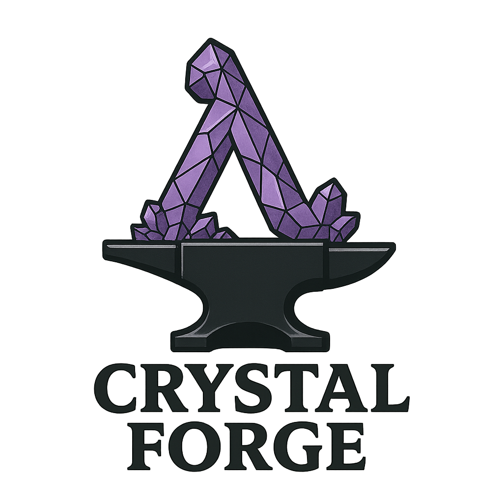
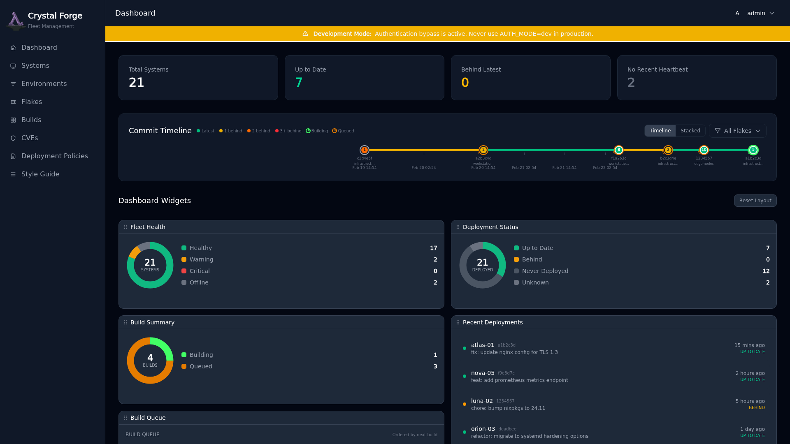

<p align="center">
    
</p>

<p align="center">
  <strong>Monitoring, build coordination, and compliance tooling for NixOS fleets</strong>
</p>

---

Crystal Forge is a self-hosted monitoring, compliance, and build system
purpose-built for NixOS fleets. It provides cryptographically-verified system
state tracking, automated build coordination, CVE scanning, and policy-based
deployment management, built toward the goal of auditability and control in
regulated environments.

**Current status**: v0.3.0. The core backend is solid and the web UI covers the
main workflows, but the UI still has rough edges and a number of planned
features are not implemented yet. Crystal Forge is aimed at homelabbers and
NixOS enthusiasts who want to run it and help shape it. The compliance and
regulated-environment story is still in progress.



## Features

- **System monitoring**: Ed25519-signed agent reports, system fingerprinting,
  drift detection, and heartbeat tracking.
- **Build coordination**: Automatic NixOS evaluation from Git commits,
  parallel builds with resource limits, and binary cache push (S3, Attic, or
  standard Nix caches).
- **CVE scanning**: Automated vulnerability assessment with vulnix.
- **Deployment management**: Per-system deployment policies and strategies,
  fleet tracking, and generation verification.
- **Compliance**: Declarative STIG modules for NixOS, compliance bundles, and
  POA&M tracking.
- **Web UI and access control**: A Dioxus dashboard with OIDC, local, or dev
  authentication and Admin, Operator, and Viewer roles.

## Documentation

The project knowledge base is the
[Open Knowledge Format](https://github.com/GoogleCloudPlatform/open-knowledge-format)
bundle in [docs/knowledge/](./docs/knowledge/). Start at the
[knowledge index](./docs/knowledge/index.md).

| Topic | Concept |
| ----- | ------- |
| What Crystal Forge is and its feature set | [Project introduction and key features](./docs/knowledge/overview/project-introduction-and-key-features.md) |
| System orientation | [System overview](./docs/knowledge/overview/system-overview.md) |
| Components and data flow | [Ecosystem architecture summary](./docs/knowledge/architecture/ecosystem-architecture-summary.md) |
| First-time setup | [Onboarding: first-time setup prerequisites](./docs/knowledge/operations/onboarding-first-time-setup-prerequisites.md) |
| NixOS module example | [NixOS module configuration quick start](./docs/knowledge/operations/nixos-module-configuration.md) |
| Sign-in configuration | [Authentication modes and OIDC configuration examples](./docs/knowledge/operations/authentication-modes-and-oidc-configuration.md) |
| Local development and tests | [Development environment commands](./docs/knowledge/operations/development-environment-commands.md) |
| v0.3.0 release notes | [Crystal Forge v0.3.0 release notes](./docs/knowledge/overview/release-notes-v0-3-0.md) |
| Release plan | [Release roadmap and active milestones](./docs/knowledge/overview/release-roadmap-and-milestones.md) |

## Quick Start

Enter the development shell and start a local stack:

```bash
nix develop
server-stack up
```

For a NixOS deployment, start from the
[NixOS module configuration quick start](./docs/knowledge/operations/nixos-module-configuration.md).
For a guided first run, follow the onboarding concepts that begin with
[first-time setup prerequisites](./docs/knowledge/operations/onboarding-first-time-setup-prerequisites.md).

## Contributing

See [AGENTS.md](./AGENTS.md) for development workflow and contribution guidelines.

See also [CONTRIBUTING.md](./CONTRIBUTING.md).

## License

See LICENSE file for details.
