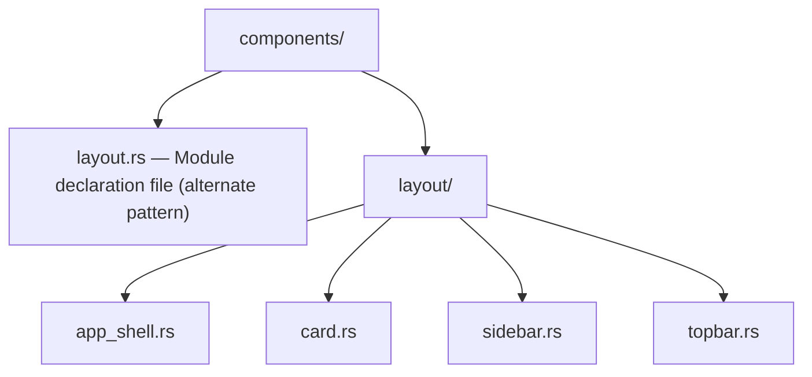
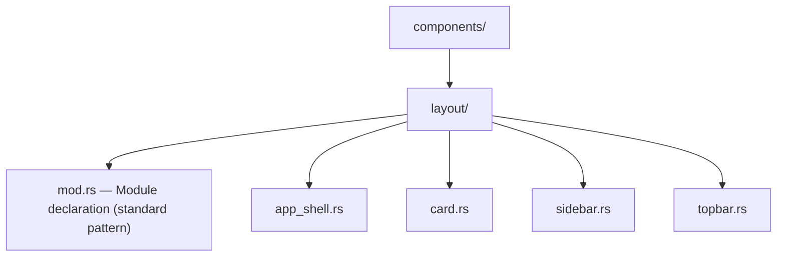

## Description

<!-- SECTION:DESCRIPTION:BEGIN -->
## Problem
The components/layout module uses an inconsistent pattern compared to other component modules.

## Current Structure (Inconsistent)

## Target Structure (Standard)

## Other modules use the standard pattern:
- components/dashboard/mod.rs
- components/charts/mod.rs
- components/filters/mod.rs
- components/modals/mod.rs
- components/tables/mod.rs

## Acceptance Criteria
<!-- AC:BEGIN -->
- [ ] #1 Delete components/layout.rs
- [ ] #2 Create components/layout/mod.rs with same content
- [ ] #3 All imports continue to work
- [ ] #4 Build passes: nix build .#checks.x86_64-linux.web-ui
<!-- SECTION:DESCRIPTION:END -->

<!-- AC:END -->

## Implementation Notes

<!-- SECTION:NOTES:BEGIN -->
Renamed components/layout.rs to components/layout/mod.rs to match standard module pattern used by other component modules.

## Already Complete
The layout module was already correctly structured:
- components/layout/mod.rs exists and properly exports all components
- No components/layout.rs file exists (old pattern removed)

## Verified
- All imports continue to work
- Build passes
<!-- SECTION:NOTES:END -->
