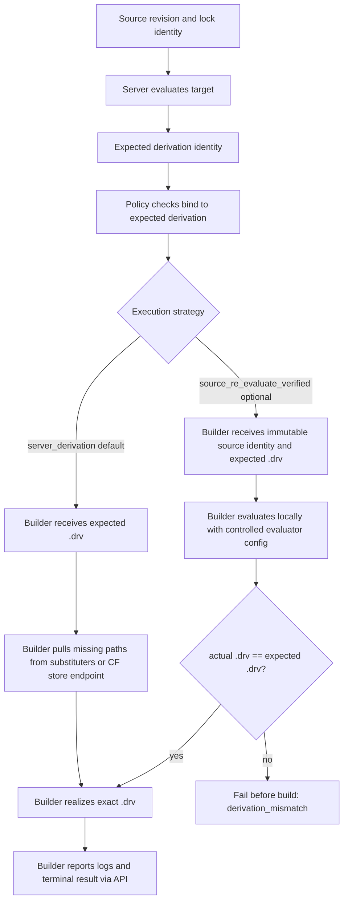
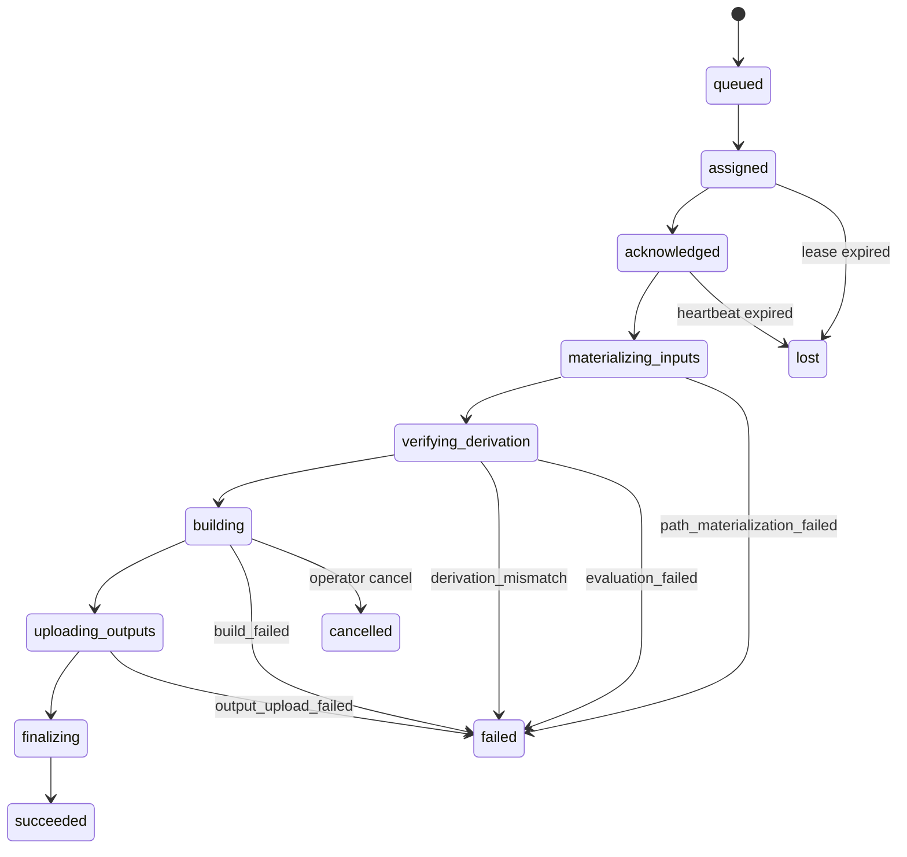

# Remote Builder Architecture Status and Follow-up Plan

## Current status after TASK-375

TASK-375 restores the API-only remote builder path enough for hotfix validation:

- Builders resolve identity through the server API instead of direct database fallback.
- Builder public keys can be persisted through the Builders UI.
- Remote builders receive build jobs over the builder API.
- The job payload includes the server-evaluated derivation/build payload so the builder does not need database access.
- Builders report logs, progress, completion, cancellation, and failure over HTTP/WebSocket APIs.
- Failure reporting has been hardened so authenticated build-failure reports should fail the job rather than leaving it stuck in `building` because of a payload mismatch.

The immediate production model remains:

```text
server_derivation
```

In this model, Crystal Forge evaluates centrally, records the expected derivation, applies policy to that expected derivation, and instructs the remote builder to realize exactly that derivation.

## Problem discovered during TASK-375 validation

The difficult part is not central evaluation itself. The difficult part is transporting the server-evaluated derivation and its input closure to a remote builder that does not share the server `/nix/store`.

The current bootstrap path contains temporary mechanisms:

1. Server attempts to publish the evaluated `.drv` requisite closure to the assigned cache.
2. Builder then realizes the `.drv` and lets Nix use substituters.
3. If cache publishing fails, server can export a derivation-closure archive and builder imports it.

This path exposed several operational risks:

- Large NixOS closures can contain tens of thousands of paths.
- One large `nix-store --export` can hit argument-size limits unless chunked.
- A monolithic archive may be multi-GiB and memory-heavy if buffered.
- Synchronous Attic publication makes cache credentials, cache availability, and `attic` runtime availability part of job bootstrap.
- Bootstrap failures can happen before the actual Nix build starts.
- Job state needs to distinguish materialization failures from actual build failures.

## Recommended direction

Keep `server_derivation` as the authoritative production default, but replace monolithic closure/archive transport with pull-based Nix store/substituter transport.

Also add an optional explicit source strategy named:

```text
source_re_evaluate_verified
```

Do not silently fall back between strategies. Any fallback should become a new explicit attempt created by scheduler policy.

## Strategy overview



## Follow-up tasks

### TASK-375.3: pull-based store transport for `server_derivation`

Goal: keep central/server-authoritative evaluation, but stop using one giant archive as the normal fallback path.

Expected direction:

- Builder realizes the server-authorized `.drv`.
- Missing paths are pulled individually using normal Nix substituter/store semantics.
- Crystal Forge may expose a path-oriented store/substituter endpoint for authorized job paths.
- Attic remains a durable cache/asynchronous cache destination, not mandatory synchronous bootstrap.
- Materialization failures become explicit attempt states and do not leave jobs stuck as `building`.

Conceptual substituter order:

```text
1. Crystal Forge job-scoped store/substituter endpoint
2. Organization Attic cache
3. cache.nixos.org
4. Other approved caches
```

### TASK-375.4: verified source re-evaluation strategy

Goal: allow a builder to evaluate pinned source locally without weakening Crystal Forge's policy/authorization guarantee.

Expected direction:

- Server still evaluates first and records expected derivation identity.
- Builder obtains immutable source identity, not just a mutable branch.
- Builder evaluates locally under controlled Nix settings.
- Builder compares local derivation identity against the server-expected derivation.
- Builder builds only when they match.
- Mismatch fails before build with `derivation_mismatch`.

Example manifest fields:

```text
strategy = source_re_evaluate_verified
source_archive_url
source_nar_hash
git_commit
flake_lock_hash
flake_target
expected_drv_path
expected_drv_nar_hash
expected_output_paths
evaluator_fingerprint
```

## Strategy comparison

| Area | server_derivation | source_re_evaluate_verified |
| --- | --- | --- |
| Production default | Yes | No, optional |
| Server-authoritative evaluation | Strong | Strong only after derivation match |
| Builder needs source credentials | No | Prefer job-scoped source archive/token |
| Store transport pressure | High until pull-based transport exists | Lower for server-evaluated closure transport |
| Evaluation duplication | Low | Higher |
| Nix evaluator sensitivity | Centralized | Must control/record builder evaluator config |
| Policy binding | Directly to expected `.drv` | Must compare local `.drv` to expected `.drv` |
| Best use | Production authoritative builds | Large/expensive transport cases with controlled builders |

## Recommended attempt phases

Remote build attempts should avoid treating all pre-build work as `building`.

Suggested phases:



Useful error classes:

```text
source_fetch_failed
source_hash_mismatch
evaluation_failed
derivation_mismatch
substituter_unavailable
path_materialization_failed
build_failed
output_upload_failed
builder_lost
protocol_error
cancelled
```

## Design principles going forward

- Keep builder processes API-only.
- Keep direct database access server-side only.
- Keep `server_derivation` as production default until another strategy is explicitly selected.
- Do not silently fall back between strategies inside a single attempt.
- Prefer path-oriented, streaming, retryable Nix transport over monolithic closure archives.
- Prefer immutable source archives/tokens over broad Git credentials for source-based strategies.
- Record expected and actual derivation identities for auditability.
- Treat durable cache publication as asynchronous infrastructure unless a specific job policy requires otherwise.
