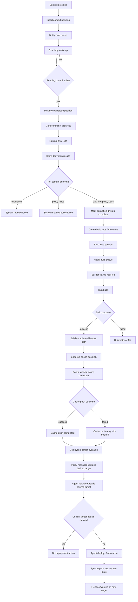

# Commit -> Eval -> Build -> Cache -> Deploy Flow

This diagram explains how Crystal Forge processes a commit from discovery to deployment using the event-driven queue flow.

## Mermaid Flowchart

## Quick Explanation

- Commits enter the eval queue and trigger immediate processing through `QueueNotifier`.
- Evaluation is commit-level, but system evaluation happens in parallel via `nix-eval-jobs`.
- Only systems that pass evaluation and policy become buildable derivations.
- Build jobs are claimed atomically by builders to avoid race conditions.
- Successful builds create cache-push jobs; cache push has retries with backoff.
- Deployment is pull-based: agents receive `desired_target` on heartbeat and converge to it.
