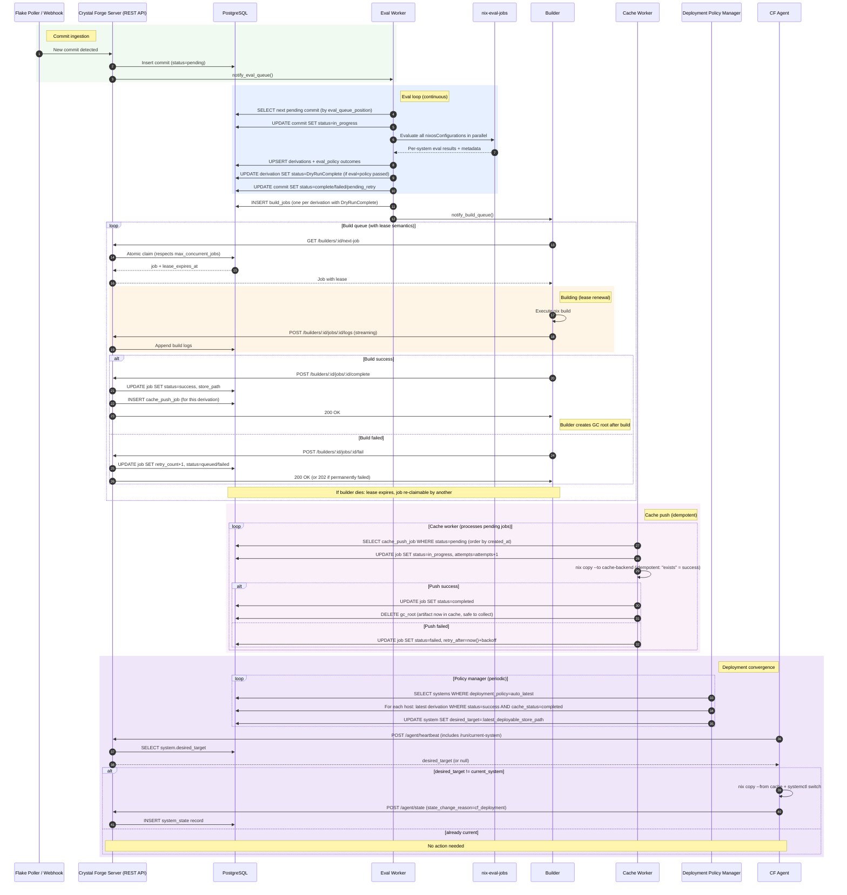

# Commit -> Eval -> Build -> Cache -> Deploy Sequence

This sequence diagram shows who talks to whom and in what order.

## Mermaid Sequence Diagram

## Reading Guide

### Key Architectural Decisions

1. **All DB writes go through API**: Builders, eval workers, and cache workers never write to DB directly. This provides authentication, authorization, and a central place for idempotency logic.

2. **Job lease semantics**: When a builder claims a job, it receives a lease (`lease_expires_at`). If the builder dies, the lease eventually expires and the job can be re-claimed by another builder (at-least-once delivery). Builders should be idempotent when re-running work.

3. **Eval produces partial results**: A commit can be "complete" but only some systems may have `DryRunComplete` derivations. Build jobs are only created for derivations that passed both evaluation AND policy checks.

4. **Eval policy vs Deployment policy**:
   - **Eval policy** (checked during eval): Is this system allowed to be built? (e.g., CF agent must be enabled)
   - **Deployment policy** (checked by DPM): Which version should this host run? (e.g., auto_latest, manual, pinned)

5. **Cache push is idempotent**: Pushing the same store path twice is safe - the cache backend returns "already exists" which we treat as success.

6. **"Deployable" definition**: A derivation is deployable when:
   - Build status = success
   - Cache push status = completed (artifact in binary cache)
   - (Implicit) Policy allows deployment to that host

7. **GC root lifecycle**: Builder creates a GC root after successful build to prevent Nix from garbage-collecting the output before it reaches the cache. Cache worker removes the GC root only after successful push.

8. **desired_target is per-host**: The DPM sets `desired_target` individually for each system, allowing different hosts to be on different commits ("partial rollouts" or "canary deployments" are supported via manual/pinned policies).
