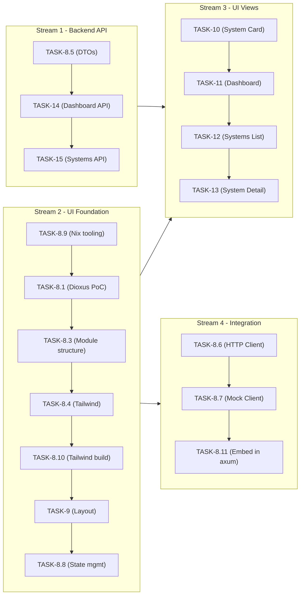

## Description

Build initial web interface for Crystal Forge management using Dioxus 0.7 (web target) and Tailwind CSS. Web UI lives in a separate crate at `packages/web-ui/` (server has native-only deps incompatible with wasm32). API DTOs in `packages/default/src/api/models.rs`, with matching client-side types in the web-ui crate. TUI deferred to a future milestone.

## Success Criteria

- Dioxus framework integrated (web target only; TUI deferred)
- Dashboard view functional with fleet metrics (polling-based updates)
- System list and detail views complete
- Backend APIs (dashboard + systems) implemented and documented
- UI accessible via web browser (embedded in axum server)
- Responsive design for mobile and desktop (Tailwind CSS)
- Separate API DTOs decoupled from DB models

## Deferred to Future Milestones

- **TUI interface** (Ratatui-based) - TASK-8.2 cancelled for m-3
- **User authentication and authorization** - requires dedicated task design
- **WebSocket real-time updates** - polling (30s) used for v1
- **Charts/visualizations** (donut charts, etc.) - stretch goal, simple counters for v1

## Tasks

- TASK-8: UI Development - Foundation and Architecture
  - TASK-8.1: Dioxus Proof of Concept - Web Target
  - ~~TASK-8.2: Dioxus Proof of Concept - TUI Target~~ (Cancelled)
  - TASK-8.3: Create UI Module Structure within packages/default
  - TASK-8.4: Implement Design System - Tailwind CSS Dark Theme
  - TASK-8.5: Build API Client - Define Data Models (API DTOs)
  - TASK-8.6: Build API Client - HTTP Client Implementation
  - TASK-8.7: Build API Client - Mock Client for Testing
  - TASK-8.8: Implement State Management with Signals
  - TASK-8.9: Add Dioxus/Trunk Tooling to Nix Dev Shell (NEW)
  - TASK-8.10: Add Tailwind CSS Build Pipeline (NEW)
  - TASK-8.11: Embed Built UI Assets in Axum Server (NEW)
- TASK-9: UI Components - Layout Components
- TASK-10: UI Components - System Card Component
- TASK-11: Dashboard View - Fleet Summary
- TASK-12: Systems List View - Table and Cards Toggle
- TASK-13: System Detail View - Overview Tab
- TASK-14: Backend API - Dashboard Endpoints
- TASK-15: Backend API - Systems Endpoints

## Execution Streams (Parallelized)

Streams 1 and 2 can start immediately. Stream 3 starts after streams 1 and 2
converge. Stream 4 starts after stream 2. An arrow means "then".

## Dependencies

- Requires m-2 (Code Quality & Architecture) for stable backend
- Backend APIs must be implemented alongside UI components
- TASK-8.9 (Nix tooling) is the true first task - unblocks everything else
