# Web-UI Component Reorganization

## Goal
Reorganize the web-ui crate to follow best practices for component/view separation, eliminating duplicate definitions and extracting reusable components from large view files.

## Current State

| View File | Current Lines | Target Lines | Reduction |
|-----------|---------------|--------------|-----------|
| dashboard.rs | 1921 | ~300-400 | 80% |
| system_detail.rs | 2817 | ~800 | 72% |
| flakes_list.rs | 2203 | ~500 | 77% |
| systems_list.rs | 2227 | ~400-500 | 80% |
| builds.rs | 1153 | ~300 | 74% |
| policies.rs | 835 | ~300 | 64% |
| environments_list.rs | 891 | ~400 | 55% |
| **Total** | **12,365** | **~3,500** | **72%** |

## Tasks

### High Priority (Critical Duplicates)
- [ ] TASK-46: Clean up dashboard.rs duplicate components
- [ ] TASK-47: Extract components from systems_list.rs

### Medium Priority (Large Files)
- [ ] TASK-48: Standardize layout module to use mod.rs pattern
- [ ] TASK-49: Move flake_timeline.rs to components/flake/
- [ ] TASK-54: Extract components from system_detail.rs

### Low Priority (Placeholder Modules)
- [ ] TASK-50: Extract build components from views/builds.rs
- [ ] TASK-51: Extract diff viewer components
- [ ] TASK-52: Extract policy components from views/policies.rs
- [ ] TASK-53: Extract flake components from views/flakes_list.rs
- [ ] TASK-55: Extract components from environments_list.rs
- [ ] TASK-56: Create AddFlakeForm component in components/forms/

## Component Directory Structure

### After Reorganization

```mermaid
%% diagram-id: backlog-milestone5-component-reorganization-tree
flowchart TD
    root["components/"]
    root --> charts["charts/"] --> charts_mod["mod.rs"]
    charts --> donut["donut.rs — ✓ Already complete"]
    root --> dashboard["dashboard/"] --> dashboard_mod["mod.rs"]
    dashboard --> queue["build_queue.rs — ✓ Already exists"]
    dashboard --> summary["build_summary.rs — ✓ Already exists"]
    dashboard --> cve["cve_summary.rs — ✓ Already exists"]
    dashboard --> deployment["deployment_status.rs — ✓ Already exists"]
    dashboard --> health["fleet_health.rs — ✓ Already exists"]
    dashboard --> recent["recent_deployments.rs — ✓ Already exists"]
    root --> diff["diff/"] --> diff_mod["mod.rs"]
    diff --> viewer["diff_viewer.rs — From system_detail.rs"]
    diff --> friendly["friendly_diff.rs — From flakes_list.rs"]
    root --> filters["filters/"] --> filters_mod["mod.rs"]
    filters --> dropdown["dropdown.rs — ✓ Already exists"]
    filters --> toggle["view_toggle.rs — ✓ Already exists"]
    filters --> env_filter["environment_dropdown.rs — From systems_list.rs"]
    filters --> health_filter["health_dropdown.rs — From systems_list.rs"]
    filters --> deploy_filter["deployment_dropdown.rs — From systems_list.rs"]
    root --> forms["forms/"] --> forms_mod["mod.rs"]
    forms --> add_system["add_system.rs — From systems_list.rs"]
    forms --> add_flake["add_flake.rs — From flakes_list.rs"]
    root --> flake["flake/"] --> flake_mod["mod.rs"]
    flake --> timeline["flake_timeline.rs — Move from components/"]
    flake --> card["flake_card.rs — From flakes_list.rs"]
    flake --> history["flake_history.rs — From flakes_list.rs"]
    root --> layout["layout/"] --> layout_mod["mod.rs — Rename from layout.rs"]
    layout --> shell["app_shell.rs"]
    layout --> layout_card["card.rs"]
    layout --> sidebar["sidebar.rs"]
    layout --> topbar["topbar.rs"]
    root --> modals["modals/"] --> modals_mod["mod.rs"]
    modals --> confirm["confirm_dialog.rs — ✓ Already exists"]
    modals --> key_pair["key_pair.rs — From systems_list.rs"]
    modals --> remove["remove_system.rs — From systems_list.rs"]
    root --> policy["policy/"] --> policy_mod["mod.rs"]
    policy --> policy_card["policy_card.rs — From policies.rs"]
    policy --> editor["policy_editor.rs — From policies.rs"]
    root --> system["system/"] --> system_mod["mod.rs"]
    system --> system_card["system_card.rs — ✓ Already exists"]
    system --> others["(others from system_detail.rs)"]
    root --> tables["tables/"] --> tables_mod["mod.rs"]
    tables --> sortable["sortable_header.rs — ✓ Already exists"]
    tables --> systems_table["systems_table.rs — From systems_list.rs"]
    root --> builds["builds/"] --> builds_mod["mod.rs"]
    builds --> build_components["(components from builds.rs)"]
    root --> loading["loading.rs — ✓ Generic utility"]
    root --> stat["stat_card.rs — ✓ Generic utility"]
    root --> badge["status_badge.rs — ✓ Generic utility"]
    root --> grid["widget_grid.rs — ✓ Generic utility"]
```

## Success Criteria
- [ ] All view files under 500 lines (except system_detail which may be ~800)
- [ ] No duplicate component definitions
- [ ] All component directories properly populated (no empty TODOs)
- [ ] Consistent module pattern (mod.rs) across all component directories
- [ ] Build passes: `nix build .#checks.x86_64-linux.web-ui`
- [ ] All existing functionality preserved
