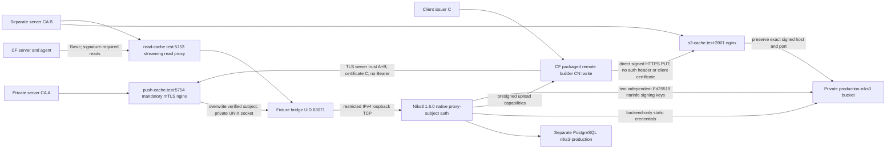

# Niks3 cache integration

Run from the task worktree:

```sh
nix eval --raw .#checks.x86_64-linux.niks3-cache.drvPath
nix build --no-link -L .#checks.x86_64-linux.niks3-cache
```

While new files are untracked, use `path:.#` instead of `.#`. Git-backed flake
evaluation excludes untracked files, including new Rust modules and migrations.
Do not update the lock file to make this check pass.

The pinned package is **Niks3 1.6.0**. Crystal Forge overrides its `nix`
dependency with `pkgs.nix-eval-jobs.nix`. This retains Niks3's upstream version
and preserves the exact evaluator Nix when the CLI starts a child process.

## CI

The `.gitlab-ci.yml` `flake-check` matrix includes `CHECK_NAME: niks3-cache`.
The generated job `flake-check: [niks3-cache]` is blocking on merge requests and
`main`, uses the existing `nix` runner tag, and builds
`.#checks.x86_64-linux.niks3-cache`. The assigned runner must provide KVM to the
Nix builder. Report the exact job's runner or KVM failure; a fixture run or
another check does not replace this gate. Matrix membership and earlier local
runs do not establish a pass for the exact commit under review.

## Full integration gate

The check uses five isolated NixOS VMs: legacy cache, production-shaped cache,
server, remote API builder, and agent. PostgreSQL and Garage data exist only in
the VM disks. The host's development database is not used. Closure-only Nix store images prevent the
agent from seeing outputs through a host-store mount. KVM must be available to
the Nix builder.

Queue records and evaluated identities are seeded; flake evaluation is not
part of this check. Each variant dispatches a real derivation to the packaged
remote builder. The check requires a successful signed completion from that
registered builder and
a completed publication for the dispatch-bound destination ID. The server must
verify readability and signatures in its temporary store before recording
publication. The real agent receives its read configuration over signed
heartbeats through a verified HTTPS proxy and
pulls an output that is absent from its local store.

Every variant has an assigned Niks3 destination and an enabled public global
`Http` destination named `a-global-public`. The global destination sorts first.
Builder dispatch and completed publication must retain the assigned ID and
database provenance. A signed capable heartbeat must return only the assigned
read cache. Before starting the packaged agent, the fixture sends a genuinely
legacy flat JSON body with no `capabilities` field, signed with the registered
Ed25519 key. Spoofed capability headers do not change that body. The response
must have a null desired target and empty runtime caches, with no global
fallback, including for public Niks3. The pending request must remain unclaimed
and the stored desired target must remain intact. The actual packaged agent
then advertises support in its signed body, claims that request, and pulls.

| Variant | Write authentication | Read endpoint |
| --- | --- | --- |
| `token-public` | Static token file | Public native Niks3 read proxy |
| `mtls-public` | Write client certificate | Public native Niks3 read proxy |
| `token-private` | Static token file | Read-only mTLS proxy |
| `mtls-private` | Write client certificate | Read-only mTLS proxy |
| `token-public-proxy` | Static token file | Public read-only TLS proxy |
| `mtls-split` | Mandatory issuer-C certificate at private-CA-A API frontend | Separate Basic-authenticated TLS read proxy and direct presigned HTTPS S3 uploads under CA B |

## Sixth topology: separate server trust and client identity

The optional `makeNiks3TestCredentials { productionPki = true; ... }` export
`productionWritePki` provides `roots` (A+B), `serverA`, `serverB`, `clientCA` (C),
`writeClient.{cert,key}`, and `replacementClient.{cert,key}`. The two client
identities have different keys and certificates, but both have `CN=write` and
issuer C. `apiServer`, `s3Server`, `readServer`, `wrongSubject`, `wrongIssuer`,
`signingPublicKeys`, and `signingPrivateKeys` expose the other fixture roles.
Default helper callers keep the original single-issuer topology.



The A+B bundle verifies server certificates. It excludes client issuer C.
Nginx uses C separately to verify client identities. Only B is installed as an
additional system root on CF server/builder roles; A remains private. The Basic
read proxy also uses B, which the standalone agent trusts as a system root.
The native server also trusts B for its own backend S3 connections.

Pinned Niks3 1.6.0 has TCP listeners and documented verified-subject proxy
authentication, but no UNIX listener. The fixture-owned `socat` bridge adapts
the private UNIX channel to `127.0.0.1:5755`. Socket mode is `0660`, directory
mode is `0750`, and nginx shares the dedicated proxy group. An nftables output
rule permits native-origin TCP only for bridge UID 63071. External clients,
root test clients, and `nobody` cannot bypass the certificate frontend.
This adaptation is test infrastructure; Crystal Forge does not require a bridge.

The frontend uses `ssl_verify_client on`, so discovery also requires a valid
issuer-C certificate. It overwrites verification/subject headers and removes
incoming `Authorization` before forwarding. Native Niks3 enforces `CN=write`.
A valid issuer-C certificate with the wrong subject can obtain public metadata,
but its protected upload request returns 401. Missing certificates, wrong
issuers, and forged incoming verification headers fail at the frontend.
The startup API token remains private to the native backend and is not supplied
to pushers. No Bearer translation is used.

Garage remains private. Unsigned PUT returns 403. The S3 TLS proxy does not
request client certificates or Basic authentication. It accepts only the exact
configured authority `s3-cache.test:3901` and forwards that same Host, preserving
SigV4 validation. Its observer emits booleans and status only, never URI, query,
presigned response body, Authorization contents, token, key, or PEM values.
Native backend-authenticated S3 traffic is distinguished from direct pusher PUTs.

The authoritative gate includes real CF jobs with A-only and B-only configured
write roots. Neither may produce a completed cache-publication row. The Go CLI
replaces system roots when `--ca-cert` is present: A-only can reach the API but
cannot verify B's S3 server, even though B is installed in system trust. B-only
cannot verify the private-A API. A+B must complete a real remote build and exact
destination-ID publication, followed by CVE materialization, signature-required
agent pull, provenance regressions, and the existing cleanup barriers.
Client private keys are encrypted in CF rows. The mTLS dispatch has no token or
static S3 keys. Live CLI inspection projects only booleans for protected
`--client-cert`, `--client-key`, and `--ca-cert` files, absent token flags, absent
AWS/token environment, and the expected root bundle.

The infrastructure-only proof is available without a server-package rebuild:

```sh
sh packages/ci/public-cache-build.sh --no-link -L .#checks.x86_64-linux.niks3-cache.production-fixture --max-jobs 1 --cores 2
```

It cannot replace the full six-variant CF gate. Discovery metadata is not write
authorization evidence. Absent native write/pins capability keeps the UI write
authorization result **Untested**.

### Basic read confinement

Only the full gate opts into `basicRead = true`. Shared helper defaults and the
original five variants retain public or mTLS reads. The sixth read frontend
streams native NARs without redirects, verifies Basic authentication, and strips
Authorization before forwarding to the backend. Missing or incorrect credentials
return 403. Read credentials never authenticate the write API or S3 uploads.

The packaged native Nix exposes `cf-netrc-authority`. Basic consumers probe the
actual executable before preparing credentials, then select a mode-0600 netrc
inside a mode-0700 owned directory and the exact HTTPS origin through child-local
settings. The gate copies the complete closure into two fresh stores, checking
each signing key independently with `require-sigs = true`. Actual server
publication, CVE materialization and packaged-agent copies exercise the shared
consumer path. A signed old-agent request with Niks3 support but no Basic support
must withhold both cache and target and leave the request pending.

The existing gate runs eight native negative operations: 301 same-authority path,
302 cross-hostname, 303 same-host different-port, 307 HTTPS-to-HTTP downgrade,
308 same-authority path, 304, and two narinfo absolute NAR URLs (foreign hostname
and foreign port). Each must fail at the native guard without importing the
output. A separate boolean-only target observer must record zero guarded target
requests and no forwarded Authorization. An ordinary Nix operation without the
CF guard or credentials must still follow a redirect. All temporary readers
reap before credential removal; the original final quiescence and exact cleanup
assertions remain authoritative.

The fixture uses separate write, read, and unauthorized client subjects. Both
signing keys must appear in published narinfo. Private reads reject anonymous
requests and the unauthorized subject. Read certificates cannot access the
write API through the read-only proxy. Invalid write tokens and unauthorized
write certificates must fail.

The check also requires server-local CVE materialization of a missing output
from the completed cache publication. The remote builder's scanner capability
is disabled to prevent it from racing that local scan. A scan may fail after
materialization because the VM has a synthetic target and no external
vulnerability database. Such a failure does not establish successful CVE
analysis. The assertion proves output restoration and terminal process cleanup.
The rebased lifecycle can create an active post-build scan intent even when
automatic scanning is disabled. The manual fixture request reuses that active
identity under the active-scan unique index. It changes the request trigger to
`manual` without fabricating scanner results or successful scan evidence.

An unrelated environment has an enabled private cache with an unauthorized read
identity. The agent must fail to pull the private target when moved into that
environment, then succeed after its original environment is restored. Credentials
are encrypted in seeded destination rows. Service logs, persisted scan metadata,
diagnostic events, and temporary credential-directory cleanup are checked
without printing secrets.

The fixture provides a valid deterministic agent/builder signing keypair and an
explicit VM-local database host. Deployment requests include a fresh timestamp
and a pending request row. The agent's startup deployment delay is zero in this
check so each restart can exercise a pull immediately. A complete deployment
section is supplied through service environment variables. This avoids the
production module's current string-duration serialization mismatch; the Rust
deployment config expects integer seconds. Standalone agent tmpfiles also need
the fixture-supplied `crystal-forge` user.

## Real proxy claim regression

Before the six Niks3 builds, a separate scratch environment, registered builder,
signed session, evaluated derivation identity and one selected cache at a time
exercise the real `next-job` and `/start` handlers. Attic, S3 and Niks3 each require
HTTP 200 through the real HTTPS Nginx proxy, the expected decrypted write
credential in a protected response file, the exact persisted destination and
builder/session binding, and HTTP 202 from `/start`. Nginx connects from
`127.0.0.1` and overwrites client-supplied duplicate/spoofed protocol headers with
one `X-Forwarded-Proto: https`. This is the same immediate-peer trust contract
required of Traefik.

The fixture reads the running server's `/proc/<pid>/environ`, follows its actual
`CRYSTAL_FORGE_CONFIG` path, parses generated TOML, and records only the path,
PID, ExecStart script, effective Nix path/version, trust flag and CIDRs. It
checks that ExecStart exports the same config path and rejects server-section
environment overrides.
The module configuration must load `trust_forwarded_builder_https = true` and
`trusted_proxy_cidrs = ["127.0.0.1/32"]`.

Each credential-bearing type must fail through the real claim path for a
missing, duplicate or HTTP protocol header, a spoofed header from the wrong
socket peer, a false trust flag, an empty CIDR list and an unmatched CIDR list.
The check requires HTTP 404, the persisted `[dispatch:cache_config]` transport
failure, absent dispatch identity, a service diagnostic and no publication row.
A nonsecret `Http` or `Nix` cache must still claim successfully over direct HTTP
without a protocol header when the flag is false.

Negative runtime configurations use a reversible bind mount of VM-local raw
TOML at the module-generated config path, followed by a controlled server
restart. A guest-local systemd drop-in temporarily clears `ExecStartPre` so the
module's regeneration step cannot overwrite the raw fixture; `ExecStart` and
its config-path export remain intact. They do not construct an invalid NixOS
configuration: the module's
fail-fast assertion prohibits a true flag with an empty CIDR list. The fixture
restores the generated configuration, restarts and verifies it, then removes
the scratch SQL identities before the six builds begin.

## Fixture diagnosis

The full gate records cleanup snapshots initially, after queueing, publication,
scan requests and scan termination, after each delivery audit, and immediately
before the original final cleanup assertion. The assertion retains exactly
`/tmp /var/lib/crystal-forge /var/lib/crystal-forge-agent`, depth 3, directories
only, and `cf-cache-*`. Snapshots do not remove paths or wait for disappearance.
Each guest diagnostic has an 8-second command bound and a 6-second process-scan
budget. A failed or truncated diagnostic reports unknown correlation.

JSON contains machine names, directory paths/basenames/types, allowlisted
process executable basenames, PID, comm, state, and matching directory paths.
Directory types distinguish `verification_store` from `credential`; both have
`filesystem_type: directory`.
The helper reads command lines, FD links and mappings privately to detect exact
directory or descendant references. It never emits those bytes, environments,
directory contents, credentials or service journals. PID/start-time rechecks
discard raced process identities. A path reference is correlation, not proof
of ownership. A Rust `TempDir` owner without an open FD can remain unknown.
For systemd `PrivateTmp`, the helper matches a process-visible `/tmp` alias only
when `/proc/<pid>/root` resolves it to the same device and inode as the audited
directory. The emitted path remains the original assertion-visible path.
VM database snapshots select only the current fixture build/scan IDs and states,
selected cache IDs, and active cache-push IDs, derivation IDs and states.
They do not select error, output, metadata or URL fields.

Helper regressions cover exact path boundaries, safe JSON serialization,
PID reuse and permission-denied unknown results. Diagnostic evidence must
identify the remaining operation before any cleanup-wait or production fix.

After the six variants, an isolated signed builder claim starts a real
server-owned derivation input upload through a TLS forwarding gate. The gate
acknowledges receipt and waits for an explicit FIFO release. The fixture drops
the HTTP request client, captures the surviving upload child and directory,
and requires the exact cleanup assertion to fail at that concurrent boundary.
It then releases forwarding to native Niks3 and matches the exact operation's
completion acknowledgment. The owner emits two fixed-field INFO events under
`crystal_forge::niks3_input_owner`: `started` and `completed`, with one opaque
operation UUID and the child PID. Start is acknowledged before the first await
and detached-task handoff, so a
queued owner is already visible. The deadline remains tied to child startup.
Completion follows child wait/reap and prepared-credential drop, including
controlled error paths. A failed
reap cannot establish a terminal child boundary. `cleanup_attempted` means
resource destruction finished; it does not claim that `TempDir::drop` removed
every file successfully. The same cleanup assertion must still pass afterward.
The fixture parses structured journals privately and emits only validated
lifecycle projections, never raw messages. A pidfd exit alone is insufficient:
the parent may still need to reap the child and drop its credential owner.

Before both the early handshake precheck and the final audit, the fixture waits
for every recorded build and scan to reach a terminal state and every relevant
cache-push job to finish without a pending retry. Every input-owner start must
have a matching post-reap, post-drop completion. Independent process inspection
requires zero live Nix/Niks3 credential-consuming clients; the identified Nix
daemon is not a client. Unknown or truncated inspection cannot pass. The builder
stops only after these boundaries. No new fixture work is produced during the
barrier. Credential-directory disappearance is not a barrier condition.

For each agent pull, a fresh `Deployment completed successfully` marker proves
that the authenticated-copy owner was awaited and its read credentials dropped.
The activation unit must also report successful deactivation, and no Nix/Niks3
client may remain before the agent stops. Output presence alone does not permit
stopping the agent.

Only the isolated input-only scratch job is removed, after its exact operation
finishes. It records no output publication or successful build. Original jobs,
scan identities and publication records remain available to the final barrier.
The original final cleanup assertion still runs for every machine. This
controlled race proves an outstanding-operation boundary; it does not identify
the final owner in an earlier CI failure without that run's evidence.

The focused Rust regression is
`handlers::api::builders::niks3_input_owner_tests::niks3_input_owner_acknowledges_reap_and_cleanup_after_detach`.
FIFO handshakes cover success, exit failure, timeout, detached callers, spawn
failure and invalid preparation. The completion callback checks that credentials
are already gone and any spawned child is reaped. No folder polling or sleep
establishes the test's handoff boundary. Blocking CI membership is owner-managed.
The parent opens both FIFO ends with `RDWR | O_NONBLOCK` before child startup.
Readiness uses an absolute 2-second poll deadline and a bounded decimal PID
marker. Release writes use a 1-second deadline. `poll` recomputes the remaining
time after `EINTR`; no blocking FIFO open or unbounded blocking-thread work is
used. Normal operations have a 10-second deadline; the timeout scenario has a
5-second deadline. Completion waits include the remaining operation deadline
and 2 seconds for reap/drop acknowledgment. The parent verifies the marker PID
against the start event and a live process before checking credential lifetime.
`handlers::api::builders::niks3_input_owner_tests::fifo_deadlines_cover_missing_readiness_and_absent_release_reader`
checks a missing readiness marker and an absent external release reader. A tiny
release remains nonblocking with the parent endpoints held open. A full FIFO
with no external reader fails at its own 30-millisecond poll deadline.

This smaller command can run while shared Rust integration is incomplete:

```sh
nix build --no-link -L .#checks.x86_64-linux.niks3-cache.fixture
```

The fixture check runs PostgreSQL, Garage, Niks3, TLS read proxies, and a CLI
probe in disposable VMs. It tests real token/mTLS publication, public/private
reads, invalid write tokens, read-only certificate rejection for writes,
wrong-subject read rejection, each signing key independently with a separate
local Nix store, rejection of an untrusted signing key, and service-log audits.
**A fixture pass does not satisfy the full remote-builder/agent gate.**

All fixture tokens and private keys are deterministic, public, nonproduction
test data. TLS certificates are issued at derivation build time. Niks3 debug
logging is disabled. These fixtures must never be used on deployed systems.

## Limits

- Legacy Attic and S3 coverage here proves authenticated cache-backed claims and
  accepted `/start` before execution. It does not prove native Attic/S3 uploads
  or a pass of their separate upload suites. The five Niks3 variants still run
  complete builds, publication verification and agent pulls.
- The target has a no-op activation script. Agent pull is tested; a complete
  NixOS generation switch and reboot are not tested.
- CVE materialization covers the server-local worker. Remote scanner credential
  delivery and a successful vulnerability analysis are not covered here.
- Environment isolation is exercised through cache selection and a negative
  agent pull. The check does not inspect a captured heartbeat body for every
  possible secret field.
- Invalid certificates use a CA-signed unauthorized subject. Expired and
  untrusted-CA client certificates are not separately covered.
- External authentication providers and Bearer/OIDC reads are outside TASK-470.
- Niks3 1.6.0 logs a prefix/suffix preview of rejected tokens at WARN level.
  The invalid token is deliberate nonproduction test data. The audit rejects
  configured tokens, private-key material, and presigned upload URLs; it does
  not establish that upstream rejected-token previews are absent.
- Garage INFO access logs contain presigned URLs. The fixture uses WARN logging
  to keep those upload capabilities out of the final service-log audit.

Run the packaging gate separately as documented in
[`builder-evaluator-packaging`](../builder-evaluator-packaging/README.md).
