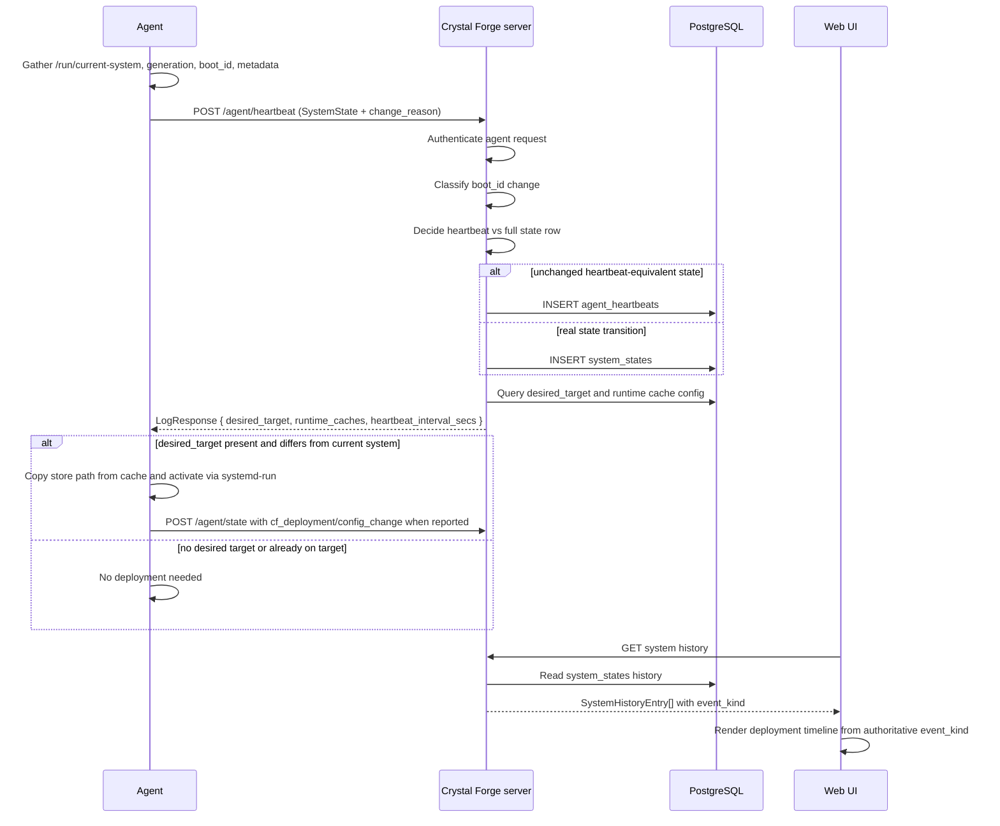
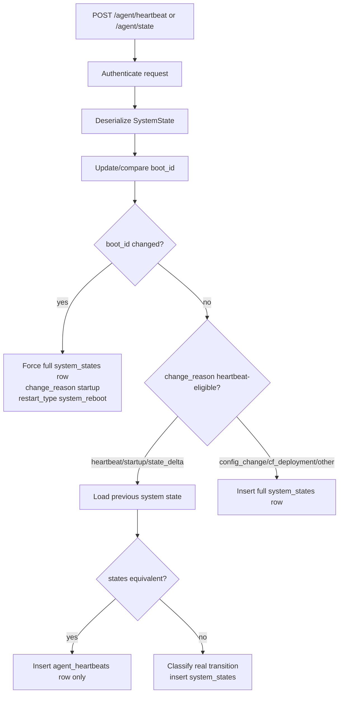
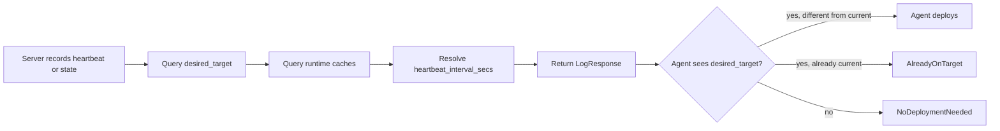
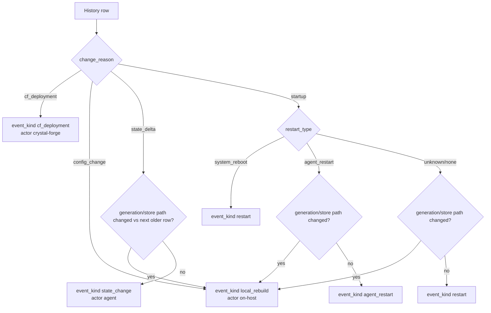

# Agent heartbeat, state, deployment, and history logic

This document describes how Crystal Forge agents report state, how the server
decides whether to persist a lightweight heartbeat or a full system-state row,
how deployment commands are returned, and how history entries should be
classified for the UI.

It is intentionally focused on the bugs seen during TASK-378:

- manual `nixos-rebuild switch` rows showing as Crystal Forge deploys
- the latest generation being hidden behind `Agent restarted`
- unchanged periodic heartbeats filling history with fake `Local rebuild` rows
- compatibility with older agents that send `state_delta` periodically

## Source files

- Agent loop and POST handling: `packages/default/src/bin/agent.rs`
- Agent deployment response handling: `packages/default/src/deployment/agent.rs`
- Server heartbeat route: `packages/default/src/handlers/agent/heartbeat.rs`
- Heartbeat-vs-state equivalence logic: `packages/default/src/models/agent_heartbeats.rs`
- System state insert/query logic: `packages/default/src/queries/system_states.rs`
- System history API classification: `packages/default/src/handlers/api/systems.rs`
- Web UI history rendering: `packages/web-ui/src/views/system_detail.rs`

## High-level flow

## Agent POST types

The agent POSTs a full `SystemState` payload to the server. The `change_reason`
field describes why the agent is sending the payload, but it is not by itself
authoritative enough to classify history.

Common values:

| `change_reason` | Meaning | Should usually create history? |
| --- | --- | --- |
| `heartbeat` | periodic agent loop | no, if state is equivalent |
| `startup` | agent process started | no, if same boot and same generation; yes if new generation after switch; yes as reboot if boot_id changed |
| `state_delta` | generic state delta; older agents may send this every heartbeat | no, if state is equivalent; yes if generation/store path changed |
| `config_change` | on-host config activation | yes |
| `cf_deployment` | agent applied a Crystal Forge desired target | yes |

Important compatibility rule:

> Older agents may emit `state_delta` for every periodic heartbeat. The server
> must still run equivalence checks for `state_delta` and write only an
> `agent_heartbeats` row when nothing meaningful changed.

## Server heartbeat-vs-state decision

The server should not blindly insert `system_states` for every POST. It should
first decide whether the POST represents a real state transition or just
heartbeat telemetry.

### Equivalence check

The server compares fields that represent meaningful system identity/config:

- hostname
- store path
- OS/kernel
- hardware identifiers
- network identifiers
- secure boot/FIPS/TPM fields
- agent version/build hash
- NixOS version

It intentionally ignores fields that naturally change every heartbeat:

- timestamp
- uptime

If the state is equivalent, the POST must become an `agent_heartbeats` row, not
a `system_states` row.

## Deployment command response

The heartbeat write path does **not** control whether the agent receives deploy
commands. The server still returns `LogResponse` after recording either a
heartbeat or a state row.

Therefore, treating old-agent `state_delta` as heartbeat-eligible is safe:

- unchanged `state_delta` writes to `agent_heartbeats`
- genuinely changed `state_delta` still writes to `system_states`
- `desired_target` is still returned either way
- older agents can still receive and apply deployment commands

### Current limitation: detached CF deployment attribution

Normal store-path deployment currently starts activation through a detached
`systemd-run --no-block` unit and returns `DeploymentResult::Started`. That path
logs that deployment started, but it does not itself synchronously write a
follow-up `system_states` row with `change_reason = cf_deployment` before the
agent process may be restarted by activation.

Because of that, the next report after activation can arrive as `startup`,
`config_change`, or `state_delta`. Unless deployment context is persisted across
the detached activation, a successful Crystal Forge-initiated activation can be
hard to distinguish from an on-host rebuild after the fact.

Desired future behavior:

1. When an agent receives a desired target and starts detached activation, persist
   pending CF deployment context locally or server-side.
2. When `/run/current-system` or the startup heartbeat later reports that target
   store path, record the transition as `cf_deployment`.
3. Clear the pending context after success, mismatch, timeout, or failure.

## Restart and activation classification

The server uses `boot_id` and generation/store-path transitions to classify
events.

### Why startup can be a local rebuild

During `nixos-rebuild switch`, systemd stops and starts services as part of
activation. That commonly restarts `crystal-forge-agent.service`. The first POST
containing the new generation can therefore have:

- `change_reason = startup`
- same `boot_id`
- new generation/store path

That is not just an agent restart. The agent restart is incidental to the
activation. The history API should classify this as `local_rebuild` when the
generation/store path differs from the next older history row.

### Why unchanged periodic rows are not local rebuilds

If the current row and the next older row have the same generation/store path,
there was no activation. Even if the raw `change_reason` says `state_delta`, the
history API should classify it as `state_change` or the server should have stored
it as an `agent_heartbeats` row in the first place.

## Web UI history rendering rules

The UI should prefer authoritative backend `event_kind` over legacy text
heuristics.

Expected mappings:

| backend `event_kind` | UI event kind | Timeline visibility |
| --- | --- | --- |
| `cf_deployment` | `Deploy` / `DeployFailed` depending on outcome | visible |
| `local_rebuild` | `LocalRebuildMatched` or `LocalRebuildUntracked` | visible |
| `restart` | `Restart` | visible, clusterable |
| `agent_restart` | `AgentRestart` | visible, not clustered |
| `state_change` | `StateChange` | hidden from Deployment History |

Important UI rule:

> `state_change` must not fall through to legacy classification. Otherwise raw
> `state_delta` text can be misread as a local rebuild and flood Deployment
> History with fake rebuild rows.

### Current limitation: failed deployment history

`DeployFailed` only appears when the history/API payload includes a failure-like
outcome (for example a value containing `fail` or `error`). The current
heartbeat/system-state history path emits `outcome = recorded` for normal state
rows, and an agent-side `DeploymentResult::Failed` is not automatically converted
into a failed deployment history row unless that failure is also persisted and
merged into the history stream. Treat `DeployFailed` as supported by the UI model
but dependent on a failure outcome being present in the data.

## Correct tests to keep

Tests should assert the behavior we actually want:

- `state_delta` with unchanged state is heartbeat-eligible server-side
- `state_delta` with changed generation/store path becomes `local_rebuild`
- `startup` with same boot and changed generation/store path becomes `local_rebuild`
- `startup` with `restart_type = system_reboot` stays `restart`
- authoritative UI `event_kind = state_change` becomes `StateChange`
- UI `StateChange` entries are excluded from Deployment History
- authoritative UI `event_kind = local_rebuild` still renders as Local rebuild

Tests should **not** assert that generic legacy `state_delta` or `state_change`
always means Local rebuild. That assertion is too broad and causes the false
positive history spam seen on `mattis` and `reckless`.

## Debug checklist

When a system shows unexpected history rows:

1. Check the agent journal for deploy activity.
   - `No desired target in heartbeat response` + `No deployment needed` means
     no CF deployment happened.
2. Compare repeated history rows.
   - Same generation and same store path every 10 minutes means heartbeat rows
     are being misclassified or incorrectly inserted as `system_states`.
3. Check backend `event_kind` returned by `/api/v1/systems/<id>/history`.
   - `state_change` should not render as Local rebuild.
   - `local_rebuild` should only appear for real generation/store-path changes.
4. Check agent version behavior.
   - Older agents may send `state_delta` every heartbeat.
   - The server must handle that compatibly by equivalence-checking it.
5. For `nixos-rebuild switch`, expect an agent restart.
   - If the generation/store path changed, classify the row as Local rebuild.
   - If generation/store path did not change, classify as Agent restarted or
     State change, not Local rebuild.

## Known pitfalls

- Do not infer Crystal Forge deployment from UI text alone. Confirm the agent
  received a `desired_target` and executed deployment logic.
- Do not treat all `state_delta` rows as rebuilds. Only generation/store-path
  changes are rebuilds.
- Do not let authoritative `state_change` fall through to legacy heuristics.
- Do not hide a real `nixos-rebuild switch` behind `Agent restarted` just
  because systemd restarted the agent during activation.
- Do not change already-applied migrations to repair history behavior; fix
  forward with code or a new migration as appropriate.
