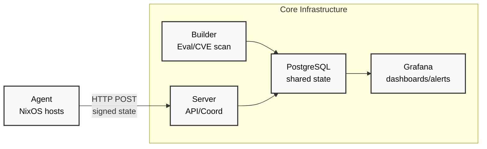

# ADR-000: Crystal Forge Architecture Overview

## Status

Accepted

## Context

Crystal Forge provides compliance monitoring and build coordination for NixOS systems in regulated environments. The architecture must support horizontal scaling, cryptographic verification, and integration with existing compliance workflows.

## Decision

### Core Components



#### Agent (Rust)

- **Location**: Runs on each monitored NixOS system
- **Responsibilities**:
  - Monitor system configuration changes via inotify
  - Collect system fingerprints (hardware, software, security status)
  - Send Ed25519-signed state reports to server
  - Heartbeat vs. state change intelligence
- **Interfaces**: HTTP POST to server `/agent/heartbeat` and `/agent/state`

#### Server (Rust)

- **Location**: Central coordination node(s)
- **Responsibilities**:
  - Receive and verify agent reports
  - Process Git webhooks for configuration updates
  - Coordinate build requests
  - Provide API for compliance queries
- **Interfaces**:
  - HTTP API for agents
  - Webhook endpoints for Git repositories
  - Database read/write operations

#### Builder (Rust)

- **Location**: Build coordination node(s)
- **Responsibilities**:
  - Evaluate NixOS flakes on demand
  - Build derivations for CVE scanning
  - Run vulnix for vulnerability assessment
  - Track configuration drift (current vs. latest)
- **Interfaces**:
  - Database coordination with server
  - Nix evaluation engine integration
  - vulnix CVE scanning integration

### Data Flows

#### 1. State Monitoring Flow

```
NixOS System → Agent → Server → PostgreSQL → Grafana
```

Agent detects configuration change → Signs state report → Server validates signature → Stores compliance data → Grafana displays/alerts

#### 2. CVE Scanning Flow

```
Git Webhook → Server → Builder → vulnix → PostgreSQL → Grafana
```

Configuration update → Server triggers build → Builder evaluates flake → Runs CVE scan → Stores vulnerability data → Compliance dashboard updates

#### 3. Drift Detection Flow

```
Agent State + Builder Evaluation → Server Comparison → Compliance Alert
```

Current system state compared against latest evaluated configuration to detect unauthorized changes.

### Key Architectural Decisions

1. **Shared PostgreSQL**: Enables horizontal scaling of servers and builders
2. **Ed25519 signatures**: Cryptographic verification of all agent communications
3. **Rust implementation**: Memory safety and performance for security-critical deployment
4. **Grafana integration**: Leverage proven dashboard/alerting rather than custom UI
5. **Flake-native**: Direct integration with modern Nix ecosystem

### Observability Points

1. **Agent health monitoring**: Heartbeat frequency, signature validation success rate
2. **Build coordination metrics**: Evaluation times, CVE scan duration, queue depth
3. **Compliance metrics**: Systems in drift, CVE exposure levels, STIG compliance rates
4. **Database performance**: Query times, connection counts, replication lag

## Consequences

**Positive**:

- Horizontal scaling through shared database
- Strong cryptographic security model
- Integration with existing monitoring infrastructure (Grafana)
- Memory-safe implementation reduces attack surface

**Negative**:

- PostgreSQL becomes single point of failure (mitigated by standard HA practices)
- Rust learning curve for contributors
- Initial dependency on Grafana for user interface

## Future Evolution

- Custom web frontend to replace Grafana dashboards
- Agent deployment capabilities for configuration management
- Support for additional CVE scanning tools beyond vulnix
