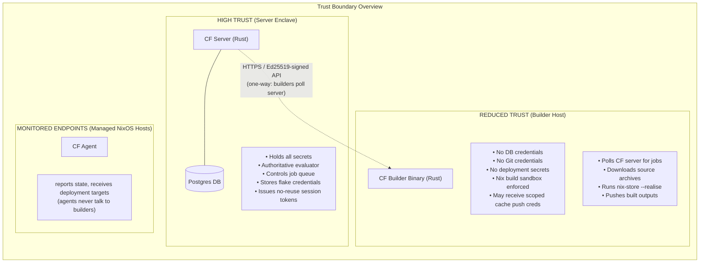
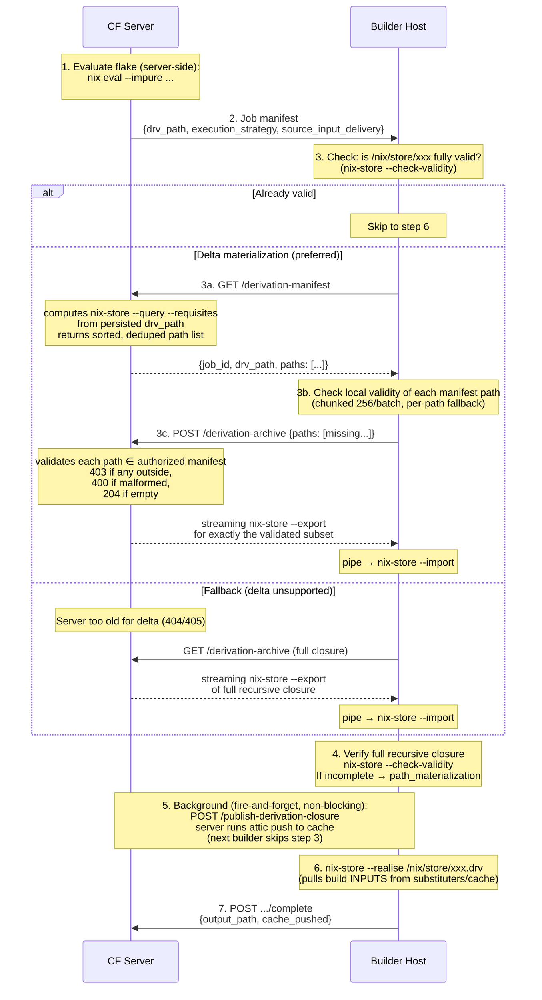
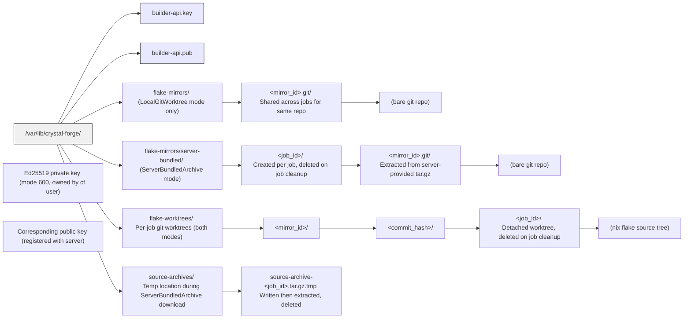
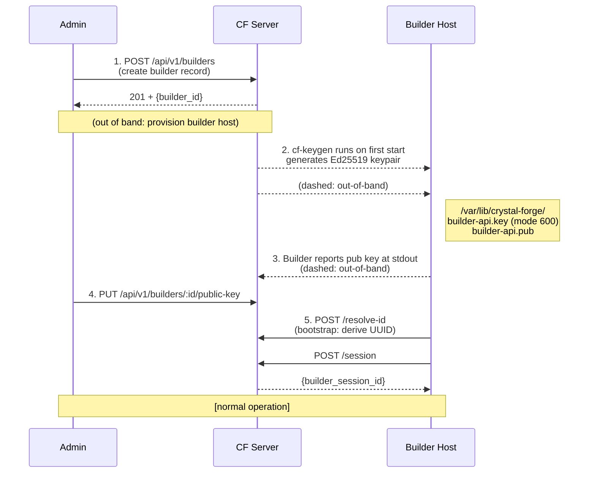

# Crystal Forge Builder Security Architecture

**Audience:** Network engineers, security architects, and cyber analysts (NSA/DoD context)  
**Classification:** Unclassified // For Official Use  
**Last updated:** 2026-07

---

## 0. Recommended Default Strategy

**Use `source_re_evaluate_verified` + `server_bundled_archive` for any new remote builder deployment.**

```toml
[server]
remote_build_execution_strategy = "source_re_evaluate_verified"
source_delivery_mode             = "server_bundled_archive"

[builder]
supported_execution_strategies = ["source_re_evaluate_verified"]
```

This is the most reliable path because:
- The builder evaluates the flake locally from a server-provided archive, so there is no dependency on an Attic/S3 binary cache being configured before the build can start.
- The builder compares its locally evaluated `.drvPath` against the server's expected value before building — this gives a cryptographic build-plan integrity check (`derivation_mismatch` hard failure).
- The builder never needs Git credentials or direct Git remote access.
- `.drv` materialization is zero-delay: the builder evaluates from local source, so it produces the `.drv` itself rather than waiting for the server to push it somewhere.

**`server_derivation`** is appropriate when you trust the server's evaluation completely and do not need the builder-side re-evaluation check, or when the builder cannot run `nix eval`. When the `.drv` is not already in the builder's Nix store, the builder streams the `.drv` closure directly from the CF server (no Attic dependency); the server pushes to cache in the background. Build inputs are pulled from configured Nix substituters.

**Summary table:**

| Strategy | Builder needs Git? | Builder needs Attic before build? | Build-plan integrity check | Best for |
|---|---|---|---|---|
| `source_re_evaluate_verified` + `server_bundled_archive` | No | No | ✅ `derivation_mismatch` | Recommended default |
| `source_re_evaluate_verified` + `local_git_worktree` | Yes | No | ✅ `derivation_mismatch` | Colocated / internal |
| `server_derivation` | No | No | ❌ Server-trusted only | Simplest path |

---

## 1. Purpose and Scope

This document defines every network boundary, data flow, credential exposure, and trust boundary that exists between the Crystal Forge server, its remote builders, and external systems. It answers the questions a network or security engineer needs to approve or deny network access rules for builder hosts.

A Crystal Forge **builder** is a host that performs Nix builds. It never talks to a database. It never receives credentials for deployment targets. It is intentionally limited to:

1. Polling the Crystal Forge server for work.
2. Pulling build inputs from authorized Nix binary caches.
3. Reporting build results back to the Crystal Forge server.
4. Optionally pushing completed build outputs to a configured cache using narrowly scoped per-job cache push credentials sent by the server.

Everything else — evaluation, policy enforcement, secret management, deployment authorization — stays on the server or on the agent running on the managed NixOS host.

---

## 2. System Components and Trust Levels



---

## 3. Component Definitions

### 3.1 Crystal Forge Server

**Role:** Central authority. Only component with database access and credential storage.

| Property | Value |
|---|---|
| Language | Rust (Axum web framework) |
| Database | PostgreSQL (private network, no external exposure) |
| Auth outbound | Ed25519 verification of builder requests; OIDC for human users |
| Network exposure | HTTPS API (configurable port, typically 443/8443) |
| Secrets held | Flake Git credentials (SSH keys / netrc); OIDC client secrets; DB password |
| Evaluator | `nix-eval-jobs` runs on the server with impure mode for remote flake refs |
| Source mirroring | Server maintains bare Git mirrors at `source_archive_root/mirrors/` |
| Source archives | Per-job tar.gz archives at `source_archive_root/archives/jobs/<job_id>.tar.gz` |

**The server is the only component that touches Git remotes or repository credentials.** Builders receive pre-packaged artifacts.

### 3.2 Crystal Forge Builder

**Role:** Isolated build executor. Talks only to the CF server and Nix binary caches.

| Property | Value |
|---|---|
| Language | Rust |
| Database access | **None.** Zero DB credentials. Zero DB network access required. |
| Git access | **None** when `ServerBundledArchive` is configured (recommended for GovCloud) |
| Network outbound | CF server HTTPS; Nix binary cache HTTPS (configurable substituters) |
| Secrets held | Its own Ed25519 private key (`/var/lib/crystal-forge/builder-api.key`). When builder-side cache push is enabled, the next-job response may also include narrowly scoped cache push credentials. |
| Authentication | Per-request Ed25519 signature on all API calls to the CF server |
| Session scope | Builder session ID scoped to process lifetime; server validates ownership per job |
| Build isolation | Nix sandbox enabled; `--restrict-eval`, no impure by default |

**A builder that is compromised gives an attacker:**
- The builder's Ed25519 private key (allows claiming build jobs only)
- Per-job cache push credentials, when builder-side cache push is enabled and the server has authorized credential transport for that job
- Access to build job outputs before they reach the cache
- No DB access, no deployment credentials, no Git credentials, no other builders' keys

### 3.3 Crystal Forge Agent

**Role:** NixOS host monitor. Reports system state to the server. Receives deployment targets. Never communicates with builders.

| Property | Value |
|---|---|
| Network outbound | CF server HTTPS (heartbeat and state reports only) |
| Auth | Ed25519-signed state reports |
| Deployment | Pull-based: reads `desired_target` store path from server heartbeat response, calls `nixos-rebuild switch --flake <cache-path>` |
| Credentials | Its own private key; no Git credentials; no builder credentials |

---

## 4. Network Flow Diagrams

### 4.1 Builder Job Lifecycle — Complete Network Picture

```mermaid
sequenceDiagram
    participant Builder as Builder Host
    participant Server as CF Server
    participant GitCache as Git Remote / Cache

    Builder->>Server: 1. POST /builders/:id/heartbeat<br/>Ed25519-signed, CPU/RAM metrics
    Server-->>Builder: 200 OK (heartbeat_interval_secs)

    Builder->>Server: 2. POST /builders/:id/next-job<br/>Ed25519-signed, strategy list
    Note over Server: DB: atomic job claim<br/>FOR UPDATE SKIP LOCKED

    alt ServerBundledArchive mode
        Server->>GitCache: git clone --bare / git fetch<br/>(server uses stored SSH key or netrc)
        GitCache-->>Server: 
        Note over Server: server: tar czf archive, sha256sum<br/>save to source_archive_root/archives/&lt;job_id&gt;.tar.gz
    end

    Server-->>Builder: 200 OK — Job Manifest<br/>{job_id, drv_path, source_identity,<br/>archive_url, archive_sha256, expected_drv_path}

    Builder->>Server: 3. GET /builders/:id/jobs/:jid/source-archive<br/>Ed25519-signed
    Server-->>Builder: 200 OK — streaming tar.gz<br/>(ReaderStream, no full archive in server RAM)

    Note over Builder: verify SHA-256<br/>extract to job-scoped mirror<br/>git worktree add

    Builder->>Server: 4. POST /builders/:id/jobs/:jid/publish-derivation-closure<br/>Ed25519-signed
    Server->>GitCache: nix copy --to &lt;cache&gt;<br/>(server pushes .drv closure to cache)
    GitCache-->>Server: 
    Server-->>Builder: 200 OK

    Note over Builder,GitCache: Builder: nix-store --realise<br/>(pulls .drv closure from cache or server<br/>via derivation-archive endpoint)

    Builder->>Server: 5. WS /api/v1/build-jobs/:jid/logs/stream<br/>(real-time log + metrics)
    Note over Builder,Server: WebSocket, falls back to HTTP POST
    Server-->>Builder: streaming build output

    Builder->>Server: 6. POST /builders/:id/jobs/:jid/complete<br/>{output_path, cache_pushed, cache_reference}
    Note over Server: DB: verify cache_reference<br/>against known destinations<br/>create cache_push row
    Server-->>Builder: 200 OK
```

### 4.2 ServerDerivation Strategy (No Source Access on Builder)



**Security property of the delta protocol:**
- The server NEVER exports a path just because the builder asked. The server computes the authorized manifest from its own persisted drv_path and enforces requested ⊆ manifest.
- The builder NEVER sends its store inventory. It only names paths from the manifest the server just gave it.
- A builder requesting a path outside the manifest is a **403 FORBIDDEN** (logged with builder and job IDs; path list is NOT logged).
- A builder requesting a non-store path is a **400 BAD REQUEST**.

**Fallback policy:**
- **404/405** from the delta endpoint = `Unsupported` → transparent fallback to the full closure archive GET. The builder never gets stuck waiting for a server that doesn't speak delta.
- **403**, drv path mismatch, malformed response, or import failure = `Fatal` → hard error. Never silently retried as full archive.
- The fallback distinction is encoded in the `DeltaError` enum at the client level, not an ad-hoc string check.

**What the builder can access in this mode:**
- ✅ CF server API (HTTPS) — for drv manifest, drv archive, and job lifecycle
- ✅ Nix binary caches (HTTPS) — for build INPUTS during `nix-store --realise`
- ❌ Git remotes
- ❌ Database
- ❌ Deployment credentials
- ❌ Other builders

**Note:** No Attic/S3 cache is required for the builder to START a build in this mode. The .drv closure (or the delta subset) arrives directly from the CF server via streaming export. Attic is used in the background to warm the cache for subsequent builds. The build INPUTS (nixpkgs, dependencies) still come from Nix substituters.

### 4.3 SourceReEvaluateVerified + ServerBundledArchive Strategy

```mermaid
sequenceDiagram
    participant Git as Git Remote
    participant S as CF Server
    participant B as Builder Host

    Git-->>S: clone/fetch top-level repo<br/>(server uses stored SSH key from DB)
    Note over S: generate tar.gz of bare mirror<br/>sha256sum<br/>save to archives/jobs/&lt;job_id&gt;.tar.gz
    S->>B: job manifest (job_id, archive_url, sha256)
    B->>S: GET /source-archive (authenticated, streaming)
    S-->>B: streaming tar.gz

    Note over B: verify sha256<br/>extract to mirrors/server-bundled/<br/>&lt;job_id&gt;/&lt;mirror_id&gt;.git<br/>git worktree add<br/>nix eval (local)<br/>compare .drvPath<br/>nix-store --realise
    B-->>S: POST /complete<br/>{output_path, cache_pushed}
```

**What is bundled:** Top-level flake repository only
**What is NOT bundled:** Locked flake inputs (nixpkgs, etc.)
**Implication:** Builder needs substituter access for flake inputs OR inputs must already be in builder's `/nix/store`. Private flake inputs (not nixpkgs) must be: publicly accessible, pre-seeded in the Nix store/cache, or handled by a future full-input-closure mode.

### 4.4 SourceReEvaluateVerified + LocalGitWorktree Strategy

```mermaid
sequenceDiagram
    participant Git as Git Remote
    participant S as CF Server
    participant B as Builder Host

    S->>B: job manifest (repo_url, commit_hash, expected_drv_path)
    Note over B: git clone --bare &lt;repo_url&gt;<br/>(only if mirror doesn't exist)<br/>git fetch +refs/*:refs/*<br/>git worktree add --detach &lt;commit&gt;<br/>nix eval (local worktree)<br/>compare .drvPath to expected<br/>nix-store --realise
    B-->>S: report complete
```

**What the builder can access in this mode:**
- ✅ CF server API (HTTPS)
- ✅ Git remote (builder needs network + credentials for the repo URL)
- ✅ Nix binary caches
- ❌ Database
- ❌ Deployment credentials
- ❌ Repositories NOT listed in the job manifest

**Network rule implication:** Builders in this mode need outbound TCP/22 or TCP/443 to the Git remote. For GovCloud or classified networks, prefer ServerBundledArchive instead.

---

## 5. Authentication and Signing Protocol

### 5.1 Per-Request Ed25519 Signature

Every API request from builder to server is independently signed. There are no bearer tokens, no session cookies, no long-lived secrets exchanged at runtime.

```
Canonical payload = METHOD + "\n" + PATH + "\n" + TIMESTAMP + "\n" + BODY_BYTES

Example:
  "POST\n/api/v1/builders/550e8400.../next-job\n2026-07-11T14:30:00Z\n{...body...}"

Signature = Ed25519.sign(canonical_payload, builder_private_key)

Headers sent:
  X-Builder-ID:         550e8400-e29b-41d4-a716-446655440000
  X-Builder-Session-ID: <process-lifetime session UUID>
  X-Signature:          base64(signature)
  X-Timestamp:          2026-07-11T14:30:00Z
```

**Replay protection:** Timestamp must be within ±5 minutes of server time. Requests outside this window are rejected with 401.

**Session scoping:** `X-Builder-Session-ID` is assigned by the server at startup. Job ownership checks verify both builder ID and session ID, so a job claimed in session A cannot be completed in session B (prevents build-job hijacking if a builder restarts mid-job).

### 5.2 What the Builder Private Key Controls

The builder private key authorizes exactly:

| Permitted | Not Permitted |
|---|---|
| Poll for next job | Access the database |
| Download source archive for claimed job | Download source archive for another builder's job |
| Stream logs for claimed job | Access logs for other builders |
| Complete / fail owned job | Complete / fail jobs owned by other builders |
| Send heartbeat metrics | Read/write deployment policy |
| Download .drv manifest for claimed job (authorized path list) | Evaluate flakes |
| Download .drv archive (full or delta subset) for claimed job | Manage builders (admin only) |
| Publish closure to cache (server-side push) | Manage builders (admin only) |

**Job ownership is double-checked on every API call:** The server verifies `builder_id` + `builder_session_id` + `job.status == "building"` before serving source archives, drv archives, or accepting completion reports.

---

## 6. Data in Transit — What Crosses the Wire

| Flow | Data / Classification |
|---|---|
| **Builder → Server** *(all requests)* | Ed25519 signature (public key material, not secret), Builder ID (UUID, not secret), Session ID (process-lifetime, not a credential), Timestamp, Request body (job poll: strategy list; complete: store path, cache reference) |
| **Builder → Server** *(log streaming)* | Build log text (stdout/stderr of nix build), CPU/RAM metrics, WebSocket or HTTP POST |
| **Server → Builder** *(next-job response)* | Job manifest: job_id, derivation name, drv_path, execution strategy, source identity (repo URL, commit hash, mirror_id), archive_url (relative path), archive_sha256, expected_drv_path. **NOTE:** No repository credentials. No DB passwords. archive_url is a CF server path, not a Git URL. When remote builder-side cache push is enabled, this response may include narrowly scoped cache push config/credentials for the selected cache destination. |
| **Server → Builder** *(source-archive)* | Binary tar.gz of bare Git mirror (top-level repo only). Streamed per-job; per-chunk RAM on server is bounded. Builder verifies sha256 before unpacking. |
| **Server → Builder** *(drv manifest)* | `GET /derivation-manifest` — JSON list of store paths (sorted, deduplicated requisite closure of the job's persisted drv_path). Server-computed, not builder-supplied. Used as authorization baseline for delta. |
| **Server → Builder** *(drv archive)* | nix-store export binary format (full OR delta subset). **PREFERRED:** `POST /derivation-archive` with JSON `{"paths": [missing...]}` — server validates each requested path against the authorized manifest; 403 if any path is NOT in the manifest. Streams nix-store --export for exactly the validated subset. **FALLBACK:** `GET /derivation-archive` — streams full recursive closure (for servers that do not support the delta protocol). Both paths are streamed per argv chunk; no full-closure server buffer. |
| **Server → Git** *(mirror clone)* | SSH private key (from DB, used by server only). Applied via `GIT_SSH_COMMAND` env var to git process. Never leaves server; never sent to builder. |
| **Server → Cache** *(push)* | `nix copy --to <attic/S3 endpoint>`. Attic token / AWS credentials remain server-held for server-side cache push worker flows. Builders may separately receive short-scoped cache push credentials only for builder-side cache push jobs when trusted HTTPS forwarding is verified. |
| **Builder → Cache** *(optional push)* | `attic push` or equivalent cache push command using credential-bearing cache config from the signed next-job response. Only used when builder-side cache push is enabled and credential transport is explicitly allowed. |
| **Builder → Cache** *(substituter pull)* | Standard Nix substituter pulls (narinfo / .nar). Cache URL + optional auth token (configured on builder). Builder only pulls paths listed in job manifest. |

---

## 7. Filesystem Layout on the Builder Host



**Cleanup guarantees:**
- Per-job worktrees are removed via `git worktree remove --force` after the build completes or fails.
- Per-job server-bundled mirror dirs (`server-bundled/<job_id>/`) are deleted after worktree removal.
- Temp archive files are deleted immediately after extraction regardless of success or failure.
- Server-side job-scoped archives (`archives/jobs/<job_id>.tar.gz`) are deleted on job `complete`, `fail`, cancellation finalization, or claimed-job requeue after manifest/source/cache-config preparation errors via `cleanup_source_archive()`.

---

## 8. Firewall Rules Required per Strategy

### 8.1 ServerDerivation (Recommended Default)

```
# Builder host outbound rules
ALLOW TCP  <builder>  →  <cf_server>:443     # API polling, drv archive download
ALLOW TCP  <builder>  →  <cache_host>:443    # Nix substituter pulls (narinfo, NAR)
DENY  ALL  <builder>  →  <database>          # Builder has no DB access
DENY  ALL  <builder>  →  <git_remote>        # No Git access in this mode
DENY  ALL  <builder>  →  <other_builders>    # Builders don't talk to each other
DENY  ALL  <builder>  →  <managed_hosts>     # Builder never touches managed NixOS hosts
```

### 8.2 SourceReEvaluateVerified + ServerBundledArchive

Same as 8.1. The builder never contacts Git remotes in this mode.

```
ALLOW TCP  <builder>  →  <cf_server>:443     # API + source archive download
ALLOW TCP  <builder>  →  <cache_host>:443    # Nix substituter pulls
DENY  ALL  <builder>  →  <git_remote>        # Source arrives from CF server
DENY  ALL  <builder>  →  <database>
DENY  ALL  <builder>  →  <other_builders>
DENY  ALL  <builder>  →  <managed_hosts>
```

### 8.3 SourceReEvaluateVerified + LocalGitWorktree

```
ALLOW TCP  <builder>  →  <cf_server>:443     # API calls
ALLOW TCP  <builder>  →  <git_remote>:22     # SSH git clone/fetch  ← ADDITIONAL
# OR
ALLOW TCP  <builder>  →  <git_remote>:443    # HTTPS git clone/fetch
ALLOW TCP  <builder>  →  <cache_host>:443    # Nix substituter pulls
DENY  ALL  <builder>  →  <database>
DENY  ALL  <builder>  →  <other_builders>
DENY  ALL  <builder>  →  <managed_hosts>
```

**Note for security reviewers:** LocalGitWorktree requires the builder to hold or discover Git credentials for the repository URL embedded in the job manifest. For private repositories this means SSH keys or netrc on the builder. ServerBundledArchive eliminates this requirement.

### 8.4 CF Server Inbound Rules

```
# Server host inbound rules
ALLOW TCP  <builders>          →  <cf_server>:443   # Builder API
ALLOW TCP  <agents>            →  <cf_server>:443   # Agent heartbeat/state
ALLOW TCP  <admin_workstations> →  <cf_server>:443  # Web UI / admin API
ALLOW TCP  <git_webhooks>      →  <cf_server>:443   # Git push webhooks
DENY  ALL  EXTERNAL            →  <cf_server>:5432  # DB never exposed externally
```

---

## 9. Threat Model — What Builders Can and Cannot Do

### 9.1 Compromised Builder

If an attacker compromises a builder host and exfiltrates everything on it, they obtain:

| Obtained | Impact |
|---|---|
| `builder-api.key` | Can impersonate the builder: claim jobs, complete/fail them. **Cannot** access other builders' jobs, the database, or deployment credentials. |
| Per-job cache push credentials (conditional) | Can push to the configured cache destination within the permissions granted by the cache token/key. Only present when builder-side cache push is enabled and trusted HTTPS forwarding is configured. |
| Nix build artifacts in `/nix/store` | Build outputs that were already pushed to the cache. |
| Job-scoped source archive (if present during extraction) | A tar.gz of the top-level flake repo at one specific commit, already public via Git. |
| Build log content | Text output from `nix build` of potentially sensitive derivations. |
| Nix store paths from job manifest | The `.drv` path and output path for the current job. |

**Not obtainable from a builder host:**
- PostgreSQL credentials or DB network access
- Git SSH keys for any repository
- OIDC client secrets
- Deployment credentials or authorized SSH keys for managed hosts
- Other builders' private keys
- The CF server's internal evaluation state

**Conditional cache credential boundary:** Builders do not receive database, deploy-target, OIDC, or Git credentials. When remote builder-side cache push is enabled, builders may receive narrowly scoped cache push credentials in the signed next-job response. Credential-bearing cache config is only sent when the server is explicitly configured to trust HTTPS forwarded by a reverse proxy and the request is marked as HTTPS by that trusted proxy. Operators must ensure the backend service is not directly reachable over plaintext by builders or untrusted clients.

### 9.2 Malicious Job Claim

If an attacker injects a malicious job into the queue (requires compromising the CF server or admin credentials), the builder will:

1. Accept the job manifest.
2. Download the source archive URL listed in the manifest.
3. Evaluate `nix eval` against the source archive.
4. Compare the evaluated `.drvPath` against the server-provided `expected_drv_path`.

**Step 4 is the critical defense for `SourceReEvaluateVerified`.** A manipulated source that evaluates to a different `.drvPath` than the server recorded will cause a `derivation_mismatch` failure before any build starts. The build plan cannot be altered without invalidating the derivation identity check.

For `ServerDerivation`, the `.drv` itself arrives from the server. A malicious `.drv` injected at queue time would build and report whatever the injected derivation produces.

### 9.3 Source Archive Tampering

The builder verifies the server-provided `archive_sha256` against the downloaded archive before extraction. A man-in-the-middle or storage corruption that alters the archive will cause a `SourceFetch` failure. The SHA-256 is computed on the server at archive generation time and included in the job manifest, which is itself Ed25519-signed.

### 9.4 Replay Attacks

Each request is independently signed with a timestamp. Replaying a captured request after ±5 minutes is rejected. The server session ID further scopes job operations to the current builder process lifetime.

---

## 10. Pre-Build Failure Phases

When a build cannot proceed safely, the builder reports a specific failure phase rather than leaving the job in `building` state indefinitely.

| Phase | Trigger | Job State |
|---|---|---|
| `source_fetch` | Archive download failed, SHA-256 mismatch, tar extraction error, `git clone`/`fetch` failed | `failed` or retry |
| `source_input_availability` | Required source inputs not available | `failed` or retry |
| `evaluation` | `nix eval .drvPath` failed on builder (timeout, eval error) | `failed` or retry |
| `derivation_mismatch` | Builder-evaluated `.drvPath` ≠ server-expected `.drvPath` | `failed` (no retry — policy violation) |
| `path_materialization` | `.drv` not available locally after delta manifest/archive or full archive download | `failed` or retry |
| `delta_unsupported` (info only) | Delta endpoint returned 404/405 — transparent fallback to full archive | (not a failure) |
| `build` | `nix-store --realise` failed | `failed` or retry |

`derivation_mismatch` is treated as a hard failure with no automatic retry because it indicates the build plan has diverged from the server-evaluated state, which is a security-relevant event that warrants human review.

---

## 11. Configuration Reference for Network-Constrained Environments

### 11.1 Maximum Isolation (GovCloud / Air-Gap Adjacent)

```toml
# /etc/crystal-forge/server.toml
[server]
remote_build_execution_strategy = "source_re_evaluate_verified"
source_delivery_mode             = "server_bundled_archive"
source_archive_root              = "/var/lib/crystal-forge/source-archives"

# /etc/crystal-forge/builder.toml
[builder]
supported_execution_strategies = ["server_derivation", "source_re_evaluate_verified"]
source_mirror_root              = "/var/lib/crystal-forge/flake-mirrors"
source_worktree_root            = "/var/lib/crystal-forge/flake-worktrees"
cleanup_source_worktrees        = true

# No git credentials on the builder. Server holds all repo credentials.
```

**Remaining builder network requirements:**
- Outbound HTTPS to CF server
- Outbound HTTPS to Nix binary caches (or air-gapped store path pre-seeded)

**Builder network requirements that are eliminated:**
- Any access to Git remotes
- Any database access
- Any access to OIDC providers

### 11.2 Colocated / Internal Deployment (Relaxed)

```toml
# /etc/crystal-forge/server.toml
[server]
remote_build_execution_strategy = "server_derivation"
# source_delivery_mode defaults to local_git_worktree (ignored for server_derivation)

# /etc/crystal-forge/builder.toml
[builder]
supported_execution_strategies = ["server_derivation"]
# No source mirror or worktree needed for server_derivation
```

---

## 12. Key Management Lifecycle



**Key rotation:** `PUT /api/v1/builders/:id/public-key` with new public key. Old sessions automatically invalidated on next heartbeat verification. Builder private key replaced on host (service restart required).

---

## 13. Logging and Auditability

| Event | Logged Where | Log Content |
|---|---|---|
| Builder registration | Server / DB | builder_id, public_key hash, admin user |
| Job claimed | Server / DB | job_id, builder_id, session_id, timestamp |
| Source archive generated | Server log | job_id, mirror_id, commit_hash, sha256 |
| Source archive downloaded | Server log | job_id, builder_id, HTTP response status |
| `.drvPath` mismatch | Server log | job_id, expected, actual |
| Derivation manifest served | Server log (debug) | job_id, path_count |
| Derivation delta archive requested | Server log (debug) | job_id, builder_id, requested_path_count, validated_path_count |
| Derivation delta path rejected (403) | Server log (warn) | job_id, builder_id, logged count only (paths not logged) |
| Delta fallback to full archive | Builder log (info) | job_id, reason (always "Unsupported" — never on 403) |
| Build complete | Server / DB | job_id, output_path, cache_reference |
| Build failure | Server / DB | job_id, failure_phase, error message |
| Session ID mismatch | Server log (warn) | builder_id, presented session vs. stored |
| Timestamp replay | Server log | builder_id, timestamp diff |
| Source archive cleanup | Server log (debug) | job_id, archive_path |

---

## 14. Relationship to Other Crystal Forge Documentation

| Document | Covers |
|---|---|
| `multi-builder-api.md` | API reference: endpoints, request/response schemas, retry logic |
| `eval-build-deploy-flow.md` | End-to-end commit → eval → build → deploy flowchart |
| `architecture.md` | High-level component overview, queue notification system |
| `deployment-policies.md` | Policy evaluation (server-side), not builder-specific |
| `store-path-flow.md` | Nix store path lifecycle and cache push flow |
| `auth-session-security.md` | Human user session security (separate from builder key auth) |
| **`builder-security-architecture.md`** | **This document** — builder boundaries, trust model, firewall rules |
