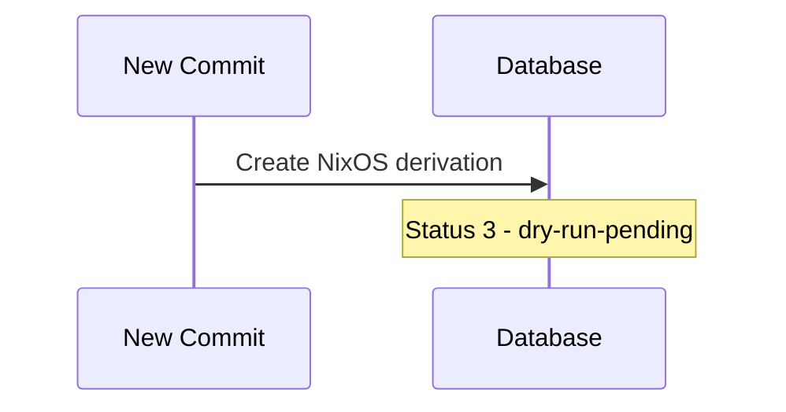
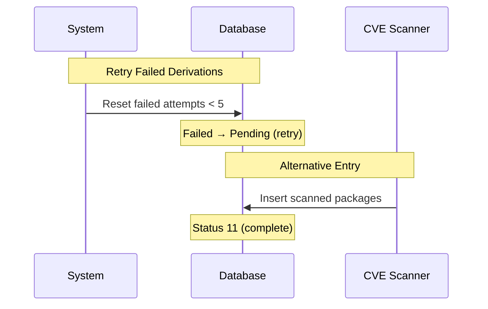

# Crystal Forge Derivation Status Flow

This document explains the various statuses that derivations go through in Crystal Forge and when they transition between states.

## Status Overview

Crystal Forge processes derivations (NixOS systems and packages) through a multi-stage pipeline. Each derivation has a status that indicates its current stage in the process.

## 1. Commit Discovery



## 2. Dry-Run Evaluation

```mermaid
sequenceDiagram
    participant Loop as Evaluation Loop
    participant DB as Database

    Loop->>DB: Find pending derivations
    Note over DB: Status 3 → 4 (in-progress)

    Loop->>Loop: Run nix evaluation

    alt Success
        Loop->>DB: Evaluation complete
        Note over DB: Status 4 → 5 (dry-run-complete)
        Loop->>DB: Discover package dependencies
    else Failure
        Loop->>DB: Mark failed
        Note over DB: Status 4 → 6 (dry-run-failed)
    end
```

## 3. Build Phase

```mermaid
sequenceDiagram
    participant Loop as Build Loop
    participant DB as Database

    Loop->>DB: Find completed evaluations
    Note over DB: Status 5 → 8 (build-in-progress)

    Loop->>Loop: Build derivation

    alt Success
        Loop->>DB: Build complete
        Note over DB: Status 8 → 10 (build-complete)
    else Failure
        Loop->>DB: Build failed
        Note over DB: Status 8 → 12 (build-failed)
    end
```

## 4. Retry & CVE Scanning



## Status Definitions

| ID  | Status Name             | Description                                | Terminal? |
| --- | ----------------------- | ------------------------------------------ | --------- |
| 1   | **pending**             | Initial state (should not be used)         | ❌        |
| 2   | **queued**              | Waiting in queue (reserved for future use) | ❌        |
| 3   | **dry-run-pending**     | Ready for Nix evaluation (dry-run)         | ❌        |
| 4   | **dry-run-in-progress** | Currently running `nix build --dry-run`    | ❌        |
| 5   | **dry-run-complete**    | Nix evaluation succeeded, ready for build  | ❌        |
| 6   | **dry-run-failed**      | Nix evaluation failed                      | ✅        |
| 7   | **build-pending**       | Ready for actual build                     | ❌        |
| 8   | **build-in-progress**   | Currently building derivation              | ❌        |
| 9   | **in-progress**         | Generic in-progress (legacy)               | ❌        |
| 10  | **build-complete**      | Build succeeded                            | ✅        |
| 11  | **complete**            | Fully complete (used for packages)         | ✅        |
| 12  | **build-failed**        | Build failed                               | ✅        |
| 13  | **failed**              | Generic failure                            | ✅        |

## Normal Flow

### NixOS Systems (derivation_type = 'nixos')

```
pending → dry-run-pending → dry-run-in-progress → dry-run-complete → build-pending → build-in-progress → build-complete
                          ↘                    ↘                                    ↘
                           dry-run-failed      dry-run-failed                        build-failed
```

### Packages (derivation_type = 'package')

```
# Discovered during NixOS evaluation:
dry-run-complete → build-pending → build-in-progress → build-complete

# Found during CVE scanning:
complete (inserted directly)
```

## Status Transitions

### 1. Commit Processing

- **When**: New commits are discovered
- **From**: N/A → **dry-run-pending** (status 3)
- **Process**: `process_pending_commits()` creates derivations for each NixOS config

### 2. Dry-Run Evaluation

- **When**: Derivation evaluation loop runs
- **From**: **dry-run-pending** (3) → **dry-run-in-progress** (4)
- **Process**: `nix build --dry-run` to discover derivation paths
- **Success**: → **dry-run-complete** (5)
- **Failure**: → **dry-run-failed** (6)

### 3. Package Discovery

- **When**: During successful dry-run
- **From**: N/A → **dry-run-complete** (5)
- **Process**: Package dependencies are inserted with derivation paths

### 4. Build Phase

- **When**: Build processing loop runs
- **From**: **dry-run-complete** (5) → **build-pending** (7) → **build-in-progress** (8)
- **Process**: `nix-store --realise` to actually build
- **Success**: → **build-complete** (10)
- **Failure**: → **build-failed** (12)

## Processing Loops

### Derivation Evaluation Loop

- **Queries**: `status_id = 3` (dry-run-pending)
- **Function**: `process_pending_derivations()`
- **Frequency**: Every ~30 seconds
- **Action**: Runs Nix evaluations to discover what needs to be built

### Build Processing Loop

- **Queries**: `status_id IN (5, 7)` (dry-run-complete, build-pending)
- **Function**: `get_derivations_ready_for_build()`
- **Action**: Actually builds the derivations

## Retry Logic

- **Max Attempts**: 5 attempts before permanent failure
- **Retry Conditions**:
  - `dry-run-failed` with `attempt_count < 5` → reset to `dry-run-pending`
  - `build-failed` with `attempt_count < 5` → reset to `build-pending`
- **Function**: `reset_non_terminal_derivations()` (runs at startup)

## Terminal States

Terminal states indicate the derivation has finished processing:

- ✅ **dry-run-complete** (5) - Ready for building
- ✅ **dry-run-failed** (6) - Cannot be evaluated
- ✅ **build-complete** (10) - Successfully built
- ✅ **build-failed** (12) - Build failed
- ✅ **complete** (11) - Fully complete (packages)
- ✅ **failed** (13) - Generic failure

## Common Issues

### Stuck in "pending" (status 1)

- **Cause**: Bug in `insert_derivation_with_target()` hardcoding status 1
- **Fix**: Should start in `dry-run-pending` (status 3)
- **Resolution**: Update status manually or fix insertion code

### Derivations Not Processing

- **Check**: Are they in the right status for their processing loop?
- **dry-run-pending** (3) → Picked up by evaluation loop
- **dry-run-complete** (5) → Picked up by build loop

### High Failure Rates

- **Check**: `attempt_count` - derivations with 5+ attempts are permanently failed
- **Review**: Error messages in `error_message` field
- **Action**: May need to reset attempt counts or fix underlying issues
