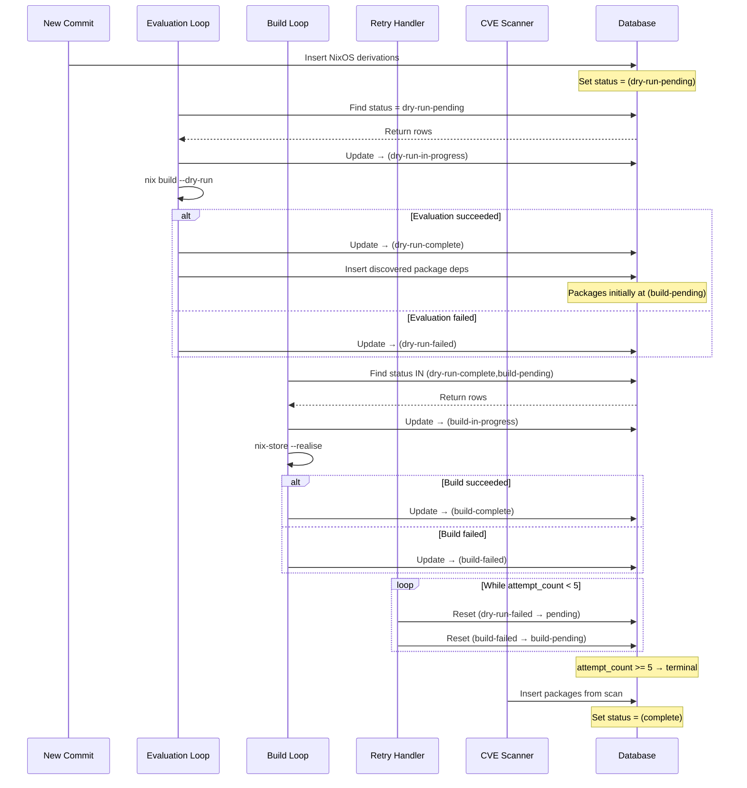

# Crystal Forge Derivation Status Flow

This document explains the statuses that derivations go through in Crystal Forge and how they transition during processing.

---

## Combined Lifecycle (Sequence)

---

## Status Table

|  ID | Name                 | Description               | Terminal |
| --: | -------------------- | ------------------------- | -------- |
|   1 | pending              | Should not be used        | ❌       |
|   2 | queued               | Reserved for future use   | ❌       |
|   3 | dry-run-pending      | Ready for dry-run         | ❌       |
|   4 | dry-run-in-progress  | Running nix dry-run       | ❌       |
|   5 | dry-run-complete     | Dry-run succeeded         | ❌       |
|   6 | dry-run-failed       | Dry-run failed            | ✅\*     |
|   7 | build-pending        | Ready for build           | ❌       |
|   8 | build-in-progress    | Building                  | ❌       |
|   9 | in-progress (legacy) | Generic in-progress       | ❌       |
|  10 | build-complete       | Build succeeded           | ✅       |
|  11 | complete             | Fully complete (packages) | ✅       |
|  12 | build-failed         | Build failed              | ✅\*     |
|  13 | failed               | Generic failure           | ✅       |

\* Terminal only if maximum retry attempts reached.

---

## Processing Loops

**Derivation Evaluation Loop**

- Picks `status_id = 3`
- Function: `process_pending_derivations()`
- Runs every \~30s
- Action: nix dry-run

**Build Loop**

- Picks `status_id IN (5, 7)`
- Function: `get_derivations_ready_for_build()`
- Action: build

---

## Retry Logic

- **Max attempts:** 5
- `dry-run-failed` → `dry-run-pending` if attempts < 5
- `build-failed` → `build-pending` if attempts < 5
- Function: `reset_non_terminal_derivations()` (on startup)

---

## Terminal States

- dry-run-failed (6) — if max attempts reached
- build-complete (10)
- build-failed (12) — if max attempts reached
- complete (11)
- failed (13)

---

## Common Issues

**Stuck in pending (1)**

- Fix: Set to `dry-run-pending` (3)

**Not processing**

- Status 3 → evaluation loop
- Status 5 or 7 → build loop

**High failure rates**

- Check `attempt_count` (≥ 5 = permanent)
- Inspect `error_message` and fix root cause
