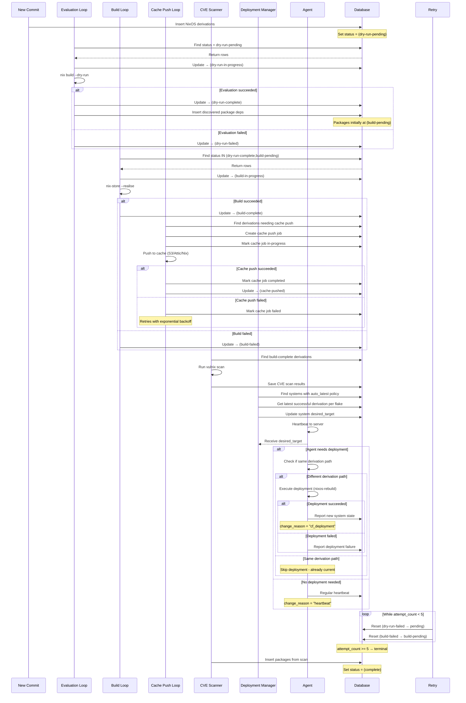

# Crystal Forge Derivation Status Flow

This document explains the statuses that derivations go through in Crystal Forge and how they transition during processing, including deployment and cache operations.

---

## Combined Lifecycle (Sequence)

---

## Status Table

|  ID | Name                 | Description               | Terminal | Next Step |
| --: | -------------------- | ------------------------- | -------- | --------- |
|   1 | pending              | Should not be used        | ❌       | → dry-run-pending |
|   2 | queued               | Reserved for future use   | ❌       | → dry-run-pending |
|   3 | dry-run-pending      | Ready for dry-run         | ❌       | → evaluation loop |
|   4 | dry-run-in-progress  | Running nix dry-run       | ❌       | → dry-run-complete/failed |
|   5 | dry-run-complete     | Dry-run succeeded         | ❌       | → build loop |
|   6 | dry-run-failed       | Dry-run failed            | ✅\*     | → retry or terminal |
|   7 | build-pending        | Ready for build           | ❌       | → build loop |
|   8 | build-in-progress    | Building                  | ❌       | → build-complete/failed |
|   9 | in-progress (legacy) | Generic in-progress       | ❌       | → legacy handling |
|  10 | build-complete       | Build succeeded           | ❌       | → cache push |
|  11 | complete             | Fully complete (packages) | ✅       | → CVE scanning |
|  12 | build-failed         | Build failed              | ✅\*     | → retry or terminal |
|  13 | failed               | Generic failure           | ✅       | N/A |
|  14 | cache-pushed         | Pushed to binary cache    | ✅       | → CVE scanning |

\* Terminal only if maximum retry attempts reached.

---

## Processing Loops

### **Derivation Evaluation Loop**
- **Picks:** `status_id = 3` (dry-run-pending)
- **Function:** `process_pending_derivations()`
- **Interval:** ~30s
- **Action:** `nix build --dry-run` to validate configuration
- **Dependencies:** Discovers and inserts package dependencies

### **Build Loop**
- **Picks:** `status_id IN (5, 7)` (dry-run-complete, build-pending)
- **Function:** `get_derivations_ready_for_build()`
- **Interval:** ~60s (configurable via `build.poll_interval`)
- **Action:** `nix-store --realise` to build derivations
- **Features:** 
  - Systemd resource control (memory/CPU limits)
  - Streaming build progress with heartbeats
  - Real-time build target tracking

### **Cache Push Loop**
- **Picks:** Derivations with `build-complete` status needing cache push
- **Function:** `process_cache_pushes()`
- **Interval:** ~30s (configurable via `cache.poll_interval`)
- **Action:** Push built derivations to binary cache
- **Backends:** S3, Attic, HTTP, Nix stores
- **Features:**
  - Parallel uploads
  - Retry logic with exponential backoff
  - Filtering based on derivation names

### **CVE Scanning Loop**
- **Picks:** Derivations with `build-complete` or `cache-pushed` status
- **Function:** `scan_derivations()`
- **Interval:** ~60s (configurable via `vulnix.poll_interval`)
- **Action:** Run vulnix security scanner
- **Output:** CVE database entries with severity levels

### **Deployment Policy Manager**
- **Picks:** Systems with `auto_latest` deployment policy
- **Function:** `update_auto_latest_policies()`
- **Interval:** ~15m (configurable via `deployment.deployment_poll_interval`)
- **Action:** Update system `desired_target` to latest successful derivation
- **Policies:** manual, auto_latest, pinned

---

## Deployment Flow

### **Agent Heartbeat Process**
1. Agent sends system state to server
2. Server responds with `desired_target` (if any)
3. Agent compares desired target with current derivation path
4. If different: Execute deployment via `nixos-rebuild`
5. If same: Skip deployment (already current)
6. Report deployment result back to server

### **Deployment Result Types**
- `NoDeploymentNeeded`: No desired target set
- `AlreadyOnTarget`: Current and desired paths match
- `SuccessFromCache`: Deployment succeeded using binary cache
- `SuccessLocalBuild`: Deployment succeeded with local build
- `Failed`: Deployment failed with error details

### **Deployment Configuration**
- `dry_run_first`: Run dry-run before actual deployment
- `fallback_to_local_build`: Fall back to local build if cache fails
- `cache_url`: Binary cache URL for faster deployments
- `deployment_timeout_minutes`: Maximum deployment time

---

## Cache Push Process

### **Cache Types**
- **Nix**: Standard nix copy to HTTP/S3 endpoints
- **S3**: Direct S3 upload with optional signing
- **Attic**: Specialized Nix binary cache with token auth
- **HTTP**: Generic HTTP-based binary cache

### **Cache Push Features**
- **Filtering**: Only push derivations matching configured patterns
- **Parallel uploads**: Configurable concurrent push operations
- **Retry logic**: Exponential backoff for failed pushes
- **Signing**: Optional store path signing for security

### **Cache Push Jobs**
- Queued automatically after successful builds
- Tracked separately from derivation status
- Include metadata: size, duration, error messages
- Support both `.drv` paths and resolved store paths

---

## Retry Logic

### **Automatic Retries**
- **Max attempts:** 5 (configurable)
- **Reset conditions:**
  - `dry-run-failed` → `dry-run-pending` if attempts < 5
  - `build-failed` → `build-pending` if attempts < 5
- **Reset trigger:** `reset_non_terminal_derivations()` on startup
- **Backoff:** Exponential delay between retries for cache operations

### **Manual Intervention**
- Reset attempt count to force retry
- Update derivation target for different commit
- Modify build configuration for resource issues

---

## Terminal States

### **Successful Completion**
- **build-complete (10)**: Ready for cache push and CVE scanning
- **cache-pushed (14)**: Successfully cached, ready for deployment
- **complete (11)**: Fully processed (typically for packages)

### **Failure States**
- **dry-run-failed (6)**: Configuration invalid, requires code fix
- **build-failed (12)**: Build errors, may need dependency updates
- **failed (13)**: Generic failure state

---

## Integration Points

### **System State Tracking**
- Agents report current derivation path during heartbeats
- Server correlates system state with successful derivations
- Deployment timeline tracked via system state changes

### **Flake Integration**
- Commits trigger derivation creation
- Flake targets specify exact configuration paths
- Git references ensure reproducible builds

### **Security Integration**
- CVE scanning provides vulnerability assessment
- Binary cache signing ensures integrity
- Ed25519 authentication for agent communication

---

## Common Issues

### **Stuck in pending (1)**
- **Fix:** Set to `dry-run-pending` (3)
- **Cause:** Usually startup state or manual insertion

### **Not processing**
- **Status 3:** Check evaluation loop health
- **Status 5 or 7:** Check build loop health
- **Check:** Loop intervals and resource availability

### **High failure rates**
- **Check:** `attempt_count` (≥ 5 = permanent failure)
- **Inspect:** `error_message` for root cause
- **Common causes:** Resource limits, network issues, configuration errors

### **Cache Push Failures**
- **Check:** Cache credentials and connectivity
- **Verify:** Store path exists and is readable
- **Review:** Cache configuration and filters

### **Deployment Issues**
- **Verify:** Agent connectivity and authentication
- **Check:** Deployment policy configuration
- **Review:** nixos-rebuild logs on target systems

---

## Monitoring Recommendations

### **Key Metrics**
- Derivation processing rate by status
- Build success/failure ratios
- Cache push success rates
- Deployment success rates
- CVE scan coverage

### **Alerting Thresholds**
- Derivations stuck in pending > 1 hour
- Build failure rate > 20%
- Cache push failure rate > 10%
- Agent heartbeat gaps > 30 minutes
- High-severity CVEs in deployed systems
