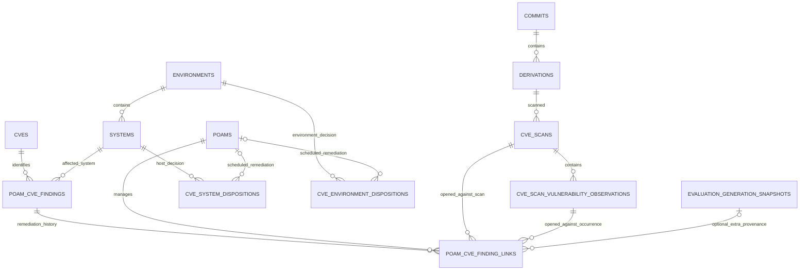
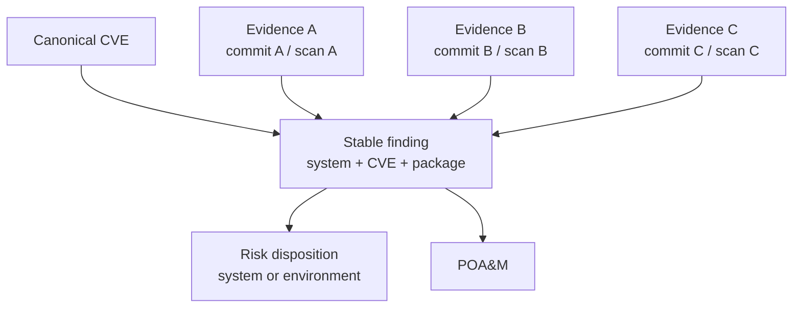
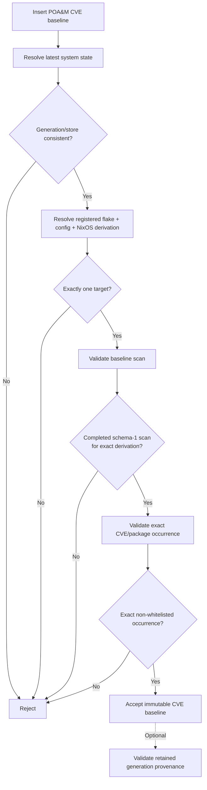
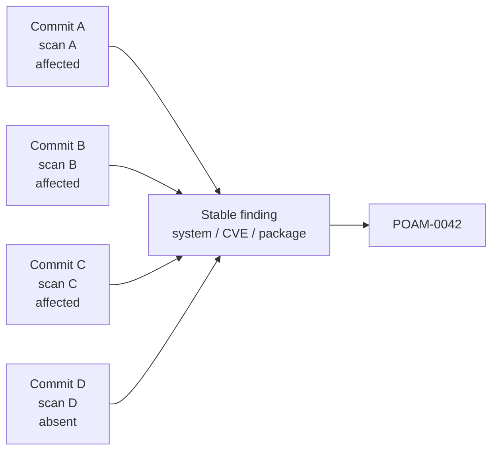
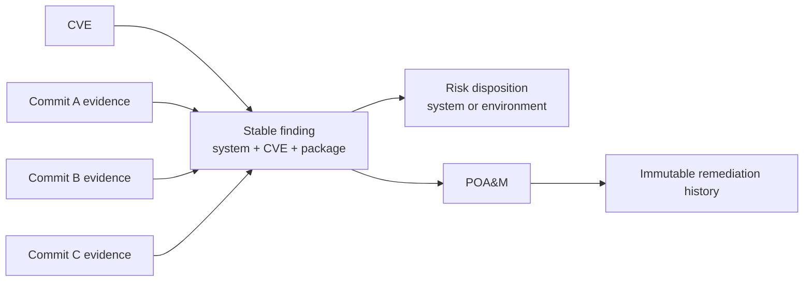

# CVE POA&M and Risk-Disposition Continuity Across Revisions

**Status:** Proposed design  
**Scope:** CVE finding identity, evidence continuity, risk disposition, POA&M continuity, verification, and recurrence

## 1. Purpose

Crystal Forge must keep CVE findings, remediation plans, and risk decisions stable across normal configuration changes.

A Git commit, NixOS generation, system derivation, package derivation, package version, and CVE scan are evidence about a finding at one point in time.

They are not the durable identity of the finding.

They are also not the durable identity of the remediation plan.

If a system has `CVE-X` in package `firefox` on commit A, and the same system still has `CVE-X` in `firefox` on commit C, the operator must not create a new POA&M only because the revision changed.

Likewise, if an environment has a remediation plan for `CVE-X` in `firefox`, that same environment POA&M continues while affected systems enter and leave the current affected set.

This document defines the required model and behavior for:

- stable CVE findings;
- immutable scan evidence;
- evidence across commits and configurations;
- system-scoped risk decisions;
- environment-scoped risk decisions;
- system-scoped POA&Ms;
- environment-scoped POA&Ms;
- current finding state;
- remediation verification;
- closure;
- recurrence after closure.

The core separation is:

```text
Finding
    = what security deficiency exists?

Evidence
    = where and when was that deficiency observed?

Disposition
    = what risk decision applies?

POA&M
    = what remediation plan manages the deficiency?
```

These concepts must not be collapsed into one record.

---

## 2. Core design principles

### 2.1 A finding has stable identity

For a system-scoped CVE finding, stable identity is:

```text
system_id
+ canonical_cve_id
+ canonical_package_name
```

The existing `poam_cve_findings` table already uses this identity.

The following values must **not** be part of stable finding identity:

```text
Git commit
generation
NixOS derivation ID
NixOS store path
scan ID
package derivation path
installed package version
scanner version
evaluation artifact
```

Those values are evidence.

Example:

```text
Stable finding:

sledge
+ CVE-2026-1234
+ openssl
```

This remains the same finding when the system moves through:

```text
commit A
commit B
commit C

generation 16
generation 17
generation 18

openssl 3.0.1
openssl 3.0.2
openssl 3.0.3
```

as long as the canonical CVE and canonical package identity remain the same.

---

### 2.2 A POA&M manages findings

A POA&M is a remediation episode.

It does not belong to a commit.

It does not belong to a generation.

It does not belong to a scan.

The durable relationship is:

```text
POA&M
    <->
stable finding
```

The evidence associated with that finding changes over time.

A POA&M may manage:

- one finding;
- several findings on one system;
- the same CVE/package finding across multiple systems;
- several related findings.

A POA&M must not be replaced merely because newer evidence exists.

---

### 2.3 Evidence belongs to revisions

A CVE scan is immutable evidence for an exact Nix derivation.

A scan observation records an exact occurrence such as:

```text
CVE
canonical package
observed package version
package derivation path
scan
system derivation
```

The current evidence for a stable finding can therefore advance:

```text
finding F
    |
    +-- evidence from commit A
    |
    +-- evidence from commit B
    |
    +-- evidence from commit C
```

The finding remains the same.

The POA&M remains the same.

Only the evidence changes.

---

### 2.4 Risk decisions are scoped decisions

Accepted risk and remediation scheduling are decisions about a CVE/package deficiency within a scope.

Supported scopes are:

```text
system
environment
```

A system decision is identified by:

```text
system_id
+ canonical_cve_id
+ canonical_package_name
```

An environment decision is identified by:

```text
environment_id
+ canonical_cve_id
+ canonical_package_name
```

These decisions must not be keyed by commit, generation, derivation, or scan.

---

### 2.5 Current evidence and historical evidence are different

Historical evidence is useful for audit.

Historical evidence must not authorize a current mutation.

Current triage must always resolve from what the system is currently reported to be running.

A historical scan may answer:

> Was this finding present on generation 14?

It must not answer:

> May I change the current risk disposition for this system?

---

## 3. Conceptual data model

The intended high-level model is:



The important property is that the POA&M relationship terminates at the stable finding.

It does not terminate at a commit.

It does not terminate at an evaluation artifact.

Commit and configuration history are evidence associated with the finding.

---

## 4. Existing schema concepts to retain

Crystal Forge already contains most of the required model.

### 4.1 `poam_cve_findings`

This table represents the stable system CVE finding.

Its identity is effectively:

```text
UNIQUE (
    system_id,
    canonical_cve_id,
    canonical_package_name
)
```

This is the correct identity and must remain unchanged.

Do not add these fields to its uniqueness constraint:

```text
commit_id
generation
derivation_id
scan_id
package_version
store_path
```

---

### 4.2 `cve_scans`

A CVE scan represents scanner execution against one exact derivation.

Completed schema-1 scans are authoritative CVE evidence.

A scan is evidence.

It is not the finding.

---

### 4.3 `cve_scan_vulnerability_observations`

These rows are immutable exact vulnerability occurrences.

They already preserve important evidence including:

```text
scan_id
canonical_cve_id
canonical_package_name
observed_package_name
observed_package_version
observed_derivation_path
is_whitelisted
detection_method
observed_at
```

This is the evidence history needed to associate a stable finding with different configurations over time.

A new generic `cve_finding_evidence` table is **not required** unless later implementation proves the existing scan/observation relationship cannot provide a required query efficiently or correctly.

Prefer the existing immutable scan evidence.

---

### 4.4 `poam_cve_finding_links`

This table links:

```text
POA&M
<->
stable CVE finding
```

It also records immutable link-time baseline evidence.

That is the correct responsibility for this table.

Its baseline should answer:

> What exact CVE evidence was current when this finding entered this remediation episode?

It must not mean:

> What evidence must remain current forever for this POA&M to continue existing?

---

### 4.5 `cve_system_dispositions`

This represents a host-specific current risk/remediation decision.

Its durable identity is:

```text
system
+ CVE
+ canonical package
```

It can represent:

```text
accepted
scheduled
```

A system disposition overrides an environment disposition for that system.

---

### 4.6 `cve_environment_dispositions`

This represents an environment-level current risk/remediation decision.

Its durable identity is:

```text
environment
+ CVE
+ canonical package
```

It can represent:

```text
accepted
scheduled
```

For scheduled remediation, the disposition references the environment POA&M.

---

### 4.7 Legacy `system_cve_justifications`

`system_cve_justifications` predates the exact disposition model.

It must remain supported where compatibility requires it, but it must not define the new continuity model.

In particular:

```text
legacy justification
!= accepted-risk disposition
!= successful remediation
!= verification PASS
```

Do not copy legacy justifications into accepted-risk rows automatically.

Do not use them to fabricate remediation evidence.

The long-term current-state model should use system/environment dispositions for scoped accepted-risk decisions.

---

## 5. Finding, evidence, disposition, and POA&M relationships

The desired relationship is:



This must be read as:

```text
CVE evidence A, B, and C all describe the same durable finding.

The disposition describes what risk decision applies now.

The POA&M describes what remediation episode manages the finding.
```

The POA&M does not move from commit to commit.

The evidence beneath it advances.

---

## 6. Current CVE authority

### 6.1 Current CVE authority is a CVE-domain concept

CVE mutation authority must not be unnecessarily coupled to Config Explorer or rollback authority.

For CVE triage, the server must determine:

> What exact registered NixOS derivation is this system currently reporting, and what is the latest completed schema-1 CVE scan for that exact derivation?

That question does not require proof that Crystal Forge initiated the deployment.

It also does not require an available immutable Config evaluation artifact when the running output itself can be uniquely resolved.

---

### 6.2 Actionable current CVE evidence

A system has actionable current CVE evidence when all of these are true:

1. The server selects the latest persisted system-state observation.
2. The observation has a generation.
3. The observation has a usable store path.
4. `generation_matches_current_store_path` is true.
5. The store path maps to exactly one NixOS derivation within:
   - the system's registered flake; and
   - the effective configuration name.
6. A completed schema-1 CVE scan exists for that exact derivation.
7. The requested CVE/package occurrence is resolved from that exact scan.
8. The actor has the normal system/environment authorization.

This is sufficient for CVE-domain actions such as:

- open triage;
- accept risk;
- save justification;
- schedule remediation;
- create or reuse a POA&M.

It does **not** establish authority for:

- rollback;
- Config Explorer artifact inspection;
- claiming Crystal Forge initiated the deployment;
- deployment provenance;
- unrelated compliance evidence.

---

### 6.3 External activation

Activation origin does not change the CVE finding identity.

Example:

```text
nixos-rebuild switch
```

performed outside Crystal Forge can result in:

```text
system reports store X
store X uniquely maps to registered config/derivation D
completed schema-1 CVE scan exists for D
```

That current CVE evidence is actionable.

The system must not remain permanently read-only only because Crystal Forge did not initiate the activation.

---

### 6.4 Being behind flake head

A system may be running an older commit.

If that exact running derivation is uniquely resolved and has a completed schema-1 scan:

```text
Current remains actionable.
```

A newer evaluated commit does not replace Current.

A newer scanned but undeployed commit does not replace Current.

---

### 6.5 Fail-closed conditions

Current CVE mutations must remain unavailable when any of these apply:

```text
no current report
missing generation
missing store path
generation/store mismatch
unmapped running output
ambiguous running output
foreign flake/configuration mapping
no completed schema-1 scan
schema-0-only evidence
scan from another derivation
actor cannot access the system
```

These states mean:

```text
evidence unavailable
```

They do not mean:

```text
clean
```

---

## 7. Explicit historical selections

An explicitly selected historical target is inspection-only.

Examples:

```text
old generation
old commit
undeployed commit
historical derivation
```

Even if that historical target has a valid scan:

```text
historical selection = read-only
```

Current mutations must always re-resolve the current system state on the server.

The browser must never convert historical inspection into current mutation authority.

---

## 8. POA&M baseline model

### 8.1 Stable relationship

The core POA&M relationship is:

```text
poams
    <- poam_cve_finding_links ->
poam_cve_findings
```

This is many-to-many.

A POA&M may manage several findings.

A finding has historical remediation episodes over time.

Only one active remediation should govern the finding where the existing product invariant requires that.

---

### 8.2 Immutable opened-against evidence

When a finding first enters a POA&M, preserve:

```text
baseline_scan_id
baseline_scan_derivation_id
baseline_scan_completed_at
baseline_generation
baseline_target_store_path
baseline_occurrence_derivation_path
baseline_observed_package_version
```

These values must never be rewritten merely because newer evidence exists.

They answer:

> What evidence caused this finding to enter this POA&M?

---

### 8.3 Evaluation-generation provenance is supplemental

`baseline_generation_snapshot_id` currently requires every CVE POA&M baseline to possess a retained evaluation-generation snapshot.

That requirement is too strong for the CVE domain.

The intended model is:

```text
baseline_generation_snapshot_id
```

becomes optional supplemental provenance.

If present:

```text
Crystal Forge also has retained evaluation/deployment lineage.
```

If absent:

```text
The baseline was established from exact observed Current CVE evidence.
```

Absence must not invalidate an otherwise exact CVE baseline.

Do not create fake `evaluation_generation_snapshots` records merely to satisfy the POA&M schema.

Do not synthesize an available evaluation artifact.

Do not modify an unavailable artifact to make CVE triage work.

---

### 8.4 Minimal schema change

Prefer the smallest additive schema change.

At minimum:

```text
poam_cve_finding_links.baseline_generation_snapshot_id
    NOT NULL
    ->
    NULLABLE
```

and corresponding copied baseline fields in verification history must support the same optional provenance:

```text
poam_cve_verification_items.baseline_generation_snapshot_id
    NOT NULL
    ->
    NULLABLE
```

Existing rows remain unchanged.

Existing retained-generation-backed baselines remain fully valid.

A new authority table is not required merely to represent this distinction.

The presence or absence of the optional retained-generation reference already records whether the stronger provenance exists.

If implementation discovers that an explicit discriminator is necessary to enforce an invariant that cannot safely be derived from the row, that must be justified in the implementation review before adding it.

---

## 9. Database validation of a CVE POA&M baseline

The database must continue to validate CVE POA&M baselines.

Validation must no longer require an evaluation artifact for every baseline.

The required validation is:



The transaction must validate the exact current state again.

A stale browser response must never authorize a mutation.

---

## 10. Current evidence over time

Consider:

```text
System: sledge
Finding: CVE-X / openssl
POA&M: POAM-0042
```

### Commit A

```text
generation 16
openssl 3.0.1
CVE-X present
scan A
```

POAM-0042 is created.

Baseline remains:

```text
scan A
generation 16
openssl 3.0.1
```

### Commit B

```text
generation 17
openssl 3.0.1
CVE-X present
scan B
```

Expected:

```text
same finding
same POA&M
baseline still A
current evidence = B
```

### Commit C

```text
generation 18
openssl 3.0.2
CVE-X present
scan C
```

Expected:

```text
same finding
same POA&M
baseline still A
current evidence = C
```

### Commit D

```text
generation 19
openssl 3.0.3
CVE-X absent
scan D completed successfully
```

Expected:

```text
same finding
same POA&M
baseline still A
current evidence = D
current resolution = candidate remediated
```

The POA&M does not automatically close.

---

## 11. Current finding resolution

For an existing stable finding:

```text
system
+ canonical CVE
+ canonical package
```

resolve current state by:

1. resolving actionable Current CVE authority;
2. selecting the newest completed schema-1 scan for the exact current derivation;
3. searching that scan for:
   - canonical CVE;
   - canonical package.

Suggested resolution states are:

```text
affected
    exact current occurrence exists

candidate_remediated
    exact current scan exists and occurrence is absent

whitelisted
    exact current scan contains a whitelisted occurrence

justified
    exact current occurrence exists and an effective risk decision applies

evidence_unavailable
    exact current derivation or exact current scan cannot be resolved
```

The key distinction is:

```text
completed scan + occurrence absent
    !=
no scan
```

Only the first can become candidate remediated.

---

## 12. POA&M continuity

### 12.1 Revision changes

If the same stable finding remains affected on a newer revision:

```text
same POA&M
same finding
new current evidence
```

Do not create a duplicate POA&M.

---

### 12.2 Package version changes

Example:

```text
openssl 3.0.1
->
openssl 3.0.2
```

If canonical package identity remains:

```text
openssl
```

and the canonical CVE remains the same:

```text
same finding
```

Installed package version is evidence.

---

### 12.3 Package derivation changes

A different package derivation path does not create a new finding when canonical package identity remains the same.

---

### 12.4 Finding disappears

If a completed exact current scan no longer contains the stable CVE/package pair:

```text
POA&M remains open
finding becomes candidate remediated
verification becomes available
```

Do not automatically close the POA&M.

---

### 12.5 Finding disappears and returns before closure

Example:

```text
A -> affected
B -> candidate remediated
C -> affected
```

Expected:

```text
same finding
same POA&M
current state returns to affected
```

This is one unresolved remediation episode.

---

### 12.6 Finding returns after closure

If POAM-0042 was completed using authoritative verification and a later scan shows the finding again:

```text
do not silently reopen POAM-0042
```

The old POA&M remains historical truth.

The new occurrence is a recurrence.

The product should support:

```text
new remediation episode
```

with a link to prior history where useful.

---

## 13. System risk dispositions

A host-specific accepted-risk decision is scoped to:

```text
system
+ CVE
+ canonical package
```

It survives:

```text
commit changes
generation changes
derivation changes
scan changes
package-version changes
```

while the stable finding remains applicable.

The operator must not have to re-enter the same justification for every deployment.

A host-specific disposition overrides an environment disposition for the same finding.

---

## 14. Environment risk dispositions

An environment decision is scoped to:

```text
environment
+ CVE
+ canonical package
```

It applies to current affected systems in that environment unless a host override exists.

Example:

```text
Environment: LAN
CVE: CVE-X
Package: openssl

Current affected:
    sledge
    gray
    webb
```

An environment accepted-risk decision applies to those current subjects.

If `daly` later becomes affected:

```text
the existing environment decision applies
```

unless `daly` has a host-specific override.

---

## 15. Environment POA&M continuity

An environment POA&M means:

> Remediate this CVE/package deficiency for the systems currently owned by this environment decision.

Example initial state:

```text
LAN
CVE-X
openssl

affected:
    sledge
    gray
    webb
```

POAM-0042 is created.

Later:

```text
sledge  affected
gray    affected
daly    newly affected
webb    clean
```

Expected:

```text
same environment POA&M
```

The current subject set changes.

The remediation episode does not.

---

### 15.1 Newly affected systems

A newly affected system under an active environment scheduled disposition must:

1. get or reuse its stable `poam_cve_finding`;
2. link to the existing environment POA&M;
3. use its exact current scan occurrence as its own initial baseline;
4. do so idempotently;
5. respect host overrides.

The operator must not repeatedly add new hosts manually.

---

### 15.2 Systems becoming clean

When a previously affected system becomes clean:

```text
keep the historical POA&M link
do not count it as currently affected
show current state as candidate remediated
```

Historical membership is audit evidence.

It is not current environment membership.

---

### 15.3 Environment moves

If a system moves from environment A to environment B:

```text
environment A stops governing current state
environment A POA&M history remains
environment B determines current environment disposition
host override remains system-scoped
```

---

## 16. POA&M verification

### 16.1 Verification uses current evidence

Verification must compare the stable finding against current exact CVE evidence.

It must not require:

```text
current generation
==
baseline generation
```

It must not require:

```text
current derivation
==
baseline derivation
```

Those would defeat cross-revision remediation.

---

### 16.2 Verification result

For each finding:

```text
current exact occurrence present
    -> FAIL

current exact scan exists and occurrence absent
    -> PASS candidate

current evidence unavailable
    -> MISSING

current occurrence whitelisted
    -> WHITELISTED

effective accepted-risk justification applies
    -> JUSTIFIED
```

Existing product semantics for these result types remain authoritative.

---

### 16.3 Verification must use newer evidence

The scan used to prove remediation must be newer than the evidence used when the finding entered the remediation episode.

The exact timing rule must remain server-owned.

A POA&M cannot be closed using the same evidence that created it.

---

### 16.4 Optional retained-generation provenance

Verification may use a retained generation snapshot when one exists.

It must not require one merely because the POA&M baseline historically had that relationship.

Current exact CVE evidence is the authority for CVE remediation verification.

---

## 17. POA&M closure

A POA&M reaches `completed` only through the existing authoritative closure workflow.

A clean scan alone does not close a POA&M.

Suggested lifecycle:

```text
open
    ->
in_progress
    ->
awaiting_verification
    ->
completed
```

A current clean scan can make the finding ready for verification.

It does not itself create `completed`.

---

## 18. Environment POA&M closure

Before closing an environment POA&M, the server must reconcile the current affected subject set.

Closure must consider:

- current systems in the environment;
- exact current CVE evidence;
- active host overrides;
- historical systems no longer affected;
- systems that entered the affected set after POA&M creation.

A newly affected current subject must not be omitted merely because it was not present when the POA&M was opened.

---

## 19. Environment scheduled-disposition coherence

The desired invariant is:

```text
current affected subjects owned by environment disposition
SUBSET OF
findings managed by environment POA&M
```

It is **not**:

```text
all historical POA&M members
==
currently affected systems
```

Extra POA&M links are expected because they preserve history.

A formerly affected host becoming clean must not make the environment disposition incoherent.

---

## 20. Reconciliation

Continuity must not depend on the browser being open.

Server-owned reconciliation must maintain environment POA&M subject membership.

Useful triggers include:

```text
schema-1 scan completion
current system state change
system environment change
host disposition change
environment disposition change
```

A bounded periodic repair pass should handle missed events.

Reconciliation must be:

```text
idempotent
bounded
concurrency-safe
authorization-neutral
safe against duplicate events
safe against deployment races
safe against disposition races
```

Use the established CVE/POA&M lock ordering.

---

## 21. Configuration and commit relationship

Commits and configurations describe evidence.

They do not own the finding or the POA&M.

Conceptually:



The system does **not** need a new direct:

```text
POA&M <-> commit
```

many-to-many table merely to model continuity.

That relationship can already be recovered through:

```text
POA&M
-> finding link baseline scan
-> derivation
-> commit
```

and through current evidence:

```text
stable finding
-> current system
-> current derivation
-> current scan
-> current commit
```

Add a separate POA&M/commit table only if a later requirement needs an explicit operator-authored POA&M-to-commit relationship that cannot be derived from evidence.

Do not add such a table solely for continuity.

---

## 22. Current and baseline evidence

The product must expose two separate concepts for each POA&M CVE finding.

### Opened against

Immutable:

```text
baseline scan
baseline derivation
baseline generation
baseline store path
baseline package derivation
baseline package version
optional retained-generation provenance
```

### Current evidence

Derived:

```text
current commit
current derivation
current generation
current store path
current completed schema-1 scan
current package derivation
current package version
current finding result
```

The baseline does not advance.

Current evidence does.

---

## 23. UI requirements

Claude design remains authoritative for visual layout and interaction design.

This specification defines semantics only.

The implementation must not invent new UI presentation without approved design.

### 23.1 System CVE triage

When Current has actionable exact CVE evidence:

```text
normal triage controls are available
```

This includes uniquely resolved externally activated configurations.

The UI must not show `Read-only` merely because an evaluation artifact is unavailable.

Historical selections remain read-only.

---

### 23.2 Existing decision continuity

If a current finding already has:

```text
active POA&M
accepted-risk decision
scheduled remediation
```

from an earlier revision, show the existing decision.

Do not prompt the operator to create a duplicate merely because the commit changed.

---

### 23.3 POA&M detail

For each CVE finding, support presentation equivalent to:

```text
Opened against:
    commit
    generation
    package version
    scan time

Current evidence:
    commit
    generation
    package version
    scan time
    finding state
```

Suggested finding labels include:

```text
Still affected
Candidate remediated
Evidence unavailable
Whitelisted
Justified
Out of current environment scope
```

Final copy and visual presentation remain owned by the approved design.

---

## 24. Security and integrity invariants

The simplified model must not weaken these rules:

- clients cannot establish current authority using a supplied store path;
- clients cannot establish current authority using a supplied commit hash;
- clients cannot choose which scan authorizes a mutation;
- schema-0 scans cannot authorize mutable exact-CVE actions;
- historical selections cannot authorize current mutations;
- running-output mapping must be scoped to the registered flake and configuration;
- ambiguous mapping fails closed;
- CVE scan observations remain immutable;
- POA&M link-time baselines remain immutable;
- POA&M verification evidence remains immutable;
- completed POA&Ms do not automatically reopen;
- host overrides take precedence over environment defaults;
- environment automatic membership uses server-resolved current evidence;
- no unavailable evidence may be represented as a clean result.

---

## 25. Migration guidance

All database changes must be additive.

Do not edit an applied migration.

Preserve:

```text
existing POA&M IDs
existing finding IDs
existing dispositions
existing link history
existing verification history
```

The migration for this design should prefer adapting existing structures instead of introducing parallel ones.

Expected minimal change includes support for nullable retained-generation provenance in exact-CVE POA&M baseline/history records.

All existing non-null retained-generation values remain valid.

Migration/backfill must not manufacture missing evaluation artifacts.

---

## 26. Implementation guidance

Prefer the following implementation shape:

```text
one server-owned Current CVE resolver
        |
        +-> System Detail inventory
        +-> fleet CVE current subjects
        +-> triage detail
        +-> accepted-risk mutation
        +-> scheduled-remediation mutation
        +-> POA&M creation/link
        +-> verification
```

Do not maintain subtly different definitions of "Current exact CVE subject" across these paths.

The resolver must return enough information to identify:

```text
system
environment
canonical CVE
canonical package
current generation
current store path
derivation
commit
scan
occurrence
```

where applicable.

All mutation paths must re-resolve under their transaction and lock discipline.

---

## 27. Behavior matrix

### 27.1 Current CVE authority

| Situation                                                   | Current CVE action                              |
| ----------------------------------------------------------- | ----------------------------------------------- |
| CF-deployed exact Current with schema-1 scan                | Actionable                                      |
| Externally activated exact known Current with schema-1 scan | Actionable                                      |
| Current is behind flake head                                | Actionable if exact current evidence exists     |
| Current has no evaluation artifact                          | Actionable if exact current CVE evidence exists |
| Current evaluation attempt is unavailable                   | Does not invalidate exact current CVE evidence  |
| Unmapped Current                                            | Unavailable                                     |
| Ambiguous Current                                           | Unavailable                                     |
| Known Current with no schema-1 scan                         | Unavailable                                     |
| Explicit historical generation                              | Read-only                                       |
| Explicit undeployed commit                                  | Read-only                                       |

---

### 27.2 System POA&M continuity

| Event                                    | Expected result                                |
| ---------------------------------------- | ---------------------------------------------- |
| Commit changes, same CVE/package present | Same finding, same POA&M                       |
| Generation changes                       | Same finding, same POA&M                       |
| NixOS derivation changes                 | Same finding, same POA&M                       |
| Package version changes                  | Same finding, same POA&M                       |
| Package derivation changes               | Same finding, same POA&M                       |
| CVE absent from newer exact scan         | Candidate remediated                           |
| CVE returns before closure               | Same finding, same POA&M, affected again       |
| CVE returns after closure                | Recurrence; do not auto-reopen completed POA&M |
| Canonical package identity changes       | New finding unless authoritative alias exists  |

---

### 27.3 Environment POA&M continuity

| Event                                          | Expected result                                |
| ---------------------------------------------- | ---------------------------------------------- |
| Existing host remains affected                 | Same environment POA&M                         |
| Existing host becomes clean                    | Preserve history; no longer currently affected |
| New host becomes affected                      | Auto-link to existing environment POA&M        |
| Host receives explicit override                | Host override wins                             |
| Host leaves environment                        | Old environment stops governing current state  |
| Finding recurs after environment POA&M closure | New remediation episode                        |

---

### 27.4 Accepted risk

| Event                                         | Expected result                                                 |
| --------------------------------------------- | --------------------------------------------------------------- |
| Commit changes, finding still affected        | Existing decision continues                                     |
| Generation changes                            | Existing decision continues                                     |
| Package version changes                       | Existing decision continues                                     |
| New host enters environment affected set      | Environment decision applies unless overridden                  |
| Finding becomes clean                         | Decision remains history but has no current affected occurrence |
| Finding returns while decision remains active | Decision can apply again                                        |
| Review date expires                           | Surface review according to policy                              |

---

## 28. Required regressions

### 28.1 Real `sledge`-shaped Current evidence

Create:

```text
valid latest generation/store
generation_matches_current_store_path = true
exactly one registered derivation
completed schema-1 CVE scan
exact CVE/package occurrence

NO retained generation snapshot
NO available integrity-1 evaluation artifact
current evaluation snapshot unavailable/integrity0
```

Assert:

```text
Current inventory is actionable
triage detail succeeds
system accepted-risk justification saves
system scheduled remediation succeeds
POA&M creation succeeds
```

No evaluation artifact is fabricated.

---

### 28.2 Stable finding continuity

1. Create finding on commit A.
2. Create POA&M.
3. Deploy commit B with same CVE/package.
4. Scan B.
5. Assert:
   - same finding ID;
   - same POA&M ID;
   - baseline remains A;
   - current evidence is B.

Repeat for commit C with changed package version.

---

### 28.3 Candidate remediation

1. Finding affected on A.
2. POA&M exists.
3. Exact current scan B does not contain the CVE/package.
4. Assert:
   - same finding;
   - same POA&M;
   - candidate-remediated state;
   - no automatic closure.

---

### 28.4 Reappearance before closure

```text
A affected
B clean
C affected
```

Assert:

```text
same finding
same open POA&M
current state affected
```

---

### 28.5 Recurrence after closure

1. Close remediation using authoritative verification.
2. Later exact current evidence contains the finding again.
3. Assert:
   - old POA&M stays completed;
   - old verification remains immutable;
   - no automatic reopen;
   - recurrence can start a new remediation episode.

---

### 28.6 Environment membership

Initial:

```text
LAN:
    sledge affected
    gray affected
    webb affected
```

Create one environment POA&M.

Later:

```text
sledge affected
gray affected
daly newly affected
webb clean
```

Assert:

```text
same environment POA&M
daly automatically gets/reuses stable finding
daly links to existing POA&M
webb remains historical
webb not currently affected
no duplicate POA&M
```

---

### 28.7 Host override

1. Environment has accepted or scheduled disposition.
2. One system gets a host-specific disposition.
3. Assert:
   - host disposition wins;
   - environment reconciliation does not overwrite it;
   - historical environment relationships remain intact.

---

### 28.8 Environment move

1. System is managed under environment A.
2. Move system to environment B.
3. Assert:
   - A no longer governs current disposition;
   - A history remains;
   - B determines environment-level current state;
   - host-specific disposition remains system-scoped.

---

### 28.9 Fail-closed evidence

Prove no mutation authority from:

```text
schema-0 scan
historical scan
scan for another derivation
unmapped running store
ambiguous running store
foreign flake/config
missing current scan
client-supplied commit
client-supplied store path
```

---

### 28.10 Concurrency

Exercise concurrent:

```text
scan completion
current-state change
environment reconciliation
host override mutation
POA&M mutation
verification/closure
```

Assert:

```text
no duplicate active remediation
no stale-evidence closure
no lost override
no duplicate environment membership
```

---

## 29. Acceptance criteria

This design is satisfied only when all of the following are true.

1. Stable system CVE finding identity is `system + CVE + canonical package`.
2. Commit, generation, derivation, package version, and scan are evidence only.
3. A POA&M relates to stable findings, not directly to a deployment revision.
4. A POA&M survives normal revision changes while the stable finding continues.
5. The immutable link-time baseline is preserved.
6. Current evidence can advance independently of the baseline.
7. Exact Current CVE authority does not require Crystal Forge to have initiated the activation.
8. Exact Current CVE authority does not require an available Config/evaluation artifact.
9. A uniquely mapped current derivation plus exact completed schema-1 CVE evidence can authorize normal CVE triage.
10. Historical selections never authorize current mutations.
11. No evidence is never represented as clean.
12. A clean newer exact scan produces candidate remediation, not automatic closure.
13. Verification can cross commits, generations, and derivations.
14. A finding that returns before closure remains in the same remediation episode.
15. A finding that returns after closure does not automatically reopen the completed POA&M.
16. System accepted-risk decisions survive revision changes.
17. Environment accepted-risk decisions survive revision changes.
18. Environment POA&Ms automatically cover newly affected current subjects.
19. Historical environment members remain visible without counting as currently affected.
20. Host overrides take precedence over environment defaults.
21. Existing POA&M IDs and history survive migration.
22. Existing retained-generation-backed CVE baselines remain valid.
23. Missing retained-generation provenance does not prevent an otherwise exact CVE POA&M baseline.
24. Config/rollback/deployment authority remains separate from CVE remediation authority.
25. Server-owned tests prove the full A -> B -> C -> clean -> recurrence lifecycle.

---

## 30. Example end-to-end scenario

### Commit A

```text
System: sledge
Package: openssl 3.0.1
CVE: CVE-X
Generation: 16
Scan: scan-A
Result: affected
```

Stable finding:

```text
sledge / CVE-X / openssl
```

Operator creates:

```text
POAM-0042
```

POA&M:

```text
POAM-0042
Status: In Progress

Finding:
    sledge / CVE-X / openssl

Opened against:
    commit A
    generation 16
    openssl 3.0.1
    scan-A

Current evidence:
    commit A
    generation 16
    openssl 3.0.1
    scan-A

Current result:
    Still affected
```

---

### Commit B

An unrelated NixOS change is deployed.

```text
Generation: 17
Package: openssl 3.0.1
Scan: scan-B
CVE-X still present
```

Expected:

```text
same finding
same POAM-0042
```

UI semantics:

```text
Opened against:
    commit A
    generation 16
    scan-A

Current evidence:
    commit B
    generation 17
    scan-B

Current result:
    Still affected
```

---

### Commit C

OpenSSL changes:

```text
openssl 3.0.2
CVE-X still present
```

Expected:

```text
same finding
same POAM-0042
```

Package version change does not create another remediation episode.

---

### Commit D

A completed exact current scan shows:

```text
openssl 3.0.3
CVE-X absent
```

Expected:

```text
POAM-0042 still exists
Status remains non-completed until verification

Current result:
    Candidate remediated
```

The operator can run the normal verification workflow.

---

### Verification

Verification uses current exact CVE evidence.

If the exact current scan remains clean:

```text
verification can PASS
```

If closure requirements are met:

```text
POAM-0042 -> Completed
```

Its baseline and verification history become permanent audit records.

---

### Commit E

Later:

```text
CVE-X reappears in openssl
```

Expected:

```text
POAM-0042 remains Completed
finding is a recurrence
operator may create a new remediation episode
prior POA&M remains linked as history
```

The previous remediation result is not erased.

---

## 31. Summary

The durable model is:



The key rule is:

> **Findings and remediation decisions are durable. Commits, configurations, generations, derivations, package versions, and scans are evidence that changes over time.**

Crystal Forge must preserve that separation throughout CVE triage, POA&M creation, accepted risk, verification, closure, and recurrence.
