# Crystal Forge Compliance View
## Architecture, data provenance, POA&M integration, and consistency contract

**Document version:** 0.1, review draft  
**Reviewed source:** `931e36229ed548b0c62b560fc99f9415e3829cef`  
**Source branch:** `TASK-326.2-scanning-cve-triage-parity`  
**Merge request:** Crystal Forge !329, target `dev`  
**Review date:** 2026-09-23  
**Suggested repository location:** `docs/design/CrystalForge/docs/crystal-forge-compliance-design/`  
**Status:** Documentation only. No application code, database, backlog, branch, or merge request was changed by this review.

---

## 1. Purpose, evidence, and revision boundary

This document describes the production `/compliance` route. It covers the bundle catalog, revision selection, requirement coverage, systems matrix, evidence drawer, assignment maintenance, finding-origin POA&M actions, bundle POA&M lists, common POA&M detail, and evidence export. It includes the import and release-management entry points to identify their effect on evidence. It does not claim a complete audit of the import parser or every release-management transaction. [P01], [P02], [P03], [P06], [P07]

The user will review this document with the Systems and fleet CVEs drafts. This document prepares that review. It does not merge the drafts, approve their proposals, or declare their contracts consistent. A reusable UI component is not proof that its callers provide the same scope, data, capabilities, or refresh behavior.

### 1.1 Evidence labels

| Label | Meaning |
|---|---|
| **AS-BUILT** | Established by source inspection at the pinned revision. Not an execution claim. |
| **EXISTING SPEC** | Stated in a repository design or specification. Conflicts remain visible. |
| **PROPOSED** | A contract or repair for joint review. Not approved or implemented here. |
| **UNVERIFIED** | Requires additional source inspection, database records, route execution, browser work, or query plans. |

A source-confirmed defect can have an unexecuted reproduction. The gap register distinguishes those conditions. Proposed tests are not passing tests. A code comment or test description is not sufficient evidence that its assertion matches production behavior.

### 1.2 Bridge to the earlier documents

The Systems and CVEs drafts inspected `58006084`. At the start of this review, MR !329 had advanced to `931e3622`. The direct comparison contained two commits: `5df4b6cd` added the Systems design bundle; `931e3622` added the CVEs design bundle. The comparison did not show application, test, or migration changes. Thus the three drafts describe the same application source state, although this document has a later documentation commit as its source pin. [P23], [P24]

The earlier drafts' statements that they were not committed describe their creation-time state. Their later addition to the repository does not approve their open decisions. Their text and original reviewed revisions are preserved.

The final head check is recorded in `verification.md`. A pipeline state is recorded as an observation only. This audit does not identify the deployed SHA or certify that a pipeline failure belongs to Compliance.

### 1.3 What was and was not checked

The production view, shared Compliance and POA&M components, export module, design examples, selected API handlers, read queries, verification transactions, and requirement coverage calculation were inspected. Selected test bodies and a larger test inventory were inspected. No application tests, database queries, migrations, Nix builds, NixOS VM workflows, browser workflows, export schema validators, or query plans were executed. [P01]–[P22]

No current Compliance screenshot was supplied or produced. All UI parity findings are structural source comparisons. Color, geometry, focus behavior, responsive behavior, and rendered clipping remain unverified. The existing Systems and Scanning screenshots are not evidence about this route.

### 1.4 Reading map

| Review question | Sections |
|---|---|
| What exists, and which objects must remain distinct? | 2–6 |
| Which evidence and count rules feed the page? | 7–9 |
| Which navigation and refresh boundaries can disagree? | 10–12 |
| What does POA&M verification or risk acceptance actually do? | 13–14 |
| Can exported evidence be traced to the selected revision? | 15 |
| What do import, assignment, permissions, and errors change? | 16–17 |
| Where does production differ from the visual reference? | 18 |
| What has to be measured or repaired? | 19–23 |
| What must we decide together across all three documents? | 24–25 |
| How was each claim sourced? | 26 and `source-manifest.json` |

---

## 2. Existing design contracts and conflicts

### 2.1 What the existing design already requires

The POA&M design explicitly places creation and linking on a failed finding, not on a bundle. It states that a remediation plan does not change an evaluation result. It separates waivers from remediation. The Compliance design adds bundle rollups, finding navigation, revision context, requirement coverage, and evidence export. Those are useful product contracts, even though their mock implementation is not backend authority. [P04], [P05]

The earlier TASK-433 parity report identifies explicit save actions, typed server state, optimistic revisions, finding compatibility, and verification history as production differences. It also excludes mutable fixture arrays, local-storage POA&M state, synthetic result overrides, global custom events, and timeout-based navigation from production domain authority. Those exclusions remain important. Restoring visual parity must not restore simulated evidence or client-side authorization. [P17]

### 2.2 Conflicts that must remain visible

| Topic | Existing reference or wording | Observed production rule | Review consequence |
|---|---|---|---|
| Finding versus bundle | Create from a deficiency, not a bundle. | Shared create service requires a current failed policy finding; an assignment reference is ancillary. | Preserve this separation. A bundle-level Create action cannot invent a finding. |
| A completed remediation plan | Mock code can manufacture a verification record during close. | Server close resolves fresh evidence and seals an attempt under locks. | Keep the server rule. Never port the fabricated evaluation ID. |
| CVE closure | Reference CVE section says to close milestones, then the item. | Exact-CVE closure requires a newer exact scan and rejects changed baseline deployment identity. | The mock statement is not the closure contract. Resolve the continuity proposal jointly. |
| Waiver | Separate control-level waiver flow is described. | Policy waiver service exists, but no corresponding action was found in the inspected Compliance and shared POA&M components. | Separate concepts are correct; an unreachable workflow is still incomplete. |
| Compliance score | Reference presentation can treat waived controls as covered compliance. | Current score counts Pass in the numerator, while Waiver remains in the evaluated denominator. | Decide labels and formulas. Do not make Waiver indistinguishable from Pass. |
| Evidence export | Multiple bundle and environment selections are offered. | Current download builds one original bundle payload and drops the selected immutable revision on evidence fetches. | This is a data-scope defect, not a permissible visual difference. |
| Global POA&M change | Reference uses a common change event. | Production uses several local callbacks and independent resources. | Replace the demo mechanism with a real shared invalidation contract, not necessarily a global DOM event. |

These comparisons come from the code and design, not from a claim that the reference is correct in every detail. [P01], [P03], [P04], [P05], [P08], [P10], [P12], [P14], [P17]

### 2.3 Companion decisions are still open

The Systems draft's read-only fallback question is about displaying a matching scan when complete retained-generation authority is unavailable. The CVEs continuity proposal is about verifying a persistent remediation finding after a valid deployment change. These are separate decisions. Neither authorizes a Compliance fallback to promote unrelated evaluation-attempt output into current verified evidence. [P23], [P24], [P25]

---

## 3. Surface and component model

The Compliance route is a coordinator for several domains, not one query displayed in several ways. [P01]–[P03]


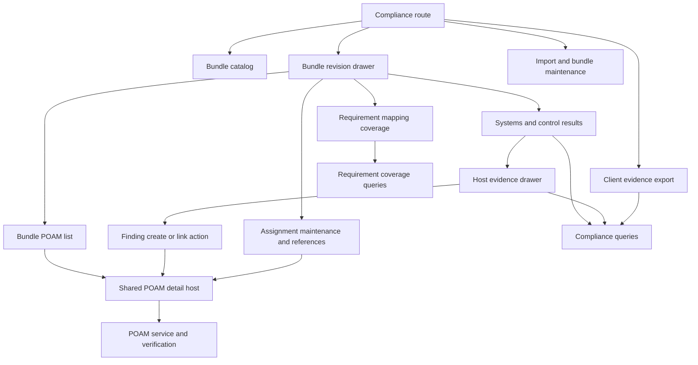


### 3.1 Surface ownership

| Surface | Production owner | Main purpose | Important boundary |
|---|---|---|---|
| Page and route state | `views/compliance.rs` | Select bundle, revision, host, policy, POA&M, and subview. | Selection is not evidence authority. |
| Bundle catalog | `components/compliance/mod.rs` | Browse bundle lineages and summary metadata. | Current-pointer summary is not the selected historical revision. |
| Requirement coverage | Page card plus framework queries | Show how selected policy versions map to baseline requirements. | Mapping coverage is not runtime success. |
| Systems matrix | Shared Compliance component | Show host-level control result aggregation. | Its evidence selector is not identical to the evidence drawer selector. |
| Host evidence | Shared evidence drawer | Display per-policy evidence and current remediation relationships. | Display fallback can lack mutation authority. |
| Finding Create / Link | Shared POA&M components | Start or join remediation for a current failed finding. | Server re-resolves identity, evidence, visibility, and compatibility. |
| Bundle POA&M list | Page plus shared table | Show related remediation plans. | Query uses bundle lineage, not the selected revision. |
| Common POA&M detail | Shared POA&M host and tray | Edit, track milestones, verify, close, and inspect history. | Policy and exact-CVE families require different capabilities. |
| Assignment maintenance | Page-local panels | Maintain exact assignment versions and attach baseline references. | Linking a reference neither changes assignment state nor creates a waiver. |
| Report export | Page modal plus `export/mod.rs` | Generate report files in the browser. | Export is a separate projection, not a byte-for-byte evidence DTO export. |
| Import and release controls | Page-local dialogs and backend handlers | Review source, create drafts, trust, publish. | Their effects must invalidate current-policy and coverage projections. |

### 3.2 Scope that the route must make explicit

At least four scopes coexist in one open drawer: the bundle lineage used for catalog and POA&M membership, the selected bundle version used for coverage and versioned systems, the host's currently effective assignment and policy context, and the observation selected for a displayed control. A fifth scope is the historical link or closure snapshot inside a POA&M. These must not be described by one unqualified label such as “current.” [P01], [P07], [P13], [P15]

A CVE-originated POA&M can open at this route through the `poam` parameter without any bundle or host selection. Therefore the common POA&M detail must work independently of the surrounding catalog. A policy finding with no bundle context is also a valid navigation case, not an impossible state. [P01], [P03], [P08]

---

## 4. Identity and state model


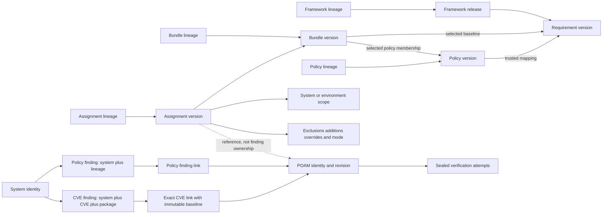

The two finding-link branches describe alternative POA&M families. They do not permit one plan to mix policy and exact-CVE findings. [P12]


### 4.1 Identity dictionary

| Object | Identity | What must not be substituted |
|---|---|---|
| System | System UUID | Hostname, display name, or another host with the same configuration name. |
| Bundle | Bundle lineage UUID | Current published version UUID or display version text. |
| Bundle version | Immutable version UUID within a bundle lineage | “Latest,” current draft, or current published pointer after explicit selection. |
| Framework release | Framework version UUID | A framework name shared by multiple releases. |
| Requirement | Requirement version UUID and its framework release | A copied external ID without release identity. |
| Policy | Policy lineage UUID | Current policy version or a requirement that it maps to. |
| Policy version | Exact policy version UUID | Another version in the same lineage. |
| Assignment | Assignment lineage UUID and immutable assignment version UUID | A current pointer after a baseline reference has been recorded. |
| Policy finding | Stable finding UUID for system plus policy lineage | A single assessment UUID; the finding can outlive one assessment. |
| Exact CVE finding | Stable finding UUID for system plus canonical CVE plus canonical package | Policy finding identity, package version, or CVE ID alone. |
| Observation | Assessment or typed source-specific observation context | A label, score, HTML rendering, or current list row. |
| POA&M | Stable UUID, human label, optimistic revision | The human label alone or a stale revision from another open drawer. |
| Finding link | Link identity, active/retired state, family, and baseline where applicable | Plan identity alone; links have their own audit history. |
| Verification | Sealed attempt and per-finding items | Milestone checkboxes or a previous successful attempt when closing later. |
| Waiver | Waiver identity and observation binding | An accepted-risk CVE disposition or a baseline assignment reference. |

These distinctions are visible in the UI contexts, creation service, verification services, and summary counts. [P02], [P03], [P08]–[P13], [P20], [P21]

### 4.2 Orthogonal state dimensions

The implementation already has several independent dimensions. A coherent design must preserve them rather than collapse them into one status chip.

| Dimension | Examples | Separate from |
|---|---|---|
| Catalog/release lifecycle | Draft, published, trusted, deprecated | Whether a host passed a policy. |
| Effective policy resolution | Resolved, conflict, not applicable | Whether evaluation evidence exists. |
| Evidence availability | Present, missing, pending, partial, error, fallback | The outcome of a complete authoritative evaluation. |
| Policy outcome | Pass, Warn, Fail, Waiver, Not checked, Not applicable, Error | Whether remediation is tracked. |
| Requirement mapping | Full, Partial, Unmapped, Recovery required | Host assessment and closure state. |
| Remediation lifecycle | Open, In progress, Awaiting verification, Completed | Overdue status and evidence result. |
| Remediation coverage | On a POA&M, no active POA&M, historical association | Assignee availability. |
| Exact-CVE disposition | Outstanding, accepted risk, scheduled remediation | Scheduled deployment target and actual package absence. |
| Timing | Due today, overdue, review due, evidence age | Boolean completion or acceptance. |

**PROPOSED:** Every status component should declare which dimension it displays. For example, “Covered” in a requirement table must not imply “Verified” in a remediation tray. A warning-colored unknown state must not count as a policy failure merely because it is visually urgent. [P01]–[P05], [P07], [P10]–[P15]

---

## 5. UI-to-API contract inventory

Paths below are relative to `/api/v1`. The route registration establishes the path; the service and handler establish authority. No endpoint was called against a running Crystal Forge server in this review. [P06], [P16]

| Surface/action | API or service entry | Selection and response contract | Caution |
|---|---|---|---|
| Bundle catalog | `GET /compliance/bundles` | Bundle lineage summaries and version pointers. | Handler authenticates but does not pass a caller environment scope to `list_bundles`. |
| One bundle | `GET /compliance/bundles/:id` | Finds one item from the catalog read. | Does not independently establish host visibility. |
| Versioned systems | `GET /compliance/bundles/:id/systems?version_id=...` | Optional exact bundle version; systems and totals. | Handler does not pass caller environment memberships. |
| Host evidence | `GET /compliance/bundles/:id/systems/:system_id/evidence?version_id=...` | Host, optional version, controls and observation context. | Explicit host environment check; GET can materialize finding identities. |
| System Compliance | `GET /systems/:system_id/compliance` | Applicable bundle, direct, and overall rollups. | Handler is authentication-only in the inspected source. |
| Policy membership | `GET /compliance/bundle-versions/:version_id/policies` | Exact selected policy versions. | Does not resolve a different version from a lineage pointer. |
| Requirement membership | `GET /compliance/bundle-versions/:version_id/requirements` | Exact requirement baseline. | Independent from selected policies. |
| Requirement coverage | `GET /compliance/bundle-versions/:bv_id/requirement-coverage` | Coverage rows plus full/partial/unmapped/recovery counts. | No per-host evaluation meaning. |
| Requirement search | Framework-version requirement search | Bounded candidates and continuation information. | Page picker does not provide a complete browse path. |
| Assignment maintenance | `/compliance/assignments/:id` | Immutable current snapshot; update carries `expected_version_id`. | Admin and CSRF checks confirmed for create/update. |
| Assignment preview | `POST /compliance/assignments/preview` | Preview proposed effective choices. | Preview is not a committed assignment. |
| Trust / publish / draft | Version-scoped release endpoints | Exact version identifier and release inputs. | Full release transaction audit is outside this pass. |
| XCCDF | Version- or assignment-specific XCCDF endpoints | Interchange artifact for an explicit domain object. | Not the same path as the report export modal. |
| POA&M lists and rollups | `poam_api` list, system rollup, bundle rollup clients | Scoped plan summaries, family counts, server timing. | A lineage rollup cannot be called a selected-version total. |
| Finding create / link | POA&M service `create`, shared compatible-search clients | Current failed policy context; assessment or typed legacy observation. | Client display fields cannot establish a valid mutation. |
| POA&M detail/history | Shared `fetch_poam` | Revision plus bounded findings, activity, attempts, and reference data. | Continuations must be reconciled against the same plan revision. |
| Verify / close / reopen | POA&M service lifecycle actions | Exact plan ID and revision; server-owned finding set. | Close performs fresh verification, even after Verify succeeded. |
| Policy waiver | `create_waiver`, list/get/decision service | Current failed finding and exact observation binding. | No control-level entry action found in the inspected Compliance UI. |

The table intentionally uses service/client names where the complete endpoint registration was not reread. This avoids presenting guessed paths as a verified HTTP contract. [P03], [P08]–[P13]

---

## 6. Persistence and provenance map

### 6.1 Read and mutation stores

| Store or model | Role in the route | Authority limitation |
|---|---|---|
| `compliance_bundle_versions` and selected policy/requirement memberships | Version-specific baseline and implementation selection. | Catalog pointer changes do not change an already selected version's identity. |
| Framework and requirement versions, `policy_requirement_mappings` | Requirement lineage, release, mapping semantics, trust, provenance. | A trusted mapping is not proof that its implementation was evaluated successfully. |
| Assignment lineages, immutable assignment versions, additions/exclusions/overrides | Current effective baseline for a host or environment. | Baseline references retain exact versions; they are not active finding links. |
| `system_states` | Running-path and generation observations. | Selection order and handling of incomplete latest rows differ between resolvers. |
| `evaluation_generation_snapshots`, `evaluation_snapshots`, `derivations` | Retained-generation and exact target binding, strongest in exact-CVE verification. | A matching path alone is not equivalent to all retained-generation checks. |
| `composite_policy_assessments` and `composite_policy_rule_results` | Persisted policy assessment and ordered rule output. | Matrix, detail, and verification do not select these identically. |
| Evaluation-attempt rule results | Supplemental evaluation output. | Current Compliance fallback does not bind all returned rows to one deployed target or one attempt. |
| Nix policy results and completed `cve_scans` counters | Source-neutral legacy policy observations. | A CVE threshold result is not an exact CVE/package occurrence finding. |
| `poam_findings`, `poam_finding_links` | Stable policy finding and active/historical remediation association. | GET evidence can materialize the stable identity. |
| `poam_cve_findings`, `poam_cve_finding_links` | Exact-CVE remediation family with immutable link baseline. | Cannot be mixed with policy findings in one active family. |
| `poams`, milestones, activity, assignment references | Remediation management. | Plan edits and milestones do not rewrite technical observations. |
| `finding_waivers`, waiver events | Policy-risk decision bound to an observation. | Not a fleet CVE accepted-risk record. |
| Verification attempts and policy/CVE verification items | Sealed evidence of the verification decision. | A prior attempt is history, not permission to close against changed evidence. |
| CVE host/environment disposition records | Current triage and append-only disposition history. | Closure retires scheduled dispositions; acceptance is not exact absence. |

The table describes the stores read or written by inspected query/service paths. Database constraints and triggers outside the recorded ranges were not exhaustively audited. [P07]–[P13], [P15], [P21]

### 6.2 GET evidence is not a purely read-only operation

The evidence query creates or updates stable `poam_findings` identities for the relevant system/policy lineages under a system key. This is identity materialization. It does not create a POA&M, accept a risk, or manufacture a passed result. Nevertheless, a GET request can write to the database. The report export's evidence fetches can invoke the same behavior. [P07], [P01]

This affects the cross-view review in two ways. First, a list that derives counts only from existing finding rows can have a different population before and after evidence inspection unless another producer has already materialized every relevant finding. Second, “read-only user” and “read-only endpoint” must be distinguished from “no database writes.” The current producer completeness and read-driven population effects require a real fixture test; they are not established by the existence of an upsert alone.

**PROPOSED:** Declare the materialization rule explicitly. Prefer a producer-owned complete finding projection, or expose bounded lazy materialization as a documented service behavior with idempotence and consistent rollups. Do not remove the upsert without replacing the stable identity path.

---

## 7. Bundle versions, assignments, and requirement coverage

### 7.1 Three different version questions

“Which bundle version is selected?” is a browser navigation question. “Which version is assigned to this host?” is a current assignment question. “Which policy version produced this observation?” is an evidence question. Their identifiers can differ legitimately. The UI should show the difference instead of replacing one with another. [P01], [P07]

The versioned systems path starts from active assignments whose current immutable assignment version names the requested bundle version. It resolves effective policy provenance for those systems. Therefore this path is a view of current applicability to a selected baseline version, not a historical snapshot of every host that used that baseline. The unversioned path and catalog current pointers have different selection semantics. [P07]

The bundle POA&M list and rollups use a bundle lineage. Selecting an older bundle revision does not make those remediation counts historical or revision-specific. A closed plan can remain associated through closure metadata or an assignment reference. That is useful, but the scope needs a label. [P01], [P13]

### 7.2 Requirement baseline is independent of selected implementation

A bundle version has selected requirement versions and selected policy versions. They are not interchangeable sets. A requirement can have no trusted implementation mapping; a policy can be a custom addition; several policies can contribute to one requirement. The current coverage query preserves selected requirements in the denominator even when their framework release requires recovery. [P15]


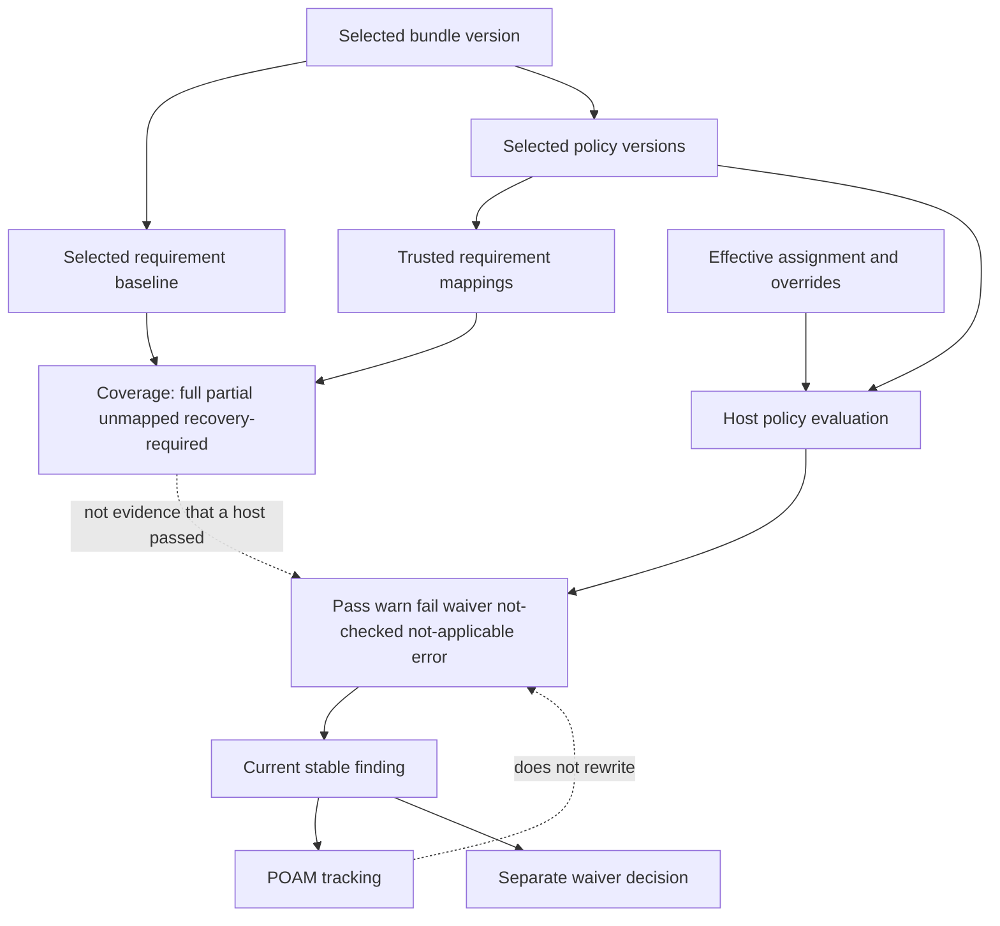


The as-built mapping classification is:

| Coverage state | Rule |
|---|---|
| Full | At least one selected policy version has a trusted mapping that both implements the requirement and declares full coverage, with a finalized framework release. |
| Partial | At least one eligible trusted mapping exists, but the full implementation condition is not satisfied. |
| Unmapped | Release is finalized, but no eligible trusted selected-policy mapping exists. |
| Recovery required | Framework release has not completed semantic recovery/finalization. It stays in the baseline denominator. |

`total_requirements = full + partial + unmapped + recovery_required`. These are requirement-version counts, not host counts, policy counts, or POA&M counts. Coverage reads source-framework identity from the bundle version separately from requirement membership, so even a corrupt zero-requirement baseline can retain its source identity for diagnosis. [P15]

The query does not derive runtime pass/fail from mapped-policy coverage. It reads selected membership and trusted mapping records, not each host's current evaluation. An assignment override also does not automatically rewrite the bundle version's baseline coverage. Host-specific effective implementation coverage would be a separate proposed projection.

### 7.3 Assignment references do not establish remediation coverage

The assignment panel can link an existing POA&M to an immutable assignment version. That is a baseline reference. It is not a finding, an accepted waiver, an environment CVE decision, a migration approval, or an instruction to deploy. The generic policy creation service independently validates reference visibility and compatibility with its actual finding. [P01], [P03], [P08]


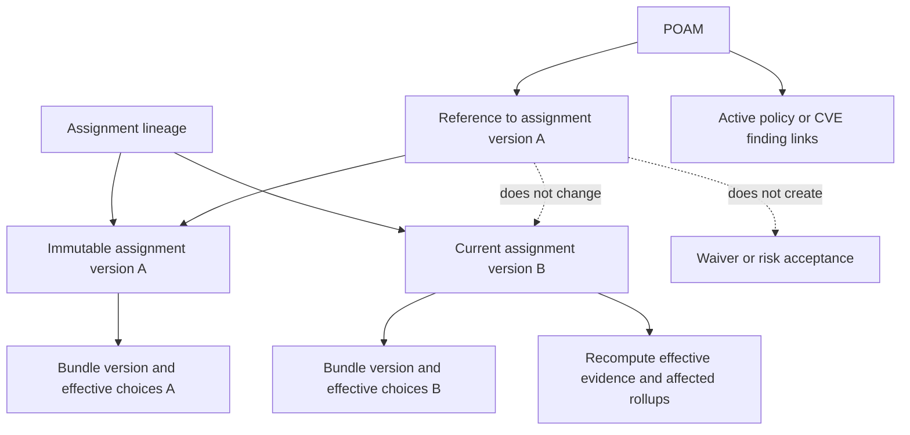


Create/update assignment handlers require an administrator and a valid CSRF value. Updates load state from the current immutable assignment snapshot, preserve the scope and bundle version, apply tri-state reason semantics, and pass the supplied expected version into persistence. Omitted reason preserves the prior value; explicit null clears it; a value sets it. This contract must remain separate from a POA&M's numeric optimistic revision. [P06]

The UI offers assignment maintenance controls without the same explicit viewer guard that its POA&M link action uses. A visible control can therefore offer an action that the backend forbids. This is a UI capability mismatch, not evidence that a viewer can bypass the server's administrator requirement. [P01], [P06]

---

## 8. Evidence source selection and authority


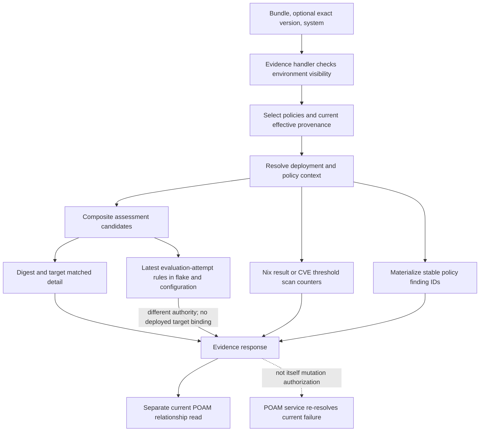


### 8.1 Evidence selection by surface

| Consumer | Primary selector | Supplemental or fallback behavior | Action authority |
|---|---|---|---|
| Versioned systems matrix | Current effective policies for requested bundle version; resolved deployment context. | Batched composite status query uses the complete effective-set digest; legacy policy types use their own result/counter paths. | Summary only. |
| Host evidence drawer | Host, selected version when supplied, effective policy and target context. | Composite detail accepts enforced or complete digest; it can fall back to evaluation-attempt rules. | A displayed result is not sufficient by itself. |
| Policy POA&M create | Server-resolved current failed policy finding. | Supports an assessment identity or a typed source-neutral legacy observation. | Validated under a stable finding key. |
| Policy POA&M verification | Current effective policy set and compatible assessment/rule evidence; exact legacy observation where applicable. | Missing and stale remain explicit; matching observation-bound waiver is a distinct accepted result. | Fresh server resolution under writer-compatible locks. |
| Exact-CVE POA&M verification | Current retained running generation and exact derivation; link baseline. | No cross-deployment baseline substitution; requires a later schema-1 scan for the same deployment binding. | Exact pair absence only. |
| Report export | Cached original bundle systems plus newly fetched evidence. | Calls evidence with no selected version; generator creates a narrower report projection. | No independent verification or closure authority. |

This table is the central consistency boundary. Sharing the word “evidence” does not make these selectors equivalent. [P01], [P07]–[P12], [P14]


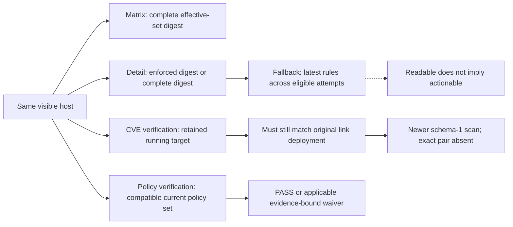


### 8.2 Composite digest mismatch

The batch matrix path supplies the complete resolved effective-set digest to `load_composite_assessment_statuses`. The detailed evidence path supplies both the enforced-composite authorization digest and the complete digest, and prefers the enforced digest. Policy verification also computes the enforced-composite authorization digest and selects a compatible assessment set. [P07], [P11]

A complete set can include policy context that is not part of the enforced-composite authorization set. If an assessment is stored under the enforced digest and the complete digest differs, the detail and verification selectors can accept it while the matrix selector does not match it. This is a source-confirmed predicate difference. A fixture with different complete/enforced digests is needed to show the exact user-visible matrix result and prove the repair.

**PROPOSED:** One domain resolver should define compatible assessment identity. The matrix may aggregate the result, but it must not implement a weaker or narrower alternative digest rule. Report-only policy changes must be tested explicitly rather than used as a reason to disable all freshness checks.

### 8.3 Latest evaluation-attempt fallback is not deployed evidence

`load_current_eval_attempt_results` searches evaluation attempts in the system's flake and configuration. It selects the newest row for each policy-version/rule pair. It does not bind the selected rows to the resolved deployed derivation, store path, or effective digest. Per-rule selection can also combine rows from different attempts. The assembled control context has one attempt field rather than preserving a distinct attempt identity for every independently selected rule. [P07]

For example, a host can still run commit A while an undeployed commit B produces a passing rule. The fallback selector can display B's rule while the surrounding drawer was entered from the host. Another rule can come from a different attempt. This is a query-level possibility established by the selectors, not a runtime reproduction performed here.

The fallback does not thereby acquire a valid assessment ID or current typed observation token for remediation. The create service still re-resolves current failure. The defect is that presentation can imply one coherent current result when its rows have different provenance. A missing expected rule can also be hidden if aggregation only sees returned fallback rows. [P02], [P07], [P08]

**PROPOSED:** Keep candidate/evaluation evidence accessible, but give it an explicit selection, attempt ID, target, completeness, and read-only reason. Select one coherent attempt before selecting its rules. Never use a successful candidate evaluation to claim current-host compliance.

### 8.4 Latest row versus latest valid row

The Compliance target resolver reads the latest system state and then validates its useful fields. Exact-CVE verification also validates the latest state and requires generation/store agreement. The policy verification assessment query, however, selects the latest non-empty store-path state by filtering rows before limiting them. A newer incomplete state can therefore be ignored by that policy query while another surface treats current authority as unavailable. [P07], [P10], [P11]

This requires a shared decision: does an incomplete newest report invalidate current authority, or may a retained earlier value remain current under an explicit freshness rule? The current implementation does not express one rule consistently. Do not silently standardize on the permissive rule to make counts agree.

### 8.5 Policy thresholds versus individual CVEs

A `require_cve_check` policy can derive its outcome from completed scan counters and configured critical/high thresholds. The inspected batch helper does not require the same schema-1 immutable occurrence contract as exact-CVE findings. A threshold-policy finding remains a policy finding keyed by system and policy lineage. It is not an alias for every CVE/package pair in a fleet table. [P07], [P10]

One host can legitimately have a passing threshold policy and still have lower-severity exact vulnerabilities. Conversely, a threshold-policy failure can represent several occurrences but produce one policy finding. Cross-view consistency means explaining the rule and count unit, not forcing the values to match numerically.

### 8.6 Safeguards already present

The inspected batch evaluation path restores each host's effective configuration before evaluating a materialized policy version. It should not be reported as blindly applying another host's override merely because version metadata is cached by policy version. The detailed path also preserves real requirement mapping data rather than the design's simulated identifiers. These are protections to retain. [P07], [P02]

The source-level audit does not prove every helper's authority closure. Producer completeness, missing-rule behavior, unsupported snapshots, stale users, and all concurrency interleavings remain in the verification plan.

---

## 9. Count units, scores, and misleading clean states

### 9.1 Current score formula

For the normal per-system control aggregation inspected here:

```text
evaluated = pass + warn + fail + waiver
all controls = evaluated + not_checked + not_applicable + error
score = floor(100 * pass / evaluated), when evaluated > 0
score = 0, when evaluated = 0
```

Unresolved applicability/resolution uses its own state and can return zero evaluated controls. Waiver is in the evaluated denominator but not the Pass numerator. Not checked, Not applicable, and Error do not contribute to that evaluated denominator. These are current application rules, not a claim about any external compliance standard. [P07]

The totals helper considers a host fully compliant when Fail, Warn, and Error are zero and evaluated controls are greater than zero. Consequently, a host with only waived evaluated controls can satisfy that fully-compliant predicate while its score is zero. A host with one Pass plus additional Not checked controls can retain a high score because those unassessed controls do not enter the score denominator. The product wording must explain or change these rules deliberately. [P07]

### 9.2 Clean filtering is weaker than the server predicate

The systems matrix and client export scope use `fail == 0 && warn == 0`. They do not test Error, Not checked, resolution conflict, or whether any control was evaluated. Therefore “Clean” can include an error-only or unassessed host. This is a predicate defect, independent of whether a screenshot looks correct. [P01], [P02], [P14]

The score strip displays Pass, Warn, Fail, and Waiver without the full availability/error state distribution. The aggregate report DTO projection and export summaries omit additional fields that would explain this discrepancy. Unknown coverage must not become apparent success through omission. [P02], [P07], [P14]

### 9.3 POA&M quantities are not all plan counts

| Quantity | Unit and population |
|---|---|
| Requirement coverage total | Selected requirement versions in one bundle version. |
| Bundle control count | Selected policy membership, not requirement membership. |
| System result total | Evaluated or listed policy results for that system/context. |
| Open policy findings | Current failed stable policy findings in the scoped resolver population. |
| On POA&M findings | Those failed policy findings with a visible active policy-finding link. |
| No POA&M findings | Open policy findings minus On POA&M findings. |
| Open / overdue / awaiting / closed plans | Distinct POA&M records associated with the scope. |
| Policy `finding_count` | Policy-finding family count, not exact CVE count. |
| `cve_finding_count` | Exact-CVE finding count, separately projected. |
| Fleet CVE rows | Canonical CVE/package pairs across inventory scope, not policy findings or scan occurrences. |

System/bundle POA&M rollup services recompute current failed policy findings. A waiver result can still retain an observed Fail, so a technically failed but waived policy must not be assumed absent from every open-finding projection. Exact predicates and labels must be compared explicitly. [P13], [P20], [P21], [P24]

### 9.4 Bundle membership is broader than active control remediation

The bundle POA&M service builds association from relevant active policy links, closure verification bundle IDs, and assignment references. An assignment-referenced plan can therefore be associated with a bundle without adding an open failed policy finding to that bundle. No exact-CVE occurrence-to-bundle mapping is implied by this association. [P13]

The compact POA&M table displays the policy `finding_count` without substituting or separately displaying `cve_finding_count`. An exact-CVE plan can thus appear to have zero linked findings even though the backend explicitly reports its CVE family count. The model and query already support the distinction; the presentation needs to use it. [P03], [P20], [P21], [P22]

**PROPOSED:** Put the unit and scope in every count contract. Require `open_policy_findings = on_poam_policy_findings + no_poam_policy_findings` within one authorized response revision. Do not require a plan count to equal a finding count, and do not sum per-bundle plan totals as if all plans belonged to only one bundle.


---

## 10. Navigation, request state, and refresh boundaries

### 10.1 URL contract

The page owns six query keys: `bundle`, `version`, `system`, `policy`, `poam`, and `view`. UUID parsing is optional; malformed values become absent selections. The view parser recognizes overview, coverage, and POA&M modes, with unknown modes returning to overview. Unrelated query parameters are retained. These are useful mechanics, but they do not establish that an explicit invalid or unavailable selection is handled honestly. [P01]

At initial load, a requested bundle that is not in the returned catalog can fall back to the first bundle. An unavailable requested version can fall back to a current published or draft pointer. A user following an exact evidence link can therefore receive another valid-looking context rather than a clear unavailable state. This should not be used to hide a stale link or a visibility failure. [P01]

**PROPOSED:** Distinguish an absent selection from an explicit invalid/unavailable selection. Default selection is suitable for an ordinary page visit. Exact deep links must preserve the requested identity and show why it cannot be opened.

### 10.2 Requests are independently keyed

The page maintains distinct request state for catalog, systems, coverage, assignments, policy details, bundle POA&M rollups, bundle POA&M lists, and nested evidence. Several requests use generation guards, which correctly prevent an old response from replacing a newer request. There is no one page-wide scope revision that binds all these independent resources. [P01]

The bundle selection path clears some evidence and POA&M state and starts a new systems fetch. It does not consistently invalidate the POA&M-list request generation or clear the assignment scope. A late result for bundle A can therefore remain eligible to update state after selecting B, depending on the navigation path. This is an identified race in the source lifecycle; it was not reproduced in a browser.

Coverage suppresses repeated fetches for a version through a last-requested marker. An error can leave that marker in place, so merely revisiting the same selection does not necessarily retry. Policy-detail loading also has a shared in-flight guard rather than a complete per-selection request identity. Each resource needs its own explicit retry and stale-response contract. [P01]

### 10.3 POA&M-to-evidence navigation has a zero-candidate failure

The policy finding navigation callback tries to retain a current bundle/version pair or find a unique candidate pair. Its expression includes:

```rust
(candidates.len() == 1).then_some(candidates[0])
```

The argument to `then_some` is evaluated even when the condition is false. When the enclosing fallback runs with an empty candidate list, indexing element zero panics. A direct-policy finding or an obsolete/unavailable bundle association can reach a legitimate no-candidate state. The callback needs an explicit zero/one/many match; zero is not a valid reason to select an unrelated bundle. [P01]

The retention check also treats bundle-ID and version-ID membership as separate collections. A future exact navigation contract should carry a validated pair rather than rely on independent membership checks that can lose pair provenance.

### 10.4 Keyboard selection and route selection can diverge

The shared evidence drawer changes its active control index for keyboard movement and selection reconciliation. Those paths do not consistently invoke the `on_active_policy` callback that the click path uses. The visible policy can therefore differ from the policy key in the URL. The return-to-system route also does not preserve a precise Compliance/evidence target in the same way an exact evidence route should. [P02]

A browser test must move between policies by keyboard, copy the URL, reopen it, and check exact identity. A test that only clicks rows cannot prove this contract.

### 10.5 As-built invalidation graph


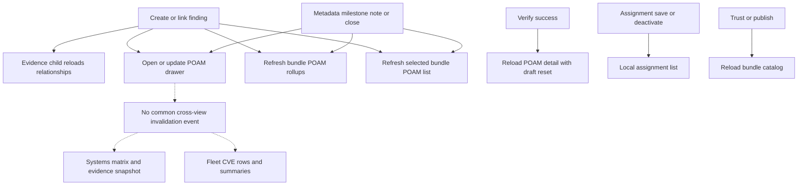


| Event | Refresh that is explicitly present | Data not covered by a common invalidation contract |
|---|---|---|
| Create/link from an evidence finding | Child relationship resource refresh; parent opens plan and refreshes bundle POA&M rollups/list. | Control assessment, matrix, catalog score, other routes, and export cache. |
| Metadata, note, milestone, or lifecycle mutation through common detail | Detail response reconciled; host change callback refreshes bundle POA&M rollups/list. | Open evidence snapshot and assignment-related projections outside that host. |
| Verify succeeds | POA&M detail is fetched again. | Host change callback is not issued on this path; parent rollup/list can remain stale. |
| Close rejects with recorded attempt | Error handler recognizes returned revision/history and reloads detail. | Other surfaces do not get one declared committed-write event. |
| Assignment save/deactivate | Local assignment list changes or reloads. | Effective matrix, score, coverage context, POA&M relationships and other host views. |
| Trust/publish | Bundle catalog reloads. | Current evidence, selected systems, derived coverage and remediation relationships are not uniformly invalidated. |
| Policy edit | Policy library refreshes. | Every affected Compliance projection does not receive an explicit dependency update. |
| Navigate back to an existing subview | Route state changes. | Some list fetches depend on the original click or load path rather than route state alone. |

The evidence parent's `InvalidateAssessment` callback is a no-op, but the child independently refreshes its relationship resource. It would be incorrect to report that no relationship refresh exists. The actual gap is incomplete invalidation across the larger data graph. [P01]–[P03]

**PROPOSED:** A committed domain mutation should publish typed affected identities and revisions to an application-level invalidation mechanism. Each mounted route should refresh only the resources it uses. It must not convert an accepted mutation into a false failure merely because a later refresh fails. Section 21 defines this as a review proposal.

---

## 11. Finding-origin POA&M creation and linking

### 11.1 Policy finding context

The shared evidence drawer constructs a `FindingPoamContext` containing a stable finding ID, system ID, policy lineage/version identity, optional assessment, optional source-neutral observation, and display context. Bundle and requirement information helps explain the finding; it does not replace the finding identity. A failing result with no usable authority must remain distinct from a valid mutation source. [P02], [P03]

`FindingPoamBar` checks relationship identity before displaying it. It offers creation/linking for a Fail result without an active plan, subject to role state. It preserves history separately. That is the correct placement model. A bundle is not a deficiency; an assignment reference is not a substitute for a failed finding. [P03], [P05], [P08]

### 11.2 Creation transaction and success boundary


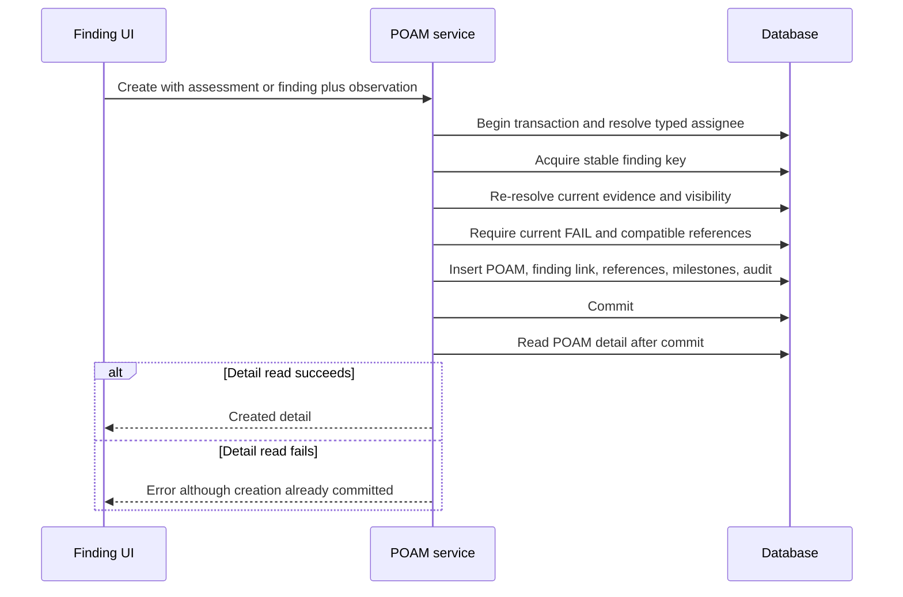


The generic policy creation service validates the title, text bounds, typed/legacy assignee shape, and assignment reference bound. It obtains the stable finding key, re-resolves the current observation, requires a current Fail, checks visibility, and validates reference compatibility. It inserts the POA&M, active finding link, optional assignment references, optional milestones, and audit activity in one transaction. [P08]

There is an important response-boundary difference from exact fleet triage and the close path: the generic creation service commits, then calls `detail(...)` to build its response. If that read fails, the caller can receive an error after the plan and link already exist. This does not prove that a duplicate plan can be inserted, because the active-link constraints still matter. It does mean that the UI must not state that nothing was created or blindly replay the request as a new operation. [P08], [P12], [P24]

**PROPOSED:** Either build the success payload before commit, as other mutation paths do, or return an unambiguous committed receipt that survives detail-fetch failure. A later refresh failure should be presented as “created, detail unavailable,” not “creation did not happen.”

### 11.3 Different minimum fields are currently allowed

Generic policy remediation permits an initially empty plan and an unassigned/legacy-compatible ownership path. A target date is optional; when default milestones are requested and no target is supplied, the service supplies a date 56 days after the service clock's date. Fleet CVE scheduling requires stricter reusable POA&M metadata, including typed assignment, plan, and date, as documented in the CVEs draft. These differences must be explicit rather than accidentally hidden by a shared form. [P03], [P08], [P24]

The current policy service creates its standard milestones at fixed offsets of 14, 28, 35, 49, and 56 days. Those offsets do not scale to an explicitly supplied earlier target date. A plan due in 14 days can therefore receive later milestones by construction. Decide whether defaults must fit the chosen target, remain a template that needs operator adjustment, or be rejected when inconsistent. Do not call these offsets a regulatory deadline. [P08]

### 11.4 Compatible linking is not an arbitrary plan picker

Finding-origin linking uses server-compatible POA&M candidates and a current observation context. The common tray's “Link finding” picker is a different entry point. It requests bounded compatible finding candidates but its UI requires an assessment ID before linking. A valid legacy policy finding can be actionable from its evidence drawer through a typed observation while remaining blocked in this picker. That is a capability mismatch across entry points, not proof that the backend has no legacy support. [P03], [P08]

Both picker paths take the first bounded result set without a complete continuation interaction. A search can still be useful, but a partial response must not appear to be the complete eligible population. Missing candidates require an explicit empty state and a way to distinguish no compatible results from a load failure. [P03]

### 11.5 Existing and historical relationships

The finding relationship can identify an active plan and retained history. The UI's “Completed history” wording is narrower than general retired association history. The shared component should not assume every historical link belongs to a completed plan without a server field that proves that lifecycle state. The exact query population for every history variant was not independently audited in this pass. This is a verification item, not a confirmed claim that a specific live plan is mislabeled. [P03]

---

## 12. Common POA&M detail, families, and entry-point consistency

### 12.1 One record, several callers

The common tray is opened from Compliance findings, bundle POA&M lists, assignment-reference panels, and direct route parameters. Related callers also exist in System Detail and fleet CVE workflows. The shared component is useful, but callers provide different optional callbacks and candidate lists. That changes what a user can do after opening the same plan. [P01], [P03], [P23], [P24]

The top-level Compliance `PoamDetailHost` supplies an empty assignment-version candidate list and does not supply the optional CVE-finding evidence callback. The assignment panel hosts a different local POA&M context. Thus the same plan can expose different reference/evidence actions depending on how it was opened. This must become a deliberate capability contract, not a side effect of optional component parameters. [P01], [P03]

### 12.2 Policy and exact-CVE finding families

The backend separately projects policy `finding_count` and `cve_finding_count`. Verification requires one nonempty finding family. The shared detail can render exact vulnerabilities and retired CVE link history, but it also renders the policy “Linked findings” area and policy finding picker. Those controls must not suggest that the user can mix incompatible finding families. [P03], [P10], [P12], [P20], [P21]

For an exact-CVE POA&M opened from fleet triage into Compliance, the missing callback means its Evidence action is not rendered. The user can inspect the remediation record but lacks the corresponding direct exact-CVE return path. A normal navigation sequence must work in both directions: CVE finding → plan → the same CVE/package and host evidence. [P01], [P03], [P24]

The exact-CVE table also renders a fixed-version fallback as unavailable and prefers current observed package version with a baseline fallback. Without distinct source labels, that fallback can obscure whether a displayed version is current evidence or the immutable linkage baseline. A missing fixed version should remain unknown, but known metadata must be traceable through the common plan view. [P03]

### 12.3 As-built tray hierarchy

The common tray renders its identity/header, owner/date/opened/progress metadata, remediation status and verification attempts, plan details, vulnerability and policy-finding areas, assignment references, remediation plan, milestones, and activity. The production version adds explicit saves and authoritative attempt history. Those are useful additions, but some are moved ahead of the evidence summary compared with the reference. Section 18 records the exact structural differences. [P03], [P05]

### 12.4 Draft preservation and pending state

Metadata and plan edits use explicit persistence actions. Stale revision handling can reload authoritative detail while preserving local drafts, which is the correct starting point. However, Verify success calls the detail loader with draft reset enabled and does not issue the host's general change callback. Verification should not silently discard unrelated unsaved plan edits. [P03]

Controls are generally disabled during a pending mutation or for a read-only actor. Completion is not uniformly used as an additional editor capability boundary. The backend may reject an invalid completed-record mutation, but the visible controls should tell the user what is supported before submission. The exact set of allowed completed-record metadata edits requires a domain decision and full endpoint review. [P03], [P12]

### 12.5 Bounded history

The detail component supports append-style history loads and checks plan revision before combining pages. That is a useful safeguard. It uses different limits for finding, activity, and verification history. A complete design must state whether each counter describes loaded rows or the complete server population and whether policy and CVE histories have independent continuation metadata. This review does not assume an uninspected query returns the entire history. [P03]

Retired CVE links have an explicit presentation. The inspected policy-finding section filters to active links and does not show an equivalent standalone retired policy-link list. That difference must be tested after closing and reopening both families, not dismissed because verification attempts remain visible.

---

## 13. Verification, closure, and reopening

### 13.1 Verification is not scanning and is not closure

Both `verify` and `close` require `awaiting_verification` in the inspected service. Verification reads current authoritative evidence, records a sealed attempt and updated revision, and leaves the plan awaiting verification. It does not enqueue a new scan and does not itself complete the plan. [P12]

The common UI exposes “Verify now” for every non-completed plan. The server rejects it in states other than awaiting verification. Align the action availability with the domain contract, or explicitly redesign the contract. Repeatedly offering an action that must fail is not an acceptable loading or validation strategy. [P03], [P12]


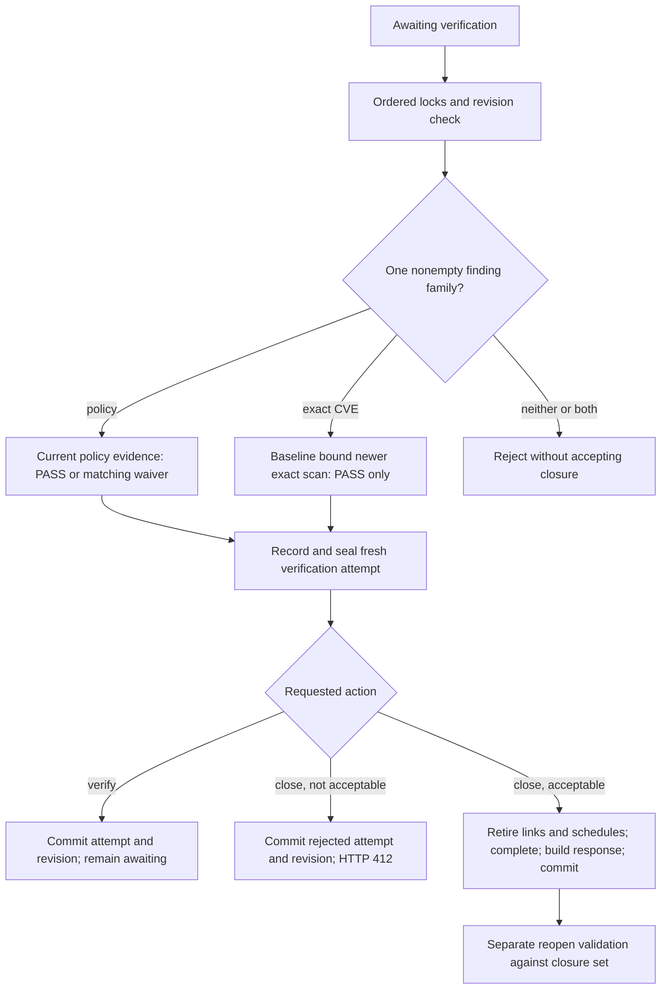


### 13.2 Policy finding acceptance

Policy verification re-resolves the current effective policy set. A missing effective policy or resolution conflict yields a stale result rather than a success. Compatible composite evidence must match policy and effective-context identity, including expected rules. The legacy policy path retains a source-specific observation snapshot and semantic token. An applicable accepted waiver is a separate verification result, not a rewritten passed technical result. [P11], [P12]

For policy findings, an acceptable closure item is Pass or the domain's applicable waiver result. The underlying observation, current policy context, and waiver binding still matter. Merely removing a policy, changing its enforcement mode, or retaining an old accepted waiver must not be treated as equivalent to a new Pass. The remaining helper and expiry edge cases are part of the proposed fixture suite.

### 13.3 Exact-CVE acceptance remains tied to the original deployment

Exact-CVE verification loads the active link's immutable baseline and resolves the current running derivation through retained-generation evidence. It requires the current derivation ID, retained-generation snapshot ID, generation number, and target store path to equal the baseline. It then selects a completed schema-1 scan strictly newer than the baseline scan. The exact canonical CVE/package pair must be absent for Pass. [P10]

If a fixed generation B replaces the baseline generation A, verification returns Missing before accepting B's clean scan. This confirms the same continuity issue identified in the fleet CVEs document. Opening the plan from Compliance does not change that rule. The existing continuity proposal remains a proposal, not a reason to remove the check in a UI-only repair. [P10], [P24], [P25]

Whitelisted or justified occurrences that remain present do not produce Pass in the exact-CVE verification path. Fleet accepted-risk disposition also does not supply a policy waiver item. The closure service accepts exact-CVE items only when every item is Pass. [P10], [P12]

### 13.4 Ordered transactions and response semantics

The verification/close path gathers and locks the relevant CVE keys, system sentinels, policy finding keys, exact-CVE keys, and active links in a defined order. It checks current authorization and optimistic revision, confirms the finding set, resolves evidence again, and writes the attempt and audit data. The locks are not an implementation detail that can be replaced by trusting a prior browser response. [P12]

Close performs a fresh verification even if Verify recently succeeded. If evidence is acceptable, the service retires the active links and relevant scheduled dispositions, records completion and closure-attempt identity, builds detail in the transaction, and commits. Milestone completion alone is not the acceptance condition. [P12]

If close is rejected, the service **commits the rejected attempt and a new revision**, then returns HTTP 412 with attempt/revision and result details. This is an intentional partial-success shape: the closure failed, but its audit attempt was recorded. The UI already has special handling for this case. It must not erase the attempt, keep using the previous revision, or report that no write occurred. [P03], [P12]

The generic create service's post-commit detail read is a different committed-write/error case. A unified client error type should distinguish validation rejection, stale revision, committed rejected verification, and committed mutation with failed refresh. One generic “not applied” string is insufficient. [P08], [P12]

### 13.5 Reopening

The inspected reopen entry and contract describe restoring from the retained closure finding set, subject to current ownership and applicability constraints. Reopen is not simply setting `status = in_progress`. The complete reopen implementation was not independently reread in this Compliance pass; the companion CVEs document describes its exact-CVE environment and ownership constraints in more detail. [P12], [P24]

**PROPOSED:** Joint review should define what remains fixed after reopening: plan ID, finding identity, original linkage baseline, closure-attempt history, current active links, and any episode identity introduced by a continuity design. Closed historical evidence must not be overwritten to make a later state look consistent.

---

## 14. Waivers, CVE acceptance, and assignment exceptions


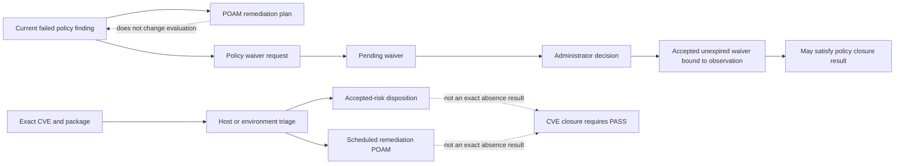


### 14.1 Policy waiver

The policy waiver creation service requires a mutating actor and a current failed observation. It supports assessment-based and typed legacy observation contexts. It creates a pending waiver with immutable observation-related data and audit history. The list/get and decision entry points inspected here require an administrator. The full administrative decision implementation was not audited in this pass. [P09]

Current policy verification only considers an accepted, non-expired waiver with matching finding, policy version, assessment identity where applicable, and observation token. This is stronger than attaching a justification string to a plan. It also means that a waiver can cease to apply when the relevant observation changes. [P11]

The design and shared create dialog direct users to a separate waiver flow. No `create_waiver` caller was found by a focused Web UI source search, and no waiver action was found in the inspected Compliance view, evidence drawer, or shared POA&M module. This establishes an entry-point gap within the audited surfaces. It does not prove that no external administrative API client exists. [P01]–[P05], [P09]

### 14.2 CVE accepted risk

CVE accepted risk is a host or environment disposition for a canonical CVE/package context. It is not a `finding_waivers` row and does not produce an exact absence result. A plan can remain open while risk is accepted; a scheduled plan remains different from acceptance. The fleet CVEs draft explains host precedence and environmental defaults. [P10], [P12], [P24]

### 14.3 Assignment exception or baseline reference

A baseline assignment reason and its immutable version can explain why a system stays on a baseline. A POA&M reference can connect that decision to tracked work. The reference does not grant a waiver, change the finding outcome, authorize a deployment, or become a finding counted as remediated. [P01], [P06], [P08], [P13]

### 14.4 Joint terminology decision

**PROPOSED:** Use “Waiver” only for the policy waiver domain, “Accepted risk” for the exact-CVE disposition domain, and “Baseline assignment reference” for the exact assignment link. Keep an independent technical outcome visible beside each. Common UI styling can be shared, but shared styling must not erase different expiry, scope, authorization, or closure rules.

The choice to permit policy closure through an accepted waiver while requiring exact-CVE absence may be intentional. Consistency does not require those policies to be identical. It requires explicit types, accurate labels, and no transfer of authority between them.

---

## 15. Evidence export and report integrity

### 15.1 As-built export path


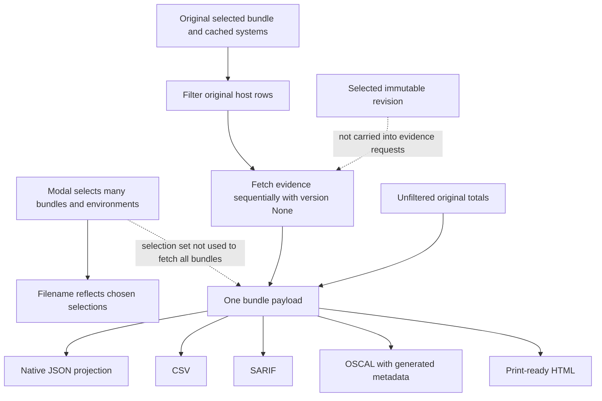


The page's export dialog accepts a multi-bundle selection, environment selection, host scope, format, and inclusion options. Its download closure, however, retains the original selected bundle and its systems response. It does not iterate through the selected bundle set to fetch each bundle's systems and evidence. The filename reflects the selection more broadly than the payload does. Selecting another bundle or deselecting the original does not make the payload follow that selection. [P01]

The modal does not receive the selected bundle-version ID. Its per-host evidence calls pass `None` as the version. A user looking at a pinned or historical bundle revision can therefore download evidence resolved through the unversioned path. The surrounding bundle summary and cached systems can describe a different context from those newly fetched controls. [P01], [P07]

The host rows are filtered, but the payload retains the original unfiltered totals. The preview summary is also based on the original systems response. Counts can therefore include excluded hosts or controls while the file contains a smaller population. The same weak Clean predicate described in Section 9 applies. [P01], [P14]

These are separate defects: multi-bundle selection, immutable revision retention, and denominator recomputation. Fixing only the filename cannot fix any of them.

### 15.2 Format-specific projection

| Format | What the generator actually carries | Important omission or assumption |
|---|---|---|
| Crystal Forge JSON | Selected presentation fields for one bundle, totals, systems, controls, and optional simple evidence items. | Not full-fidelity serialization of the evidence DTO. Omits exact bundle/policy versions, observation IDs/tokens, retained target proof, source timestamps, POA&M link state, and several availability fields. |
| CSV | Per-host/per-control rows with repeated host rollups; rollup-only fallback when no evidence rows exist. | Repeated host totals are not additive control counts. Exact proof and remediation history are not represented. |
| SARIF | Rules by policy identity and host/control results; a waiver is represented separately from a passed result. | Versioned source authority and real waiver metadata are not fully retained; suppression rationale is generic. |
| OSCAL | Generated assessment results plus embedded generated plan/security-plan-like documents. | Hard-coded classification, sensitivity and collection metadata; some state/method fields are synthesized from display content. |
| Print-ready HTML | Escaped presentation summary and per-control evidence tables. | A readable report, not an immutable proof bundle or an actual server-generated PDF. |
| Version/assignment XCCDF | Separate server endpoint for an explicit interchange object. | Not evidence that the browser's report payload has the same scope or provenance. |

These observations concern the code's transformations. This audit did not run a SARIF or OSCAL schema validator and does not certify any format as valid or invalid against its complete external schema. [P14], [P16]

### 15.3 Unsupported authoritative-looking metadata

The OSCAL generator writes `UNCLASSIFIED` and a low security sensitivity into generated records. It uses the export-time browser clock as observation collection time and assessment start/end time. It infers “evaluated” and policy-enabled state from whether evidence text contains `enabled=false`. Those values do not come from a verified source record or an explicit user choice in the audited export path. [P14]

It also contains the literal `not-satisficed` for the Not checked state. That spelling differs from the other generated state values. Schema validity must be tested, but the broader provenance problem exists independently of that spelling: a missing evaluation cannot honestly acquire an observed collection time or a verified classification merely because an export was generated.

**PROPOSED:** Export generation time, source observation time, classification, assessment boundary, and source method must be separate fields. Missing authoritative metadata must remain unavailable or require explicit input. Export must not default to a weaker classification or invent an assessment event.

### 15.4 Native JSON is not currently an evidence replay contract

The generator comments call the native JSON full fidelity and suitable for re-ingestion. The implementation manually selects a subset of fields instead of serializing the complete current evidence response. Its control status is derived from a debug enum representation, while other formats use separate label mappings. This file is a reporting projection, not yet a complete replay or round-trip contract. [P14]

A replay contract would need schema/version identifiers, exact subject selection, observation IDs, immutable artifacts or verified references, source timestamps, completeness, authorization scope, and state dimensions. A report could intentionally omit those details, but it must not claim that the omitted proof can be reconstructed.

### 15.5 Bounds, consistency, and failure

Evidence is fetched sequentially for the original scoped systems, and an evidence error aborts the download rather than silently dropping that host. This is a useful all-or-nothing behavior. It does not create a database snapshot spanning the separate requests. A deployment, assignment, policy publication, waiver, or scan can change between host reads. [P01], [P07]

**PROPOSED:** Build an authorized server-side export selection or use a documented revision-bound multi-request protocol. Return complete selection metadata and reject a changing dataset or produce an explicitly time-bounded, source-ID-complete report. Recompute totals after all filters, and test the actual exported bytes, not only the dialog.

---

## 16. Import, bundle maintenance, and assignment side effects

### 16.1 Import state machine and browser persistence

The page contains upload, native review, reconciliation, refinement, final review, committing, and completion states. It preserves ordered source/check fragments and uses a source hash to detect a different re-upload. A persisted draft is bounded to roughly 2 MiB; the fallback strips heavier preview/refinement data before falling back further or reporting a size problem. [P01]

The local-storage key is `cf-stig-import-draft`, with a versioned payload. It is not namespaced by authenticated user. An import draft is not a secret store, and its retained source/notes must not be assumed isolated across account changes in the same browser profile. Session-change cleanup and user-specific draft ownership require verification. This is a local retention and context risk, not a claim that another browser can read the draft remotely. [P01]

The visible import workflow treats imported content as a draft rather than automatically treating source text as trusted executable policy. The page also differentiates required source-derived statements from user refinement. The parser, source trust transition, publication transaction, and all import-side database constraints were not fully audited here. Preserve those boundaries in any implementation task rather than relying on the UI alone.

### 16.2 Requirement hydration in bundle editing

The edit form starts with asynchronously loaded requirement membership. Some failures are ignored, and the loading state is not a complete barrier to submission. The draft/current-pointer selection is also not the same as the revision a user is currently browsing. This creates a risk that an unhydrated empty membership candidate can be submitted as an intentional replacement. The exact resulting update must be exercised against the real endpoint before claiming a demonstrated deletion. [P01], [P06]

The framework picker starts fetching when its data is empty and it is not loading. Without a separate loaded/error marker, an empty successful result or a failure can trigger repeated fetch attempts during rendering. Requirement search is bounded but has no complete continuation interface. These are state-machine gaps, not reasons to replace exact membership with lineage-based inference. [P01]

**PROPOSED:** Require explicit hydration completion for every replace-style editor. Preserve unknown membership separately from a known empty set. Use exact source version, editable draft identity, expected revision/digest, and a clear target version in the dialog.

### 16.3 Release changes and invalidation

Trust and publish callbacks refetch the bundle catalog but do not declare the complete set of affected resources. Publishing can change current pointers; assignment state can change effective policies; policy edits can change coverage and evidence compatibility. A coherent invalidation contract must account for each dependency. A successful catalog refresh is not proof that a displayed systems matrix or evidence drawer has changed to the same revision. [P01], [P07], [P15]

The full publication transaction was not independently inspected in this pass. Do not infer that it is unsafe merely because the caller omits an optional expected digest. The actionable source finding here is the UI's incomplete context and refresh propagation; transaction-level publication guarantees remain an explicit verification item.

### 16.4 Assignment maintenance details

Assignment cards are keyed by lineage while editable state is initialized from a version. After a version refresh, unchanged component identity can preserve stale local form state unless it is deliberately reconciled. Preview results are shared rather than fully scoped to one assignment/request. Saving or deactivating an assignment only updates the local list; relationship and effective-evidence caches do not receive one complete change event. [P01]

The backend create/update path does preserve the immutable current snapshot and expected-version contract. UI repair should use it, not update immutable rows in place. Reason preservation and clearing have distinct semantics and an existing named browser test. [P06], [P18], [P19]

---

## 17. Authorization, errors, loading, and unavailable states

### 17.1 Authorization asymmetry

The inspected catalog, bundle systems, and System Compliance handlers check that a user is authenticated, then call queries without an actor environment scope. The host evidence handler and policy-usage handler explicitly load environment memberships and return Not found for a hidden host. POA&M rollup services pass actor scope into their queries. These are different boundaries for adjacent panels. [P06], [P13]

The selected version systems query contains host identifiers and per-system results, so treating its missing caller scope as harmless public catalog metadata is not sufficient. A non-admin can be permitted to request a host list whose detail route would deny that host. The source path is a P1 scope defect relative to the environment-scoped model used by evidence and POA&M services. No cross-environment live HTTP reproduction was run, and database-level access controls outside the inspected path were not certified. [P06], [P07]

**PROPOSED:** Resolve one `ComplianceReadScope` before any host membership, names, counts, environment aggregates, search candidates, or export selection. Empty membership must be restrictive. A global shared bundle definition can remain visible by policy, but its host-derived data must be independently scoped.

### 17.2 CSRF and capability checks

Assignment create/update handlers explicitly check administrator role and CSRF. Basic bundle create/update/delete handlers in the inspected initial range have administrator checks but do not show the same local CSRF call. The final server router composition inspected here adds CORS and state; allowing the CSRF header is not a validation check. Full middleware/extractor coverage for every mutation remains unverified, so the gap register treats this as a route-protection verification priority rather than a tested exploit. [P06], [P16]

A user who can manage a POA&M is not automatically permitted to publish a baseline or change an assignment. Typed assignee identity is not authorization. The UI needs operation-specific capabilities instead of reusing one “can edit” flag for all these actions. [P03], [P06], [P08], [P09]

### 17.3 Required error distinctions

| State | As-built observation | Required interpretation in a reviewed contract |
|---|---|---|
| No bundles | Page has a dedicated empty path. | No visible catalog items, not proof that every host is compliant. |
| Catalog error | Separate error UI exists. | Do not replace with empty catalog or success totals. |
| Evidence loading | The loading-only wrapper lacks the full close/Escape control set. | Loading must remain dismissible; a stalled fetch must not trap navigation. |
| Coverage failed | Version request marker can suppress automatic retry. | Explicit retry resets request state without changing the selected version. |
| Hidden/unavailable exact selection | Some page selection paths fall back. | Preserve requested identity and show an unavailable state; do not substitute. |
| No compatible plan/finding | Some pickers have weak empty/continuation treatment. | Distinguish none, partial results, unauthorized, and error. |
| POA&M stale revision | Reload/preserve behavior exists. | Retain draft, show the current revision, require a conscious retry. |
| Rejected close | HTTP 412 can include a committed attempt and revision. | Closure failed; verification record succeeded. |
| Successful mutation, refresh failed | Generic create can commit before detail fetch. | Do not claim the mutation was rolled back. |
| No current exact-CVE authority | Common plan can remain readable. | Missing proof cannot become Pass or a policy waiver. |
| Assignment edit forbidden | Backend administrator guard exists. | Do not offer unrestricted edit/deactivate to a viewer/operator. |
| Assignee unavailable | Typed historical identity can be displayed. | Retain history; do not treat unavailable assignment as valid reusable scheduling metadata. |

The table combines inspected current behavior and an explicit target interpretation. It does not certify keyboard/focus behavior without browser execution. [P01]–[P03], [P06], [P08]–[P12]

---

## 18. Source-level design parity register

This is a structural comparison against `ComplianceView.jsx` and `PoamViews.jsx`, not a pixel comparison. Changes that protect evidence or make persistence explicit are identified separately from omissions. [P01]–[P05], [P17]

### 18.1 Page and bundle drawer

| Category | Reference | Production observation | Treatment |
|---|---|---|---|
| Missing section/action | Header offers an evidence-package/ATO entry action in addition to import/export. | No equivalent top-level action found in the production Compliance header. | Decide supported package workflow; do not relabel the report modal as equivalent. |
| Reordered section | Revisions and requirement coverage precede the bundle POA&M rollup. | POA&M rollup appears before Revisions; coverage follows Revisions. | Record hierarchy change for review. |
| Missing filters | Systems matrix offers environment, On POA&M, No POA&M, and Overdue filters. | Production matrix has basic All/Clean/Warn/Fail filtering without these remediation/environment filters. | Missing workflow, not only spacing. |
| Missing metadata | Systems rows show remediation state and related plan IDs/counts. | Production matrix has no equivalent POA&M column. | Important omission for locating unmanaged failures. |
| Collapsed concept | Host operational health and compliance score are separate. | Production status-dot presentation derives from the score. | Do not imply operational health from compliance percentage. |
| Missing metadata | Pin/assignment context includes reason, approver, migration deadline, and related plan context. | Production shows some assignment identity/reason but lacks the full reference metadata. | Keep explicit unavailable fields; do not invent approvals. |
| Changed interaction | Exact selected context should remain identifiable throughout the drawer. | Header uses lineage/current-pointer summary while content can use another selected version. | Label each scope and prevent apparent version substitution. |
| Missing empty detail | Filtered matrix has a distinct empty explanation in a complete workflow. | No equivalent dedicated filtered empty row was identified in the inspected matrix. | Add reset and distinguish unavailable evidence. |

### 18.2 Evidence drawer

| Category | Reference | Production observation | Treatment |
|---|---|---|---|
| Missing navigation metadata | Control list includes remediation/overdue hints. | No equivalent per-control POA&M/overdue navigation tag. | Users must open individual controls to discover tracking state. |
| Changed grouping | Reference names fixed framework navigation categories. | Production derives grouping from available evidence metadata. | Dynamic real grouping is valid; test ordering and labels rather than hard-code demo groups. |
| Missing artifact metadata | Evidence artifacts display source/reference, timestamp, type-specific icon, and collapsible content. | Production uses more generic file/terminal presentation and omits parts of this provenance hierarchy. | Restore data-backed provenance, not fake text. |
| Collapsed concept | Multiple artifact kinds have different readable presentations. | Generic artifact rendering merges several types. | Preserve distinctions where operators need them to assess evidence. |
| Changed interaction | Keyboard movement and selected control should identify the same target. | Keyboard and reconciliation paths do not consistently synchronize the URL callback. | Behavioral parity defect. |
| Added correctness | Reference can synthesize mapping identifiers from mock data. | Production renders real requirement mappings. | Keep production behavior. Never fabricate SRG/CCI/requirement identity for parity. |
| Added correctness | Fixture POA&M state updates locally. | Production queries typed relationships and validates finding identity. | Keep server authority. |
| Missing loading controls | Fully interactive drawer remains dismissible. | Initial loading wrapper does not include all close/Escape affordances. | Verify focus and dismissal for loading/error states. |

### 18.3 POA&M create, link, and detail

| Category | Reference | Production observation | Treatment |
|---|---|---|---|
| Changed persistence | Metadata changes immediately mutate the demo store. | Explicit Save metadata and Save plan. | Supported earlier production difference; retain unsaved-state clarity. |
| Reordered sections | Deficiency precedes vulnerability scope; plan then milestones/activity. | Production adds Plan details and moves vulnerability/verification material relative to findings. | Review density and hierarchy with rendered comparison. |
| Added section | One simplified closure record. | Bounded verification attempts and per-item results. | Necessary audit enhancement; distinguish latest readiness from historical attempts. |
| Missing family action | Exact-CVE plan should link back to its vulnerability context. | Compliance caller does not supply the CVE Evidence callback. | Cross-view workflow is incomplete. |
| Collapsed or misleading count | Deficiency context can describe the active finding family. | Compact table prints policy finding count for a CVE-only plan. | Use typed family counts. |
| Changed interaction | Lifecycle actions should match supported transitions. | Verify now is offered outside the service's required awaiting-verification state. | Align capabilities. |
| Missing history parity | Retained link history should be inspectable. | Explicit CVE retired-link section has no equivalent policy-link presentation identified. | Verify both families after close/reopen. |
| Missing compatible path | Link action should reach eligible findings. | Tray picker requires assessment ID and omits legacy observation-only candidates. | Reuse the typed server contract. |
| Missing picker continuation | Eligible populations can exceed one page. | First 50 candidates only, no complete browse continuation. | Expose bounded pagination and honest totals. |
| Missing waiver entry | Create copy directs users to a separate control waiver flow. | No action found in audited control surfaces. | Add or explicitly delimit the workflow; do not merge it into POA&M creation. |

### 18.4 Export, import, and maintenance

The export modal has the visual multi-select controls, but their downstream data behavior does not match the chosen scope. This is functional non-parity even before rendering is compared. The existing export browser test asserts those controls and a filename, not the bytes that the user downloads. [P01], [P18]

The import wizard is substantially more involved than a mock file picker: it maintains source identity, review stages, and resumable state. This audit does not assert full visual parity with the separately implemented import or bundle editor references; those complete references and all states were not rendered. Requirements that those surfaces preserve provenance, exact baseline membership, and explicit trust transitions remain in scope as data contracts.

### 18.5 Visual verification still required

Capture page, bundle drawer, evidence, create/link dialogs, shared POA&M tray, assignment editor/reference picker, import stages, and each export format configuration. Compare desktop, narrow desktop, and mobile in both themes. Inspect every affected hierarchy, not only one representative screenshot. Record missing sections and interaction changes separately from geometry/color differences. No baseline should be updated merely to make a test pass before the design decision is approved.

---

## 19. Performance and query behavior

### 19.1 Work that is already batched

The Compliance query layer includes batched system-policy resolution, shared policy-version metadata, batched composite status loading, and bounded service inputs. Requirement coverage reads mappings for a whole selected baseline. POA&M system/bundle rollups use bounded ID batches and reject overlarge resolver populations. The evidence component batches relationship lookup by stable finding identity. These are mechanisms to preserve, not evidence that all paths are fast. [P02], [P07], [P13], [P15]

### 19.2 Where workload grows

| Path | Source-level cost driver | Measurement required |
|---|---|---|
| Initial Compliance page | Catalog plus rollups plus systems can load before a detail drawer is opened. | Request count, payload size, and critical-path latency for a large catalog. |
| One-bundle endpoint | Reads full catalog then selects one bundle in the handler. | Total catalog work versus true point lookup. |
| Versioned host evidence | Can call the bundle-wide systems computation before selecting one system. | Whether per-host export multiplies bundle-wide work. |
| System Compliance | Bundle reads and per-bundle evidence work are distinct from direct-policy aggregation. | Query count and duplicated resolver work across many bundles. |
| Composite fallback | Latest-per-rule selection across evaluation attempts. | Rows scanned, indexes, and whether bounded output hides broad work. |
| Policy verification | Loads assessment/rule context and compatible sets for linked findings. | Cost as hosts, policy lineages, and retained assessments increase. |
| Exact-CVE verification | Loops through findings, resolving baseline, target, scan, occurrence, and justification. | Queries per finding; latency for large fleet plans. |
| Bundle POA&M rollup | Current assignments, findings, verification context, active links, closure context, references. | Query/lock contention and coherent snapshot cost. |
| Client export | Sequential per-host evidence calls plus full in-memory report generation. | Timeout, memory, cancellation, and request amplification. |
| Requirement coverage | Multiple metadata/mapping reads and per-row mapping association. | Large-baseline memory/CPU, ordering and pagination needs. |

These are inspected scaling characteristics and measurement targets. No EXPLAIN plan, latency percentile, query count, or production load was measured. Do not call an existing batched query O(1) merely because it uses a fixed number of SQL statements. [P01], [P07], [P10], [P11], [P13]–[P15]

### 19.3 Coherent reads versus repeated reads

Several page projections are assembled from separate database statements and separate HTTP requests. The source can change between catalog, systems, evidence, relationships, rollups, and export. A deterministic sort does not make that composite read a snapshot. [P01], [P07], [P13], [P15]

**PROPOSED:** Choose a consistency boundary explicitly. Within one response, use a coherent read transaction or a materialized versioned projection where needed. Across requests, return scope/evidence revisions and prevent the UI from combining incompatible responses. Do not hold a browser-spanning database transaction open.

### 19.4 Bounded does not mean complete

The route has several first-page pickers and all-items client helpers. A bound protects memory but does not justify a “no more items” claim. Counts, scope overflow, paging failures, cursor/revision changes, and retry behavior must be part of the contract. Performance repairs must not silently truncate current remediation subjects or exported evidence to hide a slow query.


---

## 20. Consolidated gap register

This register is for architecture review, not an MR approval decision. Priority indicates the consequence to investigate or repair. It does not imply that a reproduction was executed. A P1 source finding needs independent runtime coverage before a repair can be accepted. A verification or measurement priority is deliberately not presented as a proven exploit or measured performance regression.

The scope of each finding is the pinned source. Refer to Section 18 for the full visual-structure inventory, rather than treating its single consolidated row below as a complete parity checklist.


| ID | Priority | Evidence status | Gap | Required response | Source / section |
|---|---|---|---|---|---|
| CPG01 | P1 | Source-confirmed scope mismatch | Compliance catalog and systems projections do not apply the environment scope used by evidence and POA&M reads. | Use one explicit read-scope contract before host/count aggregation. Prove hidden-environment behavior through real routes. | [P06], [P07], [P13]; §17.1 |
| CPG02 | P1 | Source-confirmed selector mismatch | The matrix, evidence detail, and verification paths do not use identical complete/enforced policy-context matching rules. | Define compatible assessment-set selection once. Preserve intentional display-only differences with an explicit authority label. | [P07], [P11]; §8.2 |
| CPG03 | P1 | Source-confirmed display-authority gap | Evaluation-attempt fallback can select latest results per rule without an exact deployed-target binding or one common attempt. | Expose candidate evidence separately. Require one identified complete observation set for a current-result claim. | [P07]; §8.3 |
| CPG04 | P1 review priority | Source-confirmed predicate difference; impact unexecuted | Some current-state reads validate the newest report; policy verification first filters to nonempty store paths. | Test a newer invalid report after an older valid report. Decide whether last-known state is an explicit secondary mode. | [P07], [P10], [P11]; §8.4 |
| CPG05 | P1 | Source-confirmed export-scope defect | Multi-bundle selection changes the reported selection or filename, but the export body is built from the original single bundle. | Fetch and serialize exactly the chosen bundle set. Reject an empty selection and never include a deselected bundle. | [P01], [P14]; §15.1 |
| CPG06 | P1 | Source-confirmed revision loss | Evidence export does not pass the selected immutable bundle revision to each evidence request. | Bind each export item to a validated bundle/version pair and preserve that pair through every request and file. | [P01], [P14]; §15.1 |
| CPG07 | P1 | Source-confirmed reporting mismatch | Filtered export rows can retain unfiltered totals. The native JSON projection omits important evidence and version identities. | Define report scope and count units. Carry a provenance envelope or label the result as a non-replayable summary. | [P01], [P14]; §15.2–15.4 |
| CPG08 | P1 | Source-confirmed unsupported report metadata | The OSCAL generator assigns classification, sensitivity, observation times, and evaluation metadata without corresponding authoritative inputs. | Require sourced values or represent them as unspecified. Separate export time from observation time. Validate emitted formats independently. | [P14]; §15.3 |
| CPG09 | P2 | Source-confirmed clean-filter defect | Clean filtering checks only Fail and Warn, so incomplete or error-only hosts can enter a clean selection. | Define clean from completeness, errors, conflicts, and applicable evaluated results. Use the same predicate in export. | [P01], [P02], [P07], [P14]; §9.2 |
| CPG10 | P2 | Source-confirmed terminology mismatch | Waiver-only evaluated hosts can satisfy the fully-compliant predicate while receiving a zero Pass-based score. | Name technical pass rate, accepted risk, evaluation coverage, and compliance policy separately. Approve any formula change explicitly. | [P07]; §9.1 |
| CPG11 | P2 | Source-confirmed identity substitution | An unknown bundle/version deep link can fall back to another selection; the heading can retain current-pointer metadata for a selected revision. | Fail explicitly for an unavailable exact selection. Render heading metadata from the selected version. | [P01], [P02]; §7.1,10.1 |
| CPG12 | P2 | Source-confirmed panic path | POA&M-to-evidence navigation eagerly evaluates candidates[0] inside then_some when no valid bundle candidate exists. | Handle zero, one, and multiple candidates without indexing before the cardinality check. Preserve direct-policy navigation. | [P01]; §10.3 |
| CPG13 | P2 | Source-confirmed caller-capability gap | The Compliance POA&M host omits the exact-CVE Evidence callback, while the common tray still exposes policy-oriented finding controls. | Make finding-family capabilities explicit and provide a valid exact-CVE return path from every caller. | [P01], [P03]; §12.1–12.2 |
| CPG14 | P2 | Source-confirmed count-family defect | The compact POA&M table uses policy finding_count for a CVE-only plan even though the API supplies cve_finding_count. | Render the active finding family and its count, not a zero policy count described as all findings. | [P03], [P20], [P21], [P22]; §12.2 |
| CPG15 | P2 | Source-confirmed action-state mismatch | Verify now is offered outside awaiting_verification, but the service rejects verification in those states. | Render server-supported lifecycle capabilities and retain server enforcement. | [P03], [P12]; §13.1 |
| CPG16 | P2 | Source-confirmed draft/refresh mismatch | Successful Verify reloads with draft reset and does not call the parent change callback. | Preserve unrelated unsaved edits and publish a verification/revision invalidation event. Distinguish saved and draft values. | [P03], [P12]; §12.4,13.1 |
| CPG17 | P2 | Source-confirmed incomplete invalidation graph | Plan, assignment, policy, and release mutations refresh different local projections without a common dependency contract. | Define mutation receipts and affected-resource invalidation across Systems, CVEs, Compliance, and exports. | [P01], [P02], [P03]; §10.5 |
| CPG18 | P2 | Source-confirmed missing request fences; races unexecuted | POA&M list and assignment scope changes do not consistently invalidate outstanding requests for the previous bundle context. | Bind every asynchronous response to selection, visibility, and request generation. Clear obsolete scope on navigation. | [P01]; §10.2,16.4 |
| CPG19 | P2 | Source-confirmed edit-state risk; persistence effect unverified | Bundle requirement editing can begin with an empty selection while hydration is pending or failed. | Block destructive replacement until the authoritative initial selection loads. Test persistence through the real update path. | [P01]; §16.2 |
| CPG20 | P2 | Source-confirmed assignment presentation/refresh gap | Assignment edit/deactivate presentation is not consistently role-gated; local drafts and parent caches can retain prior assignment state. | Use explicit capabilities, immutable assignment-version preconditions, and committed readback. Keep Admin/CSRF enforcement. | [P01], [P06]; §16.4,17.2 |
| CPG21 | P2 | Audited entry-point omission | The audited control UI refers to a separate waiver workflow but provides no inspected request/decision entry point. | Provide or identify the complete policy-waiver workflow. Do not replace it with CVE acceptance or POA&M scheduling. | [P01], [P02], [P03], [P09]; §14.1 |
| CPG22 | P2 | Source-confirmed picker gaps | First-page candidate limits lack continuation, and the tray policy linker excludes observation-only legacy contexts that other entry points support. | Use the shared typed finding contract and bounded continuation. Distinguish no matches from a partial catalog. | [P03]; §11.4,12.3 |
| CPG23 | P2 | Source-confirmed recoverability gaps | Initial evidence loading lacks the normal close path, and a failed coverage request can retain its last-request marker and prevent a simple retry. | Keep dismissal and retry available in loading and failed states. Test stalled requests and repeated same-selection retries. | [P01], [P02]; §17.3 |
| CPG24 | P2 | Source-level visual/metadata omission | Systems filters, remediation indicators, assignment context, and artifact source/type/time hierarchy differ from the design reference. | Resolve the detailed Section 18 matrix, then inspect exact-head rendered pairs. Do not invent missing metadata. | [P01], [P02], [P04], [P05]; §18 |
| CPG25 | P2 | Source-confirmed ambiguous-success boundary | Generic policy POA&M creation commits before loading response detail; a later read failure can be reported after the write succeeds. | Define a committed-result receipt or construct authoritative response data before commit. Test retry and lost-response reconciliation. | [P08]; §11.2 |
| CPG26 | P2 | Source-confirmed milestone/date mismatch | Policy default milestones use fixed offsets through day 56 even when the user chooses an earlier target completion date. | Approve target-relative milestone generation or an explicit schedule conflict. Do not change an existing plan silently. | [P08]; §11.3 |
| CPG27 | P1 review priority | Source-confirmed lifecycle constraint; design decision open | Exact-CVE verification returns MISSING after a deployment identity differs from the immutable link baseline, even with a newer clean exact scan on the new deployment. | Review baseline preservation versus current-evidence continuity jointly. Never repair this by overwriting the original baseline. | [P10], [P24], [P25]; §13.3 |
| CPG28 | Verification priority | Incomplete route-level security verification | Some inspected basic bundle handlers lack an explicit local CSRF check; assignment and POA&M mutations do have checks. | Inventory all write routes and execute missing/mismatched-token tests. Do not infer exploitability from an absent local check alone. | [P06], [P12], [P16]; §17.2 |
| CPG29 | Verification priority | Source-confirmed materialization; coverage of producers unverified | Evidence GET can materialize stable finding identities. Rollups count materialized finding records, but complete producer coverage was not established. | Prove that visiting an evidence drawer or exporting cannot change the apparent open-finding population. Document read-side writes. | [P07], [P13]; §6.2,9.3 |
| CPG30 | P2 review priority | Source-confirmed browser-state scope; impact unexecuted | Import draft persistence uses a shared local-storage key rather than an explicit account/environment identity. | Define draft ownership, logout handling, source matching, expiry, and recovery. Never treat restored state as import approval. | [P01]; §16.1 |
| CPG31 | P2 | Source-level history presentation gap | The shared tray explicitly presents retired exact-CVE links but does not provide equivalent policy-link history presentation in the inspected path. | Verify active, retired, and closure-set navigation for both families. Do not label every retired link completed remediation. | [P03], [P12]; §12.5 |
| CPG32 | Measurement priority | Source-confirmed scaling and snapshot boundaries; performance unmeasured | Per-host exports can repeat bundle-wide work, and several multi-query projections lack a common evidence revision. | Measure representative query plans, bounded expansion, and lock behavior; define coherent response and export snapshot boundaries. | [P01], [P07], [P10], [P11], [P13], [P15]; §19 |


### 20.1 Initial repair order, subject to review

First address unauthorized scope disclosure, target/assessment authority disagreement, and report scope/provenance. These can make an otherwise functional page describe the wrong systems or evidence. Then repair the complete create/link/verify/close/navigation workflow, including committed-error semantics. Finally close the remaining presentation, recoverability, pagination, and measured query-cost gaps. Do not postpone evidence identity behind screenshot work.

The cross-deployment exact-CVE issue needs an explicit lifecycle decision before implementation. It is not a request to loosen every exact-evidence prerequisite. A revised verifier must preserve the link-time baseline, independently authorize the current deployment, and record the evidence used for closure.

---

## 21. Proposed shared contracts

**PROPOSED.** This section is a review target. It does not describe new endpoints or types that already exist. The objective is shared meaning across the three views, not identical evidence algorithms for every finding family.


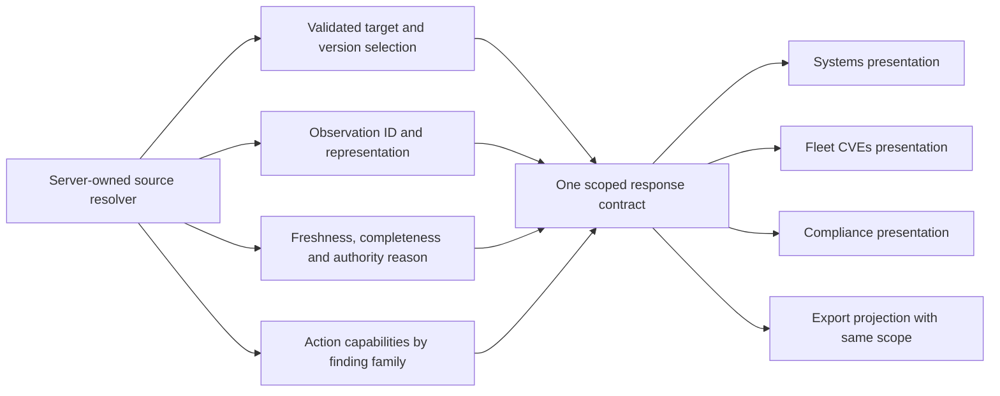


### 21.1 A validated selection and observation envelope

Each evidence-bearing response should identify the following dimensions separately. Use typed fields rather than reconstructing them from labels or array order.

| Dimension | Proposed meaning |
|---|---|
| Selection | Validated system, bundle/version pair where applicable, and target kind. An unavailable exact selection fails explicitly. |
| Observation | Stable source identity, source representation, observation time, and the exact target that was assessed. |
| Policy context | Policy lineage/version, effective configuration identity, assessment-set identity, and declared compatibility rule. |
| Completeness | Complete, partial, unavailable, unsupported, or failed acquisition. Empty findings alone do not imply a complete clean assessment. |
| Authority | Current authoritative, historical authoritative, or display-only candidate, with a machine-readable reason. |
| Visibility | Caller scope resolved before aggregation. Do not disclose hidden scope in counts, autocomplete, errors, or exports. |
| Findings | Typed policy or exact-CVE identity. Keep a policy threshold failure distinct from an individual CVE occurrence. |
| Disposition | Host decision, environment default, applicable policy waiver, and effective decision where the family supports them. |
| Remediation | Active plan relationships, immutable link baseline, related assignment references, and historical relationships. |
| Capabilities | Server-validated available actions with reason codes. These aid presentation and do not replace write-time authorization. |
| Revisions | Evidence/projection revision and record revision as separate fields. Neither is automatically a Git commit. |

A proposed shape is shown below. It is deliberately a design sketch, not a copy-paste production DTO. The field names must be agreed with the existing protocol and compatibility constraints before implementation.

```text
EvidenceEnvelope
  selection: ValidatedSelection
  visibility_revision: OpaqueRevision
  observation: Optional<TypedObservation>
  evidence_revision: OpaqueRevision
  completeness: CompletenessState
  authority: AuthorityStateWithReason
  policy_context: Optional<PolicyContext>
  finding_family: Policy | ExactCve
  result: TypedObservedResult
  disposition: FamilySpecificDisposition
  remediation: RemediationRelationships
  capabilities: ActionCapabilities
```

A historical selection can be exact without being eligible for a current mutation. A policy evaluator can consume CVE scan counters without thereby producing one exact-CVE finding for every reported vulnerability. These are intentional distinctions, not violations of a shared envelope. [P07], [P10], [P11]

### 21.2 One compatibility decision, several presentations

Centralize the definition of a usable assessment set. Inputs should include the selected target, policy version, effective configuration, required rule identities, completion state, and the applicable enforced/complete digest rule. The matrix, detail, verifier, and export should consume the result of that decision. A view can request a weaker display-only fallback, but the response must label it and withhold current-mutation capabilities.

Do not centralize by copying the broadest current fallback into every consumer. Do not make a historical result current because it has a later timestamp. Define the intended rule first, then use one adversarial fixture across the consumers.

### 21.3 Typed count contracts

Every aggregate must declare its unit and scope. Useful units include distinct systems, selected requirement versions, evaluated policy controls, policy findings, exact-CVE findings, CVE/package pairs, and remediation plans. A count of plans is not a count of findings covered by those plans.

For a selected requirement baseline:

```text
selected requirements = full mapping + partial mapping + unmapped + recovery required
```

For the proposed policy result collection:

```text
applicable result rows = pass + warn + fail + waiver + not checked + error
not applicable is reported separately, with its own count
```

The second equation is a proposed presentation contract, not a change to the current persisted totals. Decide whether the current all-control denominator also remains available. Do not silently reinterpret an existing field.

For a current finding population, expose open technical findings, findings with active remediation, and findings without active remediation. Define whether accepted waivers remain in that technical population. Expose accepted risk separately rather than subtracting it without a label.

### 21.4 Common POA&M action capabilities

A shared detail host should receive complete typed navigation context and the capabilities for its actual finding family. It must not require a bundle to display an exact-CVE plan or a directly assigned policy plan.

The capability contract should distinguish editing metadata, adding milestones, adding notes, linking policy findings, linking exact-CVE findings, attaching assignment references, transitioning status, verifying, closing, and reopening. An empty callback is not an implementation of an available action. A family-specific action should be absent or explicitly unavailable, not lead to a picker for another family.

### 21.5 Mutation result and invalidation contract

A successful write should return the affected POA&M identity, committed record revision, mutation identity where supported, and a bounded description of affected resources. Rejected closure must preserve its documented committed attempt/revision semantics. A transport failure should not be translated into “nothing changed” when the commit outcome is unknown.

Separate two operations after a mutation: update the saved record state from committed data; invalidate dependent projections. Preserve unrelated user drafts. The invalidation graph should include plan lists, plan detail/history, finding relationships, system and bundle remediation rollups, relevant CVE disposition rollups, and export snapshot state. Invalidation need not refetch every page immediately; inactive resources can be marked stale.

Retries require action-specific rules. An identical accepted-risk decision can be semantically idempotent. Generic plan creation needs a reliable committed-result lookup or an idempotency mechanism. Do not assume that all POST requests can be retried blindly.

### 21.6 History and navigation contract

A link to evidence should say whether it opens current evidence, the immutable link baseline, or the recorded closure observation. Preserve the matching identity for that mode. A historical link must not silently open today's result under the original date.

When multiple bundle contexts are possible, require a validated association or a context picker. For a direct policy with no bundle, use a direct-policy evidence route. For an exact-CVE finding, use the canonical pair and the selected observation/target. The common tray should retain a return location so the user can return to the originating Systems, CVEs, or Compliance context without losing filters.

### 21.7 Export contract

An export request should contain exact selections, not only catalog IDs and a filename. The server should return a bounded export manifest or a coherent data snapshot with scope, selected revisions, source observation identities, completeness, time semantics, and applicable access scope. Report generators should project that manifest without inventing evidence.

A multi-bundle report can have a report-wide host union and per-bundle host/control counts. It must label both. Repeated host-control rows must not be summed as distinct hosts. Missing classification must remain unspecified until an authorized source supplies it. Export time, observation time, verification time, and closure time must remain separate.

The existing browser generators can remain presentation adapters, provided they consume this contract and pass schema and semantic validation. A generated file that parses successfully is not proof that it describes the selected scope.

---

## 22. End-to-end workflow contracts for review

These workflows are proposed acceptance narratives. They are not execution reports. Each should be tested from every relevant entry point, not only through a direct service call.

### 22.1 Discover and remediate a policy failure

Open a bundle at an exact revision. Select an authorized system and failing policy control. Confirm the requirement mapping, effective policy version, source observation, and failure before creating a plan. Create with a typed assignee and the agreed required fields. Reopen the result through the common POA&M tray. The original control remains Fail. Its relationship bar and applicable system/bundle rollups identify the new plan without duplicate findings.

Create the same workflow from System Detail. Both entry points must produce the same stable finding identity and compatibility decision. Different default filters or layouts are acceptable; different mutation subjects are not.

### 22.2 Open a CVE plan from the fleet view and continue in Compliance

Triage one exact CVE/package pair in the fleet view. Open the returned POA&M at `/compliance?poam=...`, without assuming a selected bundle. The tray shows exact-CVE finding counts, host scope, link-time evidence, and supported actions. Its Evidence action returns to a valid canonical CVE context. Policy-only controls must not appear as actionable substitutes.

Inspect the same plan from System Detail. Shared plan metadata, revision, active links, and immutable baseline must agree. A CVE threshold policy failure remains a separate policy finding even when it concerns the same scan.

### 22.3 Link another failed policy finding to an existing plan

Start at a second host's current failed policy finding. Browse the full authorized compatible candidate set through bounded pages. Select a same-lineage compatible plan. The server rechecks current evidence and record revision. On success, the shared tray and both hosts' relationships agree. On conflict, preserve the intended selection and show the specific recoverable conflict without taking ownership from another active plan.

Repeat with a legacy observation-only policy context. The supported typed observation contract must not disappear merely because the tray picker was designed around assessment IDs.

### 22.4 Review a historical revision without changing current state

Follow an exact bundle/version or observation link. If it is unavailable, show that state rather than selecting another revision. Display the historical metadata and observation identity. Current assignments and current remediation can be shown as separate related context, but not relabeled as historical facts.

Opening the page does not create a plan, accept risk, or authorize a current mutation. If stable finding identities are materialized during reads, that side effect must not change the apparent technical failure population.

### 22.5 Verify, fail to close, then repair

Move a plan to awaiting verification. Verify against current authorized evidence. The service records an attempt and revision; it does not launch a scan or complete the plan. Preserve unrelated unsaved text in the tray.

Attempt closure while evidence still fails. The client receives the rejected closure result and adopts the committed attempt/revision. The next action must not use the old revision. The UI should show that closure failed while the audit attempt was saved. After valid new evidence exists, closing re-verifies rather than trusting an earlier displayed green state.

### 22.6 Deploy a fix for an exact-CVE plan

Create an exact-CVE plan on deployment A. Deploy authorized B and obtain a complete exact scan that does not report the pair. The current implementation returns MISSING because the link baseline refers to A. [P10]

For the later joint review, decide whether this should remain an explicit limitation or become supported continuity. If continuity is approved, preserve A as the immutable baseline and record B as independently resolved verification evidence. Test unrelated targets, rollback, incomplete scans, recurrence, and a newer failed scan before allowing closure. Do not equate a changed package version with proof of remediation.

### 22.7 Accept a policy waiver without pretending the system passed

Request a waiver for a current failed policy observation. An authorized administrative decision binds acceptance to the intended observation, policy version, and expiry. The technical observation stays Fail. The applicable waiver is a separate accepted decision. A POA&M can close only under the agreed policy-family waiver rule, not merely because some waiver text exists.

Repeat the visual journey for CVE accepted risk and for an assignment reason. Neither is automatically a policy finding waiver. The shared terminology should explain these differences rather than combine all three under “accepted.”

### 22.8 Change an assignment that is referenced by a plan

Attach a real immutable assignment-version reference to a compatible plan. Update the assignment through its own Admin/CSRF/expected-version operation. The historical reference remains unchanged. Current effective policy results and related rollups are re-evaluated or marked stale as required. The reference must not move to the new assignment version without an explicit operation.

Show a clear distinction between historical baseline reference, current active assignment, and evidence required to verify the linked findings.

### 22.9 Export the evidence that was selected

Choose two bundles with explicit revisions and a subset of environments. Export each supported format. Parse the actual downloaded bytes. Every record must belong to a selected bundle/version and authorized environment, and all required selected records must be represented or the export must report an explicit incomplete/overflow failure.

Validate totals, unknown/error hosts, waived controls, observation times, source identity, and classification. A filename or a checked multi-select control is not evidence that this workflow works.

### 22.10 Navigate away while data is still loading

Delay systems, coverage, evidence, plan-list, candidate, and assignment-preview responses independently. Switch bundle, revision, host, or plan before each response returns. A late response may not replace data for a newer selection. Loading remains dismissible. Errors remain retryable for the same selection. A rejected response cannot become an empty or clean result.


---

## 23. Verification strategy and regression matrix

### 23.1 Evidence found in the repository

The existing `29c-compliance-export-modal` workflow uses one mocked bundle with no systems. It checks the heading, selection controls, format choices, inclusion toggles, and a computed filename, then closes the dialog. It does not download or parse a report. It therefore cannot establish multi-bundle scope, exact revision retention, observation provenance, or report schema validity. [P18]

The adjacent new-bundle workflow checks fields and disabled submission against mocked catalogs. The adjacent API-error workflow checks a 500 response state. Those are useful focused checks, not complete CRUD or export proof. [P18]

The coverage manifest identifies real-evidence, failed-finding creation, compatible linking, detail edits, lifecycle, assignment reason, and System Compliance rollup workflows. Some descriptions explicitly refer to persisted server evidence. Only the named inventory, selected bodies, and focused database assertions were inspected in this pass. This audit does not classify all Compliance browser tests as mocked or claim their full assertions are sufficient. [P19], [P22]

The historical TASK-433 report is a source of design decisions and earlier evidence claims. It is not proof that a current test ran, passed, or covered a later exact-CVE path. [P17]

### 23.2 Separate proof layers


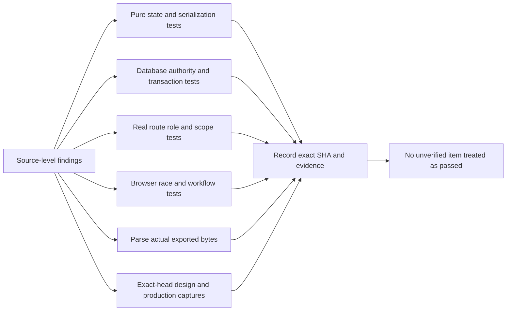


Use unit tests for selection cardinality, state transitions, draft preservation, count labels, and serialization. Use database tests for source selection, exact identity, effective-policy compatibility, ownership, and transactional failure semantics. Use real HTTP tests for role, environment scope, CSRF, and error contracts. Use browser tests for caller integration, request ordering, navigation, drafts, and downloads. Use rendered design/production pairs for visual parity.

A source string assertion is not a substitute for a SQL behavior test. A mocked browser route is not proof of backend scope enforcement. A screenshot is not proof that an export contains the selected systems. Each layer should test the responsibility it actually controls.

### 23.3 Proposed regression scenarios

All 80 scenarios below are **not executed in this audit**. Existing tests may satisfy part of a scenario, but that must be established from their actual assertions and an exact-head run. A scenario can require several test functions. The companion `regression-matrix.json` retains the same IDs and execution status.


#### Identity and navigation

| ID | Scenario | Required result | Proof | Gaps |
|---|---|---|---|---|
| CPT01 | Open a valid exact bundle/version deep link. | Heading, baseline, coverage, systems requests, and export selection retain the same validated pair. | Browser + HTTP | CPG06, CPG11 |
| CPT02 | Open an absent bundle or a version belonging to another bundle. | Return an explicit unavailable/invalid selection; do not substitute the first bundle or current version. | HTTP + browser | CPG11 |
| CPT03 | Switch between a published version and a draft with different metadata. | Header and body refer to the selected version; lineage-level metadata is labeled separately. | Browser | CPG11 |
| CPT04 | Open a direct-policy finding from a POA&M with no bundle candidates. | No panic occurs; the user reaches direct-policy evidence or an explicit supported alternative. | Unit + browser | CPG12 |
| CPT05 | Open a policy finding with more than one bundle context. | Use a validated retained pair or a context picker; do not combine unrelated bundle and version arrays. | Unit + browser | CPG11, CPG12 |
| CPT06 | Move between evidence controls with keyboard navigation, then use Back. | Visible control, URL, selected observation, and restored focus remain coherent. | Browser | CPG11, CPG24 |
| CPT07 | Open the same exact-CVE plan from Systems, fleet CVEs, and a direct Compliance URL. | Each caller shows the same plan revision and family; Evidence navigation is available and correctly bound. | Cross-view browser + HTTP | CPG13, CPG14 |
| CPT08 | Open current, link-baseline, and closure evidence from a completed plan. | Each mode preserves its own source identity and time; historical links never silently open current evidence. | Browser + database | CPG11, CPG13, CPG31 |


#### Evidence authority

| ID | Scenario | Required result | Proof | Gaps |
|---|---|---|---|---|
| CPT09 | Provide an assessment with the complete digest only, then with the enforced digest only. | Matrix, detail, verifier, and export implement the approved compatibility rule and identify any display-only difference. | Database + HTTP | CPG02 |
| CPT10 | Provide matching policy versions but different per-host effective overrides. | Each host is evaluated against its own effective configuration; cached metadata cannot substitute another host configuration. | Database | CPG02 |
| CPT11 | Provide a newer evaluation attempt for an undeployed target. | It cannot become an authoritative current result or authorize remediation/closure for the running target. | Database + HTTP | CPG03 |
| CPT12 | Split successful rule rows across separate evaluation attempts. | No complete passing observation is synthesized from incompatible attempts. | Database | CPG03 |
| CPT13 | Omit a required rule while all present rules pass. | Completeness is partial/unavailable, not Pass; mutation capabilities follow the authoritative result. | Database + browser | CPG02, CPG03 |
| CPT14 | Record a valid current report followed by a newer empty or invalid report. | All current resolvers follow the approved newest-report rule; any last-known display is explicitly secondary. | Database | CPG04 |
| CPT15 | Provide an exact legacy Nix result for one policy version and a different result for its lineage head. | The selected version is not replaced by the lineage head; the typed observation identity remains intact. | Database + HTTP | CPG02, CPG22 |
| CPT16 | Provide completed CVE threshold counters without schema-1 exact occurrence evidence. | Policy threshold status and exact-CVE finding authority remain distinct; no exact occurrence is fabricated. | Database + cross-view browser | CPG02, CPG13 |
| CPT17 | Complete a clean exact scan after an older vulnerable scan. | The current resolver honors the complete clean scan and does not fall back to old findings. | Database + HTTP | CPG03, CPG27 |
| CPT18 | Read evidence and rollups before and after first-time finding-identity materialization. | The apparent technical finding population is stable, or a documented reconciliation state explains the difference. | Database + HTTP | CPG29 |


#### Counts and scope

| ID | Scenario | Required result | Proof | Gaps |
|---|---|---|---|---|
| CPT19 | Use a baseline with full, partial, unmapped, and recovery-required requirements. | The denominator includes every selected requirement; the four coverage counts sum to that denominator. | Database + browser | CPG10 |
| CPT20 | Map several policies to one requirement and one policy to several requirements. | Requirement coverage, policy control counts, and plan counts remain separate units. | Database + browser | CPG10, CPG14 |
| CPT21 | Create an error-only host and a never-evaluated host. | Neither enters an unqualified clean collection or clean export. | Unit + HTTP + browser | CPG09 |
| CPT22 | Use only waived controls on an evaluated host. | Technical score, waiver count, and accepted-compliance label follow the explicitly approved formula. | Database + browser | CPG10 |
| CPT23 | Link multiple findings to one plan and show one finding under multiple bundle contexts. | Plans, findings, and distinct systems are not summed interchangeably or double-counted. | Database + browser | CPG14 |
| CPT24 | Load a plan containing only exact-CVE findings. | Its compact row uses the exact-CVE count and family label, not zero policy findings. | Unit + browser | CPG14 |
| CPT25 | Give a non-Admin access to one of two environments and query every summary/detail route. | Unauthorized host identities and counts are excluded before aggregation; hidden details stay non-enumerable. | Real HTTP + database | CPG01 |
| CPT26 | Filter by environment, result, bundle revision, and finding-family scope. | Rows and aggregates declare and use the same scope; empty access is not interpreted as fleet access. | HTTP + browser | CPG01, CPG07, CPG09 |


#### Creation and linking

| ID | Scenario | Required result | Proof | Gaps |
|---|---|---|---|---|
| CPT27 | Create from the same current failed policy finding through Systems and Compliance. | Stable finding identity and server-owned authority checks are identical; the finding remains Fail after creation. | Cross-view browser + database | CPG17, CPG29 |
| CPT28 | Attempt creation from Pass, stale, partial, or an unrelated observation. | The server rejects the action without creating a plan, reference, or active link. | Real HTTP + database | CPG02, CPG03 |
| CPT29 | Create and link with a supported legacy observation-only policy context. | All supported entry points preserve the typed observation instead of requiring a fabricated assessment ID. | HTTP + browser | CPG22 |
| CPT30 | Browse more than 50 compatible plans/findings. | Continuation reaches every allowed candidate; a first-page limit is not presented as the complete set. | HTTP + browser | CPG22 |
| CPT31 | Choose a 14-day target with default policy milestones enabled. | Milestone dates obey the approved target-date rule or the UI reports an explicit schedule conflict. | Database + browser | CPG26 |
| CPT32 | Commit generic creation, then fail response-detail loading or lose the response. | The client can reconcile the committed plan and revision; retries do not claim a rollback or silently duplicate ownership. | Database fault injection + HTTP | CPG25 |


#### Shared POA&M tray

| ID | Scenario | Required result | Proof | Gaps |
|---|---|---|---|---|
| CPT33 | Open policy-only, CVE-only, and direct-policy plans at the Compliance route. | The tray works without unrelated catalog selection and shows only the correct family capabilities. | Browser + HTTP | CPG13 |
| CPT34 | Open the exact-CVE Evidence action from the Compliance-hosted tray. | A real callback leads to the canonical pair and intended target/observation. | Browser | CPG13 |
| CPT35 | Verify each non-completed lifecycle state. | Verify is offered only when supported; the server still rejects invalid state transitions. | Browser + real HTTP | CPG15 |
| CPT36 | Edit plan text locally, then run Verify. | Successful verification updates saved attempt/revision without discarding unrelated unsaved text. | Browser | CPG16 |
| CPT37 | Trigger stale-revision, unauthorized, and deleted/hidden-record errors during edit. | The UI preserves recoverable drafts, distinguishes unavailable state, and never claims an unsaved change persisted. | Browser + HTTP | CPG16, CPG20 |
| CPT38 | Retire policy and exact-CVE links, then close and reopen related plans. | Both families expose accurate active, retired, and closure-set history without treating all retirement as closure. | Database + browser | CPG31 |
| CPT39 | Change or remove an assignee identity after the plan was created. | Historical identity remains readable; unavailable identity is not a valid new assignment and does not confer access. | Database + browser | CPG20 |
| CPT40 | Mutate a plan while a history continuation is in flight. | Pages do not combine incompatible record revisions; restart behavior is explicit and does not duplicate rows. | HTTP + browser | CPG16, CPG31 |


#### Verification and closure

| ID | Scenario | Required result | Proof | Gaps |
|---|---|---|---|---|
| CPT41 | Verify while a linked finding still fails. | Persist a rejected sealed attempt and new revision; retain awaiting-verification status and active links. | Database + real HTTP | CPG15, CPG16 |
| CPT42 | Close while current evidence fails. | Return the documented 412 with the committed attempt/revision; the client adopts that revision. | Database + browser | CPG16, CPG25 |
| CPT43 | Show a passing verification, then publish newer failed evidence before Close. | Close re-resolves current authority under locks and rejects stale readiness. | Concurrent database + HTTP | CPG02, CPG04 |
| CPT44 | Complete all milestones while one current finding still fails. | Milestone completion does not authorize closure. | Database + browser | CPG15, CPG26 |
| CPT45 | Approve a policy waiver for the exact current failed observation. | Only an applicable unexpired waiver under the approved policy rule can satisfy closure; original Fail remains visible. | Database + HTTP | CPG21 |
| CPT46 | Expire or change the observation underlying an accepted policy waiver. | The old waiver cannot satisfy the new closure attempt. | Database | CPG21 |
| CPT47 | Create an exact-CVE link on A, deploy fixed B, and scan B clean. | Record the present MISSING behavior as a regression baseline; implement a different expectation only after the continuity decision. | Database + cross-view browser | CPG27 |
| CPT48 | Keep deployment A and provide a strictly newer complete schema-1 scan with pair absence. | Exact-CVE verification can return Pass without changing the immutable link baseline. | Database | CPG27 |
| CPT49 | Keep the pair present but whitelist it, justify it, or accept its risk. | None of those states becomes exact absence or silently satisfies the current exact-CVE Pass requirement. | Database + cross-view browser | CPG21, CPG27 |
| CPT50 | Race closure/reopen against ownership changes, environment moves, and link replacement. | Re-resolve access and exact subjects; preserve one active owner and immutable closure history, or return a typed conflict. | Concurrent database + HTTP | CPG01, CPG25, CPG27, CPG31 |


#### Waivers and assignments

| ID | Scenario | Required result | Proof | Gaps |
|---|---|---|---|---|
| CPT51 | Request and decide a policy waiver through its user-visible entry point. | The complete role-separated workflow exists; accepted-risk triage is not used as a substitute. | Browser + real HTTP | CPG21 |
| CPT52 | Attach an immutable assignment-version reference, then update that assignment. | The reference stays on its original version; current assignment state and its effect are separate. | Database + browser | CPG20 |
| CPT53 | Update assignment reason with omitted, null, and nonempty values. | Omitted preserves, null clears, and a value replaces under the expected-version precondition. | Database + real HTTP | CPG20 |
| CPT54 | Use Viewer or Operator credentials on Admin-only assignment maintenance. | UI capabilities match the restriction; forged requests are rejected without mutation. | Browser + real HTTP | CPG20 |
| CPT55 | Use missing or mismatched CSRF tokens on every basic bundle and assignment write route. | Each state-changing route rejects the request according to the common CSRF contract. | Real HTTP | CPG28 |
| CPT56 | Save bundle edits while requirement hydration is delayed or fails. | The UI cannot replace an unknown prior requirement selection with an empty one; real persisted membership is preserved. | Browser + database | CPG19 |


#### Export integrity

| ID | Scenario | Required result | Proof | Gaps |
|---|---|---|---|---|
| CPT57 | Select two bundles with disjoint host and control data. | Downloaded bytes contain the complete selected set, not just the bundle active before the modal opened. | Browser download + parse | CPG05 |
| CPT58 | Deselect the original bundle and retain another bundle. | No original-bundle data appears; the retained selection controls both filename and contents. | Browser download + parse | CPG05 |
| CPT59 | Export two revisions with different selected policies and metadata. | Each request and record retains the chosen immutable version; no current-pointer substitution occurs. | HTTP + browser download | CPG06 |
| CPT60 | Restrict export to one authorized environment. | All host/control rows and totals use that scope; hidden environments cannot appear in metadata or totals. | Real HTTP + download parse | CPG01, CPG07 |
| CPT61 | Export the clean host scope with error, unscanned, waiver-only, and passing fixtures. | Membership follows the approved clean/completeness rule and does not hide unknown states. | Download semantic validation | CPG09, CPG10 |
| CPT62 | Toggle inclusion of waivers and source evidence. | Each format implements the declared toggle semantics, with explicit source omissions and coherent totals. | Download semantic validation | CPG07 |
| CPT63 | Export native JSON for an exact selected observation. | Version, observation, authority, target, completeness, and relevant time identities survive, or the format is explicitly a summary. | Download semantic validation | CPG07 |
| CPT64 | Export multiple control rows for one host to CSV. | Repeated rollup cells are not represented as additive distinct-host counts; quoting and row structure are validated. | Download parse + semantic validation | CPG07 |
| CPT65 | Export with no authoritative classification or sensitivity metadata. | Do not assert UNCLASSIFIED or low sensitivity by default; retain unspecified or validated user input. | Download semantic validation | CPG08 |
| CPT66 | Export old observations now, including absent and partial evidence. | Export time is distinct from collection/evaluation time; no not-checked row is reported as an executed automated assessment. | Download semantic validation | CPG08 |
| CPT67 | Validate SARIF and OSCAL against pinned schemas and application semantics. | Check every status, including not-checked, referenced resources, identifiers, and real waiver provenance; schema success alone is insufficient. | Pinned schema + semantic validation | CPG07, CPG08 |
| CPT68 | Fail a middle evidence request or change evidence midway through a large export. | No apparently complete partial report is emitted; changed-snapshot, cancellation, and overflow behavior are explicit. | Fault injection + browser download | CPG07, CPG32 |


#### Async and recoverability

| ID | Scenario | Required result | Proof | Gaps |
|---|---|---|---|---|
| CPT69 | Delay a POA&M list for bundle A, then switch to bundle B. | The late A response cannot replace B rows or counts; obsolete assignment scope is cleared. | Browser request control | CPG18 |
| CPT70 | Delay two assignment previews or policy-detail reads in opposite order. | Each response applies only to its original immutable scope and newest request generation. | Browser request control | CPG18, CPG20 |
| CPT71 | Fail requirement coverage, then retry the same selection. | Retry issues a new request and can succeed without changing bundle selection. | Browser request control | CPG23 |
| CPT72 | Keep initial evidence loading indefinitely, then dismiss it. | Close and Escape remain usable; no background response reopens the dismissed drawer. | Browser request control | CPG23 |
| CPT73 | Create, link, update, verify, and close while adjacent views remain mounted. | Every affected relationship/list/rollup is refreshed or marked stale; unrelated drafts and inactive views are not needlessly reset. | Cross-view browser + real HTTP | CPG16, CPG17 |
| CPT74 | Restore an import draft after logout/account change or with a different source file. | Draft ownership and source validation are explicit; restored browser state cannot approve or import unreviewed content. | Browser storage + HTTP | CPG30 |


#### Visual and interaction parity

| ID | Scenario | Required result | Proof | Gaps |
|---|---|---|---|---|
| CPT75 | Compare populated page and bundle drawer with the reference. | Explicitly account for section order, requirement coverage, remediation strip, systems filters, and missing columns. | Rendered paired captures + assertions | CPG24 |
| CPT76 | Compare complete, partial, missing, and failed evidence drawers. | Result, completeness, source type, identity, observation time, and action authority remain distinguishable. | Rendered paired captures + assertions | CPG03, CPG23, CPG24 |
| CPT77 | Compare policy and exact-CVE create/link/detail surfaces. | Family-specific context, assignee, due date, plan, findings, verification, history, and unavailable actions retain clear hierarchy. | Rendered paired captures + assertions | CPG13, CPG14, CPG24, CPG31 |
| CPT78 | Use nested dialogs by keyboard in both themes. | Initial focus, wrapping, Escape precedence, and return focus work without closing or reopening the wrong layer. | Browser keyboard + paired captures | CPG23, CPG24 |
| CPT79 | Use narrow desktop and mobile with long package, policy, requirement, and assignee text. | Important metadata/actions remain reachable; no hidden overflow or collapsed concept is accepted without a recorded decision. | Responsive browser + paired captures | CPG24 |
| CPT80 | Inspect export/import/assignment pending, error, empty, and read-only states. | Controls match capabilities; incomplete hydration, export scope, and retry guidance remain visible and truthful. | Rendered paired captures + assertions | CPG19, CPG20, CPG23, CPG24 |


### 23.4 Test execution record required for a future acceptance review

Record the exact repository SHA, environment, command, test selection, database migration state, and output artifact for each run. Separate passing, failing, skipped, and blocked cases. Confirm that the required database was available rather than counting an early-return test as database proof.

For visual acceptance, record both the design source revision and the production revision, viewport, theme, fixture identity, and inspected comparison. Do not update a baseline to conceal a missing section or changed workflow. Run a mixed workflow sequence as well as isolated tests to detect route interception leaks and cross-test state contamination.

For a NixOS-based validation environment, use the repository's pinned development shell and named Nix/VM checks. Discover the current workflow commands from the pinned checkout before execution. This document does not invent a new working command or claim a test wrapper was run.


---

## 24. Cross-view consistency ledger

**Review worksheet, not a consistency verdict.** The Systems and CVEs columns below are inputs from their companion drafts, not a new independent audit of those whole views. Compliance source was independently traced in this pass. The direct revision comparison establishes a documentation-only bridge, so source drift is not a substitute explanation for the listed disagreements. [P23], [P24]

The same ledger is available as `cross-view-contract-ledger-v0.1.md` for the later joint review. All rows remain open. Some should be unified; others deliberately describe different finding families or different count units.


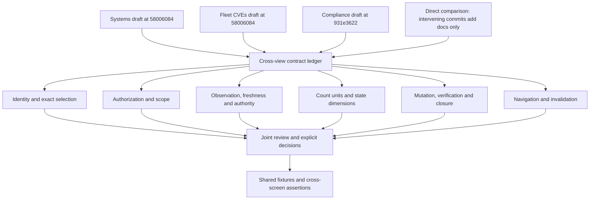


| ID | Contract | Treatment | Systems review input | Fleet CVEs review input | Compliance finding | Joint review question | Sources |
|---|---|---|---|---|---|---|---|
| CPC01 | Finding identity | Must agree within a family | Systems must preserve the stable policy lineage or canonical CVE/package identity described in its draft. | Fleet rows aggregate canonical CVE/package pairs; mutation subjects add exact authorized systems. | Policy findings use system plus policy lineage. Exact-CVE plans retain their distinct family. | Approve the identity dictionary and prohibit conversions based only on matching display names. | [P08], [P10], [P23], [P24] |
| CPC02 | Target and revision selection | Must agree | System Current, exact configuration, and retained-generation selections need separate meanings. | Current exposure, scheduled deployment target, and Historical inventory are separate relations. | Bundle version selects membership; it is not a deployment or observation identity. | Define a typed selection envelope and explicit unavailable state for each target kind. | [P01], [P07], [P23], [P24] |
| CPC03 | Read fallback versus write authority | Decision required | The Systems draft leaves the read-only scan-fallback question open. | Inventory can contain read-only scheduled/historical rows that cannot authorize fleet triage. | Evaluation-attempt fallback can display output without current deployed-target binding. | Approve display-only fallback separately from mutation and closure prerequisites. | [P07], [P10], [P23], [P24] |
| CPC04 | Complete versus enforced policy context | Must agree for the same observation | System policy evidence must be checked against the approved effective-policy compatibility contract. | Exact occurrence evidence is not itself a composite policy assessment. | Matrix, detail, and verifier currently select against differing digest rules. | Choose one compatible assessment-set resolver, with explicit family-specific inputs. | [P07], [P11], [P23], [P24] |
| CPC05 | Newest report versus last valid report | Must agree for Current | Current system state must not silently mean an older valid report unless labeled last-known. | Exact Current authority must not substitute an unrelated older target. | Policy verification and other selectors do not all apply validation after selecting the newest report. | Test a newer invalid report and decide a consistent Current/last-known distinction. | [P07], [P10], [P11], [P23], [P24] |
| CPC06 | Threshold policy versus exact CVE | Intentional family distinction | A system can have a CVE threshold policy failure and separate exact vulnerability findings. | Exact CVE/package presence supplies vulnerability subjects, not policy lineage. | Policy evaluation can use completed scan counters without producing exact-CVE finding identity. | Keep both families typed. Define explicit relationships rather than treating them as duplicates. | [P07], [P10], [P11], [P23], [P24] |
| CPC07 | Authorization before aggregation | Must agree | System detail, summary, and navigation must respect current environment visibility. | The CVEs draft describes environment scoping before occurrence counts and rollups. | Some Compliance catalog/systems handlers do not carry the scope used by evidence and POA&M routes. | Use one scope contract and prove every endpoint, export, and autocomplete path. | [P06], [P07], [P13], [P23], [P24] |
| CPC08 | Unassigned or unavailable systems | Decision required | Distinguish an unassigned system from missing scan data or an inaccessible system. | Admin-visible unassigned inventory does not automatically create environment-scoped mutation subjects. | Catalog/matrix visibility and plan access need the same explicit unassigned rule. | Specify read visibility, action availability, and non-enumerating errors without treating missing fields as zero. | [P06], [P13], [P23], [P24] |
| CPC09 | Count units | Must agree for equal scopes | System counts, control results, and related plan counts are separate quantities. | Pairs, current/scheduled/historical systems, and actionable subjects have different units. | Requirement versions, controls, policy/CVE findings, and plans coexist; compact plan counts omit the CVE family. | Document units on each field and label. Reconcile by set identity, not by comparing unrelated totals. | [P03], [P07], [P15], [P20], [P21], [P23], [P24] |
| CPC10 | Coverage, result, and remediation | Intentional dimensional distinction | A system status must not imply every requirement has a mapped and executed policy. | Accepted or scheduled vulnerability disposition does not mean remediation is verified. | Full requirement mapping can coexist with failed, missing, or erroneous policy evidence and open plans. | Keep mapping coverage, observed result, disposition, and remediation lifecycle separate in every view. | [P07], [P12], [P15], [P23], [P24] |
| CPC11 | Risk acceptance and waiver | Intentional family distinction; UX decision | System triage and policy control waivers need distinct identity and effects. | CVE acceptance records risk; it is not exact scan absence or a policy waiver. | Policy waiver verification binds to an observation/version and can satisfy its policy-family closure rule. | Approve terminology and complete entry points. Do not unify these merely because both say accepted. | [P09], [P10], [P11], [P23], [P24] |
| CPC12 | Host override and environment default | Must agree in CVE family | System host decisions override the environment default; clearing an override is not necessarily opening the finding. | Fleet rollups and environment ownership must account for host overrides explicitly. | A CVE-originated plan shown in Compliance must retain that subject ownership and not assume a bundle scope. | Define effective disposition, default scope, and owned subjects as separate fields. | [P03], [P10], [P23], [P24] |
| CPC13 | Baseline and cross-deployment continuity | Decision required | System deployment changes must retain old evidence while independently resolving new current evidence. | The continuity proposal differs from the present immutable-baseline verifier. | The shared exact-CVE verifier still returns MISSING when the deployed identity changes from the link baseline. | Review A-to-B remediation, recurrence, rollback, and closure evidence without overwriting baseline history. | [P10], [P23], [P24], [P25] |
| CPC14 | Bundle and assignment association | Decision required | System plans can be direct-policy, bundle-related, or exact-CVE plans. | A canonical CVE/package pair is not automatically a bundle requirement. | Bundle rollups use lineage/current memberships plus closure context and assignment references, not only the selected version. | Decide when association means current responsibility, selected-version context, or historical reference. | [P08], [P13], [P23], [P24] |
| CPC15 | Typed assignee and required metadata | Must agree where shared; defaults may differ | Typed identity and availability must survive opening the same plan from a system. | Scheduling requires valid typed ownership and remediation metadata; reuse preserves existing metadata. | Generic policy creation permits weaker minimum fields and fixed default milestone dates. | Approve minimum fields and family-specific defaults. Never infer authorization from assignee identity. | [P03], [P08], [P23], [P24] |
| CPC16 | Common plan capabilities | Must agree for the same record | A plan opened from System Detail should expose the same valid record actions. | Fleet triage may create or reuse a plan; opening it should not lose exact-CVE navigation. | Compliance hosts the common tray but omits the CVE Evidence callback and shows policy-oriented controls. | Use family-aware capabilities and complete caller adapters, not optional no-op behavior. | [P01], [P03], [P23], [P24] |
| CPC17 | Verification and closure | Shared transaction meaning; different family proofs | Reported remediation completion, a new scan, verification, and closure are not the same operation. | Exact-CVE closure needs the approved exact-absence proof, not accepted/scheduled status. | Policy closure can use current Pass or an applicable accepted waiver; Close re-verifies and records attempts. | Make lifecycle labels consistent while preserving each family evidence rule. | [P10], [P11], [P12], [P23], [P24] |
| CPC18 | Committed errors and retries | Must agree | System-origin actions need the same committed-result and conflict semantics as other callers. | Fleet triage builds its mutation detail before commit, as recorded in the CVEs draft. | Generic creation commits before detail loading; failed Close commits attempt/revision before 412. | Define receipt, unknown-outcome reconciliation, and retry rules per action. | [P08], [P12], [P23], [P24] |
| CPC19 | Invalidation and unsaved drafts | Must agree for shared data | System relationships, lists, and badges need invalidation after common plan mutations. | The CVEs draft identifies stale parent lists/statistics after triage. | Compliance uses local callbacks; Verify can reset drafts without notifying the parent. | Specify affected-resource invalidation and draft-preserving saved-state updates. | [P01], [P02], [P03], [P23], [P24] |
| CPC20 | History and return navigation | Must agree | Retained evidence and current evidence need distinct return targets. | Scheduled/historical inventory navigation must retain the selected target rather than default to Current. | Policy zero-candidate navigation can panic; exact-CVE callback and policy retired-history presentation are incomplete. | Support current, link-baseline, and closure evidence with explicit return context and revision-bound paging. | [P01], [P03], [P12], [P23], [P24] |
| CPC21 | Export source, scope, and time | Must agree with displayed selection | A system export must identify exact evidence rather than rely on the page heading. | Fleet exports must preserve canonical pair identity and defined inventory/count scope. | Client Compliance exports can drop revision/scope and manufacture authoritative-looking metadata. | Use one validated export manifest; distinguish observation, export, verification, and closure timestamps. | [P01], [P14], [P23], [P24] |
| CPC22 | Finding materialization and count completeness | Verification required | Opening one system should not make previously existing fleet failures appear for the first time without explanation. | Occurrence-based fleet counts and persistent plan-finding records are not necessarily the same population. | Evidence GET materializes policy finding identities; complete background population was not established. | Prove stable counts before any drawer or export is opened; define reconciliation ownership and lag. | [P07], [P13], [P23], [P24] |


### 24.1 Proposed order for the joint review

Agree on identity and scope first. Then agree on target selection, observation authority, and completeness. Next resolve count units and the effects of waiver, acceptance, and remediation. Only then settle verification continuity, closure, navigation, invalidation, and export. Otherwise a shared component can preserve a shared misunderstanding.

For each row, record one of four outcomes: shared contract accepted; intentional distinction accepted and named; implementation defect confirmed; or additional evidence required. Attach a concrete fixture and expected cross-view behavior. Record the decision once and link all three documents to it, rather than independently editing three descriptions into apparent agreement.

Do not retroactively relabel historical evidence or rewrite immutable plan baselines merely to make the current screens agree. A data migration, if required by an approved change, needs its own preservation and verification plan.


---

## 25. Decision register

Every item is **pending joint review**. Recommendations identify a preferred direction, not approval to implement it. Preserve intentional differences between policy findings and exact-CVE findings. The user should not have to approve a vague statement that “all three views now share the same logic” without reviewing these contracts.


| ID | Decision | Recommended review direction | Tradeoff or constraint | Ledger / gaps |
|---|---|---|---|---|
| CPD01 | What does an unavailable exact selection do? | Reject or show unavailable, rather than substituting a current/default selection. | Convenient fallback is acceptable for an unqualified initial page, not an exact deep link or evidence export. | CPC02,CPC20; CPG06,CPG11,CPG12 |
| CPD02 | Which effective-policy digest and assessment-set rules define current evidence? | Use one server compatibility resolver for matrix, detail, verification, and export. | A display-only fallback can remain, but must carry different authority and capabilities. | CPC04; CPG02,CPG03 |
| CPD03 | Can last-known or evaluation-attempt evidence be shown as fallback? | Allow only explicitly labeled secondary evidence that cannot authorize current mutation or closure. | More visibility can help operations; silent substitution creates false assurance. | CPC03,CPC05; CPG03,CPG04 |
| CPD04 | What do clean, score, fully compliant, and accepted mean? | Separate technical pass rate, evaluation completeness, accepted risk, and mapping coverage. | Retain existing fields with explicit semantics or version the API; do not silently change denominators. | CPC09,CPC10,CPC11; CPG09,CPG10,CPG14 |
| CPD05 | Which Compliance data are global catalog metadata versus scoped operational evidence? | Make host-bearing data and derived counts environment-scoped; explicitly document any global catalog fields. | Global reusable definitions can be valid. Host presence, failures, and remediation information need a consistent access boundary. | CPC07,CPC08; CPG01,CPG28 |
| CPD06 | Should an exact-CVE plan verify after deployment A changes to B? | Evaluate independently authorized current evidence while preserving the original link baseline, if continuity is approved. | This is a lifecycle change, not a relaxed join. It needs recurrence, rollback, missing-scan, and race rules. | CPC13,CPC17; CPG27 |
| CPD07 | Which plan fields are mandatory, and how are default milestones dated? | Approve family-specific defaults with common typed ownership and target-relative schedules. | Generic policy plans currently allow weaker metadata. Tightening requirements needs compatibility and editing rules for existing plans. | CPC15; CPG26 |
| CPD08 | Where does the complete policy-waiver workflow live? | Provide a separate finding-bound request/decision workflow with explicit authority, expiry, and status. | Do not merge policy waiver, CVE accepted risk, and assignment reasons. Shared visual layout is still possible. | CPC11; CPG21 |
| CPD09 | Does a bundle POA&M list represent a lineage, selected revision, current assignment, or historical reference? | Expose the chosen association scope explicitly and preserve exact pairs for historical navigation. | One plan can have several valid contexts. A single unlabeled count cannot represent all of them. | CPC14; CPG11,CPG20,CPG31 |
| CPD10 | Which actions and evidence routes must every common POA&M host support? | Use family-aware server capabilities and a complete navigation adapter for every entry point. | Optional callbacks can hide omissions. A real unavailable state is preferable to a misleading action. | CPC16,CPC20; CPG13,CPG15,CPG22 |
| CPD11 | How are committed results, failures, retries, and refreshes represented? | Define action-specific receipts and invalidation; preserve unrelated drafts and adopt committed revision changes even after rejected closure. | A global reload is simpler but loses context. An HTTP error does not always mean the transaction rolled back. | CPC18,CPC19; CPG16,CPG17,CPG18,CPG25 |
| CPD12 | What is the authoritative evidence export contract? | Export a validated exact-selection manifest with provenance, completeness, count units, and sourced metadata. | Client formatting can remain. Multi-bundle consistency may need bounded snapshot generation rather than many unrelated live reads. | CPC21; CPG05,CPG06,CPG07,CPG08,CPG32 |
| CPD13 | Who ensures that the stable finding population is complete? | Make reconciliation ownership and lag explicit; verify that UI reads do not determine which failures appear in rollups. | Read-side identity materialization may remain useful, but it must not be the only undisclosed population mechanism. | CPC22; CPG29 |
| CPD14 | Which source-level design differences are accepted production adaptations? | Preserve evidence and remediation hierarchy, then explicitly approve necessary additions or changed placement. | Typed source metadata and explicit saves can improve the reference. Missing sections or dead-end workflows are not cosmetic choices. | CPC10,CPC16,CPC20; CPG23,CPG24,CPG31 |
| CPD15 | How is a resumable import draft isolated and validated? | Bind draft restoration to source identity and a declared user/workspace scope, with explicit expiry and reset. | Convenient local restoration cannot confer trust or survive an account change without a deliberate policy. | CPC07; CPG19,CPG30 |


### 25.1 Decision record template

```text
Decision ID:
Status: proposed | accepted | rejected | needs evidence
Finding family and scope:
Chosen rule:
Intentional differences between views:
Required source/API changes:
Preserved immutable/history data:
Cross-view fixture and expected results:
Migration and compatibility requirements:
Evidence still required:
Approver and date:
```

Do not mark a decision accepted merely because code already behaves that way. Conversely, do not classify a deliberate family distinction as a defect merely because the screens use similar words.

---

## 26. Sources, verification limits, and artifact record

### 26.1 Source reference index

All primary repository references below are pinned to the reviewed SHA. Full-file reads, selected contiguous reads, focused search snippets, and secondary companion references are identified separately. The source manifest records the inspection scope in machine-readable form. Refer to that scope before treating this document as a complete audit of a large module.


| ID | Source | Inspection scope |
|---|---|---|
| [P01] | `packages/web-ui/src/views/compliance.rs` | Full file read. Navigation, bundle selection, export, import, coverage, assignment panels and callbacks inspected. |
| [P02] | `packages/web-ui/src/components/compliance/mod.rs` | Full file read. Catalog, score strip, systems matrix, evidence grouping, finding context and relationship refresh inspected. |
| [P03] | `packages/web-ui/src/components/poam/mod.rs` | Full file read. Create/link dialogs, table, count strips, detail tray, lifecycle, history and navigation inspected. |
| [P04] | `docs/design/CrystalForge/components/ComplianceView.jsx` | Full file read. Structural comparison only; not rendered. |
| [P05] | `docs/design/CrystalForge/components/PoamViews.jsx` | Full file read. Structural comparison only; demo state is not persistence authority. |
| [P06] | `packages/default/crates/cf-server/src/handlers/api/compliance.rs` | Selected contiguous ranges read. Function inventory located for other handlers; not a complete handler-module security audit. |
| [P07] | `packages/default/crates/cf-server/src/queries/compliance.rs` | Selected contiguous ranges read; function and test inventory located. |
| [P08] | `packages/default/crates/cf-server/src/services/poam.rs` | Selected contiguous range read. |
| [P09] | `packages/default/crates/cf-server/src/services/poam.rs` | Selected contiguous range read. Full decision implementation outside this range was not independently audited. |
| [P10] | `packages/default/crates/cf-server/src/services/poam.rs` | Selected contiguous range read. |
| [P11] | `packages/default/crates/cf-server/src/services/poam.rs` | Selected contiguous range read. Full helper closure and all producer paths were not audited. |
| [P12] | `packages/default/crates/cf-server/src/services/poam.rs` | Selected contiguous range read. Reopen entry and documented contract read; not the complete reopen body. |
| [P13] | `packages/default/crates/cf-server/src/services/poam.rs` | Selected contiguous range read. Bundle membership construction read; remaining final accumulation outside range not independently read. |
| [P14] | `packages/web-ui/src/export/mod.rs` | Full file read. Native JSON, CSV, SARIF, OSCAL and HTML generators inspected; no schema validation run. |
| [P15] | `packages/default/crates/cf-server/src/queries/framework_requirements.rs` | Coverage implementation read; requirement search and reconciliation functions located. |
| [P16] | `packages/default/crates/cf-server/src/bin/server.rs` | Compliance routes located through scoped source search; final router composition read. |
| [P17] | `docs/task-433-design-parity-review.md` | Full document read. Historical claims are not current execution evidence. |
| [P18] | `checks/web-ui/tests/integration-test.js` | Selected bodies read; assignment test entry also visible. No workflow executed. |
| [P19] | `checks/web-ui/coverage-manifest.json` | Scoped source search located named workflows; not all workflow bodies inspected. |
| [P20] | `packages/default/crates/cf-server/src/models/poam.rs` | Focused search result read; no full model-module audit. |
| [P21] | `packages/default/crates/cf-server/src/queries/poam.rs` | Focused search results read for separate policy/CVE counts and closure-link counting. |
| [P22] | `packages/default/crates/cf-server/tests/poam_workflows.rs` | Named tests and focused assertion snippets located. No tests executed; broad workflow adequacy remains unverified. |
| [P23] | `docs/design/CrystalForge/docs/crystal-forge-systems-design/systems-view-design-v0.1.md` | Companion retrieved from conversation files. Repository addition confirmed in direct comparison. Its application inspection is pinned to 58006084, not a new Systems audit. |
| [P24] | `docs/design/CrystalForge/docs/crystal-forge-cves-design/cves-view-design-v0.1.md` | Companion retrieved from conversation files. Repository addition confirmed in direct comparison. Its application inspection is pinned to 58006084. |
| [P25] | `docs/design/CrystalForge/cve-poam-evidence-continuity-design-spec.md` | Referenced through companion CVEs review, Section 15. Not independently reread in this Compliance pass; do not treat as approved or implemented. |


### 26.2 Explicit limits

The complete import parser, every bundle publish/trust transaction, every permission helper, the complete reopen body, all waiver decision branches, all background finding producers, and every browser/database test body were not independently audited. Their contracts are marked as integration boundaries or verification work rather than certified behavior.

No production database or deployed browser was accessed. No runtime query plan, benchmark, migration upgrade, concurrency test, Nix build, application test, rendered design comparison, or export-schema validation was performed. The diagrams were authored as Mermaid source; no Mermaid renderer or parser was run. Packaging checks validate the files and references, not the application or diagram rendering.

The original Systems and CVEs documents were not edited. This bundle adds a separate Compliance review and an open cross-view ledger. It does not claim that the three views are already consistent or that any merge request is ready to merge.

### 26.3 Bundle contents

The bundle contains the main document, the separate cross-view contract ledger, 14 editable Mermaid files, JSON gap/regression/decision registers, a source manifest, a diagram manifest, a verification record, an artifact-check record, and SHA-256 checksums. The JSON registers and the corresponding tables in this document are generated from the same records.

The source revision and observed MR head/pipeline state are recorded in `verification.md`. The artifact-check record lists only checks that were actually performed on generated files. The checksum file covers generated bundle files other than itself; it does not claim hashes of source files retrieved through the connector.


[P01]: https://gitlab.com/crystal-forge/crystal-forge/-/blob/931e36229ed548b0c62b560fc99f9415e3829cef/packages/web-ui/src/views/compliance.rs
[P02]: https://gitlab.com/crystal-forge/crystal-forge/-/blob/931e36229ed548b0c62b560fc99f9415e3829cef/packages/web-ui/src/components/compliance/mod.rs
[P03]: https://gitlab.com/crystal-forge/crystal-forge/-/blob/931e36229ed548b0c62b560fc99f9415e3829cef/packages/web-ui/src/components/poam/mod.rs
[P04]: https://gitlab.com/crystal-forge/crystal-forge/-/blob/931e36229ed548b0c62b560fc99f9415e3829cef/docs/design/CrystalForge/components/ComplianceView.jsx
[P05]: https://gitlab.com/crystal-forge/crystal-forge/-/blob/931e36229ed548b0c62b560fc99f9415e3829cef/docs/design/CrystalForge/components/PoamViews.jsx
[P06]: https://gitlab.com/crystal-forge/crystal-forge/-/blob/931e36229ed548b0c62b560fc99f9415e3829cef/packages/default/crates/cf-server/src/handlers/api/compliance.rs
[P07]: https://gitlab.com/crystal-forge/crystal-forge/-/blob/931e36229ed548b0c62b560fc99f9415e3829cef/packages/default/crates/cf-server/src/queries/compliance.rs
[P08]: https://gitlab.com/crystal-forge/crystal-forge/-/blob/931e36229ed548b0c62b560fc99f9415e3829cef/packages/default/crates/cf-server/src/services/poam.rs#L1330-1522
[P09]: https://gitlab.com/crystal-forge/crystal-forge/-/blob/931e36229ed548b0c62b560fc99f9415e3829cef/packages/default/crates/cf-server/src/services/poam.rs#L6330-6529
[P10]: https://gitlab.com/crystal-forge/crystal-forge/-/blob/931e36229ed548b0c62b560fc99f9415e3829cef/packages/default/crates/cf-server/src/services/poam.rs#L6666-6885
[P11]: https://gitlab.com/crystal-forge/crystal-forge/-/blob/931e36229ed548b0c62b560fc99f9415e3829cef/packages/default/crates/cf-server/src/services/poam.rs#L7205-7612
[P12]: https://gitlab.com/crystal-forge/crystal-forge/-/blob/931e36229ed548b0c62b560fc99f9415e3829cef/packages/default/crates/cf-server/src/services/poam.rs#L7800-8190
[P13]: https://gitlab.com/crystal-forge/crystal-forge/-/blob/931e36229ed548b0c62b560fc99f9415e3829cef/packages/default/crates/cf-server/src/services/poam.rs#L8490-8720
[P14]: https://gitlab.com/crystal-forge/crystal-forge/-/blob/931e36229ed548b0c62b560fc99f9415e3829cef/packages/web-ui/src/export/mod.rs
[P15]: https://gitlab.com/crystal-forge/crystal-forge/-/blob/931e36229ed548b0c62b560fc99f9415e3829cef/packages/default/crates/cf-server/src/queries/framework_requirements.rs#L615-892
[P16]: https://gitlab.com/crystal-forge/crystal-forge/-/blob/931e36229ed548b0c62b560fc99f9415e3829cef/packages/default/crates/cf-server/src/bin/server.rs
[P17]: https://gitlab.com/crystal-forge/crystal-forge/-/blob/931e36229ed548b0c62b560fc99f9415e3829cef/docs/task-433-design-parity-review.md
[P18]: https://gitlab.com/crystal-forge/crystal-forge/-/blob/931e36229ed548b0c62b560fc99f9415e3829cef/checks/web-ui/tests/integration-test.js#L19248-19400
[P19]: https://gitlab.com/crystal-forge/crystal-forge/-/blob/931e36229ed548b0c62b560fc99f9415e3829cef/checks/web-ui/coverage-manifest.json
[P20]: https://gitlab.com/crystal-forge/crystal-forge/-/blob/931e36229ed548b0c62b560fc99f9415e3829cef/packages/default/crates/cf-server/src/models/poam.rs#L570-582
[P21]: https://gitlab.com/crystal-forge/crystal-forge/-/blob/931e36229ed548b0c62b560fc99f9415e3829cef/packages/default/crates/cf-server/src/queries/poam.rs#L1-95
[P22]: https://gitlab.com/crystal-forge/crystal-forge/-/blob/931e36229ed548b0c62b560fc99f9415e3829cef/packages/default/crates/cf-server/tests/poam_workflows.rs
[P23]: https://gitlab.com/crystal-forge/crystal-forge/-/blob/931e36229ed548b0c62b560fc99f9415e3829cef/docs/design/CrystalForge/docs/crystal-forge-systems-design/systems-view-design-v0.1.md
[P24]: https://gitlab.com/crystal-forge/crystal-forge/-/blob/931e36229ed548b0c62b560fc99f9415e3829cef/docs/design/CrystalForge/docs/crystal-forge-cves-design/cves-view-design-v0.1.md
[P25]: https://gitlab.com/crystal-forge/crystal-forge/-/blob/931e36229ed548b0c62b560fc99f9415e3829cef/docs/design/CrystalForge/cve-poam-evidence-continuity-design-spec.md
