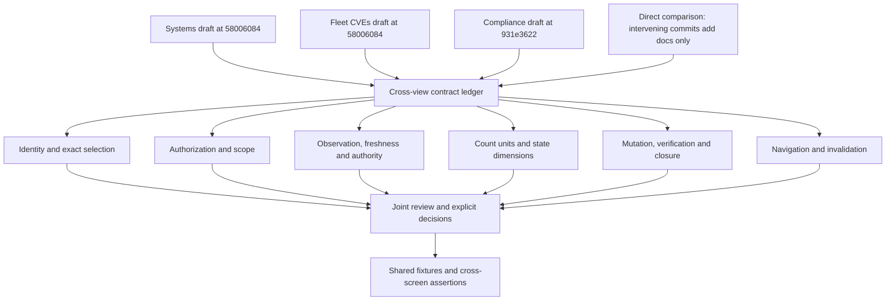

# Crystal Forge: Cross-view Contract Ledger

**Version:** 0.1, review worksheet  
**Status:** Open. No cross-view decision is approved by this worksheet.  
**Compliance source:** `931e36229ed548b0c62b560fc99f9415e3829cef`  
**Companion Systems and CVEs application source:** `58006084aa699b84bcb1d02d6f911d4d4ee94ea3`  
**Revision bridge:** Direct comparison showed two documentation-addition commits and no application, migration, or test changes.

Read this worksheet with `compliance-view-design-v0.1.md`, particularly Sections 8–15 and 20–25. The Systems and CVEs columns summarize their companion drafts, not a new full audit of those views. The Compliance column is based on the source investigation for this bundle.

“Must agree” means equal identities and scopes must yield consistent semantics. It does not require a threshold policy failure and an exact vulnerability occurrence to use the same evidence algorithm. “Decision required” remains open even when the implementation already makes a choice.

## Contract review rows

| ID | Contract | Treatment | Systems review input | Fleet CVEs review input | Compliance finding | Joint review question | Sources |
|---|---|---|---|---|---|---|---|
| CPC01 | Finding identity | Must agree within a family | Systems must preserve the stable policy lineage or canonical CVE/package identity described in its draft. | Fleet rows aggregate canonical CVE/package pairs; mutation subjects add exact authorized systems. | Policy findings use system plus policy lineage. Exact-CVE plans retain their distinct family. | Approve the identity dictionary and prohibit conversions based only on matching display names. | [P08], [P10], [P23], [P24] |
| CPC02 | Target and revision selection | Must agree | System Current, exact configuration, and retained-generation selections need separate meanings. | Current exposure, scheduled deployment target, and Historical inventory are separate relations. | Bundle version selects membership; it is not a deployment or observation identity. | Define a typed selection envelope and explicit unavailable state for each target kind. | [P01], [P07], [P23], [P24] |
| CPC03 | Read fallback versus write authority | Decision required | The Systems draft leaves the read-only scan-fallback question open. | Inventory can contain read-only scheduled/historical rows that cannot authorize fleet triage. | Evaluation-attempt fallback can display output without current deployed-target binding. | Approve display-only fallback separately from mutation and closure prerequisites. | [P07], [P10], [P23], [P24] |
| CPC04 | Complete versus enforced policy context | Must agree for the same observation | System policy evidence must be checked against the approved effective-policy compatibility contract. | Exact occurrence evidence is not itself a composite policy assessment. | Matrix, detail, and verifier currently select against differing digest rules. | Choose one compatible assessment-set resolver, with explicit family-specific inputs. | [P07], [P11], [P23], [P24] |
| CPC05 | Newest report versus last valid report | Must agree for Current | Current system state must not silently mean an older valid report unless labeled last-known. | Exact Current authority must not substitute an unrelated older target. | Policy verification and other selectors do not all apply validation after selecting the newest report. | Test a newer invalid report and decide a consistent Current/last-known distinction. | [P07], [P10], [P11], [P23], [P24] |
| CPC06 | Threshold policy versus exact CVE | Intentional family distinction | A system can have a CVE threshold policy failure and separate exact vulnerability findings. | Exact CVE/package presence supplies vulnerability subjects, not policy lineage. | Policy evaluation can use completed scan counters without producing exact-CVE finding identity. | Keep both families typed. Define explicit relationships rather than treating them as duplicates. | [P07], [P10], [P11], [P23], [P24] |
| CPC07 | Authorization before aggregation | Must agree | System detail, summary, and navigation must respect current environment visibility. | The CVEs draft describes environment scoping before occurrence counts and rollups. | Some Compliance catalog/systems handlers do not carry the scope used by evidence and POA&M routes. | Use one scope contract and prove every endpoint, export, and autocomplete path. | [P06], [P07], [P13], [P23], [P24] |
| CPC08 | Unassigned or unavailable systems | Decision required | Distinguish an unassigned system from missing scan data or an inaccessible system. | Admin-visible unassigned inventory does not automatically create environment-scoped mutation subjects. | Catalog/matrix visibility and plan access need the same explicit unassigned rule. | Specify read visibility, action availability, and non-enumerating errors without treating missing fields as zero. | [P06], [P13], [P23], [P24] |
| CPC09 | Count units | Must agree for equal scopes | System counts, control results, and related plan counts are separate quantities. | Pairs, current/scheduled/historical systems, and actionable subjects have different units. | Requirement versions, controls, policy/CVE findings, and plans coexist; compact plan counts omit the CVE family. | Document units on each field and label. Reconcile by set identity, not by comparing unrelated totals. | [P03], [P07], [P15], [P20], [P21], [P23], [P24] |
| CPC10 | Coverage, result, and remediation | Intentional dimensional distinction | A system status must not imply every requirement has a mapped and executed policy. | Accepted or scheduled vulnerability disposition does not mean remediation is verified. | Full requirement mapping can coexist with failed, missing, or erroneous policy evidence and open plans. | Keep mapping coverage, observed result, disposition, and remediation lifecycle separate in every view. | [P07], [P12], [P15], [P23], [P24] |
| CPC11 | Risk acceptance and waiver | Intentional family distinction; UX decision | System triage and policy control waivers need distinct identity and effects. | CVE acceptance records risk; it is not exact scan absence or a policy waiver. | Policy waiver verification binds to an observation/version and can satisfy its policy-family closure rule. | Approve terminology and complete entry points. Do not unify these merely because both say accepted. | [P09], [P10], [P11], [P23], [P24] |
| CPC12 | Host override and environment default | Must agree in CVE family | System host decisions override the environment default; clearing an override is not necessarily opening the finding. | Fleet rollups and environment ownership must account for host overrides explicitly. | A CVE-originated plan shown in Compliance must retain that subject ownership and not assume a bundle scope. | Define effective disposition, default scope, and owned subjects as separate fields. | [P03], [P10], [P23], [P24] |
| CPC13 | Baseline and cross-deployment continuity | Decision required | System deployment changes must retain old evidence while independently resolving new current evidence. | The continuity proposal differs from the present immutable-baseline verifier. | The shared exact-CVE verifier still returns MISSING when the deployed identity changes from the link baseline. | Review A-to-B remediation, recurrence, rollback, and closure evidence without overwriting baseline history. | [P10], [P23], [P24], [P25] |
| CPC14 | Bundle and assignment association | Decision required | System plans can be direct-policy, bundle-related, or exact-CVE plans. | A canonical CVE/package pair is not automatically a bundle requirement. | Bundle rollups use lineage/current memberships plus closure context and assignment references, not only the selected version. | Decide when association means current responsibility, selected-version context, or historical reference. | [P08], [P13], [P23], [P24] |
| CPC15 | Typed assignee and required metadata | Must agree where shared; defaults may differ | Typed identity and availability must survive opening the same plan from a system. | Scheduling requires valid typed ownership and remediation metadata; reuse preserves existing metadata. | Generic policy creation permits weaker minimum fields and fixed default milestone dates. | Approve minimum fields and family-specific defaults. Never infer authorization from assignee identity. | [P03], [P08], [P23], [P24] |
| CPC16 | Common plan capabilities | Must agree for the same record | A plan opened from System Detail should expose the same valid record actions. | Fleet triage may create or reuse a plan; opening it should not lose exact-CVE navigation. | Compliance hosts the common tray but omits the CVE Evidence callback and shows policy-oriented controls. | Use family-aware capabilities and complete caller adapters, not optional no-op behavior. | [P01], [P03], [P23], [P24] |
| CPC17 | Verification and closure | Shared transaction meaning; different family proofs | Reported remediation completion, a new scan, verification, and closure are not the same operation. | Exact-CVE closure needs the approved exact-absence proof, not accepted/scheduled status. | Policy closure can use current Pass or an applicable accepted waiver; Close re-verifies and records attempts. | Make lifecycle labels consistent while preserving each family evidence rule. | [P10], [P11], [P12], [P23], [P24] |
| CPC18 | Committed errors and retries | Must agree | System-origin actions need the same committed-result and conflict semantics as other callers. | Fleet triage builds its mutation detail before commit, as recorded in the CVEs draft. | Generic creation commits before detail loading; failed Close commits attempt/revision before 412. | Define receipt, unknown-outcome reconciliation, and retry rules per action. | [P08], [P12], [P23], [P24] |
| CPC19 | Invalidation and unsaved drafts | Must agree for shared data | System relationships, lists, and badges need invalidation after common plan mutations. | The CVEs draft identifies stale parent lists/statistics after triage. | Compliance uses local callbacks; Verify can reset drafts without notifying the parent. | Specify affected-resource invalidation and draft-preserving saved-state updates. | [P01], [P02], [P03], [P23], [P24] |
| CPC20 | History and return navigation | Must agree | Retained evidence and current evidence need distinct return targets. | Scheduled/historical inventory navigation must retain the selected target rather than default to Current. | Policy zero-candidate navigation can panic; exact-CVE callback and policy retired-history presentation are incomplete. | Support current, link-baseline, and closure evidence with explicit return context and revision-bound paging. | [P01], [P03], [P12], [P23], [P24] |
| CPC21 | Export source, scope, and time | Must agree with displayed selection | A system export must identify exact evidence rather than rely on the page heading. | Fleet exports must preserve canonical pair identity and defined inventory/count scope. | Client Compliance exports can drop revision/scope and manufacture authoritative-looking metadata. | Use one validated export manifest; distinguish observation, export, verification, and closure timestamps. | [P01], [P14], [P23], [P24] |
| CPC22 | Finding materialization and count completeness | Verification required | Opening one system should not make previously existing fleet failures appear for the first time without explanation. | Occurrence-based fleet counts and persistent plan-finding records are not necessarily the same population. | Evidence GET materializes policy finding identities; complete background population was not established. | Prove stable counts before any drawer or export is opened; define reconciliation ownership and lag. | [P07], [P13], [P23], [P24] |

## Review order and disposition

Resolve identity and visibility first, then selection/authority/completeness, then units and decision types, then verification and continuity, and finally navigation, invalidation, history, and export. For each row, record a shared rule, an intentional named distinction, an implementation defect, or a request for more evidence.

Use the `CPD01`–`CPD15` decision register in the main document. Attach one concrete adversarial fixture to each accepted rule and verify it through all relevant entry points. Do not rewrite immutable evidence or existing plan baselines to make displayed states agree.

| Row ID | Joint decision | Intentional distinction | Required change | Proof / fixture | Approval |
|---|---|---|---|---|---|
| CPC01 | Pending | Pending | Pending | Pending | Not approved |
| CPC02 | Pending | Pending | Pending | Pending | Not approved |
| CPC03 | Pending | Pending | Pending | Pending | Not approved |
| CPC04 | Pending | Pending | Pending | Pending | Not approved |
| CPC05 | Pending | Pending | Pending | Pending | Not approved |
| CPC06 | Pending | Pending | Pending | Pending | Not approved |
| CPC07 | Pending | Pending | Pending | Pending | Not approved |
| CPC08 | Pending | Pending | Pending | Pending | Not approved |
| CPC09 | Pending | Pending | Pending | Pending | Not approved |
| CPC10 | Pending | Pending | Pending | Pending | Not approved |
| CPC11 | Pending | Pending | Pending | Pending | Not approved |
| CPC12 | Pending | Pending | Pending | Pending | Not approved |
| CPC13 | Pending | Pending | Pending | Pending | Not approved |
| CPC14 | Pending | Pending | Pending | Pending | Not approved |
| CPC15 | Pending | Pending | Pending | Pending | Not approved |
| CPC16 | Pending | Pending | Pending | Pending | Not approved |
| CPC17 | Pending | Pending | Pending | Pending | Not approved |
| CPC18 | Pending | Pending | Pending | Pending | Not approved |
| CPC19 | Pending | Pending | Pending | Pending | Not approved |
| CPC20 | Pending | Pending | Pending | Pending | Not approved |
| CPC21 | Pending | Pending | Pending | Pending | Not approved |
| CPC22 | Pending | Pending | Pending | Pending | Not approved |

[P01]: https://gitlab.com/crystal-forge/crystal-forge/-/blob/931e36229ed548b0c62b560fc99f9415e3829cef/packages/web-ui/src/views/compliance.rs
[P02]: https://gitlab.com/crystal-forge/crystal-forge/-/blob/931e36229ed548b0c62b560fc99f9415e3829cef/packages/web-ui/src/components/compliance/mod.rs
[P03]: https://gitlab.com/crystal-forge/crystal-forge/-/blob/931e36229ed548b0c62b560fc99f9415e3829cef/packages/web-ui/src/components/poam/mod.rs
[P04]: https://gitlab.com/crystal-forge/crystal-forge/-/blob/931e36229ed548b0c62b560fc99f9415e3829cef/docs/design/CrystalForge/components/ComplianceView.jsx
[P05]: https://gitlab.com/crystal-forge/crystal-forge/-/blob/931e36229ed548b0c62b560fc99f9415e3829cef/docs/design/CrystalForge/components/PoamViews.jsx
[P06]: https://gitlab.com/crystal-forge/crystal-forge/-/blob/931e36229ed548b0c62b560fc99f9415e3829cef/packages/default/crates/cf-server/src/handlers/api/compliance.rs
[P07]: https://gitlab.com/crystal-forge/crystal-forge/-/blob/931e36229ed548b0c62b560fc99f9415e3829cef/packages/default/crates/cf-server/src/queries/compliance.rs
[P08]: https://gitlab.com/crystal-forge/crystal-forge/-/blob/931e36229ed548b0c62b560fc99f9415e3829cef/packages/default/crates/cf-server/src/services/poam.rs#L1330-1522
[P09]: https://gitlab.com/crystal-forge/crystal-forge/-/blob/931e36229ed548b0c62b560fc99f9415e3829cef/packages/default/crates/cf-server/src/services/poam.rs#L6330-6529
[P10]: https://gitlab.com/crystal-forge/crystal-forge/-/blob/931e36229ed548b0c62b560fc99f9415e3829cef/packages/default/crates/cf-server/src/services/poam.rs#L6666-6885
[P11]: https://gitlab.com/crystal-forge/crystal-forge/-/blob/931e36229ed548b0c62b560fc99f9415e3829cef/packages/default/crates/cf-server/src/services/poam.rs#L7205-7612
[P12]: https://gitlab.com/crystal-forge/crystal-forge/-/blob/931e36229ed548b0c62b560fc99f9415e3829cef/packages/default/crates/cf-server/src/services/poam.rs#L7800-8190
[P13]: https://gitlab.com/crystal-forge/crystal-forge/-/blob/931e36229ed548b0c62b560fc99f9415e3829cef/packages/default/crates/cf-server/src/services/poam.rs#L8490-8720
[P14]: https://gitlab.com/crystal-forge/crystal-forge/-/blob/931e36229ed548b0c62b560fc99f9415e3829cef/packages/web-ui/src/export/mod.rs
[P15]: https://gitlab.com/crystal-forge/crystal-forge/-/blob/931e36229ed548b0c62b560fc99f9415e3829cef/packages/default/crates/cf-server/src/queries/framework_requirements.rs#L615-892
[P16]: https://gitlab.com/crystal-forge/crystal-forge/-/blob/931e36229ed548b0c62b560fc99f9415e3829cef/packages/default/crates/cf-server/src/bin/server.rs
[P17]: https://gitlab.com/crystal-forge/crystal-forge/-/blob/931e36229ed548b0c62b560fc99f9415e3829cef/docs/task-433-design-parity-review.md
[P18]: https://gitlab.com/crystal-forge/crystal-forge/-/blob/931e36229ed548b0c62b560fc99f9415e3829cef/checks/web-ui/tests/integration-test.js#L19248-19400
[P19]: https://gitlab.com/crystal-forge/crystal-forge/-/blob/931e36229ed548b0c62b560fc99f9415e3829cef/checks/web-ui/coverage-manifest.json
[P20]: https://gitlab.com/crystal-forge/crystal-forge/-/blob/931e36229ed548b0c62b560fc99f9415e3829cef/packages/default/crates/cf-server/src/models/poam.rs#L570-582
[P21]: https://gitlab.com/crystal-forge/crystal-forge/-/blob/931e36229ed548b0c62b560fc99f9415e3829cef/packages/default/crates/cf-server/src/queries/poam.rs#L1-95
[P22]: https://gitlab.com/crystal-forge/crystal-forge/-/blob/931e36229ed548b0c62b560fc99f9415e3829cef/packages/default/crates/cf-server/tests/poam_workflows.rs
[P23]: https://gitlab.com/crystal-forge/crystal-forge/-/blob/931e36229ed548b0c62b560fc99f9415e3829cef/docs/design/CrystalForge/docs/crystal-forge-systems-design/systems-view-design-v0.1.md
[P24]: https://gitlab.com/crystal-forge/crystal-forge/-/blob/931e36229ed548b0c62b560fc99f9415e3829cef/docs/design/CrystalForge/docs/crystal-forge-cves-design/cves-view-design-v0.1.md
[P25]: https://gitlab.com/crystal-forge/crystal-forge/-/blob/931e36229ed548b0c62b560fc99f9415e3829cef/docs/design/CrystalForge/cve-poam-evidence-continuity-design-spec.md
