# Crystal Forge CVEs View
## Architecture, data provenance, and consistency contract

**Document version:** 0.1, review draft  
**Reviewed source:** `58006084aa699b84bcb1d02d6f911d4d4ee94ea3`  
**Source branch:** `TASK-326.2-scanning-cve-triage-parity`  
**Merge request:** Crystal Forge !329, target `dev`  
**Review date:** 2026-09-23  
**Suggested repository location:** `docs/cves-view-architecture.md`  
**Repository status:** Not committed. No application code, database, backlog, branch, or merge request was changed.

**Precedence for current work:** This review and its AS-BUILT diagrams are
time-pinned to `58006084`; they remain evidence of the inspected source, not
the current product contract. The owner-approved
[CVE/POA&M continuity design, Section 29](../../cve-poam-evidence-continuity-design-spec.md#29-acceptance-criteria)
supersedes this audit's retained-artifact CVE gate, unchanged-lineage
verification, and bidirectional scheduled-membership equality. TASK-326.2.2
is implementing it. This annotation neither re-runs the audit's checks nor
claims that the new contract is fully implemented.

---

## 1. Purpose, evidence, and review boundary

This document describes the fleet **CVEs** page at `/cves`. It covers package groups, the flat table, filters, statistics, export, fleet rescan, the fleet inventory drawer, and the nested triage editor. It also traces the relationships with System Detail, Scanning, host overrides, and exact-CVE POA&M verification.

The purpose is to establish what the code does now and what a consistent product contract would require. Existing behavior is not automatically a requirement. A proposed repair is not an approved architecture change.

### 1.1 Evidence labels

| Label | Meaning |
|---|---|
| **AS-BUILT** | Established by source inspection at the pinned revision. It does not mean that the path was executed during this review. |
| **EXISTING SPEC** | Stated by a repository specification. The document identifies conflicts with source or other specifications. |
| **PROPOSED** | A contract for review. It is not implemented or approved by this document. |
| **UNVERIFIED** | Requires execution, live records, browser inspection, or inspection outside the recorded source scope. |

“Must” in a proposed section defined the proposal at the review date. The
audit did not approve the companion Systems read-only fallback. That decision
was later superseded for exact Current CVE evidence by the continuity design;
Config inspection and rollback still use their separate authority.

### 1.2 Inspection performed

The inspection followed the production fleet view, shared triage component, HTTP handlers, fleet read queries, SQL authority and disposition views, mutation service, scan target selection, result conversion, and verification code. It also read the relevant design example, existing domain specifications, task acceptance criteria, and selected database and browser tests. Section 26 identifies the files and inspected ranges. [C02], [C03], [C04], [C05], [C06], [C07], [C08], [C09], [C10], [C11], [C12], [C13], [C14], [C15], [C16], [C17], [C18], [C19], [C20], [C21], [C22], [C23], [C24], [C25], [C26]

The MR head was checked again after the source investigation. It remained `58006084`. The visible head pipeline, `2875331762`, was **failed**. The failure cause was not investigated in this architecture review. It is not evidence of a specific CVEs defect. Historical task notes that report passing checks apply to other candidate states and are not substituted for exact-head results. [C01], [C27], [C28]

No Rust tests, SQL queries, migrations, NixOS VM checks, browser workflows, or query plans were executed. A local clone attempt failed because the execution environment could not resolve `gitlab.com`; source inspection continued through the connected GitLab API. No deployed fleet-CVEs screenshot was supplied or produced. The design comparison is therefore a **source-level structural comparison**, not a pixel or interactive accessibility certification.

### 1.3 What this document does not claim

This is not a merge approval for every change in MR !329. It does not audit all scanner execution paths, all POA&M features, all database triggers, or all authorization middleware end to end. It does not establish the deployed SHA, migration state, live scan freshness, or the reason a particular host lacks retained-generation proof.

The existing Systems document remains a separate draft. This review establishes additional facts about host overrides and fleet data flow. It does not silently rewrite that document or change its unresolved decisions.

### 1.4 Reading map

| Concern | Start here |
|---|---|
| Existing specifications and their conflicts | [Section 2](#2-existing-specifications-and-conflicts) |
| What the page displays and where each value comes from | [Sections 3–6](#3-surface-and-component-model) |
| Current, scheduled, historical, and count semantics | [Sections 7–9](#7-inventory-selection-and-authority) |
| Frontend refresh, navigation, and drawer behavior | [Sections 10–11](#10-page-state-navigation-and-refresh) |
| Risk acceptance, host overrides, and POA&M transactions | [Sections 12–14](#12-triage-decisions-and-host-override-precedence) |
| Normative target for evidence continuity across commits | [Section 15](#15-normative-target-evidence-continuity-across-deployments) |
| Errors, design comparison, performance, and security | [Sections 16–19](#16-loading-error-empty-and-stale-state-contracts) |
| Confirmed gaps and proposed target contract | [Sections 20–21](#20-consolidated-gap-register) |
| Workflows, regression matrix, and decisions | [Sections 22–25](#22-end-to-end-workflow-examples) |
| Source evidence and limitations | [Section 26](#26-source-index-and-verification-record) |

---

## 2. Existing specifications and conflicts

**Finding:** Relevant specifications already exist. The missing artifact is a consolidated fleet-page architecture and consistency description. Creating another independent domain specification without identifying conflicts would make maintenance harder. [C02], [C03], [C04], [C05]

### 2.1 Specification inventory

| Source | Useful coverage | Limitation or conflict |
|---|---|---|
| `docs/fleet-cve-triage.md` | Canonical advisory identity, environment decisions, inventory sections, exact subjects, POA&M reuse, closure, and bounds. | Some descriptions of complete environment ownership predate host overrides. It does not describe the complete frontend refresh graph. |
| `docs/specs/02-backend-api.md` | Routes, current versus historical inventory, triage request shape, typed assignees, errors, and exact evidence. | Some text still treats every Current exact host as an environment-owned mutation subject. Its “Historical” wording is broader than the compatibility fallback implemented by the fleet query. |
| `docs/design/CrystalForge/cve-poam-evidence-continuity-design-spec.md` | Owner-approved normative target for stable findings, exact Current CVE authority, optional retained provenance, dynamic membership, and cross-revision verification. | TASK-326.2.2 implementation and verification remain in progress. The audit's strict baseline-generation rule describes pinned source only. |
| `docs/design/CrystalForge/components/CvesView.jsx` | Page structure, grouped/flat modes, drawer hierarchy, environment actions, and editor presentation. | Uses mock data, local mutations, fabricated timing, and simplified authority. Those mechanics cannot define production evidence or permission rules. |
| `docs/specs/01-frontend-views.md` | Route and view index entries for `/cves`. | The CVE search found route/index coverage, not a complete current fleet-CVEs contract. |
| TASK-326.2 | Shared fleet/System Detail triage, typed POA&M reuse, authority preservation, and browser checks. | Primarily a Scanning and per-system triage task. Checked acceptance boxes and agent notes are not independent evidence of current correctness. |
| Companion Systems architecture draft | Cross-screen target, count, and retained-generation problems. | A review draft, not an approved replacement for fleet or POA&M policy. |

Sources: [C02], [C03], [C04], [C05], [C27], [C29].

### 2.2 Conflicts that must remain explicit

**Verification after deployment.** At the reviewed SHA, service code required
baseline scan derivation, retained generation, generation number, and target
store path to stay unchanged. The normative continuity design removes that
freeze while preserving the immutable scan/occurrence baseline. Section 15
describes the target. The old rule is not a TASK-326.2.2 acceptance gate.
[C04], [C17]

**Environment ownership versus host overrides.** Host overrides exist in the schema and service. Environment scheduling excludes hosts with a direct override. Fleet rollups still describe environment decisions, not the effective decision on every host. The specification needs to name both quantities instead of treating them as equivalent. [C02], [C12], [C13], [C15]

**Future hosts versus a fixed linked subject set.** At the reviewed SHA,
scheduled coherence required equality and the inspected triage path did not
automatically add a host after a later scan. The continuity contract instead
requires current affected non-overridden subjects to be a subset of active
POA&M links, with bounded server-owned reconciliation and periodic repair.
Historical clean and moved-out links remain history. This audit does not prove
that reconciliation is implemented. [C04], [C07], [C12], [C13], [C15]

**Historical evidence versus a history browser.** The fleet query exposes a latest compatibility inventory for hosts without Current or scheduled exact authority. It does not enumerate all retained generations or all previous scans. “Historical evidence” on this page must not be read as “complete historical inventory.” [C09], [C14]

**Complete environment request set versus narrowing a retry.** The fleet mutation requires one action for every visible environment with a Current exact subject. An operator cannot safely remove an environment from the payload to avoid a conflict. “Leave open” is an explicit action, not omission. Recovery copy must respect this complete-set rule. [C02], [C03], [C15]

### 2.3 Proposed documentation ownership

Use this document for the pinned fleet-page composition, data sources, count
units, refresh behavior, and cross-screen findings. For Current CVE authority,
triage, and POA&M domain rules, use the normative continuity design and the
updated API/fleet contracts. Do not promote this audit's AS-BUILT predicates
or still-open proposal labels into later acceptance requirements.

---

## 3. Surface and component model

### 3.1 AS-BUILT page composition

The page has six summary cards, filter controls, grouped and flat presentations, and a fleet inventory drawer. The drawer can open a nested triage editor. Shared triage code also serves the System Detail CVEs tab, but that tab has a distinct host/environment scope choice. [C05], [C06], [C07]

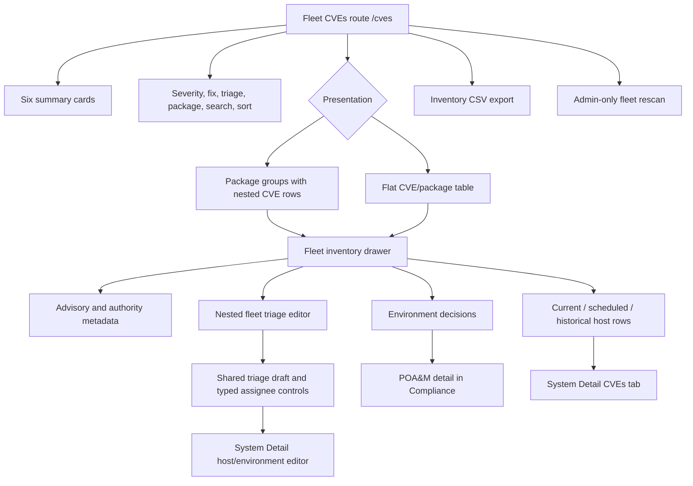

### 3.2 Distinct responsibilities

| Component or operation | Responsibility | Must not be mistaken for |
|---|---|---|
| Grouped and flat inventory | Prioritize visible advisory/package pairs and identify affected hosts. | A list of individual scanner occurrences or a complete history archive. |
| Fleet inventory drawer | Explain one exact CVE/package pair across visible inventory sections. | A mutation authority token or a single source scan for the whole fleet. |
| Fleet triage editor | Set environment defaults using server-derived Current exact subjects. | A host selector or a deployment scheduler. |
| System Detail triage editor | Set a direct host override or change its environment decision. | The fleet editor with one arbitrary client-selected host. |
| POA&M | Track remediation ownership, plan, finding links, and verification history. | Proof that the package has been fixed. |
| Fleet rescan | Enqueue scan work for server-resolved running derivations. | Rebuild, deployment, retained-generation repair, or immediate results. |
| CSV export | Export the selected inventory row contract within its bound. | An immutable closure evidence report. |

Sources: [C06], [C07], [C08], [C09], [C15], [C17], [C20].

---

## 4. Terminology and independent state dimensions

### 4.1 Identity vocabulary

| Term | Exact meaning |
|---|---|
| Advisory | The canonical CVE ID. The same CVE can affect several canonical packages. |
| Fleet inventory row | One canonical `(CVE ID, package name)` pair. |
| Package group | All returned advisory/package rows for one canonical package name. |
| Exact occurrence | An immutable observation identified by scan, observed derivation path, canonical CVE, and canonical package. |
| Stable finding | One `(system_id, canonical_cve_id, canonical_package_name)` record in `poam_cve_findings`. Version is evidence, not finding identity. |
| Current target | The latest consistent observed generation/store path uniquely resolved to a NixOS derivation within the registered flake and effective configuration. The newest completed schema-1 scan supplies CVE evidence; retained-generation provenance is optional. |
| Scheduled deployment target | The newest eligible active deployment intent and its exact scan. This is not the running configuration. |
| Environment decision | The active accepted-risk or scheduled-remediation row for a CVE/package/environment. No active row means OPEN. |
| Host override | A direct accepted or scheduled decision for a CVE/package/system. It takes precedence over the environment decision. |
| Baseline evidence | Immutable evidence captured when a finding is linked to a POA&M. |
| Verification evidence | A later scan and its evaluated result. It does not replace the baseline. |

Sources: [C02], [C10], [C12], [C13], [C15], [C17].

### 4.2 Do not collapse these dimensions

A result has an **inventory role**, an **evidence representation**, a **target identity**, a **scan time**, a **triage decision**, and a **verification result**. These dimensions are independent.

For example, a scheduled deployment target can have exact schema-1 evidence but no authority for fleet triage. A Current exact finding can be accepted risk and still be present in the scan. A scheduled-remediation finding can have no active deployment request. A current scan can be old without losing its selected-source status under the inspected query. [C09], [C14], [C15], [C17]

| Dimension | Important states | Incorrect inference |
|---|---|---|
| Inventory role | Current, scheduled deployment target, Historical. | “Scheduled configuration” means a patch has been scheduled in POA&M. |
| Evidence | Schema-1 observation, schema-0 compatibility projection, unavailable. | Schema-1 alone proves the system currently runs that derivation. |
| Authority | Current exact, historical read-only, scheduled read-only, unavailable. | A visible row automatically permits a write. |
| Triage | OPEN, ACCEPTED, SCHEDULED; mixed environment rollup. | ACCEPTED or SCHEDULED means remediated. |
| Scan attempt | Waiting, active, completed, failed. | A new failed attempt erases a prior completed source for the same target. |
| Verification | PASS, FAIL, MISSING, WHITELISTED, JUSTIFIED. | No displayed rows, no current source, or accepted risk proves PASS. |

The current fleet source selectors use the latest completed eligible scan. A newer unsuccessful attempt does not satisfy that selector and does not itself remove the preceding completed evidence. The page does not provide a complete attempt-lifecycle display; Scanning owns that workflow. [C09], [C14]

---

## 5. Persistence and identity relationships

The following diagram records the pinned schema. Its mandatory retained link
is superseded by optional provenance in the continuity contract. The separate
Mermaid source remains time-pinned audit evidence.

The diagram shows the principal relationships used by the reviewed paths. It is a conceptual schema map, not a complete DDL inventory. In particular, the separate current selectors for evaluation artifacts are omitted. [C09], [C10], [C12], [C14], [C15], [C17]

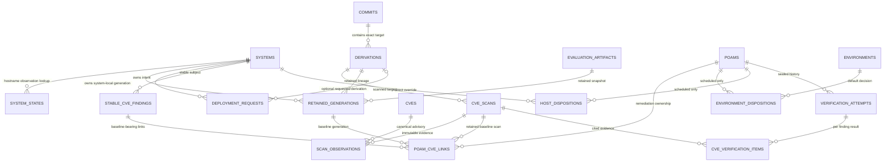

### 5.1 Immutability and mutable enrichment

Schema-1 observations preserve observed package name, version, derivation path, canonical package, and CVE identity. The scan completion path seals the observation set with the owned completion transition. A stable finding does not identify a package version. Each POA&M link instead stores the link-time baseline fields. [C10], [C16], [C17]

Not everything displayed beside an observation is immutable scan content. The fleet query reads CVSS, description, vector, publication dates, and exploitation state from `cves`. Fix information comes from `package_vulnerabilities`. Later changes to those tables can change labels, filtering, and aggregate statistics without a new scan. The legacy projection also relies on mutable package rows. [C09], [C11]

Scan archive metadata is separate from evidence identity. The original schema-1 migration has a broad immutability trigger, but later scan lifecycle migrations add operational archive behavior. Do not describe every scan column as permanently immutable based only on the original trigger. The reviewed fleet source selectors do not use archive visibility as a substitute for evidence eligibility. [C09], [C10], [C14], [C27]

### 5.2 Identity rules that already matter

A hostname is not a canonical fleet advisory identity. A package version is not a finding identity. A displayed short commit is not a target authority credential. A retained generation number is system-local. A deployment request, a scan, a finding, and a POA&M each have different durable IDs. [C09], [C10], [C14], [C15]

The fleet inventory DTO currently loses several source IDs that exist inside the queries. Section 11 describes this loss. A browser must not reconstruct the missing identity from a label or from whichever revision is newest when navigation completes.

---

## 6. Data producers and source map

### 6.1 Producer-to-reader flow

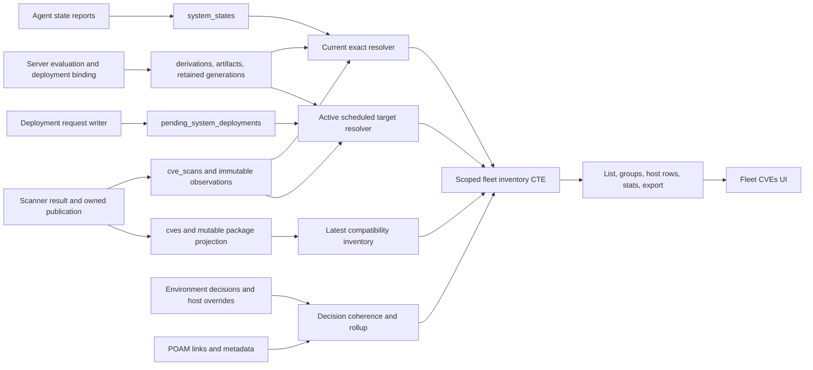

The arrows describe database dependencies inspected in the readers and writer paths. They do not establish that every upstream producer is healthy in a deployment. In particular, no complete live advisory-enrichment feed was established by this audit. [C08], [C09], [C11], [C12], [C14], [C16], [C19], [C20]

### 6.2 Field-level source map

| Visible data or decision | API or client path | Server source | Meaning and caveat |
|---|---|---|---|
| Critical, High, Patchable, triage, affected-system cards | `GET /cves/stats` | `fetch_cve_fleet_stats`, shared inventory CTE. | Full visible scope, not the current page filters. Pair counts and host counts are different units. |
| Flat rows | `GET /cves` | `fetch_cve_list`, shared inventory CTE. | Bounded CVE/package rows; the UI asks for 500. |
| Package cards and nested rows | `GET /cves/grouped` | `fetch_cve_packages_grouped`. | Two separate reads: group aggregates, then bounded nested rows. |
| Package selector | `GET /cves/packages` | Visible inventory package query. | A bounded list of package names; not a complete searchable registry. |
| Advisory title, score, vector, publication, exploitation flag | List/detail queries | `cves` joined to visible inventory pairs. | Mutable enrichment. A field's presence does not prove a fresh upstream feed. |
| Installed version on an aggregate row | Shared inventory CTE | Role-preferred lexical `MAX(installed_version)`. | A representative value, not proof that all hosts run one version. |
| Fixed version and fix availability | Shared inventory CTE and exact package lookup | `package_vulnerabilities.fixed_version`. | Known package metadata; no proof that a deployable flake target contains the fix. |
| Current host membership | Fleet inventory and exact triage detail | Latest consistent state, unique scoped NixOS derivation, newest completed schema-1 scan. | Retained evaluation provenance is optional for CVE authority; Config and rollback use separate proof. |
| Scheduled configuration membership | Fleet inventory | `view_active_scheduled_cve_scan_targets` and occurrence view. | Active deployment intent, not current runtime and not a POA&M decision. |
| Historical host membership | Fleet inventory | `view_system_vulnerabilities` fallback. | Latest compatibility projection only for hosts without either exact authority. |
| Environment accepted/scheduled display | `GET /cves/:id/fleet?package=...` | Disposition service, current subjects, coherence checks, POA&M metadata. | Environment default, not a complete host-effective rollup. |
| Host override | System Detail triage route | `cve_system_dispositions`. | Implemented; fleet read displays do not fully expose its effective-state impact. |
| Typed assignee choices | `GET /poams/assignees` | POA&M assignee catalog. | A selectable identity does not grant environment access. |
| POA&M plan, risk, due date, owner | Fleet detail nested scheduled metadata | Referenced active `poams` row and typed assignee projection. | Used for exact semantic reuse, not editable through an unchanged reuse draft. |
| First/last seen | List/export | Minimum/maximum selected source completion times. | Not an immutable lifetime discovery history. |
| Scan result counts in Scanning | Scanning APIs | Stored scanner summary counters. | Can count occurrences rather than fleet advisory/package pairs. |
| No-scan coverage | Fleet stats and drawer warning | Separate existence checks in fleet query. | Coverage is not equivalent to exact Current authority. |
| Fleet rescan outcome | `POST /cves/rescan-fleet` | Atomic target/enqueue CTE. | Counts distinct derivations, created rows, and reused work. |

Sources: [C06], [C08], [C09], [C13], [C14], [C15], [C16], [C19], [C20], [C21].

### 6.3 Advisory enrichment is not established end to end

The inspected scan publication path upserts CVE identity and CVSS score, writes package relationships, and publishes immutable observations. Searches for exploitation and fixed-version writes found fixture population and test setup, but did not establish a production updater for all rich advisory fields. The typed remote result validates `fixed_version`, but `result_to_vulnix` does not carry that field into the converted `VulnixEntry`. [C16], [C19], [C30]

Therefore the source map must not show a verified NVD, KEV, or fixed-version feed feeding these fields. An external process or uninspected writer may exist. Its ownership, synchronization time, error state, and field provenance are **UNVERIFIED**. Rich browser fixtures are not evidence of production enrichment.

### 6.4 Publication and read-only boundaries

Fleet inventory GETs query stored data. Triage writes operator decisions and POA&M records. Fleet rescan explicitly enqueues scan work. None of these operations should be described as automatically rebuilding a host, deploying a patch, or creating retained-generation proof. [C08], [C09], [C15], [C20]

---

## 7. Inventory selection and authority

### 7.1 Current exact selection

**AS-BUILT:** The fleet CTE first selects the latest state for each visible active system. It then checks that state's generation, store path, and generation/store agreement. It requires the matching retained generation, verified lineage, available integrity-version-1 artifact, matching exact NixOS derivation, and latest completed schema-1 scan. Scan selection orders by completion time and scan ID. [C09]

This is the pinned query, not the continuity contract. The target shared
`view_current_cve_authority` selects the latest state before validity checks,
then exactly one scoped NixOS derivation and its newest completed schema-1 scan.
External activation, unavailable evaluation artifact, archived or behind-head
commit, and absent retained-generation ID do not by themselves bar Current CVE
actions. Missing or inconsistent observation, ambiguous/foreign mapping, or
no exact schema-1 scan fails closed. No evidence is not clean. Explicit
historical and scheduled targets remain read-only for Current mutations.

A valid older state must not substitute for an invalid newest state. A completed scan from another derivation must not substitute for the resolved running target. A completed clean scan supplies authority even when it supplies no finding rows. The clean result suppresses stale compatibility findings for that host. [C09], [C24]

### 7.2 Active scheduled deployment selection

The scheduled-target view selects the newest live pending, unexpired deployment before it checks exact identity. A newer unbound request prevents fallback to an older exact request. The selected request must retain the expected artifact binding and exact derivation/commit/flake/configuration/store relationship. The artifact must meet the view's schema and integrity checks. The target then uses its latest completed schema-1 scan. [C14], [C24]

Expired and terminal requests do not qualify. A scheduled scan with no findings is still a usable scheduled authority record. This role is read-only for fleet triage. The same host can appear once under Current and once under Scheduled configuration exposure. [C14], [C24]

### 7.3 Historical compatibility selection

Historical fallback applies only when the host has neither Current exact scan authority nor scheduled exact scan authority. This suppression is **host-wide**, not a per-CVE fallback. The source is the latest completed built-system scan in the legacy hostname/configuration-name projection. Its findings come from `scan_packages` and mutable package vulnerability rows. [C09], [C11]

The legacy view selects by `derivation_name`. The fleet join then associates that name with the visible system hostname. This is not the same explicit `(system, flake, effective configuration)` proof used by exact paths. Reused names across flakes and a system whose configuration name differs from its hostname require dedicated regression tests. This is a source-level identity risk, not proof that a live host has already received another flake's findings. [C09], [C11]

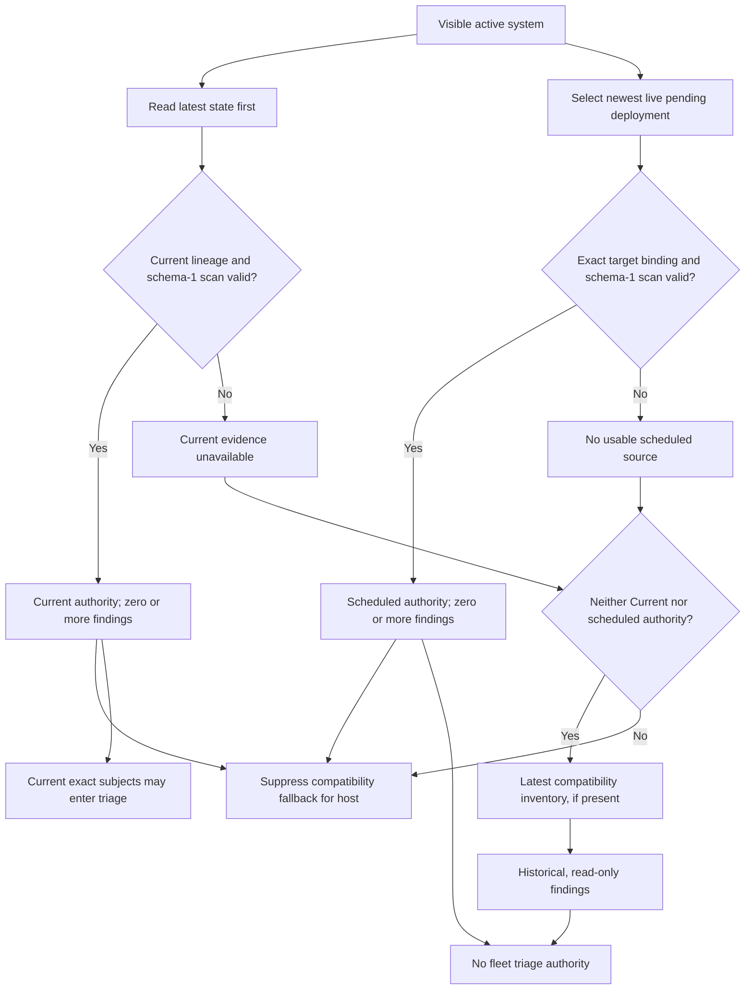

### 7.4 The raw occurrence view still has a different latest-state rule

Migration 0259 defines `view_current_exact_cve_occurrences` with validity predicates inside the state subquery, before `ORDER BY ... LIMIT 1`. It can select an older valid state when the newest state is invalid. The production fleet inventory CTE counteracts this by joining raw occurrences to its latest-first authority gate using both system ID and scan ID. [C09], [C10]

However, the environment-coherence function and `cve_list_for_environment_scope` also consume the raw occurrence view. They do not inherit the fleet CTE's gate merely because the inventory query uses them later. The exact mutation service uses its own latest-first resolver. This leaves multiple definitions of the current subject set in one feature. [C10], [C12], [C13]

A concrete test case is two hosts with older valid evidence. One host then reports a latest state with invalid generation/store agreement. Inventory and service resolution must exclude that host. The schedule-coherence calculation must exclude it too. Otherwise the list can report an incoherent or outstanding decision while the drawer's current service set reports a coherent schedule.

### 7.5 Scan freshness and authority are not the same

The inspected Current and scheduled selectors choose a completed eligible scan without a maximum evidence-age predicate. An old scan can remain the selected source. Scan scheduling intervals can request fresher work, but they are not evidence that the replacement completed. A truthful UI needs the selected scan time and a separate freshness policy. Those fields are not fully exposed in current fleet host rows. [C09], [C14], [C20]

### 7.6 Fleet rescan uses a weaker target resolver

`FLEET_TARGET_SELECT` matches active systems, flake commits, effective configuration names, and realized store paths. It does not require the retained-generation evidence chain. Its state subquery filters out empty store paths before it orders observations, and it has no state-ID tie-breaker. It can therefore use an older non-empty observation when a newer observation has no usable path. [C20]

It deduplicates by derivation ID, not by store path. Multiple same-path derivations can remain separate queue targets. Its comment about eliminating duplicate same-path work is stronger than its SQL predicate. The rescan result reports derivation counts, not the number of distinct systems. [C20]

This does not authorize triage. It does mean that the product needs a separate, explicit scan-admission target contract. Requiring remediation proof just to scan and ignoring the newest state are not the only two available choices.

---

## 8. Count contract

### 8.1 Units

| Field or visible value | AS-BUILT unit |
|---|---|
| `total_cves` in fleet stats | Number of canonical CVE/package pairs in the visible inventory, including pairs represented only by historical inventory. |
| Severity totals in fleet stats | CVE/package pairs in each named severity bucket, not scanner occurrences. |
| Package `cve_count` | Filtered advisory/package pairs for that package. |
| `affected_count` / `systems_affected` | Distinct union of Current and scheduled-target affected systems in the relevant row or fleet scope. |
| `current_affected_count` | Distinct Current affected systems. |
| `scheduled_deployment_target_count` | Distinct systems affected in the scheduled-target role. |
| `historical_inventory_count` | Historical fallback systems, outside the Current/scheduled union. |
| Exact affected count | Can include Current and scheduled exact inventory. It is not necessarily a mutation target count. |
| Mutation target count | Current exact subjects in actionable environment scope; it does not explain host-override ownership exclusions by itself. |
| `outstanding`, `accepted`, `scheduled` | Pair-level rollup counts, not counts of environments or individual host decisions. |
| Scanning stored severity counts | Scanner-derived occurrence counts across scanned package entries. |

Sources: [C09], [C13], [C16], [C21], [C24].

### 8.2 Set equations

For one advisory/package pair, let `C` be the set of Current affected system IDs, `S` the scheduled-target set, and `H` the Historical fallback set.

```text
active_affected = |C union S|
current_affected = |C|
scheduled_target_affected = |S|
historical_inventory = |H|
active_affected = |C| + |S| - |C intersection S|
```

A host represented in both Current and Scheduled must retain two role rows but contribute one to `active_affected`. The host-wide fallback rule excludes `H` when Current or scheduled authority exists, including a clean authority. Package and fleet totals must deduplicate host IDs again across multiple CVE/package rows. Summing row host counts is not a fleet host count. [C09], [C24]

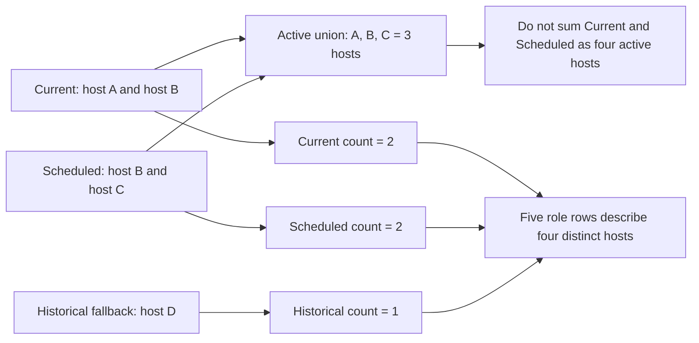

### 8.3 Existing regression evidence

The database workflow `fleet_cve_inventory_separates_current_scheduled_and_historical_scope` asserts this overlap case: Current 2, Scheduled 2, Historical 1, active affected 3, and five section rows for four distinct systems. It also checks hidden environments, expired requests, failed requests, and a newer unbound request that supersedes an older exact request. The source was read; the test was not run here. [C24]

### 8.4 Presentational inconsistencies

The **Accepted risk** card adds `accepted + scheduled`. Accepted risk and scheduled remediation are different decisions. A label that collapses them cannot support a reliable operator interpretation. [C06]

The flat affected-host bar uses the fleet's affected-system count as denominator. A nested grouped row uses the package group's affected-system count. The reference design uses total fleet population. The same numerator can therefore have different visual proportions after switching presentation. Neither current denominator means “fraction of all managed systems.” [C05], [C06]

The **Patchable now** card and “Just deploy newer flake” copy are stronger than their source. A non-null fixed-version field does not establish that the registered flake has a newer built target, that it contains the fix, or that deployment policy permits activation. [C06], [C09]

### 8.5 Missing values and incomplete partitions

The fleet statistic shape exposes Critical, High, Medium, and Low counts but not a corresponding Unknown bucket. Pair totals can include findings outside those four buckets. The UI also does not present every no-scan and authority-unavailable condition in its headline summary. Zero known findings must not be read as complete clean coverage. [C06], [C09]

`inventory_only` is a row status when no Current exact subjects exist. It is not the same as outstanding. A complete proposed triage partition needs an explicit inventory-only count, and an effective-host partition also needs mixed or partially managed states. Do not force totals to balance by relabeling untriageable inventory as OPEN. [C09]

---

## 9. HTTP contract and bounds

All paths in this section are under `/api/v1`. This is the contract observed in the named handlers and clients, not an OpenAPI completeness claim. [C03], [C08], [C09], [C18]

### 9.1 Fleet read and action routes

| Method and route | Actor | Behavior and current bound |
|---|---|---|
| `GET /cves` | Authenticated visible scope | Flat pair inventory. Default limit 500, maximum 1,000. Bare array; no continuation contract. |
| `GET /cves/grouped` | Authenticated visible scope | At most 100 package groups, with at most 100 nested pair rows per group. No complete pagination metadata. |
| `GET /cves/stats` | Authenticated visible scope | Full-scope statistics, independent of page filters. |
| `GET /cves/packages` | Authenticated visible scope | At most 500 package names. |
| `GET /cves/:cve_id/fleet?package=:pname` | Viewer, Operator, Admin within scope | Full role-aware drawer plus current decisions. Rejects over 1,000 distinct affected systems rather than returning a partial drawer. |
| `POST /cves/:cve_id/triage` | Operator or Admin; CSRF required | Complete environment action set, at most 100 actions, atomic domain mutation. |
| `GET /cves/export` | Authenticated visible scope | Full filtered row set independent of list limit. At most 1,000 rows; larger export returns 422. |
| `POST /cves/rescan-fleet` | Admin; CSRF required | Enqueues or reuses target scan work; 202 is not scan completion. |
| Compatibility `GET /cves/:cve_id` | Authenticated visible scope | Returns the alphabetically first visible package row for that CVE. It is not a union of all package contexts. |
| Compatibility affected-system read | Authenticated visible scope | Uses the selected CVE/package inventory contract. Consumers must preserve role distinctions. |

### 9.2 Filter semantics

Severity, fix status, triage status, package, search, and sort are server inputs for inventory rows. Fix status supports available, pending, and exploited cases. The exploited choice filters an exploitation flag; it is not a patch state. Values within different filter categories combine as restrictions on the same row set. [C08], [C09]

Package filtering is a substring `ILIKE` match, although a dropdown selection appears to name one exact package. Search patterns are parameterized, but `%` and `_` retain pattern meaning in the inspected construction. This is not SQL injection; it is an exact-search-versus-pattern-search contract issue. [C09]

Unknown filter strings do not receive one consistent typed validation response across these paths. The flat limit is capped above, but the inspected query does not enforce a positive lower bound. A negative limit can reach PostgreSQL instead of returning a stable client validation error. Grouped ordering does not honor the selected flat sort, as detailed in Section 18. [C08], [C09]

### 9.3 Fleet triage request

The browser sends an exact canonical package, environment actions, and POA&M metadata only when a schedule action exists. It does not send a selected host list or an authority baseline. The server derives hosts and evidence again. [C03], [C07], [C15]

```json
{
  "canonical_package_name": "openssl",
  "actions": [
    {
      "action": "accept_risk",
      "environment_id": "00000000-0000-4000-8000-000000000001",
      "justification": "Compensating controls limit exposure to the isolated test network.",
      "review_date": "2026-10-15"
    },
    {
      "action": "schedule_patch",
      "environment_id": "00000000-0000-4000-8000-000000000002"
    }
  ],
  "poam": {
    "title": "Remediate the selected OpenSSL advisory",
    "plan": "Update the configuration, deploy the tested target, and obtain verification evidence.",
    "assignee": {"kind": "oidc_group", "group_name": "platform-operators"},
    "target_date": "2026-10-31",
    "risk": "high",
    "default_milestones": true
  }
}
```

The IDs and text above are illustrative. The action set must equal the server's complete visible Current exact environment set. A request must include unchanged environments too. The server can still reject scheduling an environment when host overrides own all of its subjects. [C15]

### 9.4 Distinguish bounds from complete results

A bare array at its maximum size does not tell the client whether additional rows exist. The UI has no continuation mechanism for flat rows, groups, or package choices. Group aggregate totals can exceed the number of nested rows returned. These are not equivalent to the paged System Detail CVE inventory API. Its cursor guarantees do not automatically apply to fleet reads. [C03], [C06], [C09]

---

## 10. Page state, navigation, and refresh

### 10.1 AS-BUILT resource graph

The page starts independent resources for statistics, package choices, and flat rows. Flat-row loading occurs even in grouped mode. Grouped presentation owns another resource keyed by its filters and presentation state. Search changes issue requests without a debounce. There is no common fleet collection revision or shared response snapshot. [C06]

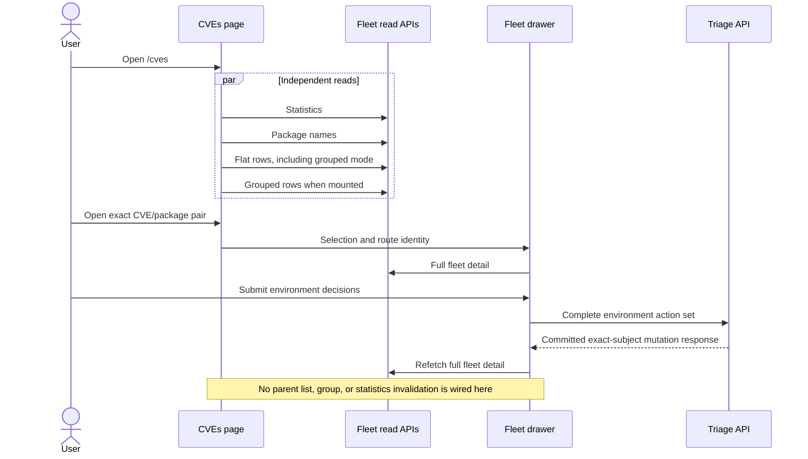

### 10.2 Mutation refresh gap

After successful triage, the drawer refetches full inventory. This is correct because the POST response describes exact mutation subjects, not every Historical or scheduled inventory row. The parent list, package groups, and statistics do not receive a corresponding invalidation callback. The drawer can show a changed decision while the row behind it and summary cards retain old values. [C06], [C15], [C25]

Changing a filter or reloading the page can make some data catch up. That is not a consistency mechanism. It also makes a defect appear intermittent during manual review.

### 10.3 Route behavior

The route stores filters, search, sort, presentation, and the exact drawer pair in query parameters. Initial hydration has a guard against immediately overwriting the incoming URL. Filter changes use `replaceState`; drawer open and close use `pushState`. [C06]

The `popstate` handler restores the drawer selection but does not restore all filter, search, sort, and presentation signals. A browser history entry can therefore carry different query state from the visible controls and issued reads. Existing browser coverage verifies drawer back/forward, not the full filter-history round trip. [C06], [C25]

### 10.4 Background refresh and staleness

There is no automatic fleet polling loop in the inspected page. Fleet rescan reports queueing, then dismisses its feedback after a short timer. It does not wait for scan completion and does not refresh the read resources when a scan publishes. Host deployment, environment movement, and another operator's triage can also leave an open page stale. [C06]

The drawer protects against a late response overwriting a different selection through a request-generation counter and a mounted guard. That protection does not make independent endpoints transactionally consistent. It also does not establish that the returned DTO belongs to the requested source unless that identity is present and checked. [C06]

### 10.5 Proposed invalidation contract

Every resource key must include the relevant visible scope, normalized filters, view, and exact selection. A successful triage mutation must invalidate the affected pair in the drawer, flat list, grouped list, and statistics. It must also invalidate any cached System Detail effective triage state that depends on the changed environment. [PROPOSED]

A scan publication or deployment change must invalidate source selection and coverage, not only a status chip. Use an explicit refresh event or bounded polling strategy with request deduplication and timeouts. A local clock can update ages, but it must not make old evidence look newly fetched. Preserve the distinction between the last successful data and the latest refresh failure.

---

## 11. Fleet drawer and navigation identity

### 11.1 AS-BUILT state machine

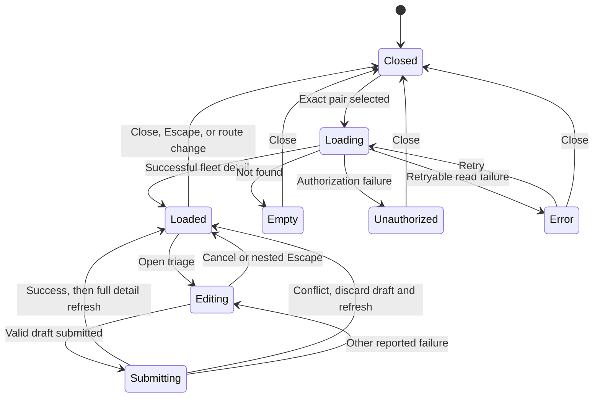

The diagram simplifies refresh into a transition label. In source, a refresh can keep the previous loaded detail while the new request runs. Its request-generation guard rejects obsolete completions. The source does not provide a complete page-wide refresh state machine. [C06]

### 11.2 Data assembly is not one snapshot

`fleet_cve_inventory_detail` loads full inventory systems, obtains current exact disposition detail through another transaction, loads the aggregate CVE/package row, and reads fleet coverage statistics. These operations are not all executed in one repeatable-read transaction. The current-only helper transaction itself uses the default transaction isolation. [C13]

Concurrent scan publication, a deployment observation, or an environment change can occur between these reads. The resulting response can contain counts, host rows, and decisions from different database states. This is a query-boundary finding. No live inconsistent response was captured in this review.

### 11.3 Information currently lost

The full inventory host query supplies `NULL` for `commit_hash`. The drawer can render an unknown commit even though the Current and scheduled source chains contain the target's commit and derivation internally. The fleet host DTO does not carry a complete source scan ID, scanner identity/version, completion time, retained-generation ID, or deployment request ID for every role. [C09], [C13]

The operator therefore cannot answer all of these questions from the drawer: Which scan produced this host row? How old is that scan? Which exact scheduled deployment does it describe? Which retained generation authorized Current? Which source should a cross-screen link open?

A single advisory header or one aggregate installed version cannot substitute for per-role source provenance.

### 11.4 Current host navigation loses selected evidence

A host link opens the System Detail CVEs tab. It does not preserve the selected canonical pair and exact historical or scheduled derivation. For a Historical or scheduled row, the destination can default to a different target. The existing System Detail default selector change does not fix this missing link context. [C06], [C28]

**PROPOSED:** A link must carry a server-issued target identity and the canonical advisory/package pair. The destination must authorize that identity again. When it cannot read the requested source, it must show an explicit unavailable state. It must not silently redirect to Current and present that as the original evidence.

### 11.5 Drawer versus editor scopes

The drawer includes inventory-only rows. The fleet editor includes only Current exact environments. The mutation response is intentionally narrower than the full drawer. This is a valid scope distinction, not a reason to remove Historical and scheduled sections after saving. Existing browser assertions explicitly require the drawer to use a refetched full GET rather than blindly trust the POST's host list. [C06], [C15], [C25]

---

## 12. Triage decisions and host-override precedence

### 12.1 Environment decisions

An active environment decision is ACCEPTED or SCHEDULED. OPEN is represented by no active row. ACCEPTED stores justification, actor, time, and optional review date. SCHEDULED references an active POA&M. Changing a decision retires history and creates a new active row when needed. Accepted risk does not create a finding link or a verification PASS. [C10], [C15]

The fleet list flattens mixed environment decisions to `outstanding`. The drawer can report `partial`, rendered as MIXED. Thus the list's outstanding filter includes more than “every environment is OPEN.” It also includes mixed decisions or schedules that fail coherence. [C09], [C12], [C13]

### 12.2 Host overrides are implemented

`cve_system_dispositions` stores a direct ACCEPTED or SCHEDULED decision for one system and canonical pair. The effective System Detail decision uses the host override first, then the environment default. Removing a host override restores inheritance. It does not create an explicit OPEN override against an accepted environment. [C07], [C12]

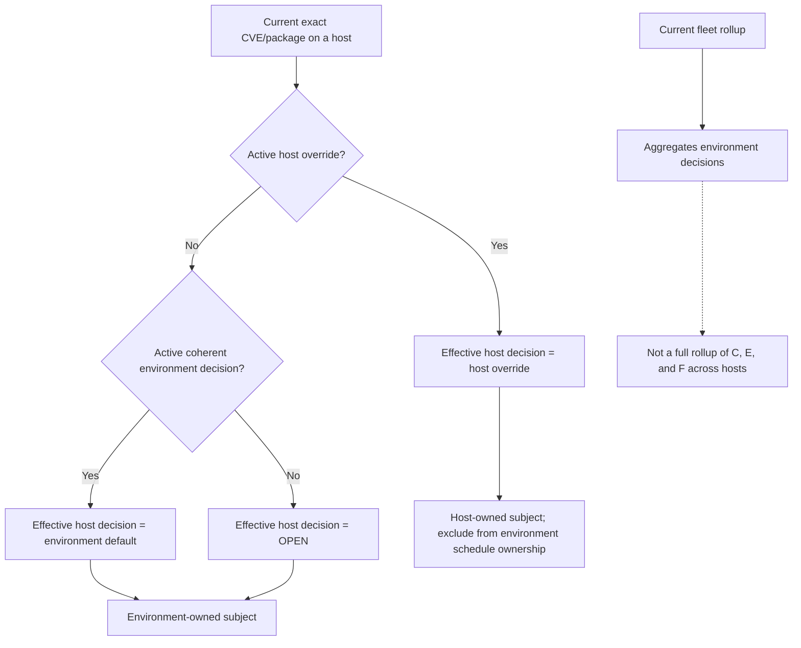

### 12.3 Current fleet rollup is not the effective-host rollup

Migration 0270 updates scheduled-environment coherence to exclude direct host overrides. It does not replace the fleet list's environment-level status aggregation with a host-effective aggregation. The drawer's rollup also counts environment decisions. [C12], [C13]

For example, an environment can be OPEN while a host in that environment has an accepted override. The System Detail row is accepted; the fleet environment default remains OPEN. Neither fact is inherently wrong. The problem is that the fleet summary and labels do not make the distinction sufficient to explain the difference.

Likewise, an accepted environment can contain a separately scheduled host. Reporting only the accepted environment default is not a complete statement about remediation ownership across its hosts.

### 12.4 Mutation subject ownership

Environment scheduling excludes all direct host overrides. This prevents an environment action from taking ownership of a host-managed finding. When every Current exact subject in an environment has an override, scheduling that environment fails with a typed conflict. [C12], [C15]

The fleet editor still builds its environment list and count from Current exact subjects without exposing the owned-versus-overridden partition. It can offer a schedule action that the server must reject. The server guard is necessary. The UI needs better actionability metadata, not a weaker guard. [C06], [C07], [C15]

### 12.5 Validation and POA&M draft behavior

Acceptance requires 10–2,000 trimmed bytes, not a loosely defined character count. An optional review date must parse as a date. A schedule requires title, plan, typed user or OIDC-group assignee, target date, and risk. The shared draft generates an initial title but does not invent an owner or target date. [C07], [C15]

When all existing scheduled rows identify one compatible POA&M, the editor hydrates its exact title, plan, target date, risk, and assignee. Reuse fields are preserved rather than silently edited. Missing nested metadata, multiple POA&Ms, or an unavailable assignee produce a preservation conflict while any schedule remains. [C07], [C18]

The UI can allow changing all schedules to OPEN or ACCEPTED, but server lifecycle rules can still prohibit removing a POA&M's final active subject. Recovery copy must explain that possible next conflict instead of promising unconditional success. [C07], [C15]

---

## 13. Triage transaction, concurrency, and retry contract

### 13.1 AS-BUILT mutation sequence

The fleet service validates the request shape, resolves server-owned subjects, obtains the writer locks, reloads the actor, and re-resolves the subject set. It does not authorize a write from the drawer's cached host list. The transaction uses `READ COMMITTED` behavior so statements after a lock wait can see the writer that released the lock. [C15], [C31]

```mermaid
sequenceDiagram
    actor Operator
    participant UI as Fleet editor
    participant Service as Triage service
    participant DB as PostgreSQL
    Operator->>UI: Submit all visible Current exact environments
    UI->>Service: Pair, environment actions, optional POAM draft
    Service->>Service: Validate action shape and bounds
    Service->>DB: Begin transaction and lock canonical CVE key
    Service->>DB: Resolve initial exact subjects
    Service->>DB: Lock sorted environment and system scope
    Service->>DB: Lock policy and exact finding keys, then rows
    Service->>DB: Reload active actor, roles, and memberships
    Service->>DB: Re-resolve Current subjects and overrides
    alt Scope or authority changed
        Service->>DB: Roll back
        Service-->>UI: Typed conflict; no triage mutation committed
    else Exact action set remains valid
        Service->>DB: Reuse or create one compatible POAM
        Service->>DB: Retire prior decisions and affected links
        Service->>DB: Insert new decisions, baselines, and audit
        Service->>DB: Build exact-subject response and commit
        Service-->>UI: Committed result and reuse metadata
        UI->>Service: Refetch full fleet inventory
    end
```

### 13.2 Lock and revalidation responsibilities

| Phase | Purpose |
|---|---|
| Canonical CVE advisory lock | Serializes decisions and evidence-dependent work for the advisory key. |
| Initial subject resolution | Determines which environment and system keys the operation expects to own. |
| Deterministically ordered environment locks | Prevents an operation from applying a decision to a stale environment subject set. |
| System sentinels, policy finding keys, exact-CVE finding keys | Coordinates ownership and evidence-dependent changes before lifecycle row updates. |
| System and lifecycle row locks | Prevents conflicting persistence changes while the transaction commits its decision. |
| Fresh actor lookup after waits | Prevents a request-time role or environment membership from surviving a concurrent revocation. |
| Subject re-resolution | Detects membership and evidence changes that occurred before the complete lock set was held. |
| Response construction before commit | Prevents a committed mutation followed by an unrelated detail-building failure in this service path. |

Source: [C15]. This table records the inspected mutation path. It does not prove that every external writer or every trigger follows the complete lock protocol. That wider concurrency audit remains separate.

### 13.3 Complete-set rule

The request environment IDs must equal the complete visible Current exact environment set. Duplicate, omitted, added, hidden, and stale environment identities must not produce a partial update or disclose a hidden scope. The server recomputes ownership rather than accepting client-selected hosts. [C15]

Host overrides are applied after Current subject resolution. An environment can be part of the required action set even though it owns no schedulable hosts. The current UI does not fully explain this distinction. A future actionability DTO should report both Current subject count and environment-owned subject count.

### 13.4 POA&M creation and reuse

All scheduled environment subjects in one request must use one compatible POA&M. Compatibility checks include title, plan, typed assignee identity, target date, risk, active status, and finding ownership. The service does not resolve incompatible POA&Ms by choosing the first one. Partial ownership and conflicting metadata abort the operation. [C15], [C22]

Creating a POA&M materializes stable findings and inserts baseline-bearing links. When default milestones are requested, the current service creates five named milestones. Their nominal offsets are 14, 28, 35, 49, and 56 days; the first four are bounded by the target date and the final milestone uses the target date. Reuse does not recreate default milestones. [C07], [C22]

These milestones express a remediation plan. They do not start deployment jobs, prove that a package update exists, or complete verification.

### 13.5 Final-subject removal

A fleet decision change must not leave an active POA&M with no valid active finding. The service rejects such retirement with a lifecycle conflict. Migration 0270 defines a narrower detached host-only exception with specific history and ownership conditions. That exception must not be generalized to environment-backed fleet POA&Ms. [C12], [C15]

An operator may therefore need to complete a POA&M lifecycle operation before removing its final scheduled environment decision. A generic “change it to OPEN” instruction can be insufficient.

### 13.6 Retry and idempotency

The service retries serialization failures up to three attempts. It does not automatically retry all business conflicts. The fleet request has no client request ID or POA&M revision field that makes the whole triage operation exactly-once. [C15], [C31]

Compatible repeated schedules can reuse the same POA&M. That is **semantic POA&M reuse**, not a guarantee of zero additional history writes. In the inspected path, an unchanged accepted decision can be skipped, while a scheduled decision can still be retired and replaced. Network retry handling must not claim stronger idempotency than the service supplies. [C15]

A lost success response creates an unknown client outcome. The browser must read canonical state before stating that the mutation failed or was not applied. Section 16 records the current contrary message.

---

## 14. Exact-CVE POA&M verification and lifecycle

### 14.1 Baseline contents

A link captures the source scan, scan derivation, scan completion time,
observed generation and store path, occurrence derivation path, observed
package version, and optional retained-generation UUID. At the audited SHA the
UUID was required; under the continuity contract it can be NULL when exact
Current scan and occurrence proof exists. Existing non-null baselines remain
valid and immutable. A client cannot construct a baseline from display metadata.
[C10], [C17], [C22]

The baseline proves that the finding existed when linked. It does not prove remediation. It remains useful after a scan changes, a finding disappears, or the POA&M closes.

### 14.2 AS-BUILT verification predicate

`current_cve_verification_items_tx` resolves the current exact deployment again. It requires current lineage to equal the link-time baseline lineage before it searches for a newer scan. The compared fields include scan derivation, retained generation identity, generation number, and target store path. [C17]

This diagram records the audited predicate, not the normative verification
rule. Under the continuity contract, server verification re-resolves the exact
observed Current derivation and scan independently of baseline lineage. PASS
requires a strictly newer completed schema-1 scan without the canonical
CVE/package occurrence. A changed commit, generation, derivation, or package
version alone cannot cause MISSING. Present, whitelisted, justified, missing,
historical, or inconsistent evidence cannot yield PASS; a clean scan only makes
the open episode a remediation candidate, never an automatic closure.

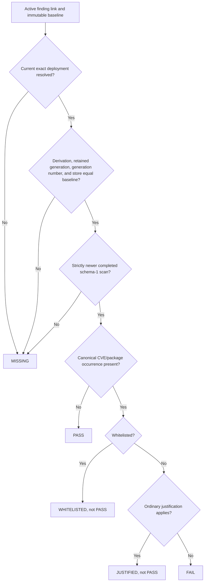

The occurrence lookup uses the canonical CVE/package pair. It does not require the newer occurrence to retain the baseline package version. The earlier lineage equality check is the condition that blocks a changed deployment. [C17]

### 14.3 Consequence for the normal patch workflow

Suppose a finding is linked on generation A. The operator deploys a fixed generation B and obtains a completed clean schema-1 scan for B. The baseline remains A. Under the current code, verification returns MISSING because the deployment lineage changed, before the clean B scan can establish PASS. [C17]

The same problem can occur when a new generation has the same store path but a different retained-generation identity. This is an explicit existing rule, not a missing UI refresh. A frontend fix cannot resolve it without changing the domain predicate.

This audited rule conflicts with the later approved continuity contract. Keep
it as time-pinned evidence, not as an instruction to restore the check. [C04]

### 14.4 Close is a separate, evidence-producing operation

Close requires the POA&M to be awaiting verification and requires every active exact-CVE item to pass. The service verifies the current subject set, creates and seals an attempt, writes its results, and updates the POA&M revision. [C26]

If evidence is insufficient, the service commits the rejected verification attempt and returns `412 closure_not_ready` with the committed revision and result details. This response does **not** mean that nothing was written. A client must retain the new revision before retrying. [C26]

On successful close, the service retires active finding links, retires the associated environment and host scheduled decisions, and records the closure attempt. The baseline and verification records remain audit history. A closed record must not be made clean by removing its evidence from the UI.

### 14.5 Reopen and recurrence

At the audited SHA, reopen checked that no other active POA&M had claimed the
closure finding. For environment-backed findings it required current exact
non-overridden subjects to equal the closure set. That equality is time-pinned
behavior, not the continuity target: current affected owned subjects require
coverage while historical links remain history. Conflicting active decisions
still block restoration. Reopen must not silently restart a completed episode.
[C26]

The service restores links by copying the original baseline fields. Reopen does not replace baseline evidence with the latest scan. A recurrence does not automatically reopen a completed POA&M. The continuity proposal instead describes a new episode after closure; that proposal is not the same as a verified current implementation. [C04], [C26]

---

## 15. Normative target: evidence continuity across deployments

The audited comparison below was written while continuity was a proposal. The
owner-approved continuity design now controls the target. The AS-BUILT column
remains pinned to the review SHA; the target column is not proof of completed
implementation or validation. [C04]

### 15.1 What the target changes

| Concern | AS-BUILT at audited SHA | Normative continuity target |
|---|---|---|
| Baseline | Immutable link-time evidence. | Preserve the same immutable baseline. |
| Current verification target | Must retain the baseline deployment lineage. | Resolve the latest authoritative running target independently of baseline generation. |
| Finding identity | Stable system/CVE/package record, with baseline-bearing links. | Keep that stable identity and the existing POA&M link model; no parallel evidence model or POA&M/commit link. |
| Environment schedule coherence | Current non-overridden subjects must match active linked ownership. | Current owned subjects must be covered by the episode's retained membership; old members remain audit history. |
| New affected host | Can make the current linked subject set incomplete. | Reconciliation adds the new subject idempotently. |
| Clean host | Current occurrence can disappear while its baseline link remains. | Retain membership and record resolved current evidence. |
| Recurrence before closure | No dedicated episode behavior was established in this review. | Continue the same active episode. |
| Recurrence after closure | No automatic reopen. | Create a new episode; preserve the closed episode. |
| Reconciliation ownership | Explicit service calls and existing coherence checks. | Server-owned reconciliation on evidence/deployment/membership changes, with bounded repair. |

Sources: [C04], [C12], [C15], [C17], [C26].

### 15.2 Separation of baseline and latest evidence

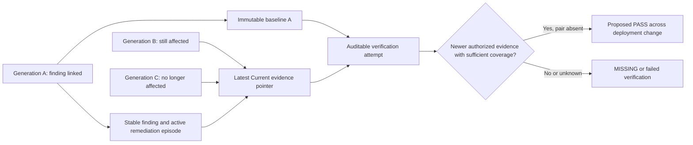

The continuity contract distinguishes absence of a canonical pair in a
completed exact Current scan from an empty UI result. Unknown coverage, missing
or inconsistent Current identity, and failed scanning must not become PASS.
Absent retained lineage alone does not bar an otherwise exact CVE scan.

### 15.3 Continuity boundary

The normative design requires newest completed schema-1 evidence for the exact
Current derivation. A clean scan without the canonical pair is candidate
remediation; absent evidence is not clean. Stable finding identity does not
include package version. Host overrides precede environment ownership; new
affected subjects are added idempotently by bounded server reconciliation on
scan, state, environment, and disposition changes and periodic repair. An
environment move does not erase old membership history.

Keep immutable scan/occurrence baselines and sealed verification history. Do
not invent retained-generation records or Config artifacts. The server must
recheck exact Current CVE authority under writer locks before mutation. A
changed generation alone is not MISSING; an unavailable or ambiguous source is.

### 15.4 Relationship to System Detail

SC1's earlier read-only tier waited for an evaluation-backed retained binding.
The continuity contract supersedes that gate for exact Current CVE triage and
verification. A uniquely resolved running derivation with a completed schema-1
scan can authorize CVE actions without retained provenance, regardless of
activation origin. Historical selections and unresolved Current states stay
read-only. CVE evidence does not authorize Config inspection or rollback.

---

## 16. Loading, error, empty, and stale-state contracts

### 16.1 AS-BUILT and proposed behavior by surface

| Surface / event | AS-BUILT | Proposed contract |
|---|---|---|
| Initial statistics load | Cards depend on the independent resource; failure can leave them absent without a local error explanation. | Show explicit loading and error states; never interpret absence as zero. |
| Package choices fail | Selector data can be unavailable without a useful local retry. | Preserve an already selected package and show a local catalog error/retry. |
| Flat/group list load | Loading and error content exists, but no complete continuation or overflow state. | Distinguish first-page loading, empty filters, unavailable inventory, and bounded partial results. |
| Full drawer load | Loading, not-found, unauthorized, and retryable-error states exist. | Preserve these distinctions and include selected pair context in each state. |
| Drawer 404 | “No current inventory findings” wording. | Explain that no visible inventory for the requested pair is available; do not imply a clean scan. |
| Drawer refresh | Can retain old Loaded content while another request runs. | Mark old data as stale, report refresh progress, and prevent stale actionability claims. |
| Late drawer response | Generation and mounted guards reject obsolete completions. | Preserve this guard and add response-identity checks where DTOs expose the source key. |
| Triage validation fails | Draft remains; no POST for invalid local input. | Preserve field-level errors and exact byte/date limits. |
| Triage conflict | Editor closes, draft is discarded, full detail refresh begins. Copy can say “Refresh completed” before completion. | State “Refreshing” until the read succeeds; preserve recoverable user text outside stale authority state. |
| Triage transport/decode failure | Can state “Triage was not applied.” | State “Outcome unknown” when a commit may have occurred; read canonical state before a definitive outcome. |
| Triage pending | Close/Escape/submit are guarded; some draft controls remain editable. | Freeze the submitted snapshot or label later edits as not part of the in-flight request. |
| Successful triage | Full drawer is refetched; parent resources remain stale. | Invalidate all affected read models and report any readback failure separately from committed success. |
| Rescan accepted | Queue feedback, not result polling. | Show queued/reused work with exact target scope; expose a route to its lifecycle. |
| No completed Current scan | May coexist with legacy or scheduled inventory. | Report coverage by role; never say the fleet is clean from an empty Current subset. |
| Export over bound | Server returns 422. | Keep the limitation explicit and preserve active filters for a narrower request. |
| POA&M close rejected | 412 can contain a committed verification attempt and revision. | Display the committed attempt and adopt its revision; do not report a no-write failure. |

Sources for AS-BUILT: [C06], [C07], [C08], [C09], [C25], [C26].

### 16.2 Empty results need a reason

These states require different explanations: no visible systems, no usable scan sources, no findings in a completed selected source, no matches for active filters, a stale/deleted selected source, and a hidden or unknown selected resource. A security-sensitive UI must not reduce all of them to “No vulnerabilities.” [PROPOSED]

Authority and coverage errors should remain local to the relevant role or target. A Historical finding may still be readable while Current is unavailable. A failed request to refresh an accepted decision must not erase the last known decision and replace it with OPEN.

### 16.3 Failure reporting must distinguish committed state

There are three client outcomes: rejected before commit, committed and acknowledged, and unknown because the response failed. A subsequent read can confirm state without proving that every ancillary effect of a different endpoint succeeded. The fleet UI should not infer rollback from a network exception. [PROPOSED]

This is especially important because triage reuses records semantically but is not a general exactly-once request protocol. Reposting after a lost response can add decision history even when it reuses the same POA&M. [C15]

---

## 17. Design-reference comparison

This comparison uses `CvesView.jsx` and the production view/component source. No current fleet page was rendered. CSS geometry, animation, contrast, focus visibility, and actual viewport behavior remain **UNVERIFIED**. Existing screenshot assertions are described as test source, not as a passing visual result. [C05], [C06], [C07], [C25]

### 17.1 Page and summary cards

| Required comparison dimension | Observation |
|---|---|
| Missing sections | The main summary/filter/inventory composition exists. A visible coverage/Unknown explanation is absent from the headline model; the reference also does not define it adequately. |
| Reordered sections | Summary, filters, and inventory retain the broad reference order. Production has six cards rather than five. |
| Collapsed or merged concepts | Accepted risk combines accepted and scheduled counts. “Patchable now” merges advisory fix metadata with assumed deployment readiness. These reference assumptions should not be copied as domain truth. |
| Missing metadata | No complete selected-source freshness or visible no-scan/unknown coverage summary accompanies the headline totals. |
| Changed interaction | Page reads are asynchronous rather than local mock filtering. Filters can issue both flat and grouped requests. No automatic result refresh follows rescan completion. |
| Visual hierarchy difference | The affected-system metric adds a card. Role-specific subtitles add useful detail, but the severity and accepted-risk headlines still hide count-unit distinctions. |

### 17.2 Grouped and flat inventory

| Required comparison dimension | Observation |
|---|---|
| Missing sections | Both modes exist. Neither production mode supplies complete fleet pagination or an overflow explanation. |
| Reordered sections | Groups use severity ordering. Production nested rows also use severity order even when another sort is selected; the reference retains selected row ordering inside groups. |
| Collapsed or merged concepts | A representative installed/fixed version can hide multi-version host evidence. An affected-host bar can appear fleet-wide while using a package-specific denominator. |
| Missing metadata | Source role counts exist, but individual source scan identity, age, and exact navigation target are not preserved for every row. |
| Changed interaction | Reference has one expanded package; production allows multiple. Group headers lack an explicit expanded-state attribute in the inspected markup. Nested click rows lack the same explicit keyboard-action control provided by flat rows. |
| Visual hierarchy difference | Grouped and flat host bars use different denominators. The same exposure can appear proportionally different after switching modes. |

### 17.3 Fleet inventory drawer

| Required comparison dimension | Observation |
|---|---|
| Missing sections | Advisory, vector, triage, remediation, and host inventory are present. Production lacks the reference maximize control. |
| Reordered sections | Production inserts authority details and warnings after vector metadata and before environment decisions. The core triage → remediation → affected-system order remains. |
| Collapsed or merged concepts | Production correctly separates Current, scheduled configuration, and Historical roles. Environment default and host-effective decision remain insufficiently separated. |
| Missing metadata | Full inventory `commit_hash` is null in the query. Scan ID, completion time, scanner version, retained target, and deployment request identity are not fully available in host rows. Reference host health/deployment metadata is not reproduced as the same row model. |
| Changed interaction | Reference direct revoke/edit shortcuts are replaced by the triage workflow. System links do not preserve Historical/scheduled target identity. POA&M links navigate to the shared Compliance route. |
| Visual hierarchy difference | Additional evidence warnings can occupy substantial space before decisions. They are necessary semantics, not automatically a parity defect. Reference “Discovered” is replaced with “Published,” which must remain tied to publication metadata rather than scan time. |

### 17.4 Nested fleet triage editor

| Required comparison dimension | Observation |
|---|---|
| Missing sections | Context, environment choices, acceptance rationale, shared POA&M form, and actions exist. The reference acceptance presets are absent. |
| Reordered sections | Production places acceptance details inside environment rows before the shared POA&M section. The reference presents the shared POA&M area before its separate acceptance details. |
| Collapsed or merged concepts | Shared POA&M fields are correctly shared across scheduled environments. The environment subject count does not show which Current hosts are excluded by host overrides. |
| Missing metadata | No explicit environment-owned-versus-overridden count. The assignee catalog error does not provide a complete local retry workflow. |
| Changed interaction | Typed assignees replace mock names. Existing POA&M metadata becomes read-only for reuse. Conflict refresh discards drafts. Fleet has no host scope selector, which is intentional. |
| Visual hierarchy difference | Rich context and reuse conflicts are prominent. Inline accepted-risk forms change the sequence and height of environment rows. These differences need rendered review, not only text assertions. |

### 17.5 Boundary rules for parity work

Do not restore mock behavior to obtain visual equality. In particular, do not fabricate actor names, timestamps, vulnerabilities, deployment progress, fix availability, or current authority. Do not implement a direct revoke button that bypasses the final-subject or ownership checks. Preserve explicit read-only inventory roles even when the reference is simpler. [C05], [C15], [C26]

A future visual review must include grouped and flat modes, all three inventory roles, a mixed decision drawer, unavailable metadata, an accepted environment with a host override, a fully overridden environment, new scheduling, reuse, and a conflict. Wide/narrow and light/dark states need separate evidence.

---

## 18. Performance and query behavior

### 18.1 AS-BUILT work amplification

The fleet page requests flat rows even while grouped mode is active. Grouped reads execute the shared inventory CTE twice, once for aggregate groups and once for nested rows. Opening a drawer adds role-aware inventory reads, current decision resolution, an aggregate pair read, and a fleet coverage read. Some of those operations repeat broad fleet work for a single selected pair. [C06], [C09], [C13]

The group response can contain 100 groups with 100 nested rows each, including groups that remain collapsed. That is a bounded response, but it can still approach 10,000 nested rows and repeated advisory text. Bounded output is not the same as small query cost or fast initial rendering. [C09]

Search changes have no debounce, and a filter change can affect both active and inactive presentation reads. No measured latency, query plan, row count, or production cardinality was obtained here. These are source-level cost risks, not a claimed benchmark regression. [C06]

### 18.2 Sorting is part of the API contract

The flat query supports selected sort behavior with stable identity tie-breakers. The grouped query fixes group and nested row order to severity-related ordering. A sort control that remains visible while grouped mode ignores it is an interaction defect, not only a performance issue. [C06], [C09]

A corrected contract must specify whether sort applies to package groups, nested advisory rows, or both. It must not sort only the first bounded subset and label that as a complete sorted result.

### 18.3 Transaction boundaries

Group aggregates and nested rows can observe different database states. The full drawer has the same multi-read problem. One repeatable-read response can prevent intra-response mixing, but separate HTTP responses still need a shared revision or explicit as-of contract if the UI promises cross-surface equality. [C09], [C13]

A shared revision must not be implemented by holding a database transaction open across arbitrary user interaction. A persisted projection revision or source-bound token is a more suitable boundary for a paged browser workflow. [PROPOSED]

### 18.4 Suggested measurement plan

Measure flat first-page, grouped first-page, expanded package, one fleet drawer, statistics, and export separately. Use production-shaped isolated fixtures with many packages, overlapping Current/scheduled hosts, historical-only systems, host overrides, and repeated scans. Record SQL statement count, returned rows/bytes, time to usable UI, and maximum concurrent requests. [PROPOSED]

Run query plans against a verified isolated database. Inspect latest-state selection, latest scan selection, observation lookup, source-scope filtering, and disposition coherence. Existing indexes or a past System Detail pagination benchmark do not prove that the fleet CTE performs well.

Prefer one active presentation request, lazy nested pages, batched source/provenance hydration, and shared count definitions. Do not remove scope checks, exact identity predicates, or hidden-environment protection to reduce query cost.

---

## 19. Authorization, privacy, and export

### 19.1 Read scope

Admin reads can cover the fleet. Non-admin reads use current environment memberships to limit visible active systems before aggregation. The filtered subject set must determine CVE presence, package names, counts, environments, and status. A global statistic followed by client-side filtering would disclose hidden fleet facts. [C08], [C09], [C03]

The legacy fallback's hostname-only association is a separate identity concern. Restricting a visible system first does not prove that the subsequently attached compatibility evidence belongs to its registered flake and effective configuration. [C09], [C11]

### 19.2 Mutation scope

Operator and Admin can triage within authorized scope. Mutations require CSRF checks. The service reloads active user state, roles, and memberships after writer locks. Typed assignment does not grant access; an assignee is not an authorization principal for the request. Viewer UI hides mutation controls, but server checks remain authoritative. [C03], [C15], [C18], [C32]

Fleet triage is environment-scoped. Admin-visible unassigned systems can appear in inventory but do not enter the fleet environment action set. Historical-only and scheduled-target-only inventory cannot create Current triage authority. [C13], [C15], [C24]

### 19.3 Legacy justification versus accepted risk

Ordinary `system_cve_justifications` and older global justification routes are separate from the accepted-risk disposition model. Their presence must not produce an ACCEPTED environment label. Verification can classify applicable ordinary justification as JUSTIFIED, which is not PASS. [C08], [C09], [C17]

A repair must not resolve display inconsistency by copying justification rows into accepted-risk decisions or by converting acceptance into remediation evidence.

### 19.4 CSV contract

The export includes CVE, severity, score, package, installed/fixed versions, active/current/scheduled/historical host counts, environment names, fix status, triage status, age, and first/last seen fields. It uses the active filters and ignores list pagination. The server rejects over 1,000 rows rather than silently truncating the export. [C08], [C24]

The CSV escapes structural characters such as commas, quotes, and line breaks. The inspected formatter does not define a spreadsheet-formula-prefix policy for strings beginning with formula characters. Whether to neutralize those values is a separate export-safety decision. No malicious exported cell was tested here. [C08]

Export timestamps use a date/time representation without a timezone label in each formatted value. The export does not include the complete baseline, source manifest, decision audit, or sealed verification evidence. Label it as an inventory export. Do not use it as a substitute for an auditable POA&M closure report. [C08], [C26]

### 19.5 Diagnostics and external links

The advisory action opens separately with `noopener noreferrer` in the inspected UI. Error bodies can include server-returned text; the final production safety of every nested diagnostic was not audited. Do not assume that a scanner or SQL error is safe merely because it reached a component prop. [C06], [C08], [C25]

---

## 20. Consolidated gap register

“Confirmed” below means the source establishes the condition. It does not mean a live reproduction was performed. Priorities express suggested investigation order, not a full MR severity certification. Design conflicts are listed separately from implementation defects.

### 20.1 Consistency and workflow gaps

| ID | Priority / evidence | Gap and effect | Required proof for a repair |
|---|---|---|---|
| CVG01 | High; confirmed source | Successful triage refreshes the drawer but not parent rows, groups, or statistics. The same pair can show different decisions in one page. | Save a real decision; verify all affected resources and filters update without navigation. |
| CVG02 | High; confirmed semantics | Fleet rollup describes environment defaults while System Detail applies host overrides. The UI lacks a complete effective-host explanation. | Mixed host/env decisions reconcile with explicit default and effective counts. |
| CVG03 | High; confirmed source divergence | Raw occurrence view filters invalid states before choosing latest, while fleet Current and service resolvers select latest first. Coherence can use a different subject set. | Latest invalid observation suppresses old authority in every list, drawer, coherence, and mutation path. |
| CVG04 | High; confirmed source | Group and drawer responses are assembled through multiple independent reads without one shared snapshot. | Concurrent scan/deployment/membership change cannot mix source membership, counts, and decisions in a response. |
| CVG05 | High; confirmed UI/API gap | Fleet host rows omit exact source provenance and hardcode null commit. Navigation does not preserve scheduled/historical target and pair. | Every role row opens the same server-issued source or an explicit unavailable state. |
| CVG06 | High; identity risk | Historical compatibility uses hostname/derivation-name association rather than full flake/configuration proof. | Same-name different-flake and hostname/config-alias fixtures remain isolated. |
| CVG07 | Medium; confirmed source | Silent flat/group/package caps and no continuation can hide matching inventory. Group totals can exceed returned nested rows. | Over-limit fixtures disclose complete totals and allow bounded continuation. |
| CVG08 | Medium; confirmed source | Grouped sorting ignores the selected row sort. | Every supported sort has defined, tested grouped and nested behavior. |
| CVG09 | Medium; confirmed source | Accepted-risk card combines accepted and scheduled; host bars use inconsistent denominators; patchable copy promises more than fixed-version metadata. | Field labels, units, denominators, and readiness states match their authoritative inputs. |
| CVG10 | Medium; confirmed source | `popstate` restores pair selection but not the full filter/view state. | Back/forward restores controls, request parameters, and visible result scope together. |
| CVG11 | High; confirmed source | Transport/decode failure can be reported as “not applied”; conflict copy can claim refresh completed before it does. | Lost response after commit yields unknown outcome and canonical readback, not false rollback. |
| CVG12 | Medium; confirmed source | Statistics/package errors can be silent; headline Unknown/no-scan coverage is incomplete. | Each resource has local failure state and no false zero/clean interpretation. |
| CVG13 | Medium; confirmed source | Editor counts Current exact hosts without showing overridden ownership exclusions. Fully overridden scheduling is offered but rejected. | Server actionability reports owned and overridden counts; no fake schedulable scope. |
| CVG14 | Medium; confirmed source | Fleet rescan chooses latest non-empty observation rather than latest observation and deduplicates derivations, not store paths. | Admission semantics are explicit; newest unknown state and same-path derivation cases are covered. |
| CVG15 | Medium; confirmed source | Inactive flat reads, eager nested rows, and immediate search amplify work. | Measured request/query/response budget meets the approved target without weaker scope checks. |
| CVG16 | Medium; confirmed source | Scalar version uses lexical aggregation and rich advisory metadata has no established complete production feed. Typed fixed-version conversion loses the field. | Producer/read round trip and multi-version display retain truthful provenance. |
| CVG17 | Medium; source-level parity | Maximize control, direct edit/revoke shortcuts, and acceptance presets differ from reference. Grouped keyboard affordances are weaker. | Explicitly approve structural differences or implement safe equivalents and render-test them. |
| CVG18 | Medium; confirmed test limitation | Browser mocks can contain impossible statistic partitions; successful workflow checks do not prove database count or transaction consistency. | Consistent fixtures plus database-backed browser cross-surface assertions. |
| CVG19 | Lower; source-level contract | Invalid limits/filter strings do not have a consistent typed validation contract. | Invalid inputs produce stable 400 responses, not PostgreSQL errors or accidental empty results. |
| CVG20 | Decision required | CSV formula-prefix safety, explicit timezone, and provenance/report scope are not fully specified. | Approved export contract and malicious/special-character regression cases. |

Sources: [C05], [C06], [C07], [C08], [C09], [C10], [C11], [C12], [C13], [C14], [C15], [C19], [C20], [C25].

### 20.2 Architecture conflicts, not silently approved fixes

| ID | Existing condition | Decision needed |
|---|---|---|
| CVD01 | At the audited SHA verification froze baseline deployment identity. | Superseded: verify against strictly newer exact Current CVE evidence across revisions. Implementation and tests remain open. |
| CVD02 | At the audited SHA environment coherence required membership equality. | Superseded: current affected owned subjects are a subset of active links; extra historical links remain. |
| CVD03 | The audited UI described future-host coverage without an established worker. | Superseded: bounded server-owned idempotent reconciliation with periodic repair is required, not proven by this audit. |
| CVD04 | Fleet Historical is a compatibility fallback, not complete retained history. | Keep and rename that role, or add an explicit historical collection without promoting its authority. |
| CVD05 | At the audited SHA Current CVE action required retained proof. | Superseded: exact observed Current CVE evidence is actionable without retained proof; Config and rollback remain separate. |

Sources: [C02], [C04], [C07], [C09], [C12], [C15], [C17].

---

## 21. Proposed target contract

This section is a design proposal. It does not claim that the following DTOs, projections, or events already exist.

### 21.1 One current-subject definition

All fleet read, decision-coherence, and mutation paths must resolve the latest observation before testing validity. They must use the same system/flake/effective-configuration boundary. A raw compatibility view must not silently retain older Current authority for one caller while another caller rejects it.

Reuse a domain query or a well-defined shared SQL projection. Do not replace duplicated predicates with a generic helper that hides which target and snapshot it authorizes. Read-only inventory resolution and mutation authorization can share identity logic while preserving different allowed outcomes.

### 21.2 Source-bound inventory envelope

Each response must identify its scope and count unit. Each host-role row must identify the source used to make its claim. A proposed shape is:

```text
FleetInventoryPage
  scope_revision
  normalized_filters
  generated_at
  total_pairs
  total_distinct_cves
  total_visible_systems
  coverage_by_role
  items
  has_more
  next_cursor

FleetInventorySubject
  system_id
  environment_id
  canonical_cve_id
  canonical_package_name
  inventory_role
  target_identity
    derivation_id
    commit_id / full_commit_hash
    retained_generation_id, when applicable
    deployment_request_id, when applicable
  scan_identity
    scan_id
    scanner_name / scanner_version
    completed_at
    evidence_schema_version
    completeness / freshness, when established
  observed_package_versions
  environment_default
  host_override
  effective_disposition
  allowed_actions / blocked_reasons
```

This is a logical contract, not a patch-ready schema. Compatibility, payload bounds, and required-versus-optional fields need explicit decisions. Unknown values remain null or typed unavailable; they do not become false, zero, “latest,” or “clean.”

### 21.3 Separate inventory, decisions, and ownership

The UI must show Current, scheduled configuration, and historical roles separately. It must also distinguish an environment default, a host override, effective host state, and POA&M ownership. A scheduled configuration must not increment a scheduled-remediation counter merely because both labels use “scheduled.”

An environment action must expose the number of Current exact subjects, the number of direct overrides, and the number of environment-owned subjects. The complete request-set rule can remain, but a zero-owned schedule action must have a clear blocked reason before submission.

### 21.4 Coherent, bounded reads

A single response must use one consistent database snapshot for authority, rows, decisions, totals, and source metadata. Cross-request continuation must bind normalized filters, visible scope, stable order, and the selected collection revision. A source change must return a typed restart condition, not silently append rows from another collection.

Grouped mode should load package summaries first and nested pair rows on expansion. Flat mode and grouped mode should share the same row/count semantics. The inactive presentation should not issue its full data request.

### 21.5 Mutation-driven invalidation

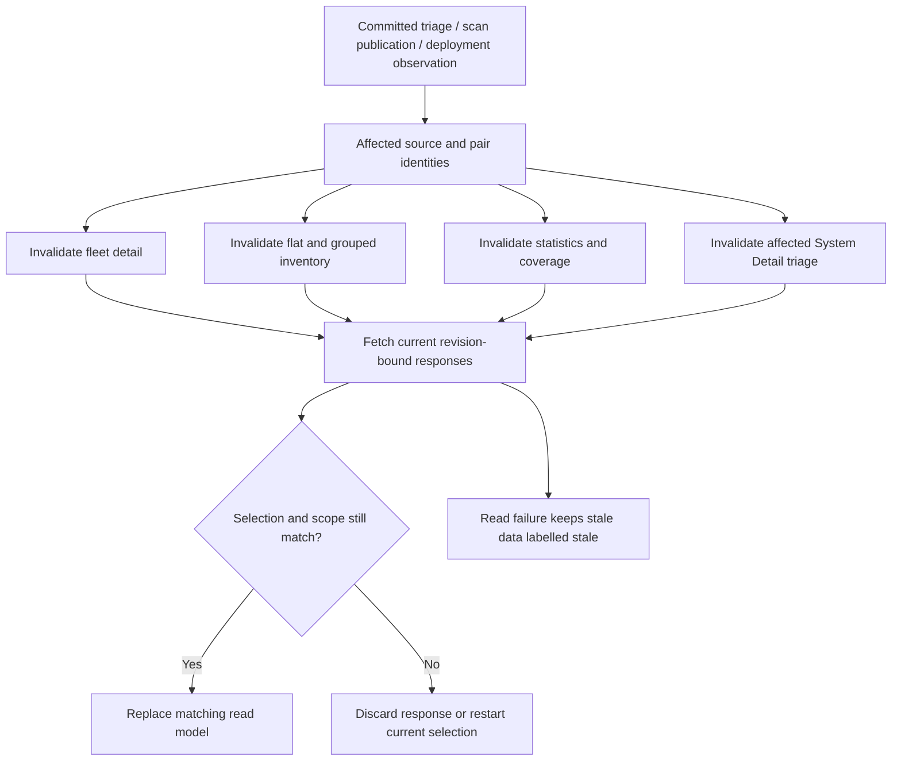

The invalidation mechanism can use explicit local mutation events, a server event stream, or bounded polling. The required property is that all affected read models become stale together and refresh without unbounded duplicate requests. The transport is a separate implementation choice.

### 21.6 Recovery and audit guarantees

A request outcome must distinguish rejected, committed, and unknown. Do not claim rollback after a transport failure. Preserve the submitted request snapshot and reconcile with canonical state. For optimistic concurrency, use a defined decision or request revision rather than relying only on a page-level load counter.

Do not mutate sealed scan evidence or link baselines during recovery. Do not turn a missing authority row into a clean finding set. Retain the independent close behavior in which a rejected verification attempt is committed and returned with its new revision.

### 21.7 What can remain unchanged

The canonical CVE/package key, server-derived host set, scope-before-aggregation rule, typed assignees, append-only decisions, complete action-set validation, late-drawer-response guard, and separation of full inventory from mutation response are useful existing boundaries. Preserve them unless a reviewed design explicitly replaces them. [C07], [C09], [C10], [C12], [C15], [C25]

---

## 22. End-to-end workflow examples

### 22.1 A mixed inventory row

Host A runs an affected Current target. Host B runs an affected Current target and has a different affected scheduled target. Host C has only affected scheduled evidence. Host D has Historical compatibility inventory and neither exact authority.

The row reports three active affected hosts, two Current hosts, two scheduled-target hosts, and one Historical host. The drawer shows five role rows. The fleet editor derives actions only from environments containing A or B as Current exact subjects. It must not silently include C or D in a patch-scheduling mutation. [C09], [C24]

### 22.2 Acceptance followed by returning to the list

The operator accepts risk in one environment. The server commits the disposition. The drawer refetches and shows acceptance. Under the current UI, the parent row and cards can retain their previous values. Under the proposed invalidation contract, all affected resources refresh or show an explicit stale state. [C06], [C15]

Acceptance does not remove the occurrence. The host remains affected in inventory until a later selected scan says otherwise. It also does not authorize a verification PASS.

### 22.3 A host override inside an environment schedule

Two hosts share an environment. One has a direct accepted override. The environment schedules remediation for the other host. The server must not attach the overridden host to the environment's POA&M. The fleet drawer must explain why the environment count and owned remediation count differ. [C12], [C15]

Removing the direct override restores environment inheritance. Under the
continuity contract, bounded server reconciliation must add a newly affected
environment-owned host to an active scheduled POA&M. This audit did not test
that repair.

### 22.4 A new affected host appears

An environment schedule was created for hosts A and B. Host C later becomes a
Current exact subject for the same pair. At the audited SHA, equality could
make the schedule incoherent. The continuity contract requires the server to
link C idempotently to the same active episode, unless C has a host override.
Clean or moved-out A/B links remain historical. [C04], [C12], [C15]

A frontend refresh alone cannot create the missing durable ownership. It must not report full scheduled coverage while the server still lacks C's link.

### 22.5 Patch, deploy, scan, verify

The operator links evidence from generation A, updates the flake, deploys
generation B, and obtains a clean B scan. At the audited SHA, verification
returned MISSING for changed lineage. Under the normative contract, B can
establish PASS only if its exact completed schema-1 scan is strictly newer than
the immutable A baseline and its Current authority resolves independently.
[C04], [C17]

This approved workflow needs a database-backed end-to-end test, not only an
editor screenshot. The pinned audit did not run that test.

### 22.6 Rescan with no retained Current proof

An Admin queues a fleet rescan. Scan admission is not itself Current CVE
authority. At the audited SHA, a completed scan could remain read-only because
retained-generation proof was absent. Under the continuity contract, a scan
for the uniquely scoped latest consistent observed derivation supplies CVE
authority even without retained proof; an unmapped or inconsistent observation
does not. [C09], [C20]

A useful UI must state which CVE prerequisite is missing. Repeatedly queueing
the same scan cannot repair an ambiguous or inconsistent running observation.

### 22.7 Lost mutation response

The service commits a schedule, but the browser cannot decode the response. A “not applied” message is unsafe. The client should show an unknown outcome, fetch the canonical decision and POA&M state, and then report whether the intended state is present. It must not immediately submit a fresh request with guessed ownership. [C06], [C15]

### 22.8 Close and later recurrence

Successful close retains immutable baseline and verification records while retiring active links and scheduled decisions. Later recurrence is a new current finding condition. It must not rewrite the closed evidence or silently turn the old completed POA&M back into an active one. Reopen remains an explicit operation with its own subject and ownership checks. [C26]

---

## 23. Test coverage and regression matrix

### 23.1 What existing test source establishes

The review found substantial tests for exact identity, environment scope, host precedence, semantic POA&M reuse, role revocation, verification, export bounds, and Current/scheduled/Historical overlap. Some test bodies were read in full; others were located by name and surrounding source. None was executed during this review. [C23], [C24], [C25], [C33]

| Test family | Evidence inspected | What it does not prove alone |
|---|---|---|
| `fleet_cve_inventory_separates_current_scheduled_and_historical_scope` | Complete relevant body, including overlap and negative scheduled-only mutations. | Browser invalidation, live deployment lineage, and real query cost. |
| Fleet triage atomicity and semantic reuse | Service source and named database workflow coverage. | Exactly-once network semantics or automatic future-host reconciliation. |
| Host/environment precedence and fully overridden scheduling | Schema/service paths and named database tests. | That fleet list rollups show effective host decisions. |
| Exact subject-set coherence | SQL functions, service predicates, and named test. | Latest-state agreement across every raw-view consumer. |
| Export pagination and overflow | Handler/query code and identified database tests. | Spreadsheet formula handling or a complete evidence report. |
| `16-cves` browser workflow | Relevant route fixtures and assertions for roles, triage, drawer states, stale responses, reuse, and navigation. | SQL predicates or transaction isolation, because central responses are stubbed. |
| Browser visual assertions | Source checks authority placement, nested context, viewport bounds, focus, and screenshot capture. | That those assertions passed at the audited head or that every reference state has visual parity. |
| Local unit tests | Validation, request construction, typed metadata reuse, and stale-selection helpers. | Real database semantics or end-to-end state refresh. |

### 23.2 Fixture and harness limitations

One Viewer browser fixture reports one total pair while reporting one outstanding, one accepted, and one scheduled pair. Those mutually exclusive pair-state counts cannot all describe the same one-row collection. The fixture exercises presentation and permissions, but cannot establish count reconciliation. [C25]

The browser mutation scenario correctly asserts a full GET after POST and rejects blindly retaining the narrower POST host scope. It does not assert that parent statistics or list/group resources are invalidated after that mutation. This gap matches the production callback structure. [C06], [C25]

Some handler tests use an optional database pool and return early when their database is unavailable. A passing ordinary test command can therefore lack executed database assertions. Query tests that build an older helper SQL string are not proof of every predicate in the newer production inventory CTE. Test reports must distinguish executed cases, skipped cases, and source-only checks. [C08], [C09]

### 23.3 Required regression scenarios

The rows below are a proposed verification matrix. “Protect existing” means preserve a source-established contract. “Repair” means the current audit found a gap. “Decision” means the expected behavior depends on approval of a proposed contract.

| ID | Scenario | Required assertion | Class |
|---|---|---|---|
| CVT01 | One CVE affects two packages. | Two pair rows, one distinct advisory, exact package preserved in drawer route. | Protect existing / count clarity |
| CVT02 | One pair affects Current and scheduled targets on the same host. | Two role rows, one active affected host. | Protect existing |
| CVT03 | Current 2, scheduled 2 with overlap 1, Historical 1. | Active 3; five role rows; four distinct inventory hosts. | Protect existing |
| CVT04 | Current exact scan is clean; old compatibility findings exist. | No compatibility fallback for that host. | Protect existing |
| CVT05 | Scheduled exact scan is clean; Current authority absent. | Historical fallback remains suppressed under the current rule. | Protect existing / decision |
| CVT06 | Newest state has invalid generation/store agreement; older state is valid. | Inventory, coherence, detail, and mutations reject old Current authority. | Repair |
| CVT07 | Latest state has empty store path. | Rescan admission follows the approved latest-state rule rather than quietly selecting an older path. | Repair / decision |
| CVT08 | Newest pending deployment is unbound; older pending deployment is exact. | Do not substitute older scheduled authority. | Protect existing |
| CVT09 | Scheduled request expires or fails. | It leaves scheduled inventory; no mutation authority remains from that request. | Protect existing |
| CVT10 | Same configuration name occurs in two flakes. | No compatibility evidence crosses the registered flake boundary. | Repair |
| CVT11 | Hostname differs from `system_configuration_name`. | Correct source association and no false no-scan state. | Repair |
| CVT12 | A newer scan attempt fails. | Keep the previous completed source for the same target, with separate attempt status. | Protect existing |
| CVT13 | Scan is old but otherwise exact. | Show source age; apply only an explicitly approved freshness policy. | Decision |
| CVT14 | Advisory has Unknown severity. | Preserve the row and explicit Unknown count; no false zero total. | Repair |
| CVT15 | Many Current hosts run different package versions. | Do not label lexical maximum as the fleet's uniform installed version. | Repair |
| CVT16 | Fixed-version metadata exists, but no built fixed flake target exists. | Do not promise deployment readiness. | Repair |
| CVT17 | Typed remote result contains a fixed version. | Verify intended persistence or explicit unsupported-field handling. | Repair / producer contract |
| CVT18 | Grouped mode is active. | Do not issue an unused full flat inventory request under the proposed resource contract. | Repair |
| CVT19 | More than 500 flat rows match. | Honest total and bounded continuation, not a silent complete-looking list. | Repair |
| CVT20 | More than 100 packages match. | Package/group continuation or explicit truncation. | Repair |
| CVT21 | One package has more than 100 CVE pairs. | Complete group total and reachable nested continuation. | Repair |
| CVT22 | Grouped sort changes to age or affected systems. | Defined group/nested order changes and deterministic ties. | Repair |
| CVT23 | Filters change rapidly. | Bounded requests; late results cannot replace the new selection. | Repair / protect existing |
| CVT24 | Group query receives a scan publication between its reads. | Aggregate totals and nested membership refer to one response snapshot. | Repair |
| CVT25 | Drawer receives an environment change between its reads. | Scope, counts, host rows, and decisions remain coherent. | Repair |
| CVT26 | Browse filtered state A, another state B, then Back/Forward. | URL, controls, mode, requests, and exact drawer pair restore together. | Repair |
| CVT27 | Open Historical or scheduled host row. | Destination preserves exact target and advisory/package or reports unavailable. | Repair |
| CVT28 | Drawer request A finishes after request B. | B remains selected and visible. | Protect existing |
| CVT29 | Viewer opens a direct fleet link. | Read allowed only within scope; mutation controls absent; server rejects writes. | Protect existing |
| CVT30 | Operator opens fleet page. | Triage allowed within scope; Admin-only fleet rescan absent and rejected server-side. | Protect existing |
| CVT31 | Hidden environment contains unique CVE/package names. | Lists, groups, stats, package choices, drawer, and export reveal none of them. | Protect existing |
| CVT32 | Membership or role is revoked while triage waits on locks. | Fresh actor check prevents mutation. | Protect existing |
| CVT33 | Request omits, duplicates, or adds an environment. | Same typed scope conflict; no partial writes or hidden-scope disclosure. | Protect existing |
| CVT34 | Acceptance rationale is blank, too short, too long, or multi-byte. | Enforce documented byte limit consistently before POST and on server. | Protect existing |
| CVT35 | Scheduled rows share reusable typed POA&M metadata. | Preserve exact owner/date/risk/title/plan and reuse one POA&M. | Protect existing |
| CVT36 | Scheduled rows omit metadata or name incompatible POA&Ms. | Non-destructive conflict; no guessed replacement ownership. | Protect existing |
| CVT37 | Host override differs from environment default. | Effective host decision and fleet default are both explicit and reconcilable. | Repair |
| CVT38 | Every Current host in an environment has a direct override. | No misleading schedulable environment-owned count; server guard remains. | Repair |
| CVT39 | Environment scheduling races with a host override. | No ownership theft or duplicate active finding claim. | Protect existing |
| CVT40 | Triage successfully changes a decision. | Drawer, flat rows, grouped rows, filters, and summary cards refresh together. | Repair |
| CVT41 | POST commits but response is lost or malformed. | Unknown outcome, canonical readback, no false “not applied” message. | Repair |
| CVT42 | Conflict refresh is slow or fails. | No premature “refresh completed”; stale draft cannot authorize a write. | Repair |
| CVT43 | Statistics or package-choice request fails. | Local error/retry; no fake zero, no lost selected filter. | Repair |
| CVT44 | Remove final scheduled environment subject. | Respect POA&M lifecycle guard; do not overgeneralize host-only exception. | Protect existing |
| CVT45 | New host joins an accepted/scheduled environment. | Accepted decision applies unless overridden; scheduled subject is linked idempotently by server repair. | Normative; unverified here |
| CVT46 | Link on A, deploy affected B, deploy clean C, then verify. | Same finding/POA&M and immutable A baseline; only strictly newer clean exact Current scan can PASS. | Normative; unverified here |
| CVT47 | Same store path, different retained generation. | Baseline stays immutable; exact Current CVE proof, not retained-ID equality, controls verification. | Normative; unverified here |
| CVT48 | New scan contains whitelist or ordinary justification. | WHITELISTED/JUSTIFIED are not PASS. | Protect existing |
| CVT49 | Verification uses baseline scan or an older scan. | Cannot pass as newer remediation evidence. | Protect existing |
| CVT50 | Close fails evidence preconditions. | Rejected attempt persists; 412 returns committed revision; UI adopts it. | Protect existing |
| CVT51 | Close succeeds, then the pair recurs. | Closed evidence remains immutable; no automatic reopen. | Protect existing / episode decision |
| CVT52 | Reopen with changed environment membership or another owner. | Typed conflict; no partial restoration or baseline rewrite. | Protect existing |
| CVT53 | Export filters differ from current first-page length. | Export uses full filtered scope within bound; over 1,000 returns explicit 422. | Protect existing |
| CVT54 | CSV contains quotes, newlines, formula prefixes, and timezone-sensitive dates. | Structural escaping and approved formula/time/provenance policy. | Repair / decision |
| CVT55 | Narrow/light/dark grouped, flat, drawer, and nested editor. | Section parity, no clipping, focus containment/restoration, keyboard row actions. | Unverified visual / repair |
| CVT56 | Counter fixtures and real database rows represent the same fleet. | Pair partitions, role overlap, effective decisions, and parent refresh reconcile end to end. | Repair |

### 23.4 Verification execution requirements

Use the repository's Nix development environment and a verified isolated test database. Never seed, reset, migrate, or prepare SQLx metadata against the user's persistent development instance merely because its address is local.

Run focused UI unit tests, affected database workflows, and browser checks for the accepted change scope. Preserve real command exit status and skipped-test counts. A static string assertion or mocked screenshot workflow cannot replace an end-to-end test of deployment, scan publication, triage, and verification.

For this document, only source inspection and artifact checks are performed. The matrix is not a report of completed tests.

---

## 24. Change boundaries and compatibility

### 24.1 Changes that can be specified independently

Parent invalidation, clearer count labels, role-preserving navigation, local error states, input validation, grouped sort semantics, and honest truncation can be designed without approving verification across deployments. They still require tests because they change observable behavior.

Current-subject resolver consolidation affects security and coherence. It requires database fixtures for latest invalid observations, environment movement, clean scans, same-name flakes, and host overrides. It must not reintroduce a fallback by selecting an older valid state.

### 24.2 Approved domain changes still requiring verification

The normative continuity design approves optional retained provenance, dynamic
environment membership, and verification across revisions. TASK-326.2.2 must
implement these with an additive migration, server-owned reconciliation, and
isolated tests. A UI-only task must not emulate them with local state or direct
SQL backfills.

Do not edit an applied migration to change the raw occurrence view. Add a forward migration if the approved repair changes that view or its dependent functions. Preserve immutable baseline records and clearly identify any compatibility projection that still uses older semantics.

### 24.3 Rolling compatibility

New DTO fields must distinguish “absent on an older server” from “known zero.” Typed authority and provenance fields need safe defaults that do not promote legacy inventory. Old clients must not receive Current mutation authority because they ignore a new field.

A compatibility-normalization helper can preserve old shapes, but it cannot infer a real scan ID, a current retained generation, or an exact host override from aggregate counts. Keep new source-aware routes or explicit response versions where additive fields cannot express the distinction safely. [PROPOSED]

### 24.4 Deployment verification

For a future implementation, record the exact application SHA, applied migrations, and the source IDs behind a representative Current, scheduled, and Historical row. Verify counts and navigation against those records. Do not infer the deployed revision from a browser tab title or from a passing pipeline on another SHA.

---

## 25. Decision register

These questions were recorded at the audit date. D05-D07 were resolved for the
CVE domain by the normative continuity design; other questions remain separate.

| ID | Decision | Recommended direction for discussion | Consequence |
|---|---|---|---|
| D01 | What does the default fleet status summarize? | Expose environment default and effective host disposition separately; use effective coverage for a fleet-wide claim. | Affects list filters, cards, drawer counts, and host overrides. |
| D02 | What should “CVEs” count? | Show unique advisories and advisory/package pairs as named separate units. | Avoids comparing scanner occurrences with deduplicated fleet rows. |
| D03 | What is the affected-host bar denominator? | Use a named, server-supplied visible fleet denominator or remove the implied fleet percentage. | Makes grouped and flat modes comparable. |
| D04 | What does Historical mean on the fleet page? | Rename the current compatibility fallback or add a separate exact history collection. | Prevents users from treating a fallback as a complete archive. |
| D05 | Can Current evidence be displayed without retained proof? | Resolved for CVEs: exact observed Current with a completed schema-1 scan is actionable without retained proof. | Config/rollback authority remains separate. |
| D06 | Can verification use a later valid deployment? | Resolved: later exact Current scan can PASS across revisions if strictly newer and clean. | Preserve immutable baseline and sealed verification history. |
| D07 | Do environment schedules cover new hosts automatically? | Resolved: bounded server-owned reconciliation adds current affected non-overridden subjects. | Requires durable ownership updates, periodic repair, and concurrency tests. |
| D08 | When does acceptance need reconsideration? | Define review-date, severity, exploitation, and scope-change rules explicitly. | A stored accepted decision alone does not define policy expiry. |
| D09 | What makes an evidence source fresh and complete? | Separate source selection, completeness, and a policy-defined freshness state. | Controls clean claims, warnings, and possibly verification eligibility. |
| D10 | How should fleet reads refresh? | One invalidation model with bounded requests; choose polling/events after defining the contract. | Avoids adding independent timers to each component. |
| D11 | How are rich advisory fields populated? | Identify the production writer, source, update time, and failure state for each field. | Prevents fixture-only metadata and unsupported patch-readiness claims. |
| D12 | Which reference interactions should be restored? | Review maximize, presets, expansion mode, and safe edit/revoke shortcuts with rendered examples. | Keeps useful design parity without copying mock domain behavior. |
| D13 | What must an export guarantee? | Separate inventory CSV from immutable remediation evidence reports; define timezone and formula safety. | Determines fields, bounds, and downstream spreadsheet handling. |

---

## 26. Source index and verification record

### 26.1 Source coverage

Repository links below are pinned to `58006084aa699b84bcb1d02d6f911d4d4ee94ea3`, except the explicitly live MR metadata link. Source ranges refer to that revision. Search results and comments helped locate code, but behavior claims rely on the retrieved implementation where available.

| Ref | Source / responsibility | Inspection coverage |
|---|---|---|
| C01 | MR !329 and head pipeline. | Metadata read at start and after source investigation. No job failure diagnosis. |
| C02 | Fleet CVE triage specification. | Full document. |
| C03 | Backend API specification. | Relevant fleet, inventory, POA&M, and error contract sections; current fleet section around 1035–1170. |
| C04 | CVE/POA&M evidence continuity proposal. | Full document. Status preserved as proposed. |
| C05 | `CvesView.jsx` visual reference. | Full component file. No rendered visual comparison. |
| C06 | Production fleet CVEs view. | Full file, including resource graph, route state, drawers, editor, and tests. |
| C07 | Shared triage component and draft. | Full file, including typed reuse, host/environment scope, validation, and tests. |
| C08 | Fleet CVE HTTP handlers. | Full file, including auth, export, rescan, legacy justification, and test setup. |
| C09 | Fleet and System CVE query module. | Full file read for fleet CTE, groups, counts, bounds, host projection, and related tests. |
| C10 | Migration 0259. | Lines 1–290: original evidence seal, observation identity, stable findings, dispositions, raw occurrence view. Later trigger changes not inferred from this migration alone. |
| C11 | Migration 0177. | Full legacy view from the companion inspection; reused source dependency, not a new performance test. |
| C12 | Migration 0270. | Full file: host overrides, environment coherence, and narrow detached-host exception. |
| C13 | Fleet subject and detail service. | Contiguous relevant ranges around 3280–3433 and 3650–4110. |
| C14 | Migration 0272. | Full active scheduled-target and occurrence view definitions. |
| C15 | Fleet triage transaction. | Lines 5107–5767. |
| C16 | Scan result persistence and owned completion. | Publication path from the companion review; owned completion at lines 1645–1709 rechecked at this pinned head. |
| C17 | Exact CVE verification. | Lines 6666–6885, including baseline-lineage checks and result classification. |
| C18 | UI POA&M API client. | Lines 1790–1900: catalog, fleet detail, fleet triage, and system triage calls. |
| C19 | Typed scan-result conversion. | Lines 1415–1495; related fixed-version validation located by search. |
| C20 | Fleet rescan target and atomic enqueue. | Lines 2180–2365. |
| C21 | Vulnix parser and counter definitions. | Full source from the companion review; reused count semantics. |
| C22 | Finding materialization and fleet POA&M creation/reuse. | Lines 4138–4350 and relevant transaction call sites. |
| C23 | Host override and coherence database workflows. | Named tests located in `poam_workflows.rs`; not every test body independently read. |
| C24 | Fleet inventory role overlap workflow. | Complete relevant body around 3580–3880. Export workflows located separately. |
| C25 | Fleet browser workflow. | Relevant fixture and assertion ranges around 12695–13435, plus scenario discovery. Stubbed responses explicitly identified. |
| C26 | Close and reopen lifecycle. | Lines 8030–8160 and 8275–8500. |
| C27 | TASK-326.2 requirements and reported evidence. | Full task file. Agent test summaries not accepted as execution proof. |
| C28 | Commit `58006084`. | Head identity and its System Detail-only default-selector context from the companion review. |
| C29 | Frontend view specification. | CVE route/index searches; not claimed as a full current fleet spec. |
| C30 | Advisory metadata producer search. | Exact-term searches in server source plus result-conversion and publication inspection; complete external enrichment remains unverified. |
| C31 | Fleet mutation retry wrapper. | Lines 4511–4572. |
| C32 | Fleet POA&M HTTP handlers. | Lines 480–580, route actor and mutation boundaries. |
| C33 | Database workflow inventory. | Named relevant tests for identity, scope, ownership, export, concurrency, and verification. Not executed. |

### 26.2 Verification status

| Activity | Result |
|---|---|
| Pinned source, specification, query, and selected test inspection | Performed through GitLab reads. |
| Head recheck | Same audited SHA; visible head pipeline failed. Cause not investigated. |
| Repository or database mutation | None. |
| Live fleet browser interaction or screenshot inspection | Not performed. No fleet screenshots included as evidence. |
| Rust, SQLx, migration, database, NixOS VM, or browser test execution | Not performed. |
| Fleet query plans, measured request cost, production cardinality | Not measured. |
| Production metadata-enrichment feed | Not established. |
| Markdown and bundle structural checks | Recorded in the accompanying `verification.md`. |
| Mermaid compilation or rendered layout validation | Recorded separately; editable source is not represented as browser evidence. |

### 26.3 Scope of certainty

The document identifies source-level behavior, contradictions, and omissions. It does not claim that every potential race, identity collision, or slow query has occurred in production. Conversely, the absence of a captured runtime failure does not make a source-level mismatch an intended guarantee.

The next design iteration can resolve the decision register without losing the as-built record. Any approved contract change should update the owning domain specification, related source documentation, and regression expectations together.


[C01]: https://gitlab.com/crystal-forge/crystal-forge/-/merge_requests/329 "MR !329; live metadata, checked on 2026-09-23"
[C02]: https://gitlab.com/crystal-forge/crystal-forge/-/blob/58006084aa699b84bcb1d02d6f911d4d4ee94ea3/docs/fleet-cve-triage.md "Fleet CVE triage specification"
[C03]: https://gitlab.com/crystal-forge/crystal-forge/-/blob/58006084aa699b84bcb1d02d6f911d4d4ee94ea3/docs/specs/02-backend-api.md#L901-1170 "Fleet inventory and exact-CVE POAM contracts"
[C04]: https://gitlab.com/crystal-forge/crystal-forge/-/blob/58006084aa699b84bcb1d02d6f911d4d4ee94ea3/docs/design/CrystalForge/cve-poam-evidence-continuity-design-spec.md "Proposed evidence continuity across deployments"
[C05]: https://gitlab.com/crystal-forge/crystal-forge/-/blob/58006084aa699b84bcb1d02d6f911d4d4ee94ea3/docs/design/CrystalForge/components/CvesView.jsx "Fleet CVEs visual reference"
[C06]: https://gitlab.com/crystal-forge/crystal-forge/-/blob/58006084aa699b84bcb1d02d6f911d4d4ee94ea3/packages/web-ui/src/views/cves.rs "Production fleet page, drawer, editor and tests"
[C07]: https://gitlab.com/crystal-forge/crystal-forge/-/blob/58006084aa699b84bcb1d02d6f911d4d4ee94ea3/packages/web-ui/src/components/cve/triage.rs "Shared triage state and host override editor"
[C08]: https://gitlab.com/crystal-forge/crystal-forge/-/blob/58006084aa699b84bcb1d02d6f911d4d4ee94ea3/packages/default/crates/cf-server/src/handlers/api/cves.rs "Fleet CVE handlers, export and rescan"
[C09]: https://gitlab.com/crystal-forge/crystal-forge/-/blob/58006084aa699b84bcb1d02d6f911d4d4ee94ea3/packages/default/crates/cf-server/src/queries/cves.rs "Fleet inventory CTE, list, groups, counts and bounds"
[C10]: https://gitlab.com/crystal-forge/crystal-forge/-/blob/58006084aa699b84bcb1d02d6f911d4d4ee94ea3/packages/default/crates/cf-server/migrations/0259_exact_cve_poam_findings.sql#L1-290 "Original exact evidence and raw occurrence view"
[C11]: https://gitlab.com/crystal-forge/crystal-forge/-/blob/58006084aa699b84bcb1d02d6f911d4d4ee94ea3/packages/default/crates/cf-server/migrations/0177_optimize_cve_scan_read_path.sql "Latest compatibility inventory projection"
[C12]: https://gitlab.com/crystal-forge/crystal-forge/-/blob/58006084aa699b84bcb1d02d6f911d4d4ee94ea3/packages/default/crates/cf-server/migrations/0270_cve_system_dispositions.sql "Host overrides and scheduled coherence"
[C13]: https://gitlab.com/crystal-forge/crystal-forge/-/blob/58006084aa699b84bcb1d02d6f911d4d4ee94ea3/packages/default/crates/cf-server/src/services/poam.rs#L3280-4110 "Current exact subjects and fleet detail assembly"
[C14]: https://gitlab.com/crystal-forge/crystal-forge/-/blob/58006084aa699b84bcb1d02d6f911d4d4ee94ea3/packages/default/crates/cf-server/migrations/0272_active_scheduled_cve_inventory.sql "Active scheduled deployment evidence"
[C15]: https://gitlab.com/crystal-forge/crystal-forge/-/blob/58006084aa699b84bcb1d02d6f911d4d4ee94ea3/packages/default/crates/cf-server/src/services/poam.rs#L5107-5767 "Fleet triage transaction"
[C16]: https://gitlab.com/crystal-forge/crystal-forge/-/blob/58006084aa699b84bcb1d02d6f911d4d4ee94ea3/packages/default/crates/cf-server/src/queries/cve_scans.rs#L1450-1718 "Result publication and owned evidence seal"
[C17]: https://gitlab.com/crystal-forge/crystal-forge/-/blob/58006084aa699b84bcb1d02d6f911d4d4ee94ea3/packages/default/crates/cf-server/src/services/poam.rs#L6666-6885 "Exact-CVE verification and baseline lineage"
[C18]: https://gitlab.com/crystal-forge/crystal-forge/-/blob/58006084aa699b84bcb1d02d6f911d4d4ee94ea3/packages/web-ui/src/views/poam_api.rs#L1790-1900 "Typed fleet and System Detail API calls"
[C19]: https://gitlab.com/crystal-forge/crystal-forge/-/blob/58006084aa699b84bcb1d02d6f911d4d4ee94ea3/packages/default/crates/cf-server/src/queries/cve_scan_leases.rs#L1415-1495 "Typed result conversion to Vulnix entries"
[C20]: https://gitlab.com/crystal-forge/crystal-forge/-/blob/58006084aa699b84bcb1d02d6f911d4d4ee94ea3/packages/default/crates/cf-server/src/queries/cve_scans.rs#L2180-2365 "Fleet target resolver and atomic enqueue"
[C21]: https://gitlab.com/crystal-forge/crystal-forge/-/blob/58006084aa699b84bcb1d02d6f911d4d4ee94ea3/packages/default/crates/cf-server/src/vulnix/vulnix_parser.rs "Scanner occurrence counter definitions"
[C22]: https://gitlab.com/crystal-forge/crystal-forge/-/blob/58006084aa699b84bcb1d02d6f911d4d4ee94ea3/packages/default/crates/cf-server/src/services/poam.rs#L4138-4350 "Baseline materialization and POAM creation"
[C23]: https://gitlab.com/crystal-forge/crystal-forge/-/blob/58006084aa699b84bcb1d02d6f911d4d4ee94ea3/packages/default/crates/cf-server/tests/poam_workflows.rs#L1941-3355 "Host override and coherence workflow test locations"
[C24]: https://gitlab.com/crystal-forge/crystal-forge/-/blob/58006084aa699b84bcb1d02d6f911d4d4ee94ea3/packages/default/crates/cf-server/tests/poam_workflows.rs#L3580-3880 "Current, scheduled and Historical overlap regression"
[C25]: https://gitlab.com/crystal-forge/crystal-forge/-/blob/58006084aa699b84bcb1d02d6f911d4d4ee94ea3/checks/web-ui/tests/integration-test.js#L12695-13435 "Fleet browser fixtures and behavior assertions"
[C26]: https://gitlab.com/crystal-forge/crystal-forge/-/blob/58006084aa699b84bcb1d02d6f911d4d4ee94ea3/packages/default/crates/cf-server/src/services/poam.rs#L8030-8500 "Close and reopen workflow ranges"
[C27]: https://gitlab.com/crystal-forge/crystal-forge/-/blob/58006084aa699b84bcb1d02d6f911d4d4ee94ea3/backlog/tasks/task-326.2%20-%20Bring-Scanning-queue-and-scan-log-interactions-to-updated-design-parity.md "Task acceptance criteria and historical reported verification"
[C28]: https://gitlab.com/crystal-forge/crystal-forge/-/commit/58006084aa699b84bcb1d02d6f911d4d4ee94ea3 "Audited source commit"
[C29]: https://gitlab.com/crystal-forge/crystal-forge/-/blob/58006084aa699b84bcb1d02d6f911d4d4ee94ea3/docs/specs/01-frontend-views.md "Frontend route and view index"
[C30]: https://gitlab.com/crystal-forge/crystal-forge/-/blob/58006084aa699b84bcb1d02d6f911d4d4ee94ea3/packages/default/crates/cf-server/src/queries/cve_scans.rs "Publication code and bounded producer search context"
[C31]: https://gitlab.com/crystal-forge/crystal-forge/-/blob/58006084aa699b84bcb1d02d6f911d4d4ee94ea3/packages/default/crates/cf-server/src/services/poam.rs#L4511-4572 "Serialization retry wrapper"
[C32]: https://gitlab.com/crystal-forge/crystal-forge/-/blob/58006084aa699b84bcb1d02d6f911d4d4ee94ea3/packages/default/crates/cf-server/src/handlers/api/poam.rs#L480-580 "Fleet POAM HTTP handlers"
[C33]: https://gitlab.com/crystal-forge/crystal-forge/-/blob/58006084aa699b84bcb1d02d6f911d4d4ee94ea3/packages/default/crates/cf-server/tests/poam_workflows.rs "Located database workflow tests; execution not performed"
