# Crystal Forge Systems View
## Architecture, data provenance, and consistency contract

**Document version:** 0.1, review draft  
**Current reviewed head:** `58006084aa699b84bcb1d02d6f911d4d4ee94ea3`  
**Full inspection base:** `72c8066323bcc1ef507c853a89852dfd880e469a`  
**Source branch:** `TASK-326.2-scanning-cve-triage-parity`  
**Merge request:** Crystal Forge !329, target `dev`  
**Review date:** 2026-09-23  
**Suggested repository location:** `docs/systems-view-architecture.md`  
**Repository status:** This document has not been committed. No application code, database, task, or MR state was changed.

---

## 1. Purpose and status

This document describes the Systems list, its preview panel, and all eight System Detail tabs. It also defines the consistency boundaries with Scanning, fleet CVEs, Config evidence, and POA&M. The main problem is that several screens describe a system's current security state through different identity checks and different counting methods.

The document has two purposes. First, it records the implementation at the pinned source revision. Second, it proposes an explicit contract for behavior that is missing, inconsistent, or not yet decided. A statement about existing code does not make that behavior a product requirement.

### 1.1 Evidence labels

| Label | Meaning |
|---|---|
| **AS-BUILT** | Verified by reading source at the pinned revision. This is not a claim that the path was executed in this review. |
| **EXISTING SPEC** | Stated by an existing repository specification. Conflicts with current code are identified. |
| **USER REQUIREMENT** | Behavior requested in this conversation. |
| **PROPOSED** | A recommended contract for review. It is not implemented or approved by this document. |
| **UNVERIFIED** | Requires live data, a running browser, test execution, or additional inspection. |

“Must” in a **PROPOSED** section specifies the proposed contract. It does not describe an existing guarantee.

### 1.2 Review boundary

The review used GitLab reads at the full inspection base, repository document and source searches, selected source ranges, full reads of relevant smaller files, and the two user-provided screenshots. The System Detail source at the inspection base was also read in the preceding inspection. The MR advanced by one direct child commit during this review. Its complete two-file diff and relevant final browser fixture ranges were inspected and incorporated. Unchanged source is now linked at the current reviewed head. The review followed the central frontend state, inventory queries, summary views, scan counter producer, and retained-generation producer. [S01], [S07], [S08], [S09], [S11], [S13], [S14], [S15], [S16], [S17], [S18], [S19], [S21], [S22]

No application tests, NixOS VM checks, SQL queries, migrations, browser interaction tests, or query plans were executed. The screenshots do not identify the deployed application SHA or database migration version. Source findings and screenshot observations are therefore separate evidence classes.

This is a Systems architecture and consistency review, not an approval review of every change in MR !329. In particular, all POA&M mutation internals, all agent ingestion paths, and all deployment worker paths were not independently audited end to end.

### 1.3 Readers and concerns

Maintainers need stable identity rules, source ownership, and clear change boundaries. Operators need to know what is running, which target a result describes, and whether a result permits an action. Frontend developers need explicit loading and invalidation rules. Backend developers need coherent query and transaction contracts. Test authors need fixtures that expose differences between deployment identity, evidence availability, and remediation authority.

### 1.4 Head movement incorporated into this draft

The initial inspection used `72c80663`. Before delivery, MR !329 advanced to its direct child `58006084`, titled `TASK-326.2: Default revision scope from candidates`. The commit changes only `packages/web-ui/src/views/system_detail.rs` and `checks/web-ui/tests/integration-test.js`. The complete diff was inspected; no changed file was omitted. [S30]

The new head adds a shared candidate-based default helper, per-tab explicit-choice state, candidate-response system IDs, fallback messages, and a Hardening head-unavailable Check now guard. It does **not** change the Scanning summary renderer, backend summary queries, count units, strict Current CVE authority, or retention producer. The screenshot-related consistency findings therefore still apply to the reviewed source. Section 10 records the exact new selection behavior and its remaining limitations. [S08], [S15], [S17], [S30]

At the last metadata read, pipeline `2875331762` for `58006084` was running. The earlier failed pipeline belonged to `72c80663`. Neither result establishes that the new browser case passed. The new fixture itself has an exact-target inconsistency, documented in Section 19. [S30], [S31]

### 1.5 Reading map

| Topic | Sections |
|---|---|
| Existing specs and actual screen model | [2–4](#2-existing-specifications-present-but-fragmented) |
| Exact sources, identity, retention, and screenshot diagnosis | [5–9](#5-as-built-source-map) |
| Default selection and proposed shared contract | [10–11](#10-revision-defaults-and-explicit-selection) |
| Each screen and design comparison | [12–13](#12-per-screen-behavior-and-gaps) |
| Concurrency, permissions, errors, and performance | [14–17](#14-refresh-and-concurrency) |
| Gap register, tests, rollout, and unresolved decisions | [18–23](#18-consolidated-gap-register) |

---

## 2. Existing specifications: present, but fragmented

**Finding:** Systems specifications already exist. A new document must consolidate them, not claim that the feature has never been specified. The inspected documents do not provide one complete, current contract for the eight-tab page and its cross-screen security data. [S02], [S03], [S04], [S05], [S06]

### 2.1 Specification inventory

| Existing source | Useful coverage | Limitation at this baseline |
|---|---|---|
| `docs/specs/01-frontend-views.md` | Systems cards/table, filters, dialogs, and an initial detail-page outline. | Its detail outline has four tabs: Overview, Deploy, History, and Logs. It does not specify the current Config, CVEs, Hardening, and Compliance workflows. Some routes and assumptions predate the current implementation. |
| `backlog/docs/specs/doc-17 - Spec-Systems-view-live-deployment-progress-real-recent-activity-working-rollback.md` | Deployment progress, heartbeat delivery, real recent activity, rollback, and targeted verification. | It is a feature-specific document. Some paths and presentation details are older. It does not define the current evidence and count contract. |
| `docs/evaluation-flake-snapshots.md` | Immutable evaluation artifacts, deployment-bound retained generations, Config reads, inspection, and evidence integrity. | Its older CVE inventory text allows a legacy fallback that current Current-inventory code no longer uses. |
| `docs/specs/02-backend-api.md`, CVE scan and fleet triage sections | Current and historical inventory selectors, pagination, explicit current-authority states, diagnostics, and remediation API rules. | The updated Current rule is useful, but other Systems consumers do not all use it. The document is not a complete frontend state or source map. |
| `docs/fleet-cve-triage.md` | CVE/package identity, system subjects, triage decisions, POA&M, and exact-evidence requirements. | It is a domain specification, not a full Systems page specification. |
| `docs/design/CrystalForge/components/Systems.jsx` | Systems list and preview structure, section order, metadata, and interactions. | It uses mock data and simulated operations. Mock “clean” and deployment assumptions are not trustworthy domain rules. |
| `docs/design/CrystalForge/components/SystemDetail.jsx` | Detail structure, revision bar, Config and CVE presentation, and triage examples. | Its revision logic uses mock array positions. Its host-override example must not be treated as proof that the same backend feature is implemented. |
| `docs/design/CrystalForge/components/HardeningTab.jsx` | Revision bar, summary, filter, table, detail modal, and waiver presentation. | It includes local mock mutations, an example actor, placeholder fields, and an unwired export control. |

Sources: [S02], [S03], [S04], [S05], [S06], [S23], [S24], [S25].

### 2.2 Specification conflicts that need explicit resolution

**Current CVE fallback.** The older snapshot document describes fallback inventory. The updated API specification and current query instead return `current_authority_unavailable` or `no_current_scan`, with no selected source, when Current prerequisites fail. Tests now explicitly require this behavior. A repair must not silently restore the old fallback under the same Current authority label. [S04], [S05], [S15], [S28]

**Real history versus synthesized history.** The deployment-progress specification requires real recent activity. The current detail view can synthesize history from commit data when history entries are empty. The Logs tab also adds explicitly labelled reconstructed entries. These behaviors must not be described as authoritative recorded deployment events. [S03], [S08]

**Design example versus production authority.** The mock revision bar can classify a newer array position as current or ahead. Production authority must use server identity, not array position. The design remains useful for layout and metadata, not for authorization or evidence substitution. [S24], [S15]

**Preview semantics.** The preview currently derives a branch from environment names and displays `flake.latest_commit` under “Currently deployed.” The full detail page uses a separate observational current-commit resolver. These are different definitions of current. [S07], [S08], [S11]

### 2.3 Proposed document ownership

Use this document as the Systems-specific architecture description after review. Keep domain rules in their existing domain specifications. Replace stale summaries with links rather than copying contradictory rules into several documents. Keep visual references authoritative for structure, but document departures required by real loading, permissions, and evidence states. [S26]

---

## 3. Screen and route model

### 3.1 AS-BUILT screen structure

`SystemsView` composes `SystemsListView`. The list supports cards and a table. A selected system can open a preview panel or the full System Detail page. The detail page has the following order:

**Overview → Deploy → History → Logs → Config → CVEs → Hardening → Compliance.** [S07], [S08], [S29]

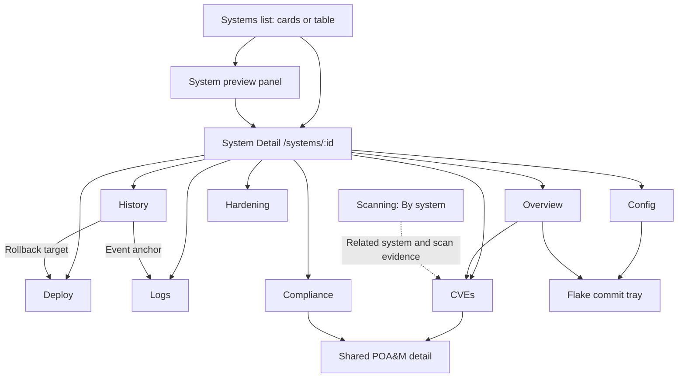

The final dotted edge is a data relationship, not a claim that every exact-target navigation link is implemented.

### 3.2 Navigation state

The detail view reads the tab synchronously to avoid flashing Overview on a deep link. `SystemDetailNavigation` carries the tab, Config revision context, POA&M context, and deployment-generation context. The view updates browser history and listens for `popstate`. [S08]

CVEs and Hardening maintain their own `SystemCveInventorySelection` signals and presentation modes. The visible selection handlers do not serialize these selections into the route in the same way as Config revision selection. A reload therefore does not have a demonstrated exact-target restoration contract for these two tabs. [S08]

**PROPOSED:** Distinguish a navigation target from a default. An explicit link or user selection must take precedence over automatic selection. Unknown or unauthorized target links must remain explicit errors. They must not quietly open Current or flake head.

### 3.3 Screen scope is not one global selected revision

The header describes a system. Config, CVEs, and Hardening can inspect different revisions. Compliance also has bundle/version context. A historical tab selection must not silently rewrite the header's running-generation identity.

**PROPOSED:** Keep the header scoped to running system state. Put selected-target identity and evidence counts inside the relevant tab. Where the selected target differs from running state, show that difference directly. Matching labels must mean matching scope, not merely similar numbers.

---

## 4. Identity model and data ownership

### 4.1 Terms that must remain separate

| Term | Identity and meaning | Invalid substitute |
|---|---|---|
| System | `systems.id`, a UUID. Hostname is display and legacy lookup data. | A hostname string as universal authorization identity. |
| Effective configuration | The registered `system_configuration_name`, or the defined hostname fallback when it is blank. | Another configuration with the same commit. |
| Registered flake | A flake ID and its configured repository/ref. | Any repository that contains the same SHA. |
| Tracked flake head | Position zero of the ready branch-commit snapshot. | Newest commit timestamp, latest scan, latest successful build, or first displayed row. |
| Running state | The selected latest observed state: generation, store path, observation time, and match information. | Desired deployment or largest generation number. |
| Desired deployment | A server deployment request and its target. | Evidence that activation has completed. |
| Commit | Full commit identity within the registered flake context. | A short SHA or a package/store hash. |
| NixOS derivation | Server-owned derivation ID plus its flake, configuration, and build/output identity. | Commit alone. |
| Retained generation | A durable system/generation binding to deployment and immutable evaluation evidence. | A local generation number or matching store string alone. |
| Scan attempt | An exact scan ID and execution lifecycle. | The latest result from any revision. |
| Completed scan evidence | One selected completed scan and its evidence representation. | An empty response, a failed attempt, or a zero-initialized counter. |
| Remediation authority | Server validation that a mutation has the required current evidence and permissions. | A “running now” badge or a completed scan status. |

Sources: [S04], [S05], [S11], [S15], [S18], [S19].

### 4.2 Logical data relationships

The following diagram is a logical model. It does not assert that every edge is a database foreign key.

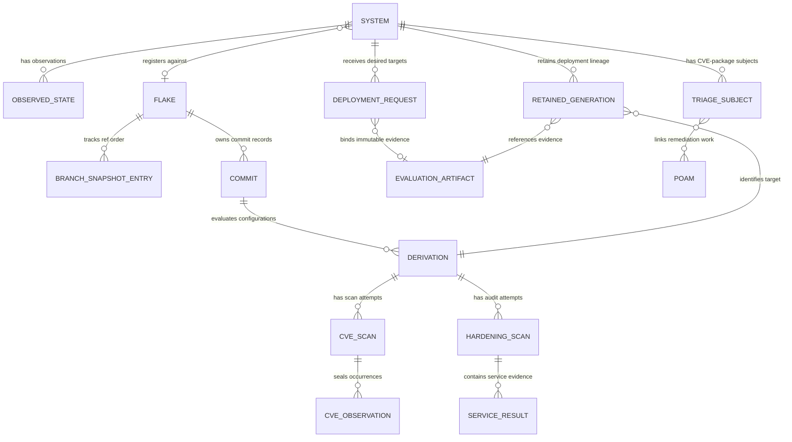

Sources: [S04], [S06], [S15], [S18], [S19], [S22].

### 4.3 Ownership boundaries

**AS-BUILT / EXISTING SPEC:** The server owns visibility, persistence, exact-target validation, job coordination, and remediation decisions. The browser supplies selectors and composes presentation. Builders report through server APIs; they do not own the database. Source comments and API specifications require server revalidation of client-supplied identities. [S05], [S15], [S18], [S26]

**PROPOSED:** Every UI result must identify its scope before the UI presents its conclusion. A result needs a system, target identity, selected scan or artifact, and availability state. A positive conclusion such as “clean,” “current,” or “verified” must have a specific supporting condition.

---

## 5. AS-BUILT source map

### 5.1 Major read paths

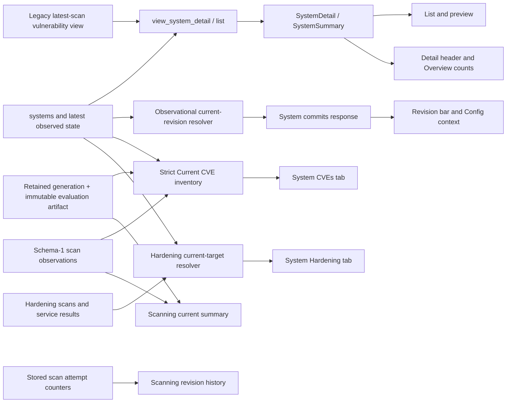

These paths are not a shared page snapshot. Some consumers share tables but apply different prerequisites, units, and refresh schedules. [S07], [S08], [S11], [S13], [S14], [S15], [S16], [S18]

### 5.2 Field and consumer matrix

Endpoint paths below are relative to the API base. Named functions identify the exact read when the endpoint is not needed to explain the contract.

| Consumer | Frontend source | Server or persisted source | Meaning and limitation |
|---|---|---|---|
| Systems list rows | `load_systems_with_fallback` | Systems list API and `view_systems_list` | Registry/observability summaries. Adapter retains `items` and discards pagination metadata. |
| Preview identity and counters | `load_system_detail_with_fallback` | System detail API and `view_system_detail` | Uses legacy summary counts. Preview commit is `flake.latest_commit`. |
| Detail header CVE metric and critical tab badge | `SystemDetail.cve_counts` | `view_system_detail` over `view_system_vulnerabilities` | Distinct CVE IDs per severity, not the selected tab inventory. No source/authority accompanies the count. |
| Detail running commit | `/systems/:id/commits` | `resolve_observational_current_revision` | Observational mapping with several resolution tiers. Not equivalent to Current CVE authority. |
| Commit menu | System commits response | Recent-commit query, bounded to 50 in the handler | Current identity is returned separately. It can be outside the displayed list. |
| Generation menu | System generations adapter | Generation response and retained identities | Displayed generation and retained snapshot identity are separate fields. |
| CVE/Hardening revision candidates | `/systems/:id/cve-inventory-sources` | `fetch_authorized_system_cve_inventory_candidates` | Current, retained-generation, and exact-derivation selectors. CVE source presence is not Hardening availability. |
| System Current CVEs | `/systems/:id/cve-inventory-page` | Strict Current resolver, then schema-1 observations | Requires retained generation and evaluation integrity. Returns a bounded stable-pair inventory. |
| Historical system CVEs | Same route with `target` and `target_id` | Revalidated retained generation or derivation | Same-target evidence only. Always read-only. May use schema 0 or schema 1. |
| Hardening tab | `/systems/:id/hardening-inventory` | Exact-target Hardening query | Current uses realized-store matching. Latest attempt and latest completed evidence are independent. |
| Hardening waivers | `/systems/:id/hardening/justifications` | System/service/directive justification records | Current-system annotations. The UI excludes them from historical evidence. |
| Scanning By-system Current findings | Scanning system summaries | Separate strict `current_exact` query | Has nullable current scan identity, but missing evidence counts are zero-coalesced. |
| Scanning expanded revision row | Scan history response | Stored `cve_scans` counters | Counts affected entries across package derivations. “Deployed” relation has weaker proof than Current CVE authority. |
| Deployment banner | Deployment progress API | Pending/recent deployment state | Requested or progressing work, not a new running state until activation is observed. |
| History and Recent activity | History adapter | Server history response; frontend fallback when empty | Preferred source is recorded history. Synthesized commit fallback is also reachable. |
| Logs | Agent events adapter plus history | Agent event records plus frontend reconstruction | Real and reconstructed lines are combined; reconstruction is labelled. |
| Config | Options, summary, module-source and observation APIs | Selected immutable evidence and observational cache | Uses exact selection and shared snapshot tokens. GET does not authorize new inspection work. |
| Compliance | Bundles, assignments, evidence and POA&M clients | Compliance and remediation domain reads | Bundle/version and system scope differ from a generic selected security revision. |

Sources: [S05], [S07], [S08], [S09], [S10], [S11], [S12], [S13], [S14], [S15], [S16], [S18], [S20].

### 5.3 Legacy header-count chain

The header chain is:

`view_system_vulnerabilities → view_system_detail CVE aggregation → SystemDetail.cve_counts → header/Overview/preview`.

The vulnerability view selects a latest completed scan by NixOS `derivation_name`, with completed build and scan conditions. It does not bind that selection to the system's current retained generation. The view then joins `scan_packages`, package derivations, mutable `package_vulnerabilities`, and `cves`. Whitelisted rows are excluded. [S13], [S14]

The summary counts distinct CVE IDs within severity groups. The four counts default to zero when rows are absent. The API mapping copies these counts into `CveSummary`; it does not replace them with the selected Current inventory metadata. [S12], [S13]

Two consequences follow. First, the metric has no explicit “unknown current evidence” state. Second, grouping by configuration name without the same complete flake/configuration identity used elsewhere creates a cross-flake collision risk. This is a source-level risk, not proof that a collision occurred for sledge. [S13], [S14]

---

## 6. Current identity is resolved in several different ways

### 6.1 Observational current commit

`resolve_observational_current_revision` selects the latest observed state and tries scoped mappings. Its resolution includes a verified retained-generation mapping, a succeeded deployment mapping, and a unique legacy store-to-commit mapping. It uses the registered flake and effective configuration. It requires full commit identities. Its generation/store condition permits `NULL` through `IS NOT FALSE`. [S11]

The resolver can therefore return a current commit even when the strict CVE resolver cannot prove Current evidence. A null return does not distinguish every possible reason. It is not, by itself, a typed assertion of out-of-band activation. [S11], [S15]

### 6.2 Strict Current CVE inventory

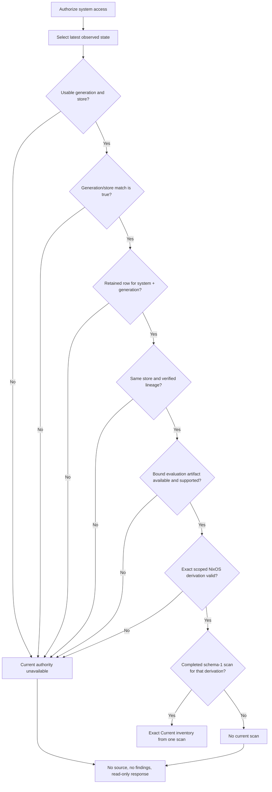

The implementation selects the newest completed schema-1 scan by completion time and scan ID after it proves the target. A clean selected scan remains an exact scan with zero findings. An unavailable target instead returns no source. These are distinct states. [S15]

`ExactCveAuthorityFailureReason` identifies the first failed prerequisite: missing generation, generation/store mismatch, missing retained generation, retained-store mismatch, unverified lineage, missing/unavailable snapshot, unsupported snapshot, missing exact derivation, or no current schema-1 scan. [S15], [S20]

### 6.3 Candidate identity is weaker than inventory authority

The revision-candidate query emits a `Current` candidate even when a running derivation or commit is not mapped. `is_current=true` does not certify the complete retained-generation chain. Exact-derivation candidates can also match the observed store without gaining Current mutation authority. [S15]

`is_latest_per_flake` has a useful precise meaning: the candidate commit is at position zero in a ready flake branch snapshot. It is not a statement about scan time or successful evaluation. `scan_available` concerns CVE scan evidence only. [S15]

The query is bounded to 1,000 candidates and has no demonstrated continuation/completeness contract. The frontend also constructs menus from separately loaded generation and commit lists. A missing menu choice can therefore mean a presentation or coverage gap, not deletion of the underlying target. [S08], [S15]

### 6.4 Current Hardening is a different contract

The Hardening query resolves Current through the observed realized store path and exact registered flake/configuration membership. It does not apply the same retained-generation and evaluation-integrity chain as Current CVEs. It selects completed evidence and the latest attempt independently. [S18]

For unresolved Current, the query can return no derivation, no source, no services, and no attempt, with `read_only=false`. The UI can consequently present “Never scanned” for a condition that is actually unresolved target identity. This must remain distinct in a future contract. [S08], [S18]

### 6.5 PROPOSED common identity contract

The server should resolve a system's running identity once for related consumers, or expose one reusable resolver contract. The result should separate:

- the observed generation and store;
- a scoped derivation/commit mapping;
- deployment-lineage proof;
- evidence availability;
- action capability.

The first four items are facts. The last item is an authorization and domain decision. A failure in one item must not erase valid facts from the others.

---

## 7. What creates retained-generation authority

A CVE scan is not the producer of retained deployment lineage. `retain_generation_snapshot_tx` requires a qualifying server deployment and its bound evaluation evidence. It does not create proof merely because a store path matches. [S19]

### 7.1 AS-BUILT sequence

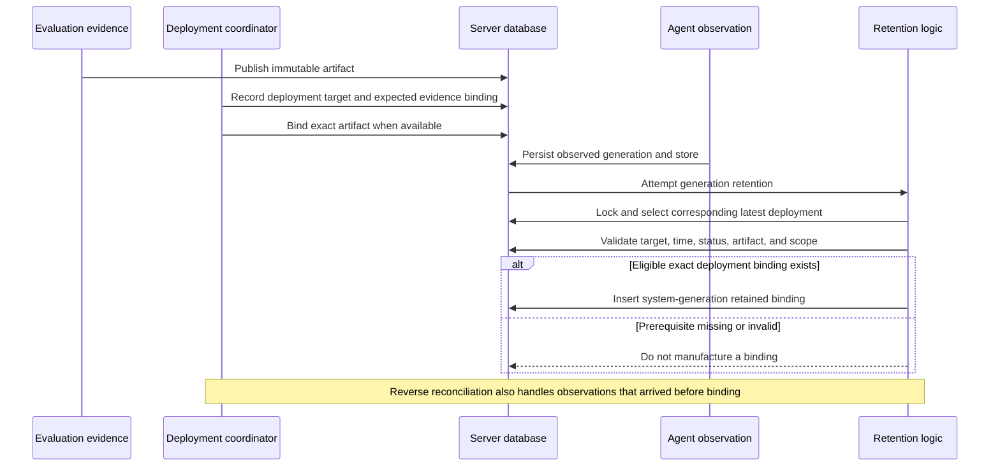

The retention code selects the corresponding latest deployment before it evaluates eligibility. It must not skip a newer ineligible record to borrow authority from an older record. The inspected path accepts pending or succeeded deployments, plus expired deployments within its defined 24-hour allowance. Failed and superseded work do not gain authority through a successful scan. The insert preserves an existing system/generation binding. [S04], [S19]

### 7.2 Operational implication

A message that asks the operator to run another CVE scan is not an adequate remedy for `RetainedGenerationUnavailable`. Another scan can create new scan evidence. It does not establish the missing deployment-to-generation binding. [S19], [S22]

**UNVERIFIED for sledge:** Whether generation 16 came from a CF deployment, an external activation, an older deployment without the expected binding, an observation/binding ordering issue, or another data condition. The screenshots do not resolve this question. Do not repair the data by inventing retained records.

---

## 8. The reported inconsistency

### 8.1 Screenshot observations

| Surface | Visible result |
|---|---|
| Sledge detail header | Generation 16; 1,386 CVEs; 91 critical and 520 high. |
| CVE revision bar | Generation 16 marked current; commit prefix `2283980b4550`; “running now.” |
| CVE authority message | Current evidence unavailable; retained generation unavailable. |
| CVE inventory panel | No scan inventory; 0 of 0 findings/packages shown. |
| Scanning sledge summary | “clean”; 12 scanned, 29 needs build, 9 never scanned. |
| Expanded Scanning row | Commit `2283980b4550c5d76e75b71c83b68aabe151e3b5`, Deployed, Completed, approximately 7 hours old. |
| Expanded row severity values | 243 critical, 1,264 high, 1,386 medium, 229 low. |

These values are observations from the provided screenshots, not results of a live database query. Cropped evidence is included in Appendix A.

### 8.2 Four independent paths explain the shape of the contradiction

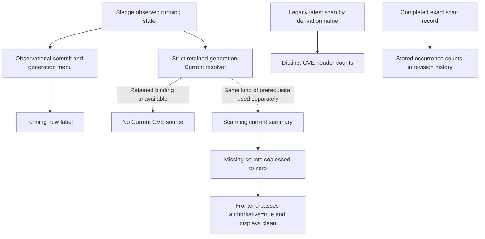

The shared prerequisite edge is conceptual. The two server queries are separate implementations, not one shared result. [S08], [S11], [S13], [S14], [S15], [S16], [S17]

### 8.3 Confirmed source defects and contract differences

**G01: False “clean” in Scanning.** The By-system row calls the findings renderer with current critical and high counts, literal zero for medium and low, and literal `true` for its authoritative argument. The renderer emits “clean” when all four supplied counts are zero. It does not use the nullable current scan identity in this call. Missing evidence and medium/low-only evidence can therefore both produce a false clean conclusion. [S17]

**G02: Header scope differs from Current inventory.** The header uses the legacy summary path, not the strict Current inventory source. A positive header count and an unavailable Current inventory can coexist. The UI does not explain their different scope. [S08], [S12], [S13], [S14], [S15]

**G03: Current inventory intentionally rejects missing retention.** The source and tests require empty Current inventory when the current generation has no retained binding. This is an existing restriction, not just a selector initialization defect. Altering it requires a specific design decision. [S15], [S28]

**G04: Units differ.** The header counts distinct CVE IDs. Stored scan severity counters count affected entries across package derivations. The paged inventory uses canonical CVE/package pairs. Equal source identity would not by itself make these three totals equal. [S13], [S15], [S21], [S22]

**G05: Recovery text is too generic.** The CVE tab has a specific top-level authority reason, but its lower empty panel always advises a scan after evaluation for `NoScan`. That advice does not distinguish a missing retained binding from a target with no completed scan. [S20]

### 8.4 What is not established

The review does not establish that the 1,386 header value came from the exact scan shown in Scanning. It does not establish that the screenshot uses the pinned application SHA. It does not establish that the scan is missing or corrupt. It does not establish that changing the default to flake head would repair generation 16's authority.

A live diagnosis must compare system ID, observed state, registered configuration, retained binding, exact derivation ID, selected scan ID, schema version, and counting unit. Comparing only commit labels or displayed totals is insufficient.

---

## 9. Count semantics

### 9.1 AS-BUILT counting definitions

`VulnixParser::calculate_stats` sums each entry's severity counts. An entry is a package derivation. Its `affected_by` list contributes severity occurrences. The same CVE in two entries can contribute two counts. The parser separately calculates distinct CVE IDs, including IDs in affected and whitelisted lists. [S21]

The stored `total_vulnerabilities` is the sum of critical, high, medium, and low counts. It excludes the separately calculated unknown count. The inspected completion path persists those four severity counts. The parser's `total_packages` is the number of entries, not a demonstrated count of every clean package in the closure. These limitations must be reflected in labels and future data contracts. [S21], [S22]

The header's SQL aggregates distinct CVE IDs from a mutable legacy projection. The inventory API groups immutable observations into canonical CVE/package identities and uses live metadata for presentation such as severity. Stored scan counters and dynamically enriched inventory counts can therefore differ in both unit and metadata time. [S13], [S14], [S15], [S21], [S22]

### 9.2 PROPOSED vocabulary and formulas

Let `O` be eligible affected, non-whitelisted observations from one selected scan. For a stated severity metadata version:

```text
occurrence_count = count of selected observed occurrence identities in O
finding_count    = count distinct (canonical_cve_id, canonical_package_name) in O
cve_count        = count distinct canonical_cve_id in O
package_count    = count distinct canonical_package_name in O
```

An occurrence identity must be defined by the stored observation contract, including its derivation path and observed package context. It must not be inferred from a row number. [S05], [S15], [S22]

The proposed primary table unit is **findings**, meaning canonical CVE/package pairs. A header labelled **CVEs** should continue to mean distinct CVE IDs, or be explicitly renamed. Scanning can retain occurrence counts, but should label them **scan occurrences**, not present them as directly comparable inventory totals.

### 9.3 Mandatory consistency conditions

**PROPOSED:** Counts are comparable only when these values match: target identity, scan ID, evidence representation, eligibility/whitelist rules, counting unit, active filters, and severity metadata basis.

For each unit, preserve an explicit unknown severity bucket. Unknown severity findings are still findings. A screen must not display “clean” because only the four known severity counts are zero.

“0 shown” is a pagination fact. “0 findings” is an inventory fact. “No completed scan” is an evidence state. “Current evidence unavailable” is an identity or authority state. These four meanings must never share the same zero-only representation.

Accepted risk and scheduled remediation are dispositions. They must not remove an affected observation or imply successful remediation. A disposition-filtered list must label its filter and retain the underlying exposure totals. [S06]

### 9.4 Clean predicate

**PROPOSED:** Render “No findings in selected scan” only when a completed, valid selected source exists and its full eligible finding count is zero, including unknown-severity findings. Include scan completion time. This is a statement about the selected scan, not a guarantee that the system has no vulnerabilities.

A missing source, failed attempt without prior evidence, unavailable target, or partial/unrecognized evidence format must not satisfy this predicate.

---

## 10. Revision defaults and explicit selection

### 10.1 USER REQUIREMENT

CVEs and Hardening must default to the configuration currently deployed to the system. For an out-of-band configuration, they must default to the registered flake's head.

**AS-BUILT at `58006084`:** The signal initializers still start at `Current` in Generations mode. After a successful candidate response for the matching system, `revision_scope_default` now applies the following rule. [S08], [S30]

```text
If any candidate is Current, is_current, and has a derivation_id:
    Select Current / Generations.
Else if an ExactDerivation candidate has is_latest_per_flake:
    Select the first such candidate / Commits.
    Explain that running configuration is out of band.
Else:
    Keep Current as the underlying request target / Commits.
    Mark head_unavailable and explain that head is unavailable for an out-of-band configuration.
```

The helper deliberately ignores `scan_available`, which avoids selecting old scanned data merely because Current has no scan. Each tab has separate explicit-choice state. Target and mode handlers set that state. Automatic updates stop for an explicit choice and reset when the stored system ID changes. Successful candidate responses carry their system ID before automatic selection is applied. These are implemented changes, not remaining feature omissions. [S08], [S30]

However, the helper treats every absence of a Current candidate with a derivation as out of band. It does not distinguish no reported state, an empty candidate collection, absent registered head, ambiguous mapping, or a successfully loaded-but-unresolved current identity. It does not wait for a separate typed current-identity result. A non-null derivation ID alone does not prove the full registered current mapping or retained authority. [S08], [S15], [S30]

When head is unavailable, requests still use `Current`; there is no separate unavailable-head request target. Only the additional Check now guard uses `head_unavailable`. The whole evidence/action surface is not represented by a new head-unavailable type. Existing eager inventory requests also start before automatic default resolution. These gaps must not be described as a complete implementation of the proposed rules below. [S08], [S30]

### 10.2 PROPOSED target-selection rules

| Condition after authoritative data loads | Default target | Mode | Required explanation |
|---|---|---|---|
| Running tracked configuration is mapped | Current running target | Generations | Identify generation and commit when available. |
| Running target is an older commit or rollback | That running target | Generations | Do not prefer newer head. |
| Running target is mapped, but its scan is absent | Same running target | Generations | “No completed scan for this target.” |
| Running identity is mapped, but retained remediation proof is missing | Same running identity; display policy decided in Section 22 | Normally Generations | Explain the missing proof. Do not call the system out of band solely for this reason. |
| Running configuration is confirmed out of band under the agreed definition | Actual registered ref head | Commits | “Showing flake head because the running configuration is out of band.” |
| Head is known but not evaluated into a selectable derivation | Head identity remains the intended target | Commits | “Flake head has no available target for this configuration.” |
| No configured flake or no usable head snapshot | No invented fallback | Explicit unavailable state | State the missing prerequisite. |
| Required request is loading or failed | Do not finalize a new default | Loading/error | Do not classify loading or errors as out of band. |
| User or exact navigation has selected a target | Preserve explicit target | Preserve explicit mode | Never override it with a late automatic response. |

A head candidate must belong to the system's registered flake and effective configuration. `is_latest_per_flake` is a useful server fact when its candidate is present. The resolver must not select the first candidate with a scan. A failed or missing head evaluation must not cause substitution of an older successfully scanned revision. [S15]

### 10.3 Initialization and selection state

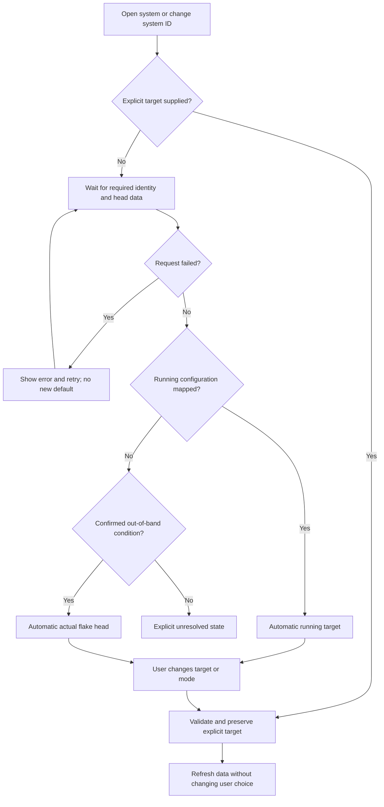

The new head already has a small shared helper and independent explicit-selection state. Extend that helper with sufficient identity states rather than adding a second default policy. The tabs should keep independent explicit selections. A user changing only Generations/Commits has still expressed a choice. A later effect must not reset that mode merely because there was no equivalent target in the other menu.

**AS-BUILT:** The new helper reapplies an automatic default when candidate metadata changes, unless the tab is explicit. Automatic head selection can therefore move on a candidate refresh. **PROPOSED:** Automatic selection can follow a confirmed running-target change after coherent refresh. Explicit selection stays fixed. A flake-head default should resolve to a specific full commit/derivation at initialization; a later head change should be offered as an update rather than silently replacing evidence under an operator. This head-follow behavior differs from the current automatic-refresh rule and requires a decision. [S30]

### 10.4 Definition of out of band is still a decision

The code distinguishes local activation that can be reconciled to a tracked commit from local activation that remains unmapped. “Activated outside CF” and “unmapped configuration” are not synonyms. [S08], [S11]

The preferred proposal is to keep a correctly mapped running configuration selected even when its activation originated locally. Use flake head for a genuinely unmapped out-of-band configuration. Section 22 asks for confirmation because the user's wording can also mean every non-CF activation.

---

## 11. Proposed shared read model

This section defines a proposed contract, not a new endpoint that already exists. The implementation may extend existing responses or use a reusable query module. It does not require one giant endpoint or a new global client store.

### 11.1 Separate facts from capabilities

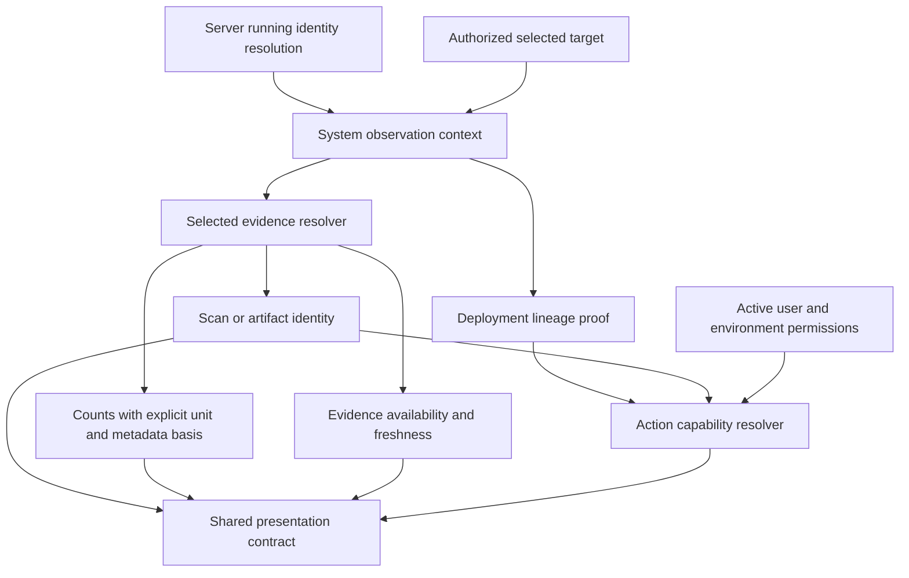

### 11.2 Proposed response fields

| Group | Required meaning |
|---|---|
| System context | System UUID, effective configuration identity, registered flake ID/ref, selected observed-state identity and timestamp. |
| Running mapping | Observed generation/store, mapped derivation/full commit when known, mapping state and reason. |
| Selected target | Selector kind and identity, full commit when known, generation binding when applicable, relation to running state, relation to ref head. |
| Proof | Deployment lineage availability and failed prerequisite. This must not be encoded only as an empty inventory. |
| Evidence | Available, absent, unavailable, unsupported, or failed-to-load; exact source ID and representation when available. |
| Attempt | Newest scan attempt and lifecycle, independent of the selected completed evidence. |
| Counts | Counting unit; full total; all severity buckets including unknown; active filters; metadata basis. |
| Capabilities | Separate read, rescan, ordinary annotation, triage, POA&M, verification, and closure decisions with reasons. |
| Coherence | Read revision or version tuple that identifies the selected observation, target, source, and mutable membership basis. |

Do not return `counts = 0` as the only representation of an unavailable source. Use absent counts or an explicit unavailable state. Existing clients can keep their old numeric fields during a rolling transition, but new UI conclusions must use the new state.

### 11.3 Evidence lifecycle and attempt lifecycle are independent

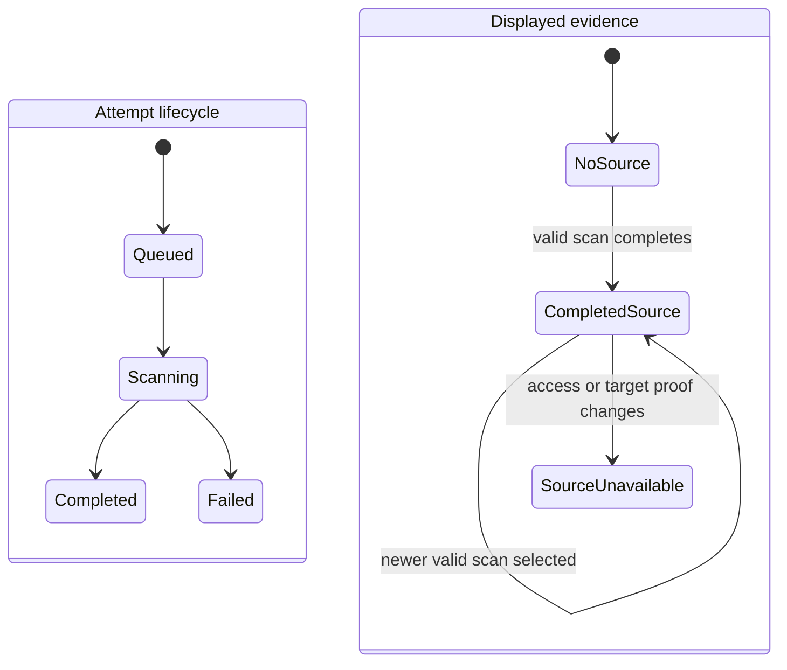

This diagram describes the proposed separation, not all CVE worker states. Actual CVE operations also have wait/retry states. The important rule is that a new failed or queued attempt does not erase earlier completed evidence for the same selected target. The UI must identify which attempt failed and which scan still supplies findings. Hardening already implements part of this separation. [S08], [S18]

### 11.4 Displaying evidence without granting remediation authority

**PROPOSED, requires decision:** When the server uniquely maps the running artifact to an authorized derivation and a completed schema-1 scan, it may display that scan read-only despite missing retained-generation proof. The response must label this as mapped-running scan evidence with unavailable remediation authority. It must not call it the existing fully authorized `ExactCurrentScan` state.

The server must continue to reject unsupported remediation operations. It must not create retained records, relax mutation validation, choose a different derivation, or borrow an older generation's binding to make the display available.

An alternative is to keep the current strict Current display restriction and make every Current-labelled summary say unavailable. Both alternatives eliminate false clean. Only the first makes independently readable matching scan evidence visible without requiring historical navigation. Section 22 records the choice.

---

## 12. Per-screen behavior and gaps

### 12.1 Systems list

**AS-BUILT:** `SystemsListView` loads summaries and applies list presentation and filtering. The adapter returns `items` but discards the API pagination envelope. List totals and client-side filtering therefore operate on loaded items, without proof that they cover the complete fleet. Flake context is loaded through additional requests, including timeline reads; some timeline failures are reduced to missing context. [S07], [S09]

**PROPOSED:** Keep a visible distinction between loaded row count and server total. Preserve and consume pagination metadata. Apply full-fleet filters on the server, or explicitly indicate that a filter covers only loaded rows. A security summary must never report a partial page as the fleet total.

Do not introduce a request per system merely to unify security summaries. Use a set-based server projection with explicit evidence states. A list row with unavailable current evidence must not show a clean badge.

### 12.2 Preview panel

**AS-BUILT:** The preview has deployment progress, identity/policy information, Currently deployed, Host, CVE exposure, Recent activity, and footer actions. It polls deployment progress every four seconds while mounted. History is fetched separately and displayed once as up to five entries. [S07]

The Currently deployed commit comes from `detail.flake.latest_commit`. The branch is derived from the environment: production maps to `main`, staging to `staging`, and other environments to `dev`. A missing generation becomes `#0`. These are not reliable current identity fields. The pending banner's View logs handler calls a generic open-detail action, not a demonstrated exact Logs navigation. [S07]

**PROPOSED:** Use the same running identity and evidence summary as the detail header. Show missing generation as unavailable, not zero. Use the registered ref. Keep last heartbeat separate from deployment progress. Load real activity with explicit error state. Navigate View logs to the relevant deployment/event context.

### 12.3 Detail header and Overview

**AS-BUILT:** The header shows system identity, health, deployment status, heartbeat, generation, uptime, CVEs, and policy. CVE counts come from the legacy detail DTO. Their resource is not refreshed by the same operation that reloads the CVE tab after a triage save. The generation subtext uses last-seen time in an “activated” phrase; last seen is not necessarily activation time. [S08]

Overview uses the observational commit lookup. Its card shows “up-to-date” when a current commit object is present, rather than proving equality with actual ref head. A current SHA outside the bounded commit menu can also lack its full commit object. The preview and Overview can therefore disagree about current identity. [S07], [S08], [S11]

Tags in the inspected Overview code are local UI state. Tag navigation does not demonstrate a persisted exact tag filter. Missing branch and IPv6 values are placeholders. Some build links open a generic Builds page rather than an exact build. [S08]

**PROPOSED:** Separate four facts: observed running revision, tracked ref head, desired deployment, and active deployment operation. Derive up-to-date only from a declared comparison. Show “observed” or “last reported” unless activation time is actually available. Keep header security metrics unfiltered and running-scoped, with source and availability metadata.

### 12.4 Deploy

**AS-BUILT:** The page supports commit and generation selection and real server deployment requests. Auto-latest policy handling uses an explicit prompt and retry state. Generation rollback sends the retained snapshot identity when available, along with generation/store context. [S08]

The plan's From commit is `system.flake.latest_commit`, not the observational running commit. Noncurrent commit rows can be labelled cached without per-row cache proof. The diff fallback is a hard-coded nginx example. Dry-run build has no handler in this component. [S08]

`DeployGatePanel` is explicitly a heuristic presentation. It derives a result from current CVE critical counts and manual policy, and its drift rule displays pass. The comment says no corresponding public system/commit gate-evaluation endpoint exists. This panel must not be described as authoritative policy evaluation for the selected deployment. [S08]

A production hostname-confirmation component exists elsewhere in this file. The direct generation-deploy callback is not sufficient evidence that every rollback path uses that confirmation. Full confirmation behavior remains unverified. [S08]

**PROPOSED:** From means observed running target. To means selected requested target. A gate result must identify the evaluated target and real decision source. Without that source, show unavailable or not evaluated. Remove illustrative diffs from production evidence presentation. Unimplemented controls must be disabled with a reason or removed. Request acceptance must not be reported as activation completion.

### 12.5 History and Recent activity

**AS-BUILT:** Event classification prefers server event types and then uses compatibility heuristics. Restart clusters can be folded. Agent restarts remain separate. Rollback and log navigation use the selected event context. History reveals local batches of fourteen rendered entries; this is not evidence of complete server-side history pagination. [S08]

If recorded history is empty, the page can synthesize entries from commits. When authoritative generation data is absent, legacy logic can infer generation movement by decrementing. These are reconstructed presentation paths, not recorded facts. [S08]

**PROPOSED:** Only recorded events belong in authoritative History and Recent activity. Keep any reconstruction in a separately labelled section. Missing history and failed history loading must be different states. Use durable event IDs for links; array-index anchors can change when new history arrives. Preserve genuine activation time, observed time, actor, outcome, target, and deployment ID when available.

### 12.6 Logs

**AS-BUILT:** Logs combine real agent events with labelled reconstructed timeline entries. Reconstructed entries include staged offsets from history times. The view supports severity filters, local/UTC display, auto-scroll, display clearing, text download, and history jumps. The event fetch is gated to the Logs tab, unlike several other resources. [S08]

**PROPOSED:** Keep reconstructed entries distinguishable in the UI and export. Never describe their synthetic times as actual operation start/end times. Preserve a durable event/deployment correlation key. A network error must not be indistinguishable from a quiet log stream. Local Clear display must not delete persisted events.

### 12.7 Config

**AS-BUILT:** Config has its own revision context and uses the observational current commit. Options, summary, and module-source reads carry a shared snapshot token. On token conflict, the view clears related surfaces and restarts, rather than merging different immutable artifacts. Request counters and selection checks reject stale async results. [S08]

Lazy inspection is explicit and requires admin eligibility plus the selected commit's inspection prerequisites. Retained-generation browsing must not start commit-scoped inspection and relabel it as historical generation evidence. The source panel exposes retained provenance and safe values, not arbitrary source reconstructed from option values. [S04], [S08]

For unmapped Current, the view offers a manual newest-inspectable-commit action. That is not necessarily actual ref head. The user's requested automatic default change concerns CVEs and Hardening; it must not silently change Config's behavior too. [S08]

**PROPOSED:** Preserve token coherence and provenance boundaries. Expose selected artifact and comparison baseline identity. Keep partial option inventory distinct from complete inventory. Do not use unavailable comparison as zero drift. Any future common revision control must preserve Config-specific inspection semantics.

### 12.8 CVEs

**AS-BUILT:** The tab uses package-first grouping and a bounded server inventory. The server metadata covers the selected scope; “shown” and “loaded” counts describe the locally accumulated page data. There is no System Detail search/filter bar in this implementation, consistent with the nearby design comment. [S20]

Target changes clear expansion and triage state and advance async guards. Pagination uses source-bound continuations. An inventory change restarts from page zero. The parent computes candidate-based read-only state, while the inner component additionally checks inventory authority for exact remediation. This is not a reason to trust candidate flags as server authorization. [S08], [S15], [S20]

Current authority failure is explicit in the top banner. Historical inventories remain read-only. The historical server query can label schema-1 historical data with `authority=legacy`, while `evidence_representation` identifies schema 1. Thus the authority label is not the same as evidence format. [S15], [S20]

**PROPOSED:** Show selected system/configuration/commit or generation, exact scan identity, completion time, evidence format, and mutation availability. Do not label all noncurrent targets “historical” when a target has never been deployed or is the current ref head. A selected target can be read-only without being old.

Provide failure-specific recovery text. For missing lineage, show the missing lineage requirement and the independently known scan state. For no scan, show a target-specific scan action only if an API actually supports that target. Do not route a head-target action through a Current-only request.

### 12.9 Hardening

**AS-BUILT:** Hardening uses the shared revision menu but its own target resolution and result resource. It shows latest attempt lifecycle separately from completed evidence. A failed newer attempt can leave older completed evidence visible. The lifecycle poll is bounded to 120 consecutive active polls at five-second intervals. [S08], [S18]

The UI's Check now request submits only the system ID. The selected derivation is not part of that request. The frontend enables the action only for `Current` with eligibility, and the new head additionally disables it for an automatic head-unavailable state. Enabling it for an automatic flake-head selection would therefore not establish that the head target is scanned. [S08], [S10]

Confirmed implementation issues include the following. The directive helper returns `ON`, `PAR`, `OFF`, or `--`, while the table checks for `on` or `partial`; the positive branch cannot match these values. The waiver attribution text contains the literal actor `mreyes`. A notes action selects a `justification` modal tab that has no matching body among overview, nix, and all. The All checks body does not reproduce the design example's waived state. [S08], [S25]

When no source exists, the UI can still show zero services and a zero average score. Those zeros are not a completed zero-service audit. User display is populated from `service_type`, which is not demonstrated to mean the service's operating-system user. Export has no handler. Waiver removal is explicitly disabled because its backend endpoint is missing. The Nix snippet is generic guidance, not extracted exact configuration. [S08]

**PROPOSED:** Separate identity-unavailable, never-scanned, queued, running, failed, and completed states. Only calculate audit metrics from a completed source. Keep actual service user, type, directive state, waiver state, and provenance separate. Use real server actor data or show attribution unavailable. Match control behavior to the selected target.

### 12.10 Compliance and POA&M

**AS-BUILT:** Compliance loads system bundles, assignments, POA&M rollups/items, and exact evidence. POA&M appears before bundle summaries. The tab distinguishes loading, unauthorized, failed, and empty states. It can require a bundle/version choice for exact finding evidence. CVEs and Compliance share the POA&M detail host. [S08]

**EXISTING SPEC:** A triage disposition does not prove remediation. Exact-CVE verification and closure require newer authorized evidence and unchanged required lineage. A typed assignee does not grant environment access. Mutation handlers must revalidate active users, roles, and memberships under their domain locks. [S05], [S06]

**PROPOSED:** A selected security revision must not silently change a POA&M's saved baseline. Keep immutable baseline evidence, present evidence, and proposed remediation target separate. Do not infer complete backend support for a visual host-level override from the mock design alone. This review did not audit every mutation path end to end.

---

## 13. Structural comparison with the design examples

This section compares inspected component structure and behavior. It does **not** claim pixel-level parity. No live light/dark, desktop/mobile, keyboard, or screenshot-diff run was performed. [S07], [S08], [S23], [S24], [S25]

| Surface | Missing sections | Reordered sections | Collapsed or merged concepts | Missing or incorrect metadata | Changed interaction behavior | Visual hierarchy differences |
|---|---|---|---|---|---|---|
| Systems preview | Reference tag strip and deployed commit message are absent from the inspected preview structure. | Generation appears before commit; reference places message and generation after commit. | Deployment progress can replace the last-heartbeat value. | Branch is guessed from environment; latest commit is presented as deployed; unknown generation becomes zero. | View logs opens generic detail; tags do not have the reference's complete interaction here. | Pending deployment adds a leading section. Exact spacing and responsive width are unverified. |
| Full detail shell | All eight current tabs exist. This does not certify every tab's sections. | Current order is Overview, Deploy, History, Logs, Config, CVEs, Hardening, Compliance. The older four-tab spec is obsolete. | Header CVE summary is not visibly separated from selected-tab evidence scope. | No header count source or unit distinction; “activated” uses last-seen context. | Exact CVE/Hardening selection restoration is not demonstrated in the URL. | Header and tab scope bars exist. Rendered parity beyond supplied CVE screenshot is unverified. |
| CVE revision bar | Basic label, toggle, menu, metadata, and relation badge exist. | No structural order omission found in the inspected bar. | Missing target falls into historical-unavailable language regardless of default-state reason. | Generation metadata substitutes commit text and lacks author; source scope can differ from the inventory below. | Unlinked mode changes preserve evidence rather than copying mock index fallback. This is a protective difference. | Production adds loading/error/refresh states. These should remain, not be removed to imitate mock data. |
| CVE inventory and triage | No finding list appears in the supplied unavailable state because the server returns no source. Host-override parity is not established by this review. | No claimed package/triage ordering pass. | Evidence format, deployment authority, and read-only status share overloaded labels. | Source/authority explanations and exact action capability need clearer separation. | Production mutations use server validation rather than mock local disposition state. | The unavailable banner and empty card are prominent. Full populated/drawer parity remains unverified. |
| Hardening page | Revision bar, stats, filters, table, and modal exist. | Production inserts lifecycle/current-action sections before summary metrics. | Missing evidence becomes zero audit metrics; service type is presented as user. | Directive positive state is broken by string mismatch. | Check now is a real request; mock reference has no equivalent lifecycle contract. | Added lifecycle information changes hierarchy intentionally; no pixel pass is claimed. |
| Hardening modal | `justification` action has no body; All checks lacks the reference's waived display. | Directives, NixOS config, All checks tab order matches. | Raw directive state and accepted waiver state are not consistently distinct in All checks. | Actor is hard-coded; per-service Nix guidance is generic. | Remove is disabled instead of reference's mock removal. Export is unwired in both, not a new parity regression. | Actual tiles use larger padding, heavier/larger type, larger gaps, and minimum height than the reference source. Rendered impact is unverified. |
| Deploy | Controls and plan exist, but real dry-run and real selected-target gate evidence are absent. | No full visual-order verification. | Current header security and hypothetical selected-target gating are combined. | From commit, cache status, diff, and drift pass can be misleading. | Real deployment and policy conversion differ from mock operations; confirmation coverage needs workflow testing. | The heuristic gate panel has authority-like prominence. It must not imply a verified gate result. |
| History, Logs, Config, Compliance | Structures were inspected, but no full section-by-section visual pass was executed. | POA&M precedes Compliance bundles; History can promote a generation-changing event above restart noise. | Recorded and reconstructed history/log information can coexist. | Durable provenance and unavailable states must remain explicit. | Config has real token/inspection constraints absent from simple mocks. | These differences require focused runtime comparison before a parity claim. |

The proposed repair must preserve the reference's information hierarchy while correcting false conclusions. Do not resolve a false clean badge by hiding security metadata. Do not remove lifecycle or unavailable states merely because the fixture always has data.

---

## 14. Refresh and concurrency

### 14.1 AS-BUILT refresh behavior

| Resource | Trigger in inspected code | Consistency consequence |
|---|---|---|
| Detail DTO/header | Initial load and explicit edit reload. | Can remain stale while scan/triage content refreshes. |
| Revision candidates | Initial load and explicit retry; successful responses now carry a system ID. | Can lag a new scan, deployment, or head update. Successful refresh can reapply a non-explicit default. |
| Commits and generations | Separate initial resources. | Arrival order differs from candidates and inventories. |
| Current CVE inventory | Initial load, selection change, save callback, pagination conflict restart. | Has selected-target guards, but no common header invalidation. |
| Deployment progress | Four-second polling. | Runs independently of detail/identity refresh. |
| History | Four-second tick guarded by outer resource presence. | The condition checks completed resource presence rather than clearly proving an active inner deployment. Treat excess polling as a static risk to test. |
| Logs | Three-second polling while Logs is active. | Better tab scoping; error handling still depends on consumed adapter fields. |
| Hardening | Selection/manual refresh plus bounded five-second active-attempt polling. | Poll loop has no visible active-tab gate; can continue off-tab. |
| Preview history | Initial fetch while preview is mounted. | New progress may appear without new activity entries. |

Sources: [S07], [S08], [S09].

Several detail resources start even when their tab is inactive. The one-second visual clock is not a server-data refresh and must not be treated as one. [S08]

### 14.2 Existing local protections

CVE and Hardening loads are tagged with the requested selection and are rejected or hidden when that request tag no longer matches the selected target. This is a stale-request guard, not complete response-body identity validation. In particular, the inspected Hardening path does not compare its returned `selection` field with the requested selector before installing evidence, as the new fixture illustrates. CVE continuation state tracks source/revision context. Config uses multiple request counters, selection checks, and a shared snapshot token. These protections must survive any new default resolver. [S08], [S20]

CVE and Hardening server reads use read-only repeatable-read transactions for their own query sequences. This gives within-request coherence. It does not make independently issued header, candidate, inventory, and Scanning requests one database snapshot. [S15], [S18]

### 14.3 PROPOSED page load sequence

```mermaid
sequenceDiagram
    participant U as User
    participant V as System Detail
    participant I as Identity and candidate reads
    participant E as Selected evidence read
    U->>V: Open system without explicit security target
    V->>I: Load running identity and required target metadata
    V-->>U: Loading identity; no clean or out-of-band conclusion
    I-->>V: Facts plus read revision
    V->>V: Resolve default once from complete facts
    V->>E: Request exact selected target
    U->>V: Select another target before response
    V->>V: Mark explicit selection and advance request epoch
    E-->>V: Response for previous target
    V->>V: Discard stale response
    V->>E: Request explicitly selected target
    E-->>V: Source, counts, capabilities, revision
    V-->>U: Render matching target and evidence
```

### 14.4 Proposed invalidation rules

| Event | Invalidate or refresh | Must remain stable |
|---|---|---|
| New observed running target | Running identity, header summary, automatic defaults, candidate relation flags, current capabilities. | Explicit historical target and its saved baseline. |
| Scan completes | Evidence for that derivation, related current summaries, attempt lifecycle, source-bound first pages. | Other derivations' selected evidence. |
| Scan fails | Latest attempt and diagnostic state. | Earlier valid completed evidence for the same target. |
| Triage or justification saved | Affected disposition/POA&M presentation and relevant membership metadata. | Immutable scan observations. |
| Archive/restore | Operational scan collections and their counts/cursors. | Audit evidence merely hidden from an operations list. |
| Registered configuration/ref edited | Identity/candidates and dependent reads. | Unrelated user/system state. |
| System ID changes | System-specific target state, caches, pagination, dialogs, outstanding request epochs. | Global UI preferences only. |
| Access is revoked | Visible data and action capabilities under new scope. | No hidden-resource existence leak. |

These are proposed dependencies, not a claim of an existing event bus. A small invalidation mechanism using current resources can implement them.

### 14.5 Snapshot and stale-response policy

**PROPOSED:** Key responses by system, selected target, source, filter context, and request epoch. Use an observation/read revision to detect when a moving Current target has changed. Revalidate after a capability-changing mutation. On a source or membership conflict, discard the incompatible continuation and restart at page zero. Do not merge pages from two scans or generations.

Background refresh may keep the last successfully loaded data visible with an explicit stale/error label. Stale data must never retain a mutation capability that the server has withdrawn. The server remains the final authority regardless of client state.

---

## 15. Authorization and mutation safety

### 15.1 Existing boundaries

System CVE inventory routes require visible system access. The paged route authorizes the system before it reports cursor errors. Hidden and missing systems use the same not-found behavior. A retained-generation or derivation selector is a factual reference, not an authorization credential. Historical reads revalidate system, flake, and effective configuration membership. [S05], [S15]

The documented scan-operation routes are Admin-scoped. System inventory reads and exact-CVE remediation have their own role contracts. The implementation must not assume that a caller who can read a system inventory can administer the Scanning page. [S05]

The exact-CVE specification requires CSRF validation, current actor/role/membership revalidation under locks, source-bound observation validation, and optimistic POA&M revision checks. This review verified these requirements in the specification, not every mutation handler. [S05], [S06]

### 15.2 Proposed action contract

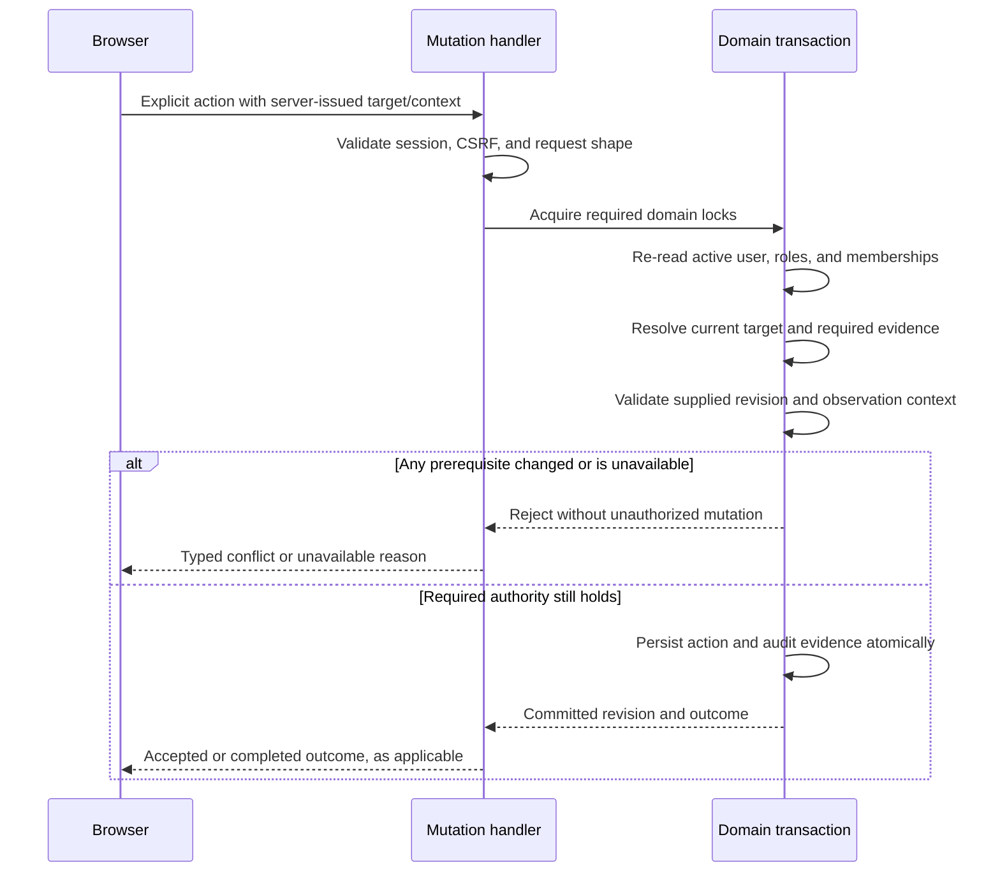

This is a proposed cross-screen contract, grounded in the exact-CVE specification. It is not a claim that all existing action endpoints implement this identical transaction sequence. [S05], [S06]

An API that accepts only `system_id` must not be used to imply an operation on an arbitrary selected commit. Until a target-specific action is supported and authorized, keep the action disabled for flake-head or historical selections. A read-only display improvement must not broaden exact triage, POA&M, verification, or closure authority.

---

## 16. Loading, error, empty, and partial states

### 16.1 Proposed presentation matrix

| Actual condition | Required UI | Prohibited conclusion | Useful next action |
|---|---|---|---|
| Identity request pending | Loading identity. | Out of band, clean, never scanned. | Wait; retain explicit user selection. |
| Identity request failed | Error with retry; optional labelled stale data. | No system exists merely because a request failed. | Retry the failed read. |
| System hidden or absent | Not found without existence disclosure. | Detailed hidden-target diagnostics. | Return to visible Systems list. |
| No reported state | No running state reported. | Generation 0 or head is running. | Check registration/agent reporting. |
| Running mapping ambiguous | Running revision unresolved, with safe reason. | Select arbitrary matching derivation. | Inspect mapping diagnostics. |
| Missing retained generation | Current remediation proof unavailable. | No scan exists, or run scan will repair lineage. | Inspect deployment/evaluation binding; optionally view explicitly read-only evidence after decision D1. |
| Valid target, no completed scan | No completed scan for this target. | Clean or zero audited services. | Target-specific scan if authorized. |
| Active scan, no earlier evidence | Queued/running with attempt identity. | Current findings are zero. | View progress/diagnostics. |
| Active or failed newer attempt, older valid evidence | Show attempt state and dated prior evidence separately. | Latest attempt completed successfully. | Retry exact target when eligible. |
| Valid completed scan, no findings | No findings in selected scan, with source/time. | Permanently secure system. | Inspect source or rescan according to policy. |
| Unknown-severity findings only | Findings with unknown severity. | Clean because C/H/M/L are zero. | Review unknown severity. |
| Continuation fails | Keep loaded rows, show incomplete status and retry. | Loaded row count is the full inventory. | Retry continuation or restart on conflict. |
| Target is absent from bounded menu | Explicit selected-target or coverage state. | Selected target is necessarily deleted. | Resolve exact target or expand coverage. |
| Flake head not evaluated | Head selected conceptually; target unavailable. | Older successful commit is head. | Evaluate/build the actual head through an explicit action. |
| Historical target has no source | No scan for this selected target. | Substitute Current data. | Choose another target explicitly. |

### 16.2 Current error handling gaps

The Systems adapter returns notices and empty results on transport failures. It does not substitute mock security data. However, the detail page can treat a missing `system` value as not found even when the adapter notice describes an API failure. Some history, generation, eligibility, and justification reads also discard detailed errors through `.ok()` or empty defaults. These are presentation gaps, not evidence of an empty database. [S08], [S09]

**PROPOSED:** Preserve error classes until the affected component renders them. An authorization failure, network error, and empty successful response must not share a data-only empty vector as the complete state model.

---

## 17. Performance and query behavior

### 17.1 Verified limits and risks

The Current CVE API has bounded pages, with default 100 and maximum 500 rows. It computes full selected-scope metadata before page presentation. The compatibility route rejects inventories above its 1,000-row bound. Candidate selection is bounded to 1,000 entries without demonstrated paging. The system commit handler returns a bounded recent list of 50. [S05], [S12], [S15]

Scanning Completed uses request-bound keyset pagination and a terminal high-water tuple. Its History collection is bounded and does not provide continuation. A locally scrollable history area must not be described as unlimited persisted history. [S05]

The Systems list adapter discards its pagination envelope. Several detail resources load eagerly, and separate consumers repeat identity work. The legacy vulnerability view chooses scans by derivation name rather than by the same complete target scope. These are concrete places to inspect for correctness and cost. No latency or query-plan improvement is claimed in this review. [S08], [S09], [S14], [S15], [S16]

### 17.2 Proposed performance contract

The list must use set-based summary reads. It must not fetch a full Current inventory once per system just to obtain a count. Each active tab should fetch only the data needed for that tab and its shared header. Expensive history, inventory, and Config data should remain bounded.

A background refresh must not accumulate overlapping identical requests. Lifecycle polling should stop or back off after its budget and while its surface is inactive. A stopped budget should produce an explicit stale status and manual refresh option.

Preserve deterministic ordering and tie-breakers for current-state, commit, scan, and history selection. Apply full-scope filters before counts and pagination. Index choices must be justified with isolated representative data and `EXPLAIN (ANALYZE, BUFFERS)`, not by query text alone.

### 17.3 Measurements required before performance claims

Measure first-load request count for Overview, CVEs, and Hardening; active/off-tab polling; server query count; list behavior beyond one page; inventory behavior beyond 500 and 1,000 rows; current/head resolution outside the recent-commit window; and candidate behavior near its 1,000-item limit. Record data volume, source SHA, database schema, and exact query plans.

---

## 18. Consolidated gap register

This register distinguishes source defects from product decisions. It is not a complete MR finding list.

| ID | Classification | Finding | Scope of correction |
|---|---|---|---|
| G01 | Confirmed presentation defect | Scanning can call missing evidence clean and discards medium/low counts. | Summary DTO use and findings predicate. |
| G02 | Confirmed contract mismatch | Header counts are not bound to the Current inventory target/source. | Shared scope/provenance contract and labels. |
| G03 | Existing intentional restriction | Current CVEs require retained proof even to return an inventory. | Decision D1, not an unreviewed fallback. |
| G04 | Confirmed semantic mismatch | Distinct CVEs, pairs, and occurrence counts share insufficiently specific labels. | Explicit units and cross-screen reconciliation. |
| G05 | Confirmed recovery-message defect | Generic scan advice covers missing retention and historical no-scan cases. | Failure-specific copy and actions. |
| G06 | Partial implementation at new head | Candidate-based Current/head defaults and explicit-choice guards now exist, but unresolved states are still classified as out of band. Missing-head requests still use Current. | Typed identity states, honest unavailable-head rendering, and async verification. |
| G07 | Confirmed identity presentation defect | Preview branch is guessed; preview and deployment From use latest commit. | Canonical observed identity and registered ref. |
| G08 | Confirmed metadata-loss risk | Systems adapter discards pagination metadata. | List completeness and server total handling. |
| G09 | Confirmed refresh separation | Header, candidates, and tab evidence have independent invalidation. | Explicit refresh dependency rules. |
| G10 | Confirmed Hardening UI defect | Directive state string mismatch prevents positive table display. | Typed state or consistent rendering values. |
| G11 | Confirmed Hardening UI defects | Hard-coded waiver actor and unsupported modal-tab action. | Real attribution and valid action destination. |
| G12 | Confirmed unavailable-state gap | Unresolved or missing Hardening evidence can look like never-scanned/zero audit. | Explicit identity/evidence state. |
| G13 | Confirmed unimplemented/misleading controls | Heuristic gate, example diff, dry-run/export gaps. | Real backend evidence or explicit unavailable controls. |
| G14 | Confirmed historical presentation gap | Commit-derived events and inferred generation changes can supplement real history. | Label or remove reconstruction from authoritative history. |
| G15 | Confirmed error-state gap | Read failures can be reduced to not found or empty data. | Preserve typed failures to rendering. |
| G16 | Source-level query risk | Legacy scan selection groups by configuration name, not complete registered scope. | Exact scope and collision tests. |
| G17 | Confirmed scan-summary limitation | Unknown count is calculated but omitted from stored four-bucket total. | Schema/API compatibility and explicit unknown semantics. |
| G18 | Unverified workflow risk | Confirmation coverage, exact-target links, mobile/focus behavior, and live refresh transitions. | Focused browser and API verification. |
| G19 | Confirmed new test-fixture defect | New head-default browser case requests derivation 99, but the shared Hardening fixture returns Current/derivation 42 for non-retained requests. | Exact-target fixture and response-identity assertions. |
| G20 | Confirmed client validation gap | Hardening's stale-response guard tags the request selection but does not validate the returned body's selector before rendering. | Validate response identity as well as request epoch. |

Sources: [S07], [S08], [S09], [S11], [S13], [S14], [S15], [S16], [S17], [S18], [S20], [S21], [S25], [S28], [S30], [S31].

---

## 19. Verification contract

### 19.1 Evidence already inspected

The Current-inventory tests explicitly exercise a newer observed generation with the same store but no retained binding. They require `NoScan`, `CurrentAuthorityUnavailable`, `RetainedGenerationUnavailable`, and no source. Related tests reject generation/store mismatch and unverified lineage. This establishes encoded intent. It is not a passing test result from this review. [S28]

The scanner parser test distinguishes unique CVEs from repeated package-entry severity occurrences. Existing revision-scope tests protect exact server-owned selectors and prevent unlinked historical selections from becoming Current on a mode change. Preserve these safeguards unless an approved contract explicitly replaces them. [S08], [S21]

The MR description reports a shared design-target failure that prevented selected browser workflows from starting on an earlier candidate. That report is not a diagnosis of the new head's pipeline. At the final head check, `58006084` had a running pipeline. This document does not claim a test pass or merge approval. [S01], [S30]

**New-head test coverage:** The commit adds unit cases for candidate ordering/current precedence, out-of-band head selection, missing-head behavior, and explicit-state reset. It adds a Hardening browser fallback case, but no corresponding new CVE browser fallback case in this two-file diff. These tests were inspected, not executed. [S30]

**New-head fixture defect:** The new browser scenario selects ExactDerivation 99. The Hardening fixture distinguishes only `retained_generation` from everything else. It returns `selection=current`, `derivation_id=42`, the Current scan's services, and `read_only=false` for that ExactDerivation request. The new scenario then asserts that no Check now button exists. With that response, the existing component's non-read-only branch still renders a disabled Check now button. Thus the fixture does not establish the requested exact-head workflow and contains a source-level contradiction with its assertion. No browser execution result is claimed. [S08], [S31]

The out-of-band candidate fixture also attaches a completed CVE source to a Current candidate whose derivation ID is null. The real candidate query joins its scan source through the derivation ID, so this combination is not production-shaped. Repair the fixture instead of weakening assertions or client identity checks. [S15], [S31]

### 19.2 Required regression matrix

| Test ID | Scenario | Required assertion | Test layer |
|---|---|---|---|
| SV-01 | Running tracked A, head B | Both security tabs default to A; header remains running-scoped. | Pure resolver + browser |
| SV-02 | Known rollback to an older generation | Actual observed generation wins over maximum generation and newest commit. | SQL + browser |
| SV-03 | Running target has no scan, older/head target has a scan | Do not substitute a different target. | SQL + browser |
| SV-04 | Confirmed unmapped out-of-band target | Actual registered head/configuration selected in Commits mode. | Resolver + browser |
| SV-05 | Head has no derivation or build | Show intended head unavailable, not latest successful revision. | Resolver + API + browser |
| SV-06 | Running derivation and completed schema-1 scan, missing retained binding | Assert the chosen D1 display contract and unchanged mutation rejection. | SQL + API + browser |
| SV-07 | Two flakes have the same configuration name | No cross-flake counts, candidate, source, or mutation context. | SQL + API |
| SV-08 | Configuration alias differs from hostname | Resolve effective configuration consistently everywhere. | SQL + API |
| SV-09 | Same commit has multiple configuration outputs | Select only the registered configuration's derivation. | SQL + API |
| SV-10 | Missing current source with completed historical source | Current summary is unavailable, never clean. | Unit + SQL + browser |
| SV-11 | Medium-only, low-only, and unknown-only evidence | Each is shown as findings, not clean. | Unit + API + browser |
| SV-12 | One CVE affects multiple package derivations and names | Distinct CVE, pair, and occurrence totals have correct labels and arithmetic. | Parser + SQL + browser |
| SV-13 | Whitelisted and accepted-risk entries | Whitelist policy is explicit; accepted risk is not remediation. | SQL + API |
| SV-14 | Severity metadata changes after scan completion | Stored occurrence summary and enriched inventory explain their metadata basis. | SQL + API |
| SV-15 | Header and inventory load across a deployment change | No mixed identity is presented as one coherent Current result. | API + browser |
| SV-16 | Candidates, commits, generations arrive in all orders | Loading is not classified as out of band; default is deterministic. | Resolver + browser |
| SV-17 | User changes target or only mode before slow response | Late initialization does not override explicit state. | State tests + browser |
| SV-18 | Toggle to a mode without equivalent historical target | Preserve selection and explain unavailable menu representation. | State tests + browser |
| SV-19 | Navigate from system A to B with in-flight requests | A's evidence, dialogs, pagination, and capabilities cannot appear for B. | Browser |
| SV-20 | New scan completes while continuation loads | No mixed-source pages; conflict restarts correctly. | API + browser |
| SV-21 | New attempt fails while previous evidence exists | Show failed attempt and prior source separately. | SQL + browser |
| SV-22 | Candidate/commit/list bounds are exceeded | No false completeness; exact current/head identity remains resolvable or explicitly unavailable. | SQL + browser |
| SV-23 | Historical/head Check now | Cannot silently invoke a Current-only action for another target. | API + browser |
| SV-24 | Role or environment membership revoked during mutation | Server revalidation rejects the operation; no hidden-resource leak. | Concurrent API/SQL |
| SV-25 | Hardening enforced/partial/missing/waived directives | Table and all modal sections agree; actor is real or unavailable. | Unit + browser |
| SV-26 | Network/server error versus successful empty response | Different visible states and useful retry. | Browser |
| SV-27 | All relevant tabs, light/dark, narrow/desktop, keyboard | Correct section order, focus, labels, and controls. | Browser + visual comparison |
| SV-28 | Deployment accepted, copying/applying, succeeded/failed | Request acceptance does not become activation; observed identity refreshes after real change. | API + browser |
| SV-29 | Archive/restore a scan used by audit context | Operational visibility does not erase retained proof or silently select another source. | SQL + API |
| SV-30 | Response body identifies a different target from the request | Reject or explicitly error; a request tag must not certify the returned body. | Client unit + browser |
| SV-31 | Candidate response has no current derivation because no state was reported | Do not claim out-of-band activation without evidence. | Resolver + API + browser |

### 19.3 How tests must prove consistency

Use one shared production-shaped fixture across header, System CVEs, Hardening, and Scanning. Do not mock each endpoint with unrelated hand-written counts that accidentally agree. The fixture should include separate observed state, desired deployment, retained binding, actual head, multiple derivations, scan attempts, and immutable observations.

Assert exact IDs and states as well as visible labels. A test that only checks that a table rendered cannot detect wrong-target evidence. A screenshot with matching colors cannot prove the count unit or source scan.

### 19.4 NixOS verification entry points

The following commands are **candidate verification commands, not commands executed for this document**. Use the repository's applicable instructions and an isolated task-owned database. Run filters that match the implemented test names, and verify that tests actually executed.

```bash
nix develop --command cargo test \
  --manifest-path packages/web-ui/Cargo.toml revision_scope

nix develop --command cargo test \
  --manifest-path packages/web-ui/Cargo.toml components::cve::tests

nix develop --command cargo test \
  --manifest-path packages/web-ui/Cargo.toml views::scanning::tests

nix develop --command cargo check \
  --manifest-path packages/web-ui/Cargo.toml \
  --target wasm32-unknown-unknown

SQLX_OFFLINE=true nix develop --command cargo check \
  --manifest-path packages/default/crates/cf-server/Cargo.toml --tests

CF_UI_TEST_STEPS='12ha-system-detail-cve-inventory-fallbacks,28-system-hardening-tab,16c-scanning-view' \
  nix build --impure 'path:.#checks.x86_64-linux.web-ui' --no-link -L
```

The focused browser command can still depend on the shared design-target derivation. If that prerequisite fails before the requested workflows start, report those workflows as **not executed**, not passed or failed. Do not use the user's persistent development database to prepare SQLx metadata or seed test fixtures. [S01], [S26]

---

## 20. Safe implementation boundaries and rollout

This document does not authorize implementation. After decisions are accepted, separate changes by behavior and proof boundary.

**First boundary: presentation truth.** Correct false clean, unsupported zero conclusions, misleading metadata, and failure-specific text. Preserve current security restrictions. Tests must include unavailable, medium-only, low-only, and unknown-only cases.

**Second boundary: identity and defaults.** Complete the shared target-default resolver added in `58006084`. Resolve actual running target and actual ref head independently of scan availability. Add missing identity/unavailable states and exact response checks. Preserve the new explicit-choice protections and existing async guards.

**Third boundary: read-model consistency.** Reuse scoped identity resolution and expose source/unit/state metadata. Remove or deprecate legacy count consumers only after all affected screens use a declared contract.

**Fourth boundary: optional evidence display change.** Implement D1 only after approval. Add an explicit read-only evidence state rather than weakening Current remediation semantics.

**Fifth boundary: broader Systems gaps.** Address preview identity, pagination, deploy gate truth, history reconstruction, and Hardening modal defects in bounded follow-up work. Do not hide these gaps by calling the initial consistency repair complete for all Systems behavior.

Use additive response fields for rolling compatibility where possible. New enum values need an explicit unknown-state client strategy. Schema changes require new migrations, not edits to already-applied migrations. Do not invent historical scan counts or generation bindings during backfill. Preserve exact observation and audit identity. [S05], [S26]

---

## 21. Live diagnosis needed for the supplied sledge case

The source explains how the UI can reach the reported combination. It does not identify why sledge's retained-generation binding is unavailable.

A safe read-only diagnosis should capture the deployed server/UI version and migration version, then compare the following records for the same system UUID:

1. Registered flake/ref and effective configuration.
2. Latest observed state, including generation, store path, match flag, and observation identity/time.
3. Observational current-commit result and the resolution path used.
4. Retained-generation row and its exact artifact/derivation/deployment binding, or the first missing prerequisite.
5. Matching scoped derivations and their output paths.
6. The exact scan ID shown in Scanning, schema version, completion time, and observation membership.
7. The selected scan used by the legacy header view.
8. The strict Current inventory response and Scanning summary response, including nullable source IDs.

This is a diagnostic checklist, not a request to write or repair data. A missing retained row must be explained before any repair is proposed. A scan for the same displayed commit can still represent a different configuration or derivation.

---

## 22. Decisions for review

### D1. Readable matching scan, but missing retained-generation proof

**Current implementation:** Return no Current inventory. Existing tests enforce this.

**Proposed contract:** Display a uniquely mapped, authorized running-derivation scan as explicitly read-only evidence. Show the missing deployment-proof reason. Keep triage, exact POA&M, verification, and closure disabled unless their independent server checks succeed. Do not reuse the existing fully authoritative Current state for this lesser proof.

**Alternative:** Keep strict Current display unavailable and make header/Scanning Current summaries unavailable too. Provide explicit historical/exact-target navigation to the matching scan.

This is the main decision behind the supplied inconsistency. It is separate from selecting flake head for an unmapped out-of-band configuration. [S15], [S28]

### D2. What counts as out of band for automatic defaults?

**Proposed:** Fallback applies to an unmapped running configuration, not merely any local activation. A locally activated configuration that maps correctly to the tracked running derivation remains the current target.

Confirm whether the intended rule instead treats every non-CF activation as a reason to inspect flake head. Do not infer the distinction from `current_commit=None` alone.

### D3. Which count is primary?

**Proposed:** Use “findings” for canonical CVE/package pairs in inventory tables. Use “CVEs” only for distinct IDs. Retain scan occurrence totals where useful, but label them. Show source identity and scan time so different screens can be reconciled.

No requirement should force all totals to the same number by discarding valid differences in unit.

### D4. Header scope during historical/head inspection

**Proposed:** Header remains running-system scoped. The tab supplies selected-target counts and provenance. A head fallback must not make the header claim that head is deployed.

### D5. Automatic head-follow behavior

**Current implementation:** Candidate refresh can reapply the default while a tab is not explicit. **Proposed:** Initialize to a specific head identity and notify when head advances. Do not move an operator's displayed evidence silently while they inspect or act on it. Explicit selections never follow head automatically. [S30]

### D6. Host-specific versus environment triage

The visual reference has a host-override example. The inspected domain document specifies shared environment triage and exact system subjects. This document does not claim complete host-override parity. Confirm the intended public workflow before extending default-selection work into disposition precedence. [S06], [S24]

---

## 23. Acceptance criteria for this architecture contract

The reviewed contract is ready to guide implementation when D1 and D2 are decided, count units are named, and each Current-labelled surface has an explicit source and availability rule. Implementation is ready for review only when the relevant regression matrix is proven and no unsupported clean, current, or remediation conclusion remains.

A passing unit suite alone does not establish live UI parity. A green screenshot does not establish correct identity. A completed scan does not establish retained deployment lineage. A retained binding does not establish that a scan found no vulnerabilities. These distinctions are the central invariants of the Systems view.

---

## Appendix A. Screenshot evidence

These crops retain the relevant application content and exclude unrelated browser tabs. They are supplied in the accompanying document bundle.

### A1. System Detail CVE inconsistency

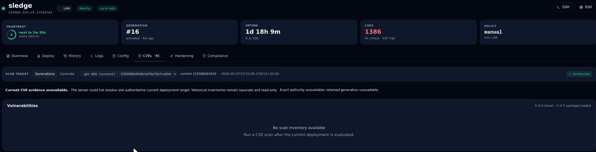

### A2. Scanning summary versus exact revision row

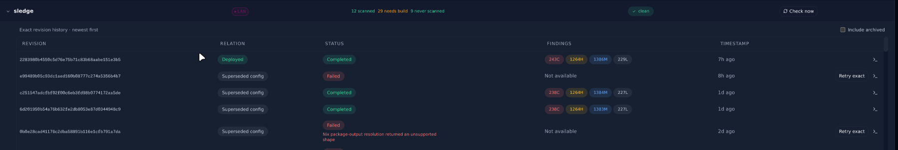

The screenshots are user-provided runtime observations. They do not establish the application SHA, migration version, exact selected scan UUID, or cause of the missing retained binding.

## Appendix B. Source index and inspection coverage

All current repository file references below are pinned to `58006084aa699b84bcb1d02d6f911d4d4ee94ea3`. Unchanged files were inspected at its direct parent, `72c8066323bcc1ef507c853a89852dfd880e469a`; the complete direct-child diff confirms their unchanged contents. MR metadata is a point-in-time read. “Full” describes a file read, not full runtime verification.

| Ref | Source and inspected responsibility | Coverage |
|---|---|---|
| S01 | MR !329: head, source branch, target, pipeline state, reported verification. | Metadata read; reported test results not independently executed. |
| S02 | Frontend view specification. | Full document. |
| S03 | Systems deployment-progress/real-activity/rollback specification. | Full document. |
| S04 | Evaluation and flake snapshot specification. | Full document. |
| S05 | Backend API specification, scan operations and CVE/POA&M contracts. | Relevant contiguous section around lines 820–1040. |
| S06 | Fleet CVE triage specification. | Full document. |
| S07 | Systems list and preview implementation. | List initialization and state; full relevant preview range around 1195–1585. |
| S08 | System Detail composition, selectors, tabs, lifecycle helpers, and tests. | Full source at the inspection base in the preceding inspection; complete current-head delta independently inspected. |
| S09 | Systems adapter, pagination/error handling, and mutation readback. | Full file. |
| S10 | API client target serialization and scan/waiver calls. | Relevant range around 1100–1290. |
| S11 | Systems queries and observational current-revision resolver. | Relevant range around 70–295. |
| S12 | Systems API mapping and commit handler. | Relevant mapping search and commit-handler range around 4130–4224. |
| S13 | Migration 0153, summary view definitions. | Full file; later definition searches performed. |
| S14 | Migration 0177, latest-scan vulnerability view. | Full file; view-definition searches performed. |
| S15 | CVE authorization, candidates, current/historical selection, and inventory reads. | Relevant contiguous ranges through approximately line 1190, plus related test ranges. |
| S16 | Scanning By-system/current summary query. | Relevant range around 1580–1785. |
| S17 | Scanning findings calls and renderer. | Relevant call sites and renderer ranges. |
| S18 | Hardening inventory target/source/attempt query. | Relevant range around 160–400. |
| S19 | Retained-generation producer and reconciliation. | Relevant range around 1200–1479. |
| S20 | CVE component state, authority/empty rendering, and grouping. | Relevant range around 170–400 and related source reads. |
| S21 | Vulnix parser, severity counters, aggregate statistics, and tests. | Full file. |
| S22 | CVE scan persistence and ownership-bound completion. | Relevant range around 1450–1718; statistics producer call located separately. |
| S23 | Systems visual reference. | Full component file. |
| S24 | System Detail visual reference. | Component discovery and revision/CVE/host-override range around 1460–1600. |
| S25 | Hardening visual reference. | Full component file. |
| S26 | Repository agent and documentation instructions. | Full file; no repository writes made. |
| S28 | Current CVE missing-retention and mismatch tests. | Relevant range around 3290–3468; not executed. |
| S29 | Systems route wrapper. | Full file. |
| S30 | Direct-child head commit `58006084`, default resolver, state guards, and tests. | Commit metadata and complete two-file diff; no truncation or remaining pages. |
| S31 | Current-head Hardening browser fixture and added fallback assertions. | Fixture ranges 18200–18485 and complete added test diff. |

[S01]: https://gitlab.com/crystal-forge/crystal-forge/-/merge_requests/329 "MR !329; metadata observed on 2026-09-23"
[S02]: https://gitlab.com/crystal-forge/crystal-forge/-/blob/58006084aa699b84bcb1d02d6f911d4d4ee94ea3/docs/specs/01-frontend-views.md "Frontend view specification"
[S03]: https://gitlab.com/crystal-forge/crystal-forge/-/blob/58006084aa699b84bcb1d02d6f911d4d4ee94ea3/backlog/docs/specs/doc-17%20-%20Spec-Systems-view-live-deployment-progress-real-recent-activity-working-rollback.md "Systems deployment-progress specification"
[S04]: https://gitlab.com/crystal-forge/crystal-forge/-/blob/58006084aa699b84bcb1d02d6f911d4d4ee94ea3/docs/evaluation-flake-snapshots.md "Evaluation and generation evidence specification"
[S05]: https://gitlab.com/crystal-forge/crystal-forge/-/blob/58006084aa699b84bcb1d02d6f911d4d4ee94ea3/docs/specs/02-backend-api.md#L820-1040 "Scan and CVE API contracts"
[S06]: https://gitlab.com/crystal-forge/crystal-forge/-/blob/58006084aa699b84bcb1d02d6f911d4d4ee94ea3/docs/fleet-cve-triage.md "Fleet CVE triage contract"
[S07]: https://gitlab.com/crystal-forge/crystal-forge/-/blob/58006084aa699b84bcb1d02d6f911d4d4ee94ea3/packages/web-ui/src/views/systems_list.rs "Systems list and preview implementation"
[S08]: https://gitlab.com/crystal-forge/crystal-forge/-/blob/58006084aa699b84bcb1d02d6f911d4d4ee94ea3/packages/web-ui/src/views/system_detail.rs "System Detail implementation and tests"
[S09]: https://gitlab.com/crystal-forge/crystal-forge/-/blob/58006084aa699b84bcb1d02d6f911d4d4ee94ea3/packages/web-ui/src/systems/adapter.rs "Systems adapter"
[S10]: https://gitlab.com/crystal-forge/crystal-forge/-/blob/58006084aa699b84bcb1d02d6f911d4d4ee94ea3/packages/web-ui/src/api/client.rs#L1100-1290 "Security target serialization and requests"
[S11]: https://gitlab.com/crystal-forge/crystal-forge/-/blob/58006084aa699b84bcb1d02d6f911d4d4ee94ea3/packages/default/crates/cf-server/src/queries/systems.rs#L70-295 "Observational current-revision resolution"
[S12]: https://gitlab.com/crystal-forge/crystal-forge/-/blob/58006084aa699b84bcb1d02d6f911d4d4ee94ea3/packages/default/crates/cf-server/src/handlers/api/systems.rs "System DTO mapping and commit handler"
[S13]: https://gitlab.com/crystal-forge/crystal-forge/-/blob/58006084aa699b84bcb1d02d6f911d4d4ee94ea3/packages/default/crates/cf-server/migrations/0153_rebuild_views_with_greatest_timestamps.sql "Systems summary views"
[S14]: https://gitlab.com/crystal-forge/crystal-forge/-/blob/58006084aa699b84bcb1d02d6f911d4d4ee94ea3/packages/default/crates/cf-server/migrations/0177_optimize_cve_scan_read_path.sql "Legacy latest-scan vulnerability projection"
[S15]: https://gitlab.com/crystal-forge/crystal-forge/-/blob/58006084aa699b84bcb1d02d6f911d4d4ee94ea3/packages/default/crates/cf-server/src/queries/cves.rs "CVE source, authority, and inventory queries"
[S16]: https://gitlab.com/crystal-forge/crystal-forge/-/blob/58006084aa699b84bcb1d02d6f911d4d4ee94ea3/packages/default/crates/cf-server/src/queries/scanning.rs#L1580-1785 "Scanning system summary query"
[S17]: https://gitlab.com/crystal-forge/crystal-forge/-/blob/58006084aa699b84bcb1d02d6f911d4d4ee94ea3/packages/web-ui/src/views/scanning.rs "By-system findings call and findings renderer"
[S18]: https://gitlab.com/crystal-forge/crystal-forge/-/blob/58006084aa699b84bcb1d02d6f911d4d4ee94ea3/packages/default/crates/cf-server/src/queries/hardening_scans.rs#L160-400 "Hardening inventory target and evidence resolution"
[S19]: https://gitlab.com/crystal-forge/crystal-forge/-/blob/58006084aa699b84bcb1d02d6f911d4d4ee94ea3/packages/default/crates/cf-server/src/queries/evaluation_snapshots.rs#L1200-1479 "Generation retention producer"
[S20]: https://gitlab.com/crystal-forge/crystal-forge/-/blob/58006084aa699b84bcb1d02d6f911d4d4ee94ea3/packages/web-ui/src/components/cve/mod.rs#L170-400 "CVE component state and availability rendering"
[S21]: https://gitlab.com/crystal-forge/crystal-forge/-/blob/58006084aa699b84bcb1d02d6f911d4d4ee94ea3/packages/default/crates/cf-server/src/vulnix/vulnix_parser.rs "Scan counter definitions and tests"
[S22]: https://gitlab.com/crystal-forge/crystal-forge/-/blob/58006084aa699b84bcb1d02d6f911d4d4ee94ea3/packages/default/crates/cf-server/src/queries/cve_scans.rs#L1450-1718 "Scan observation persistence and completion"
[S23]: https://gitlab.com/crystal-forge/crystal-forge/-/blob/58006084aa699b84bcb1d02d6f911d4d4ee94ea3/docs/design/CrystalForge/components/Systems.jsx "Systems visual reference"
[S24]: https://gitlab.com/crystal-forge/crystal-forge/-/blob/58006084aa699b84bcb1d02d6f911d4d4ee94ea3/docs/design/CrystalForge/components/SystemDetail.jsx#L1460-1600 "Revision and CVE visual reference"
[S25]: https://gitlab.com/crystal-forge/crystal-forge/-/blob/58006084aa699b84bcb1d02d6f911d4d4ee94ea3/docs/design/CrystalForge/components/HardeningTab.jsx "Hardening visual reference"
[S26]: https://gitlab.com/crystal-forge/crystal-forge/-/blob/58006084aa699b84bcb1d02d6f911d4d4ee94ea3/AGENTS.md "Repository workflow and documentation boundaries"
[S28]: https://gitlab.com/crystal-forge/crystal-forge/-/blob/58006084aa699b84bcb1d02d6f911d4d4ee94ea3/packages/default/crates/cf-server/src/queries/cves.rs#L3290-3468 "Current inventory rejection tests"
[S29]: https://gitlab.com/crystal-forge/crystal-forge/-/blob/58006084aa699b84bcb1d02d6f911d4d4ee94ea3/packages/web-ui/src/views/systems.rs "Systems wrapper"

[S30]: https://gitlab.com/crystal-forge/crystal-forge/-/commit/58006084aa699b84bcb1d02d6f911d4d4ee94ea3 "Current-head default-selection change; complete diff inspected"
[S31]: https://gitlab.com/crystal-forge/crystal-forge/-/blob/58006084aa699b84bcb1d02d6f911d4d4ee94ea3/checks/web-ui/tests/integration-test.js#L18200-18610 "New head-default test and its Hardening fixture"
