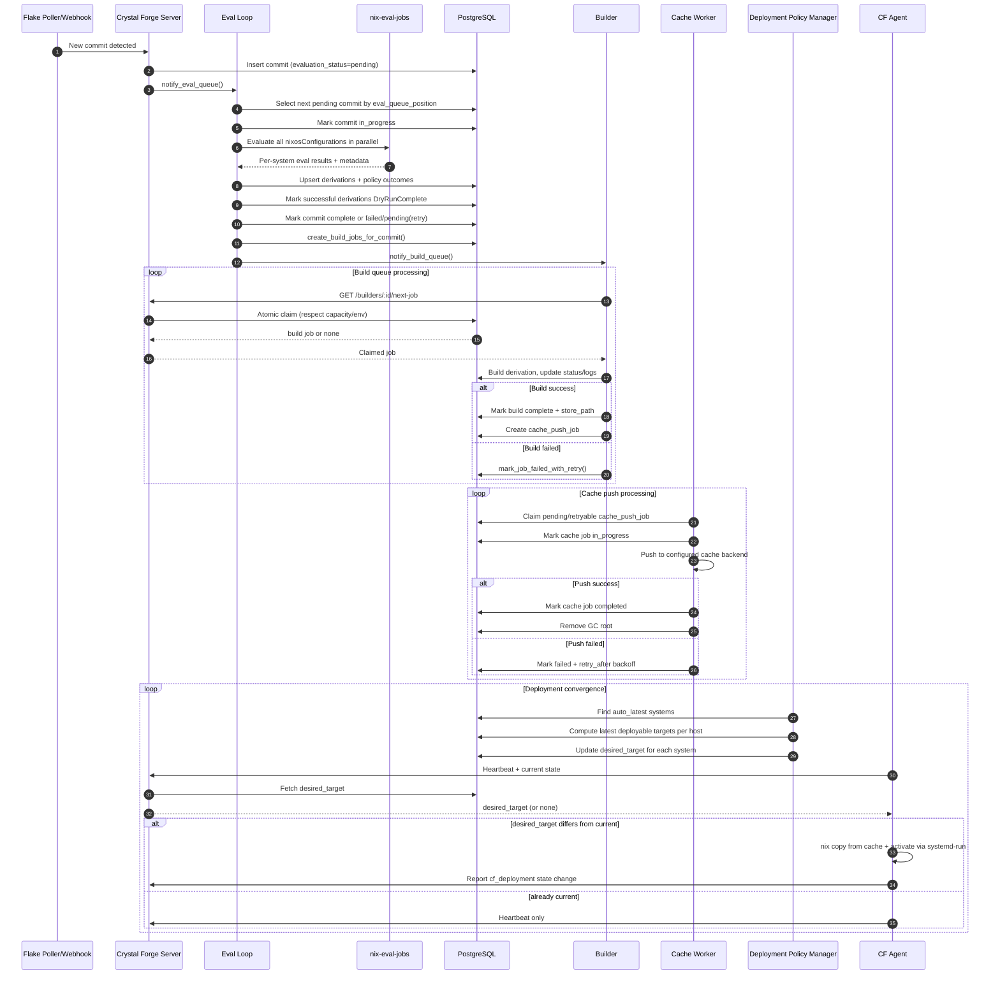

# Commit -> Eval -> Build -> Cache -> Deploy Sequence

This sequence diagram shows who talks to whom and in what order.

## Mermaid Sequence Diagram

## Reading Guide

- `notify_eval_queue()` reduces wait time by waking eval processing immediately.
- Eval ordering is user-controllable through queue position.
- Builders and cache workers are separate stages with separate retry behavior.
- Deployment is driven by `desired_target` updates and agent heartbeats.
