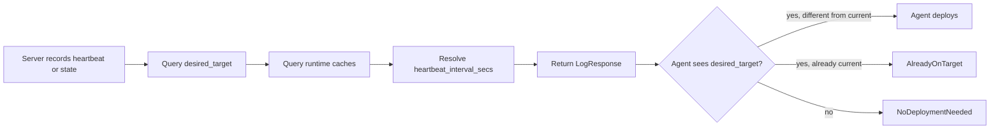

# Agent POST types and deployment command response

This concept holds the agent-to-server request and response contract of the agent heartbeat and state endpoints. The persistence decision that follows each POST is in [Agent heartbeat, state, deployment, and history logic](../deployment/agent-heartbeat-vs-state-persistence.md).

## Agent POST types

The agent POSTs a full `SystemState` payload to the server. The `change_reason`
field describes why the agent is sending the payload, but it is not by itself
authoritative enough to classify history.

Common values:

| `change_reason` | Meaning | Should usually create history? |
| --- | --- | --- |
| `heartbeat` | periodic agent loop | no, if state is equivalent |
| `startup` | agent process started | no, if same boot and same generation; yes if new generation after switch; yes as reboot if boot_id changed |
| `state_delta` | generic state delta; older agents may send this every heartbeat | no, if state is equivalent; yes if generation/store path changed |
| `config_change` | on-host config activation | yes |
| `cf_deployment` | agent applied a Crystal Forge desired target | yes |

Important compatibility rule:

> Older agents may emit `state_delta` for every periodic heartbeat. The server
> must still run equivalence checks for `state_delta` and write only an
> `agent_heartbeats` row when nothing meaningful changed.

## Deployment command response

The heartbeat write path does **not** control whether the agent receives deploy
commands. The server still returns `LogResponse` after recording either a
heartbeat or a state row.

Therefore, treating old-agent `state_delta` as heartbeat-eligible is safe:

- unchanged `state_delta` writes to `agent_heartbeats`
- genuinely changed `state_delta` still writes to `system_states`
- `desired_target` is still returned either way
- older agents can still receive and apply deployment commands

### Current limitation: detached CF deployment attribution

> **Status:** Current limitation documented in the source as of commit 3b23d36f. The pending deployment context that the numbered list below describes is documented in [Authoritative system_events timeline](../data-model/system-events-timeline.md#pending-deployment-context). This migration did not compare the limitation with the current agent code in `packages/default/crates/cf-agent/src/deployment/agent.rs`.

Normal store-path deployment currently starts activation through a detached
`systemd-run --no-block` unit and returns `DeploymentResult::Started`. That path
logs that deployment started, but it does not itself synchronously write a
follow-up `system_states` row with `change_reason = cf_deployment` before the
agent process may be restarted by activation.

Because of that, the next report after activation can arrive as `startup`,
`config_change`, or `state_delta`. Unless deployment context is persisted across
the detached activation, a successful Crystal Forge-initiated activation can be
hard to distinguish from an on-host rebuild after the fact.

Event-backed behavior:

1. When the server sets a desired store-path target, persist pending CF deployment
   context server-side.
2. When `/run/current-system` or the startup heartbeat later reports that target
   store path, record the transition as `cf_deployment_succeeded`.
3. Close the pending context after success, supersession, timeout, or reliable
   failure.

## Related concepts

- [Agent heartbeat, state, deployment, and history logic](../deployment/agent-heartbeat-vs-state-persistence.md)
- [Authoritative system_events timeline](../data-model/system-events-timeline.md)
- [Restart and activation classification](../concepts/restart-and-activation-classification.md)
