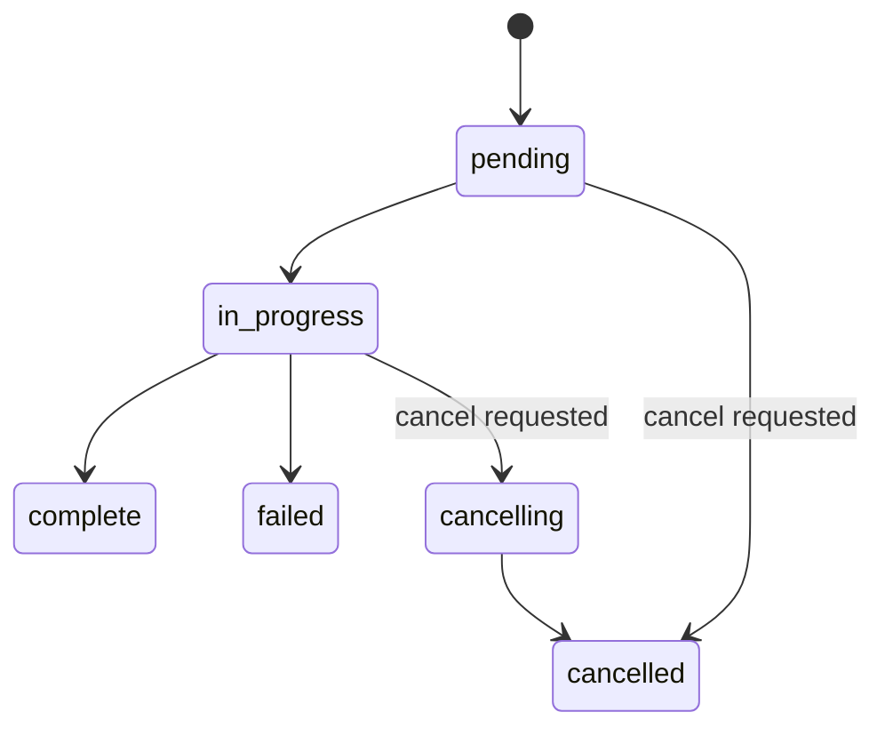
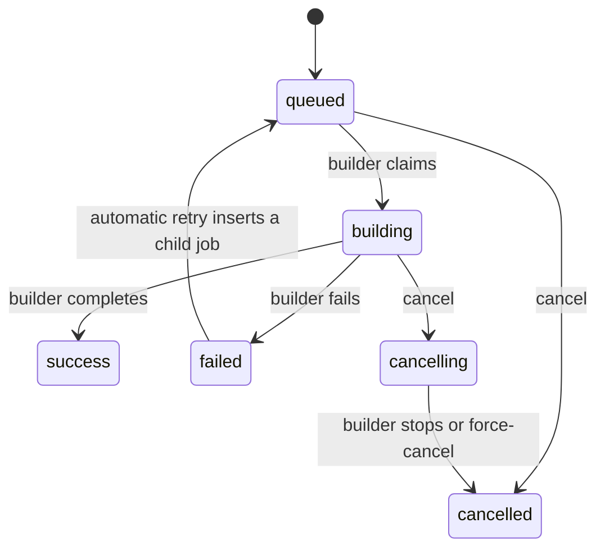

# Builders, queues, environments, dashboard, and admin APIs

## Builders API

Builders are worker processes that build Nix derivations.

### Endpoints

All paths below are relative to `/api/v1` and are registered in `packages/default/crates/cf-server/src/bin/server.rs`. Every administrative builder route requires the Admin role (`require_admin`).

| Method | Endpoint | Role | Description |
|--------|----------|------|-------------|
| GET | `/builders` | Admin | List builders |
| POST | `/builders` | Admin | Register builder |
| GET | `/builders/:id` | Admin | Get builder details |
| PATCH | `/builders/:id` | Admin | Update builder |
| DELETE | `/builders/:id` | Admin | Deactivate builder (`deactivate_builder`) |
| DELETE | `/builders/:id/permanent` | Admin | Delete builder permanently |
| PUT | `/builders/:id/public-key` | Admin | Replace builder public key |
| POST | `/builders/:id/regenerate-keypair` | Admin | Regenerate builder key pair |
| PATCH | `/builders/:id/environments` | Admin | Update builder environment assignment |
| GET | `/builders/:id/metrics` | Admin | Builder metrics |

Builder-authenticated routes (`/builders/resolve-id`, `/builders/:id/session`, `/builders/:id/heartbeat`, `/builders/:id/next-job`, `/builders/:id/jobs/...`, `/builders/:id/cve-scans/...`) use signed builder requests, not browser sessions. See [Builder request authentication](../security/builder-request-authentication-and-data-in-transit.md).

No route pauses or resumes a builder, and no per-builder job-list route exists. List and get require Admin. To stop a builder from receiving work, an operator deactivates it or updates it with `PATCH /builders/:id`.

### Builder States

| State | Meaning |
|-------|---------|
| active | Builder session established and builder heartbeating (`establish_builder_session` sets `active`) |
| inactive | Default status of a newly registered builder (`builders.status` default) |
| offline | Set by the offline-builder sweep in `queries/builders.rs` |
| draining | Allowed by the CHECK constraint and `BuilderStatus::Draining`; no code path that sets it was found |

The `builders.status` CHECK constraint allows exactly these four values (`migrations/0083_create_builders_infrastructure.sql`, `migrations/0124_add_builder_ui_fields.sql`).

---

## Evaluation Queue API

The evaluation queue manages commit evaluations (nix-eval-jobs runs).

### Endpoints

| Method | Endpoint | Role | Description |
|--------|----------|------|-------------|
| GET | `/commits/eval-queue` | Viewer+ (environment-scoped for non-Admin) | Get evaluation queue with status |
| POST | `/commits/eval-queue/reorder` | Operator+ | Change queue order |
| GET | `/commits/eval-history` | Viewer+ | Terminal evaluation history |
| POST | `/commits/:commit_id/re-evaluate` | Admin | Re-queue a commit evaluation |
| POST | `/commits/:commit_id/cancel-evaluation` | Operator+ | Request cooperative cancellation |
| POST | `/commits/:commit_id/force-cancel-evaluation` | Operator+ | Force cancellation |
| GET | `/commits/:commit_id/eval/stream` | Viewer+ | Live evaluation log stream |
| GET | `/commits/:commit_id/eval/logs` | Viewer+ | Stored evaluation log history |

### GET /commits/eval-queue

Query parameters (`EvalQueueParams`): `limit` (default 200, clamped to the server maximum), `status`, `flake`, `search`, and `latest_only`.

The response is an `EvalQueueSummary`. Counts describe the filtered domain. `items[]` holds one entry per commit.

```json
{
  "active_count": 1,
  "completed_count": 40,
  "successful_count": 38,
  "failed_count": 2,
  "domain_total": 1,
  "filtered_total": 1,
  "execution_mode": "real",
  "items": [
    {
      "commit_id": 123,
      "flake_id": 1,
      "flake_name": "nixos-configs",
      "branch": "main",
      "commit_hash": "abc123...",
      "commit_message": "Update system configs",
      "author": "Example Author",
      "committed_at": "2026-03-02T12:00:00Z",
      "enqueued_at": "2026-03-02T12:00:05Z",
      "is_latest_per_flake": true,
      "evaluation_status": "in_progress",
      "queue_position": 1,
      "systems": ["nixos-desktop", "nixos-server"],
      "system_count": 2,
      "passed_count": 1,
      "policy_failed_count": 0,
      "eval_failed_count": 0,
      "attempt_number": 1,
      "parent_attempt_id": null,
      "root_attempt_id": null,
      "available_at": null
    }
  ],
  "timestamp": "2026-03-02T12:01:00Z"
}
```

`execution_mode` is `real` or `mock`. Per-system results appear as counts (`passed_count`, `policy_failed_count`, `eval_failed_count`) and as `systems` names. The queue does not list per-system status values. The live stream carries those (see [WebSocket Streaming](api-overview-errors-and-streaming.md#websocket-streaming)).

### POST /commits/eval-queue/reorder

**Request (registered shape, `ReorderEvalQueueRequest`):**
```json
{
  "ordered_commit_ids": [123, 124, 125]
}
```

The handler accepts `ordered_commit_ids`, a complete ordered list, and returns `400` for an invalid reorder request (`handlers/api/commits.rs`, `reorder_eval_queue`).

### Evaluation States

`commits.evaluation_status` takes these values (`commits_evaluation_status_check`, migration `0113_add_eval_cancellation_support.sql`):



`complete`, `failed`, and `cancelled` end an attempt. `POST /commits/:commit_id/re-evaluate` (Admin) queues the commit again. It answers `queued: false` when an evaluation is already active. At server start, `cancelling` becomes `cancelled`, and `in_progress` returns to `pending`.

**Per-system results** are not stored as a status on the queue item. The live stream reports `pending`, `evaluating`, `success`, `failed`, `policy_failed`, and `queued_for_build` for each system.

**Key Invariant:** Only ONE commit can have `evaluation_status = 'in_progress'` at a time. The unique index `idx_commits_single_in_progress` enforces this across `in_progress` and `cancelling` (`migrations/0113_add_eval_cancellation_support.sql`).

---

## Build Queue API

The build queue manages Nix derivation builds.

### Endpoints

| Method | Endpoint | Role | Description |
|--------|----------|------|-------------|
| GET | `/build-jobs` | Viewer+ | Get a bounded page of pending/in-progress builds |
| GET | `/build-jobs/recent` | Viewer+ | Get a bounded page of terminal build attempts |
| GET | `/build-jobs/:id` | Viewer+ | Get one exact visible attempt and its active or completed collection |
| POST | `/build-jobs/:id/cancel` | Admin | Cancel a build job |
| POST | `/build-jobs/:id/force-cancel` | Admin | Force-cancel a build job |
| POST | `/build-jobs/:id/requeue` | Operator+ | Re-queue a build job |
| POST | `/build-jobs/:id/prioritize` | Operator+ | Prioritize a queued job |
| POST | `/build-jobs/:id/move-up` | Operator+ | Move a queued job up |
| POST | `/build-jobs/:id/move-down` | Operator+ | Move a queued job down |
| POST | `/build-queue/reorder` | Operator+ | Reorder the queue (`{"ordered_job_ids": [...]}`) |
| GET | `/build-jobs/:job_id/logs/stream` | Viewer+ | Live build log stream |

No registered route queues a derivation directly. The server creates a build job when evaluation succeeds. Non-Admin callers see only jobs in their environment memberships (`visibility_user_id` in `list_build_queue`).

The exact build-attempt endpoint applies the caller's environment visibility in
the primary-key query. It returns `404 Not Found` for both missing attempts and
attempts outside the caller's visibility scope. This behavior prevents attempt
identity disclosure. Exact lookup does not expand either paginated list and does
not treat a UUID as ordinary text search.

### Build States

`build_jobs.status` takes these values (`migrations/0103_expand_build_job_status_for_cancellation.sql`):



A failed attempt stays `failed`. An automatic retry inserts a **new** `queued` job that links to its parent (see [Derivation status lifecycle](../concepts/derivation-status-lifecycle.md)).

Cache publication has its own record. `cache_push_jobs.status` takes `pending`, `in_progress`, `completed`, `failed`, `cancelled`, and `permanently_failed` (`migrations/0092_enhance_cache_push_jobs_for_ui.sql`). The server registers `/api/v1/cache-push-jobs` routes to list, inspect, retry, and cancel those jobs. See [Cache push process](../caches/cache-push-process.md).

---

## Environments API

Environments group systems logically.

### Endpoints

| Method | Endpoint | Role | Description |
|--------|----------|------|-------------|
| GET | `/environments` | Authenticated (membership-scoped for non-Admin) | List environments |
| POST | `/environments` | Admin | Create environment |
| GET | `/environments/:id` | Authenticated (membership-scoped for non-Admin) | Get environment |
| PATCH | `/environments/:id` | Admin | Update environment |
| DELETE | `/environments/:id` | Admin | Delete environment (`409` while systems are assigned) |
| GET | `/environments/:id/policies` | Authenticated (membership-scoped) | Get environment with required policies |
| PATCH | `/environments/:id/policies` | Admin | Replace required policy IDs |
| GET | `/environments/policies-map` | Authenticated (membership-scoped) | Environment-to-policy map |
| GET | `/policies` | Authenticated | List policies |

The environment handlers use `authenticated_user_roles`, `highest_role`, and `Role::can_manage_environments` (Admin only) in `handlers/api/environments.rs`. List and get filter by environment membership for non-Admin callers. `GET /policies` requires a valid session and no particular role.

---

## Dashboard API

Aggregated fleet data.

### Endpoints

| Method | Endpoint | Role | Description |
|--------|----------|------|-------------|
| GET | `/dashboard/summary` | Viewer+ (environment-scoped for non-Admin) | Fleet summary |
| GET | `/dashboard/activity` | Viewer+ (environment-scoped for non-Admin) | Recent activity |

Only `/api/v1/dashboard/summary` and `/api/v1/dashboard/activity` are registered. The CVE dashboard routes (`/cves/summary`, `/cves/vulnerabilities`, `/cves/top-systems`, `/cves/scan-freshness`) are Admin-only (`handlers/api/dashboard.rs`).

### GET /dashboard/summary

The response is a `DashboardSummary`:

```json
{
  "fleet_health": { "healthy": 8, "warning": 1, "critical": 0, "offline": 1 },
  "deployment_status": { "up_to_date": 7, "behind": 2, "never_deployed": 1, "unknown": 0 },
  "cve_summary": { "critical": 0, "high": 3, "medium": 12, "low": 20 },
  "total_systems": 10,
  "active_builds": 1,
  "build_queue": {
    "building_count": 1,
    "queued_count": 3,
    "failed_24h_count": 0,
    "active_workers": 2,
    "total_workers": 2
  },
  "cache_health": {
    "status": "healthy",
    "destination_count": 1,
    "enabled_destination_count": 1,
    "successful_pushes_24h": 12,
    "failed_pushes_24h": 0,
    "last_activity_at": "2026-03-02T12:00:00Z"
  },
  "recent_deployments": [],
  "timestamp": "2026-03-02T12:01:00Z"
}
```

`build_queue` has more worker-slot fields than this example shows. `cache_health` is absent when no cache reports data. The `cache_health.status` values are defined by `CacheHealthStatus` in `api/models.rs`. Non-Admin callers see counts for their environments only.

### GET /dashboard/activity

The response is a JSON array of `DashboardActivity` items. Each item has a stable `id`, a `kind` (`deployment`, `build`, or `evaluation`), a `status`, `occurred_at`, `title`, and optional links (`system_id`, `flake_id`, `commit_id`, `commit_hash`, `build_job_id`, `deployment_id`, `evaluation_attempt_id`). The `limit` query parameter defaults to 30.

---

## Admin API

Admin-only endpoints for user and system management.

### Users Management

| Method | Endpoint | Role | Description |
|--------|----------|------|-------------|
| GET | `/admin/users` | Admin | List users |
| POST | `/admin/users` | Admin | Create user |
| PATCH | `/admin/users/:id` | Admin | Update user |
| DELETE | `/admin/users/:id` | Admin | Delete user |

### Audit Log

| Method | Endpoint | Role | Description |
|--------|----------|------|-------------|
| GET | `/admin/audit-events` | Admin | List audit events |

**Query Parameters (`AuditEventsQuery`):**
```bash
GET /api/v1/admin/audit-events?from=2024-01-01&to=2024-01-31&actor=john&action=...&page=1&per_page=50
```

### OIDC Mappings

| Method | Endpoint | Role | Description |
|--------|----------|------|-------------|
| GET | `/admin/oidc-mappings` | Admin | List mappings |
| POST | `/admin/oidc-mappings` | Admin | Create or update a mapping by group name (`upsert_oidc_mapping`) |
| DELETE | `/admin/oidc-mappings/:id` | Admin | Delete mapping |

### Other registered admin routes

`GET /admin/server-info`, `GET`/`PUT /admin/classification-config`, `GET`/`PUT /admin/automatic-retry-policy`, `GET /admin/setup-progress`, `POST /admin/setup-wizard/dismiss`, `POST /admin/setup-wizard/agent-acknowledge`, and `GET /admin/config-health`. The `server-info`, `classification-config`, and `automatic-retry-policy` routes require the Admin role (`require_admin`).

The audit query parameters are `from`, `to`, `actor`, `action`, `page`, and `per_page`. The role label `Admin` is the highest role. `AuthRole` has Admin, Operator, and Viewer.

## Related concepts

- [Backend API overview, error codes, and WebSocket streaming](api-overview-errors-and-streaming.md)
- [Systems API](systems-api.md)
- [Fleet CVE Triage](fleet-cve-triage-api.md)
- [API authentication, sessions, and role-based authorization](../security/api-authentication-and-authorization.md)
