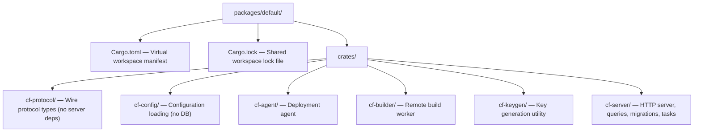
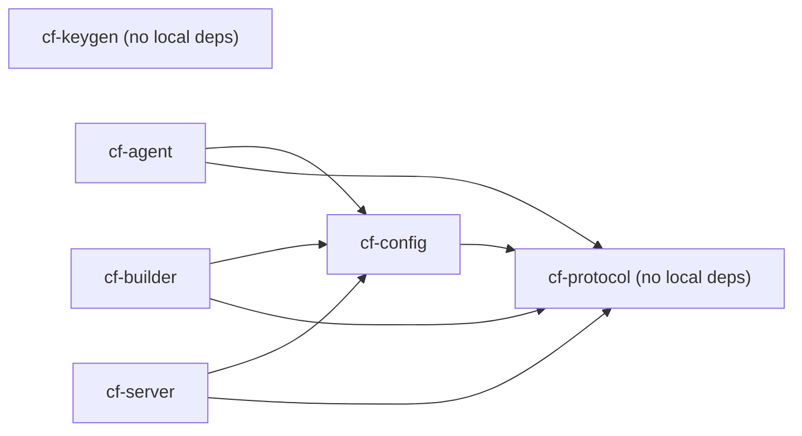

# Crystal Forge Backend — Workspace Architecture

> **Status:** The original file `packages/default/WORKSPACE.md` now holds a short pointer to this concept. The six crates exist under `packages/default/crates/`, and `cf-server` does not list `cf-agent` or `cf-builder` as dependencies.

This document describes the Cargo workspace layout after the crate split
introduced in TASK-395. Each production component is independently selectable
by Cargo and independently buildable by Nix.

## Workspace layout



## Crate boundaries

| Crate | Binary | Purpose | Key deps |
|---|---|---|---|---|
| `cf-protocol` | — | Wire types (builder↔server, agent↔server) | serde, chrono |
| `cf-config` | — | TOML/env config loading | cf-protocol, config, serde |
| `cf-agent` | `agent` | NixOS deployment agent | cf-protocol, cf-config, nix, reqwest, sysinfo |
| `cf-builder` | `builder` | Remote Nix build worker | cf-protocol, cf-config, reqwest |
| `cf-keygen` | `cf-keygen` | Ed25519 keypair generator | ed25519-dalek, rand |
| `cf-server` | `server`, `test-agent`, `hardening-worker`, `config-inspector-worker`, `xccdf-export-fixture` | API server, DB, jobs | sqlx, axum, cf-protocol, cf-config |

### Dependency direction



`cf-keygen` and `cf-protocol` have no local crate dependencies. Their labels
record that fact; the arrows represent only local dependency edges.

`cf-server` does NOT depend on `cf-agent` or `cf-builder`. The Nix `server`
output joins the server, builder, and keygen binaries, but each is built from
its own separate derivation. The Nix `server` output does not include the agent
binary; the `agent` output joins `cf-agent` and `cf-keygen`.

## Targeted Cargo checks

```bash
# Check only the agent (no SQLx, Axum, or server deps compiled):
SQLX_OFFLINE=true cargo check -p cf-agent --all-targets --manifest-path packages/default/Cargo.toml

# Check only the builder:
SQLX_OFFLINE=true cargo check -p cf-builder --all-targets --manifest-path packages/default/Cargo.toml

# Check only the server:
SQLX_OFFLINE=true cargo check -p cf-server --all-targets --manifest-path packages/default/Cargo.toml

# Check the key generation utility:
cargo check -p cf-keygen --manifest-path packages/default/Cargo.toml

# Check all workspace members:
SQLX_OFFLINE=true cargo check --workspace --all-targets --manifest-path packages/default/Cargo.toml

# Run targeted tests:
SQLX_OFFLINE=true cargo test -p cf-agent --manifest-path packages/default/Cargo.toml
SQLX_OFFLINE=true cargo test -p cf-builder --manifest-path packages/default/Cargo.toml
SQLX_OFFLINE=true cargo test -p cf-protocol --manifest-path packages/default/Cargo.toml
SQLX_OFFLINE=true cargo test -p cf-config --manifest-path packages/default/Cargo.toml
```

## Targeted Nix builds

```bash
# Build the deployment agent (does NOT build server/builder packages):
nix build .#agent --no-link

# Build the server (joins cf-server + cf-keygen + builder; not the agent):
nix build .#server --no-link

# Build the remote builder:
nix build .#builder --no-link

# Build the key generation utility:
nix build .#cf-keygen --no-link

# Legacy full workspace build (all components):
nix build . --no-link
```

## Forbidden dependency boundaries

The acceptance criteria require these dependency exclusions:

### `cf-agent` must NOT depend on:
- `sqlx`, `postgres`, PostgreSQL clients
- `axum`
- `openidconnect`, `jsonwebtoken`, `argon2`
- Server query/task/handler modules

Verify: `cargo tree -p cf-agent --bin agent | grep -iE 'sqlx|axum|argon|oidc|jwt'`
→ expected: no output

### `cf-builder` must NOT depend on:
- `sqlx`, `postgres`, PostgreSQL clients
- Server-only authentication, query, handler, or background-task code

Verify: `cargo tree -p cf-builder --bin builder | grep -iE 'sqlx|axum|argon|oidc|jwt'`
→ expected: no output

> **Status:** historical. The "Timing evidence" section records measurements taken at the TASK-395 split. It is not a current benchmark.

## Timing evidence

Baseline (before split, full monolithic crate, SQLX_OFFLINE=true, warm cache):
- `cargo check --bin agent`: 35.23s
- `cargo check --bin builder`: 31.98s
- `cargo check --bin server`: 29.55s

After split (clean build, SQLX_OFFLINE=true):
- `cargo check -p cf-agent --all-targets`: 13.93s (58 crates)
- `cargo check -p cf-builder --all-targets`: 11.24s
- `cargo check -p cf-server --all-targets`: 68s (full server dep graph)

After split (incremental, no changes):
- `cargo check -p cf-agent --all-targets`: 0.25s

The targeted agent and builder checks no longer compile the server crate
dependency set (sqlx, axum, openidconnect, argon2, etc.).

## Known follow-ups

- **SystemState unification** (open): `cf-server/src/models/system_states.rs` contains
  a second `SystemState` definition (with `sqlx::FromRow`). Once server row
  types are cleanly split from protocol DTOs, the server copy should delegate
  to `cf_protocol::agent::SystemState`. (P1, deferred at the TASK-395 split.)

## SQLx offline metadata

Two SQLx metadata directories exist, and their file lists differ:

- `packages/default/.sqlx` (workspace root). The Nix server build reads this directory.
- `packages/default/crates/cf-server/.sqlx` (crate directory).

**Unresolved:** TASK-451 in the Backlog tracks the reconciliation. Until it closes, a change to a checked server query MUST keep the directory that the Nix build reads current. Verify with the Nix server build, and do not assume that the crate-level directory is the source of truth.

The preparation command `cargo sqlx prepare --workspace` from `packages/default` was not rechecked against the two directories. Run SQLx preparation only against an isolated local database that this repository started.

## Related concepts

- [Local development workflow](../operations/local-development-workflow.md) - running the stack and key files
- [Core components](../components/core-components.md) - what the agent, server, and builder do

## Migration verification notes

Scope: crate layout, dependency direction, forbidden dependencies, binaries, Nix outputs, and SQLx metadata location were compared with the manifests and `packages/default/default.nix`. Not checked: the Cargo and Nix command lines in the check sections (not run), the "Timing evidence" measurements (historical), and `cargo sqlx prepare` behavior.

- Claim: "The server includes the agent and builder binaries alongside it in the Nix `server` output."
  Finding: The `server` output joins `cf-server-drv`, `cf-builder-drv`, and `cf-keygen-drv`. It does not include the agent. The `agent` output joins `cf-agent-drv` and `cf-keygen-drv`.
  Evidence: `packages/default/default.nix` (`server`, `agent` symlinkJoin).
  Case: documentation stale (corrected in place).
- Claim: `cf-server` binaries are `server` and `test-agent`.
  Finding: `cf-server` also builds `hardening-worker`, `config-inspector-worker`, and `xccdf-export-fixture`.
  Evidence: `packages/default/crates/cf-server/Cargo.toml` (`[[bin]]` entries).
  Case: documentation stale (corrected in place).
- Claim: `cf-agent` and `cf-builder` must not depend on `sqlx`, `axum`, OIDC, JWT, or Argon2.
  Finding: Their manifests list only `cf-config` and `cf-protocol` as local dependencies and none of those crates. The crate docs repeat the rule. `cargo tree` was not run.
  Evidence: `crates/cf-agent/Cargo.toml`, `crates/cf-builder/Cargo.toml`, `crates/cf-agent/src/lib.rs`, `crates/cf-builder/src/lib.rs`.
  Case: implemented.
- Claim: Follow-up 1: `DeploymentPolicy` and `DeploymentPolicyKind` are duplicated in `cf-protocol` and `cf-server`.
  Finding: `cf-protocol` holds no `DeploymentPolicy` or `DeploymentPolicyKind`. `cf-server` defines `DeploymentPolicy` twice (`models/systems.rs` and `models/deployment_policies.rs`).
  Evidence: `rg DeploymentPolicy crates/cf-protocol` (no match); `crates/cf-server/src/models/systems.rs`, `models/deployment_policies.rs`.
  Case: documentation stale (the completed follow-up is removed from the body).
- Claim: Follow-up 2: a second `SystemState` exists in `cf-server`.
  Finding: Still true. `cf-server` `SystemState` derives `FromRow`; it does not delegate to `cf_protocol::agent::SystemState`.
  Evidence: `crates/cf-server/src/models/system_states.rs`, `crates/cf-protocol/src/agent.rs`.
  Case: implementation incomplete relative to the proposed follow-up.
- Claim: Server SQLx metadata lives at `crates/cf-server/.sqlx/`.
  Finding: Both `packages/default/.sqlx` (141 entries) and `crates/cf-server/.sqlx` (138 entries) exist and differ. The Nix server build requires the workspace-root `.sqlx`.
  Evidence: `packages/default/default.nix` (`serverRootPaths`, COMPATIBILITY comment), TASK-451.
  Case: documentation stale (the SQLx section now states both directories and the unresolved TASK-451 reconciliation).
