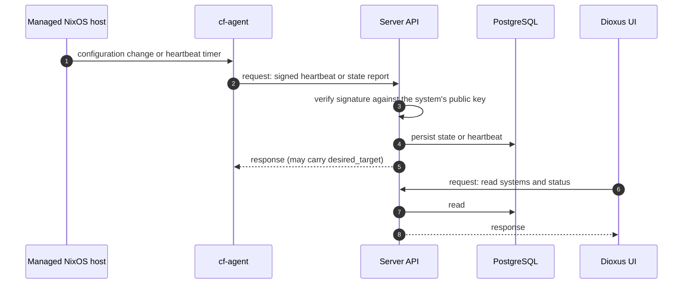
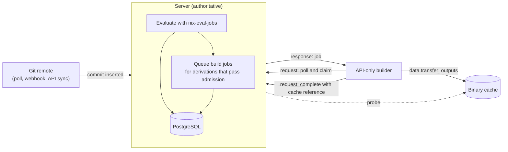
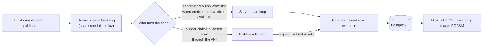
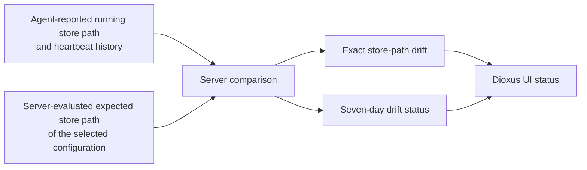

# Data Flows

Every flow below passes through the server. The UI reads results through the
server API. Arrows labeled `request` start at the requester.

## 1. Agent state reporting

`POST /agent/state` and `POST /agent/heartbeat` verify the `X-Signature`
header against the registered public key before the server persists anything.
Which of the two the server stores is decided by the equivalence check in
[Agent heartbeat versus state persistence](../deployment/agent-heartbeat-vs-state-persistence.md).

## 2. Commit evaluation, build, and cache

The server evaluates; the builder realizes. See
[Wakeups and polling](event-driven-queues.md) for how each step discovers work.

## 3. CVE scanning

The server's scan loop always recovers expired remote scan leases and
reconciles scan prerequisites. It runs vulnix itself only when the local
executor is enabled and vulnix is available. See
[Exact-CVE evidence authority](../cves/exact-cve-evidence-authority-and-inventory-reads.md).

## 4. Drift detection

The server compares the store path the agent reports as running with the store
path of the selected, server-evaluated configuration (`EvaluationDrift`). It
derives a separate seven-day drift status from persisted system-state and
heartbeat observations. The expected path comes from server evaluation, not
from a builder.

## 5. Evaluation and flake snapshot flow

PRIMARY evaluates system derivations and policies. It also emits one
revision-scoped flake-output projection without per-host exploration. A separate
durable Config Inspector worker can extract complete option metadata, safe
values, and module provenance for an exact commit and configuration after
PRIMARY succeeds. Config Explorer first reuses exact certified V2 or scoped
observations. It queues bounded observational Nix only when persisted evidence
cannot answer the requested scope. Explorer data never becomes policy or
deployment input. See
[Evaluation and Flake Snapshot Architecture](../evaluation/evaluation-flake-snapshot-architecture.md)
for ownership, lifecycle, comparison, retention, redaction, authorization, and
compatibility contracts. See
[Config Explorer Architecture](../evaluation/config-explorer-architecture.md) for lazy
observation, failure containment, cache, and authority boundaries.

## Related concepts

- [Ecosystem architecture summary](ecosystem-architecture-summary.md) - the one-page diagram
- [Core components](../components/core-components.md) - what each component owns
- [Wakeups and polling](event-driven-queues.md) - queue discovery and ordering
- [Commit to deploy flow](../workflows/commit-eval-build-cache-deploy-flow.md) - the end-to-end flow chart
