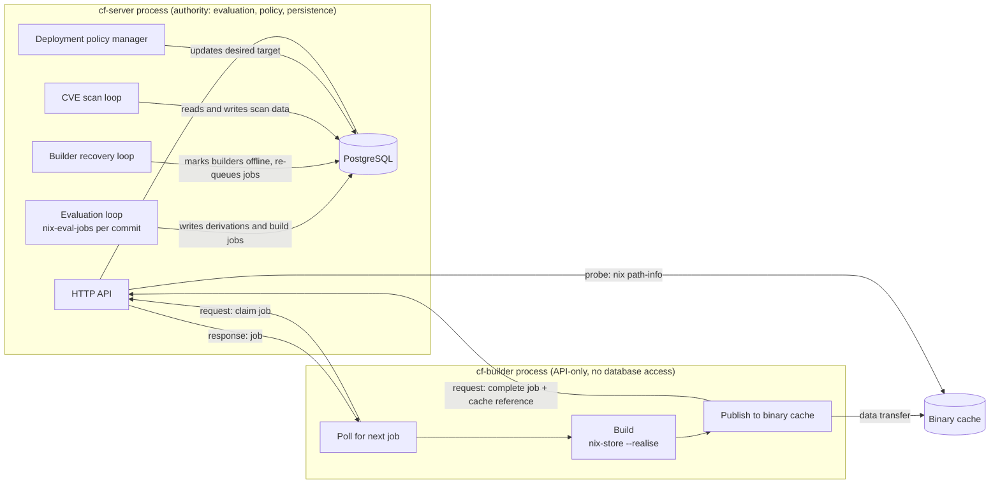

# Server background tasks and builder work loops

Each pipeline stage has one owning process. The server owns authoritative
evaluation, persistence, recovery, policy, and job coordination. The API-only
builder owns Nix realization and cache publication. The builder reaches the
server only through the signed, session-checked API.

Arrows labeled `request` start at the requester. Unlabeled arrows are
dependency or sequence. The builder holds no database connection.

## Server tasks

`spawn_background_tasks` (`cf-server/src/server/mod.rs`) starts these tasks.
The list below names the ones that carry the evaluation, build, and policy
pipeline.

### Evaluation loop

- **Function:** `run_commit_evaluation_loop` calls `process_pending_commits`.
- **Picks:** commits with `evaluation_status = 'pending'` and a `queued`
  evaluation attempt whose `available_at` has passed, ordered by
  `eval_queue_position DESC`, then `commit_timestamp DESC`, then `id DESC`.
- **Wakeup:** a `QueueNotifier` notification, the fallback tick
  `flakes.commit_evaluation_interval` (default 60 seconds), or the earliest
  queued retry-due time. See
  [wakeups and polling](event-driven-queues.md).
- **Action:** `nix-eval-jobs` evaluates all `nixosConfigurations` of one commit
  inside `cf-server`. The atomic finalize step writes each derivation as
  `dry-run-complete` and queues build jobs for derivations that pass the
  admission check.
- **Admission:** a build job is queued only for a derivation with
  `cf_agent_enabled` and `policy_requirements_met` true.

### Builder recovery loop

- **Function:** `run_builder_recovery_loop`.
- **Interval:** `max([builder] heartbeat_interval, 15 s)`; the default builder
  heartbeat is 30 seconds.
- **Action:** marks `active` builders offline after
  `max(3 × max(heartbeat, 15 s), 60 s)` without a heartbeat (90 seconds at the
  default), re-queues `building` jobs owned by a missing, offline, or disabled
  builder, and re-queues build-eligible derivations that lack a build job.

### CVE scan loop

- **Function:** `run_cve_scan_loop`, spawned with a registered background-job
  handle that starts enabled.
- **Interval:** `vulnix.poll_interval` (default 60 seconds).
- **Action:** stale-scan recovery, prerequisite reconciliation, operator-queued
  scans, post-build scans, and periodic rescans, governed by the persisted scan
  schedule policy. Builders can also claim scans through
  `/api/v1/builders/:id/cve-scans/claim`, so a scan runs either on the server
  or on a builder.

### Deployment policy manager

- **Function:** `update_auto_latest_policies` in the deployment policy manager.
- **Interval:** `deployment.deployment_poll_interval`. The configuration
  struct default is 60 seconds. The NixOS module default is 15 minutes.
- **Action:** for systems with the `auto_latest` policy, updates `desired_target`
  to the latest successful derivation, subject to the deployment policies
  described in [Deployment policies](../deployment/deployment-policies.md).

## Builder work

### Build

- **Discovery:** the builder polls the server API at `builder.poll_interval`
  (default 5 seconds) and claims the next eligible job. Claim eligibility and
  ordering are in [wakeups and polling](event-driven-queues.md#claim-eligibility-and-ordering).
- **Action:** `nix-store --realise` runs on the builder host, with Nix
  resolving dependencies. In `source_re_evaluate_verified` mode the builder
  first re-evaluates the canonical source and compares the result with the
  server-authorized derivation path. That check verifies the server's build
  plan. It does not replace server evaluation. See
  [verified-source evaluator contract](../builders/verified-source-evaluator-contract.md).

### Cache publication

- **Where:** on the builder, after a successful build. The server does not run
  a cache-push worker (`run_cache_push_workers` is not started).
- **Reporting:** the builder sends `cache_pushed` and a `cache_reference` with
  the job-completion request. The server rejects the request with `409` when
  the reference matches no active cache destination, and when
  `nix path-info --store <push_to> <store path>` does not find the path within
  30 seconds. A verified report records a completed `cache_push_jobs` row.
- **Backends:** Nix store/HTTP, S3, and Attic destinations, as configured in
  the cache destination.

## Related concepts

- [Derivation status lifecycle](../concepts/derivation-status-lifecycle.md) - status IDs each stage uses
- [Wakeups and polling](event-driven-queues.md) - how queued work is discovered and ordered
- [Cache push process](../caches/cache-push-process.md) - cache publication details
- [Deployment flow](../deployment/deployment-flow.md) - how the agent consumes `desired_target`
