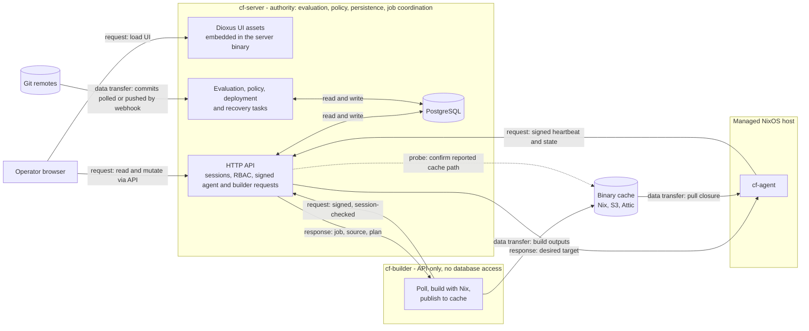

# Ecosystem architecture summary

Crystal Forge has one authoritative process, the server, and two kinds of
remote participants that reach it over HTTPS: agents on managed NixOS hosts
and API-only builders. Operators use the Dioxus web UI, which the server
serves and which talks only to the server API.

How to read the diagram:

- Solid arrows labeled `request` start at the requester. `response` is the
  reply to that request. `data transfer` moves bytes. A dotted arrow is a
  server-initiated check.
- No component other than the server connects to PostgreSQL. A builder holds
  no database connection. The builder starts every connection to the server:
  it polls for jobs and sends heartbeats, and the server does not push work to
  it.
- The UI never calls PostgreSQL, the builder, or the agent directly.

## Components

| Component | Owns | Does not own |
| --- | --- | --- |
| **Server** (`cf-server`) | Authoritative evaluation (`nix-eval-jobs`), policy and deployment decisions, persistence, authentication and authorization, the job queue, builder liveness recovery, CVE evidence and scheduling, the embedded UI | Nix realization and cache upload |
| **Dioxus web UI** (`packages/web-ui`) | Presentation and interaction for dashboards, systems, flakes, builds, evaluations, CVEs, compliance, and administration | Persistence or authorization decisions; it calls the server API |
| **Builder** (`cf-builder`) | Realizing derivations with Nix, cache publication, reporting results and logs, optional builder-side CVE scans, and verified-source re-evaluation when that strategy is configured | The database, authoritative evaluation, and policy decisions |
| **Agent** (`cf-agent`) | Reporting host state, receiving the desired target in the server's response, pulling from the cache, and activating the configuration locally | Choosing the target |
| **PostgreSQL** | System of record, accessed only by the server | |

Verified-source re-evaluation verifies the server-authorized build plan: the
builder re-evaluates the canonical source and compares the result with the
server's derivation path. It does not produce an alternative authoritative
evaluation. See [Remote builder execution strategies](../builders/remote-build-execution-strategies.md).

## Legacy and optional surfaces

Grafana is not part of the current product architecture. Two surfaces remain
in the repository at this revision:

- The NixOS module `modules/nixos/crystal-forge/default.nix` still defines an
  optional `dashboards` configuration and a conditional `services.grafana`.
- The integration check `checks/integration/default.nix` still starts Grafana
  and runs dashboard tests.

New product guidance uses the Dioxus UI and the server API. Retiring the
optional Grafana configuration and its test coverage is separate work. See the
[cleanup record](../meta/cleanup-record.md).

## Related concepts

- [Core components](../components/core-components.md)
- [Data flows](data-flows.md)
- [Wakeups and polling](event-driven-queues.md)
- [Crystal Forge system overview](../overview/system-overview.md)
- [Project introduction and key features](../overview/project-introduction-and-key-features.md)
