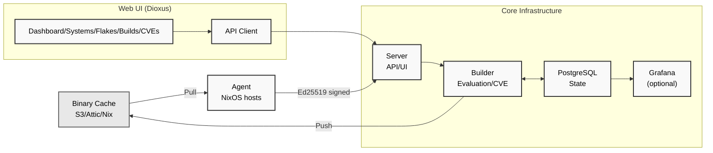

# Ecosystem architecture summary

> **Status:** partial. This concept holds the `Architecture` and `Components` sections of the repository `README.md`. The diagram shows the agent connecting to the server with Ed25519 signatures. It also shows an arrow from the server to the builder and from the builder to PostgreSQL. The repository architecture rules in `AGENTS.md` state that API-only builders do not access the database directly (see [Builder architecture and job scheduling](../builders/builder-architecture-and-job-scheduling.md)). The arrows `S --> B` and `B <--> P` are therefore verification candidates against `packages/default/crates/cf-builder/` and `packages/default/crates/cf-server/`.

## Architecture

## Components

| Component      | Description                                                            |
| -------------- | ---------------------------------------------------------------------- |
| **Agent**      | Runs on each NixOS host, monitors config changes, reports fingerprints |
| **Server**     | API, web UI, coordinates builds, manages deployments                   |
| **Builder**    | Evaluates NixOS flakes, builds derivations, runs CVE scans             |
| **PostgreSQL** | Centralized state, user/role data, compliance history                  |

## Related concepts

- [Core components](../components/core-components.md)
- [Data flows](data-flows.md)
- [Crystal Forge system overview](../overview/system-overview.md)
- [Project introduction and key features](../overview/project-introduction-and-key-features.md)
