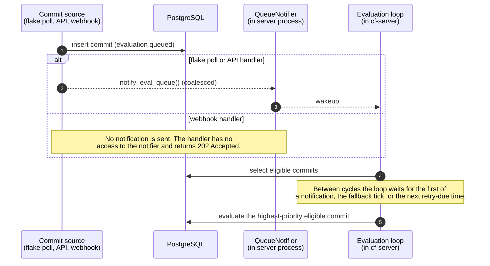
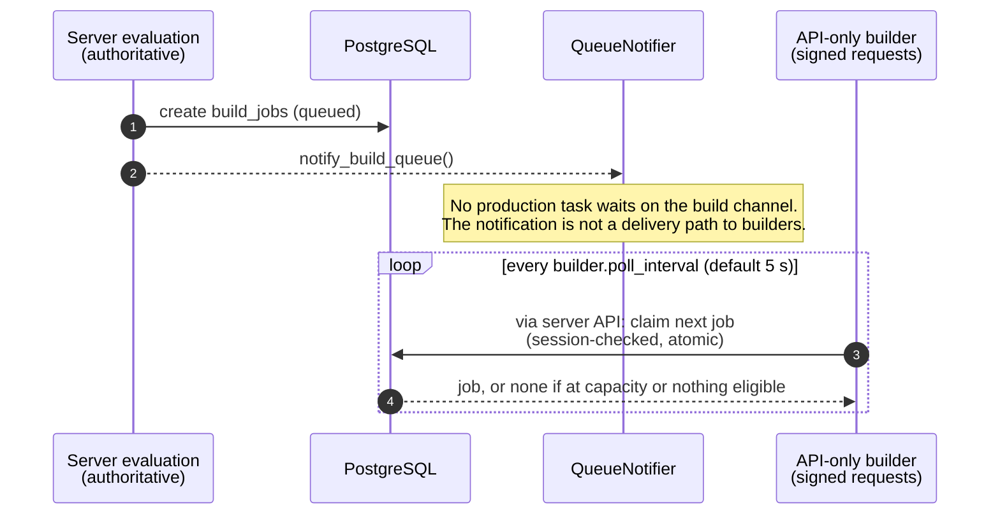

# Evaluation and build queue wakeups and polling

Two queues feed the pipeline. They are discovered in different ways. This page
states which mechanism applies to each queue.

| Queue | Who consumes it | How new work is discovered |
| --- | --- | --- |
| Evaluation queue (commits) | The `run_commit_evaluation_loop` task inside `cf-server` | In-process wakeup from `QueueNotifier`, plus a fallback tick and a durable retry-due wakeup |
| Build queue (`build_jobs`) | API-only `cf-builder` processes | The builder polls the server API for the next job. The server-side build wakeup has no waiter. |

## The in-process wakeup channel

`QueueNotifier` (`cf-server/src/queue/mod.rs`) holds two bounded channels of
capacity 1, one for evaluation and one for builds. A notification is a
fire-and-forget `try_send`. It never blocks the sender. When a wakeup is
already pending, the new notification is coalesced into it. A closed receiver
is ignored. A wakeup is a hint to look at the database, not a unit of work.
The database rows are the source of truth.

The channel exists only inside the `cf-server` process. A separate builder
process cannot wait on it.

## Evaluation queue

Arrows mean: solid = data written or read, dashed = wakeup hint.

Producers that call `notify_eval_queue()`: the flake polling loop after it
inserts commits, and the API handlers for re-evaluation, flake sync, and the
related manual actions (`handlers/api/commits.rs`, `flakes.rs`, `systems.rs`).

The webhook handler (`handlers/webhook.rs`) accepts a push payload, returns
`202 Accepted`, and inserts the commit in a spawned task. It does not notify
the queue. A webhook-inserted commit is therefore evaluated at the next
evaluation-loop wake-up, which is at most one fallback interval away
(`flakes.commit_evaluation_interval`, default 60 seconds) unless another
producer or a retry-due time wakes the loop earlier.

Latency claims: an API-triggered or flake-poll-triggered commit starts
evaluation without waiting for the fallback tick. A webhook-triggered commit
waits for the next wake-up. No path is "zero latency".

The loop also scans for flake changes every `flakes.flake_polling_interval`
(default 600 seconds), independent of webhooks.

### Eligibility and ordering

A commit is eligible when `evaluation_status = 'pending'`, it has an
`evaluation_attempts` row in status `queued` whose `available_at` has passed,
and its source is not archived. Eligible commits are ordered by
`COALESCE(eval_queue_position, 0) DESC`, then `commit_timestamp DESC`, then
`id DESC`. Operators can reorder the queue with
`POST /api/v1/commits/eval-queue/reorder`. The loop evaluates one commit at a
time.

At startup the evaluation loop first resets stuck in-progress evaluations and
stuck builds, cleans up partial derivations, and re-queues build-eligible
derivations that have no build job.

## Build queue

`notify_build_queue()` is called after jobs are queued and during recovery,
but `wait_for_build_work()` has no caller outside tests. Builders discover
work only by polling the server API. The pickup delay is therefore bounded by
the builder's `builder.poll_interval` (default 5 seconds) plus claim
contention, not by the notifier.

### Claim eligibility and ordering

A builder claim (`claim_next_job_atomic`, `queries/builders.rs`) runs in one
transaction. It locks the builder row and checks the builder session. A
session mismatch rejects the claim. It then checks the builder's
`max_concurrent_jobs` against its `building` jobs. If the builder is at
capacity, no job is claimed. Otherwise it claims the first job that satisfies
all of these conditions, using `FOR UPDATE ... SKIP LOCKED`:

- `status = 'queued'` and `available_at <= NOW()`;
- the job's environment matches the builder's environment assignments, or the
  job has no environment, or the builder has no assignments (wildcard);
- the derivation has `cf_agent_enabled` and `policy_requirements_met` true.

Order among eligible jobs is:

1. `queue_position DESC NULLS LAST`,
2. `priority_weight DESC`,
3. the commit's `commit_timestamp DESC NULLS LAST`,
4. `created_at ASC`.

New jobs are appended with `queue_position` greater than every queued or
building job (`MAX(queue_position) + n`). Because the claim takes the highest
position first, the most recently queued batch is claimed first unless an
operator reorders it with `POST /api/v1/build-queue/reorder`. Within a batch
the later derivation id has the higher position. This is newest-first by
position. It is not a FIFO.

### Retry delay

Automatic retries use the singleton `automatic_retry_policy` row: defaults are
2 build retries, 1 evaluation retry, `backoff_seconds` 30 (allowed values 0,
10, 30, 60, 120, 300), and `transient_only` true. A retried attempt becomes
eligible when its `available_at` passes. The evaluation loop wakes at the
earliest queued `available_at`.

## Builder liveness and recovery

The server spawns `run_builder_recovery_loop` at startup. It runs once at
startup and then every `max(builder.heartbeat_interval, 15 s)`. The tick uses
the server's `[builder] heartbeat_interval` (default 30 seconds).

Each cycle:

1. Marks builders with status `active` whose `last_heartbeat_at` is older than
   the stale timeout as `offline`. The timeout is
   `max(3 × max(heartbeat_interval, 15 s), 60 s)`. At the default 30-second
   interval it is 90 seconds.
2. Re-queues `building` jobs whose builder row is missing, not `active`, or
   disabled. The job returns to `queued`, loses its builder and session
   assignment, and receives an audit line in its log.
3. Re-queues build-eligible derivations that have no build job.
4. Calls `notify_build_queue()` when it queued anything.

A recovered job is picked up by the polling rule above.

## Which workers run

The server process starts these queue-related tasks in
`spawn_background_tasks` (`cf-server/src/server/mod.rs`): flake polling, the
evaluation loop, the builder recovery loop, commit artifact hydration, build
log retention, deployment policy management, and the CVE scan loop. It does
not start `run_build_loop` or `run_cache_push_workers`. Those functions exist
in the `cf-server` library but have no caller in the server startup path.
Build execution and cache publication happen in the API-only builder.

## Related concepts

- [Core components](../components/core-components.md) - what the server, builder, and agent own
- [Evaluation and build queue pipeline](../workflows/evaluation-and-build-queue-pipeline.md) - database-side fields and the single-active-evaluation rule
- [Derivation processing loops](derivation-processing-loops.md) - what each loop picks and runs
- [Builder architecture and job scheduling](../builders/builder-architecture-and-job-scheduling.md) - builder assignment, heartbeat, and offline detection
