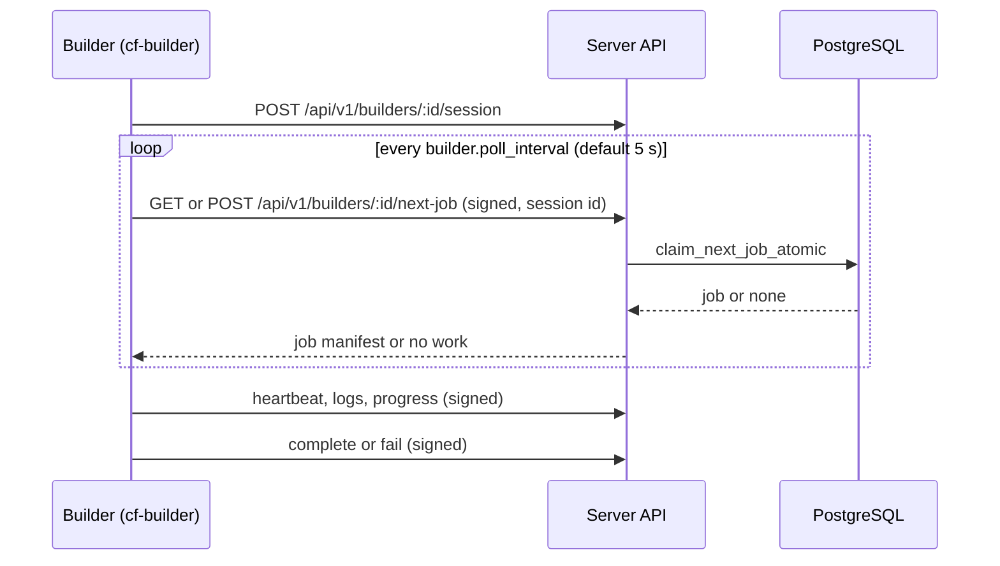

# Multi-Builder API architecture, scheduling, and environment assignment

> **See also:** [Builder trust boundaries and components](builder-trust-boundaries-and-components.md)
> for the security architecture, trust boundary diagrams, threat model, and
> per-strategy firewall rules.

## Overview

The Multi-Builder API lets several builders run on separate hosts under one
Crystal Forge server. A builder is an **API-only** process (`cf-builder`). It
talks to the server through REST endpoints. It never opens a database
connection and never holds repository credentials. When builder-side cache push
is enabled, the server can give a builder narrowly scoped cache push credentials
for one job. See the trust boundary document for those rules.

## Architecture

### Components

- **Server**: Owns persistence, authorization, builder registration, job
  creation, job assignment, and recovery.
- **Builder**: Polls the server for a job, runs the build, publishes the output
  to the binary cache, and reports status through the API.
- **Database**: PostgreSQL tables `builders`, `build_jobs`,
  `builder_metrics`, and `builder_environment_assignments`. Only the server
  reads and writes them.

### Key features

| Feature | Behavior |
| --- | --- |
| Authentication | Each request carries `X-Builder-ID`, `X-Timestamp`, and an Ed25519 signature. The timestamp provides replay resistance. |
| Session binding | A builder process establishes a session (`POST /api/v1/builders/:id/session`) and sends `X-Builder-Session-ID`. The claim, complete, and fail paths reject a request whose session does not match the session stored on the builder row or the job. |
| Authorization | Builder management is admin-only. The work queue accepts only authenticated builder requests. |
| Environment filtering | A builder claims jobs for its assigned environments. A builder with no assignment claims every environment. |
| Concurrency limit | `max_concurrent_jobs` limits the `building` jobs of one builder. |
| Retry | Automatic retry follows the `automatic_retry_policy` row. See [Builder failure phases and retry](builder-failure-phases-and-retry.md). |
| Offline detection | The server marks a builder `offline` after missed heartbeats and re-queues its jobs. See [Heartbeat and offline detection](#heartbeat-and-offline-detection). |



## Environment assignment

### Wildcard builders

A builder with **no** rows in `builder_environment_assignments` is a wildcard
builder. It can claim a job of any environment.

```sql
SELECT COUNT(*) FROM builder_environment_assignments WHERE builder_id = 'uuid';
-- 0 means: wildcard builder
```

### Environment-specific builders

A builder with assignments claims only a job where the job environment is one
of the assigned environments, or where the job has no environment.

```sql
INSERT INTO builder_environment_assignments (builder_id, environment_id)
VALUES ('builder-uuid', 'env-1'), ('builder-uuid', 'env-2');
-- Claimable jobs: environment_id IN ('env-1', 'env-2') OR environment_id IS NULL
```

Use a wildcard builder for development. Use environment-specific builders to
keep production builds on isolated hosts.

## Job claim

`claim_next_job_atomic` (`queries/builders.rs`) runs in one transaction. It
checks the builder session and the `max_concurrent_jobs` limit first. It then
selects the first queued job that meets every eligibility rule, with
`FOR UPDATE ... SKIP LOCKED`, so two builders never claim the same job.

Eligibility rules:

- `status = 'queued'` and `available_at <= NOW()`;
- the environment rule above;
- the derivation has `cf_agent_enabled` and `policy_requirements_met` set.

Order among eligible jobs: `queue_position DESC NULLS LAST`, then
`priority_weight DESC`, then the commit timestamp `DESC NULLS LAST`, then
`created_at ASC`. The claim does not consider the CPU or memory load of a
builder. [Wakeups and polling](../architecture/event-driven-queues.md#claim-eligibility-and-ordering)
explains how `queue_position` is assigned and why the order is newest batch
first.

## Heartbeat and offline detection

A builder sends a heartbeat every `builder.heartbeat_interval` (default 30
seconds). The server updates `last_heartbeat_at` and sets the status `active`.

The server runs `run_builder_recovery_loop` from startup. The loop interval is
`max(builder.heartbeat_interval, 15 s)`. Each cycle:

1. Marks an `active` builder `offline` when `last_heartbeat_at` is older than
   `max(3 x max(heartbeat interval, 15 s), 60 s)`. The default interval gives
   90 seconds.
2. Re-queues each `building` job whose builder row is missing, not `active`, or
   disabled. The job loses its builder and session assignment, returns to
   `queued`, and receives an audit line in its log.
3. Re-queues build-eligible derivations that have no build job.

A re-queued job follows the normal claim rules. Build jobs have no lease expiry
column. Recovery depends only on builder heartbeats. (The `lease_expires_at`
field in the protocol belongs to CVE scan leases.)

## Performance

### Indexes

Migration `0083_create_builders_infrastructure.sql` creates these indexes.
Migration `0192_build_jobs_queue_position.sql` adds the index that serves the
current claim order. Migration `0145_add_builder_api_sessions.sql` adds the
session index.

```sql
-- Original claim order (priority_weight, then age); the claim now sorts by queue_position first
CREATE INDEX idx_build_jobs_queue ON build_jobs(status, priority_weight DESC, created_at ASC)
    WHERE status = 'queued';

-- Current claim order
CREATE INDEX idx_build_jobs_queue_order ON build_jobs (queue_position DESC NULLS LAST)
    WHERE status = 'queued';

-- Active jobs by builder (concurrency tracking)
CREATE INDEX idx_build_jobs_builder_active ON build_jobs(builder_id)
    WHERE status = 'building';

-- Active jobs by builder session
CREATE INDEX idx_build_jobs_builder_session_active
    ON build_jobs(builder_id, builder_session_id) WHERE status = 'building';

-- Environment filtering
CREATE INDEX idx_build_jobs_environment ON build_jobs(environment_id);
```

### Metrics retention

The server keeps all `builder_metrics` rows. The server code at this revision
contains no pruning or aggregation of that table.

## History: migration from direct database access

> **Status:** historical. TASK-140 introduced the builder API while the earlier
> builder still read the database directly. The successor is the API-only
> `cf-builder`. The legacy reservation worker (`build_reservations`,
> `builder/worker.rs`) remains in the `cf-server` library, but the server does
> not start it. See [Wakeups and polling](../architecture/event-driven-queues.md#which-workers-run).

The original rollout plan:

1. Keep the existing builder running with direct database access.
2. Deploy the API infrastructure.
3. Register builders in the UI.
4. Switch the builder binary to the API client.
5. Optionally migrate existing jobs to the `build_jobs` table.

## Not implemented

TASK-140 proposed more enhancements. The code at this revision does not
contain these three:

- load-based builder selection (the claim query ignores builder load);
- aggregation or pruning of `builder_metrics`;
- builder auto-scaling from queue depth.

The proposal also listed shared cache management between builders and builder
health checks beyond the heartbeat. This document did not check those two.

## References

- Task: TASK-140
- Migration: `migrations/0083_create_builders_infrastructure.sql`
- Models: `src/models/builders.rs`
- Queries: `src/queries/builders.rs`
- Handlers: `src/handlers/api/builders.rs`
- Authentication: `src/handlers/builder_request.rs`

## Related concepts

* [Remote builder execution strategies](remote-build-execution-strategies.md) - Explains the remote build execution strategies (source_re_evaluate_verified, server_derivation), the recommended default, source delivery modes, delta derivation materialization, and the forwarded-HTTPS rule for credential-bearing cache push.
* [Builder failure phases and retry strategy](builder-failure-phases-and-retry.md) - Lists the pre-build failure phases a builder reports (source_fetch through build), which of them retry or fail permanently, and the priority-weighting retry and max-retries rules for build jobs.
* [Builder API database schema](../data-model/builder-api-database-schema.md) - Lists the builders, builder_environment_assignments, build_jobs, and builder_metrics tables with their SQL definitions, job states, and retry columns used by the multi-builder API.
* [Builder API: authentication and admin endpoints](../api/builder-api-authentication-and-admin-endpoints.md) - Documents the builder API signature authentication headers and replay window, and the admin endpoints that create, list, update, deactivate, re-key, assign environments to, and read metrics for builders.
* [Builder deployment, configuration, and troubleshooting](../operations/builder-deployment-and-troubleshooting.md) - Explains how to register and deploy a builder (prerequisites, keypair generation, builder configuration, polling loop pseudocode) and how to troubleshoot missing jobs, authentication failures, and jobs that do not retry.
