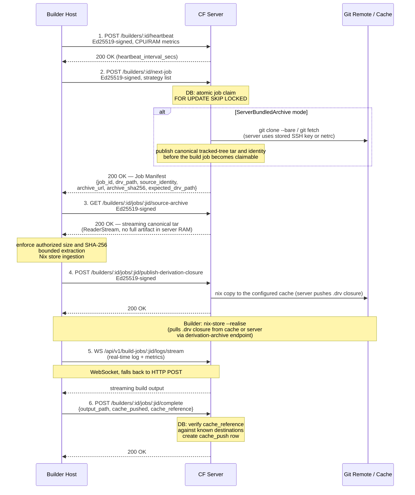
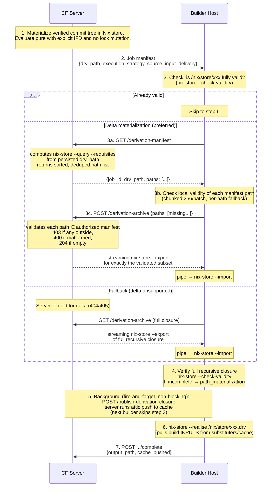
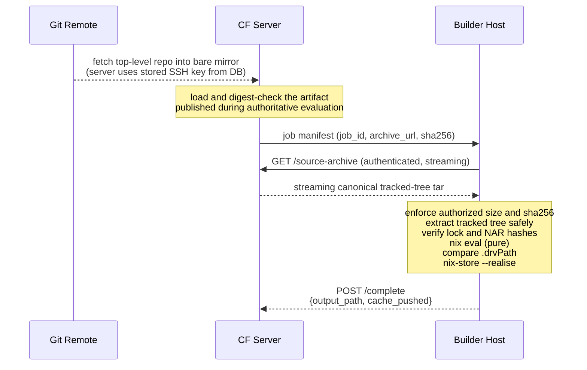
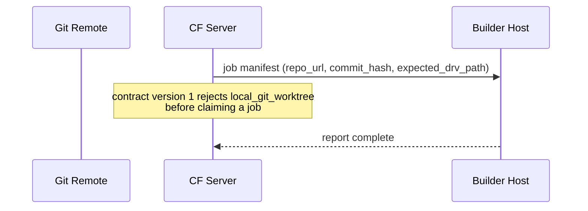

# Builder network flows by execution strategy

## 4. Network Flow Diagrams

### 4.1 Builder Job Lifecycle — Complete Network Picture

### 4.2 ServerDerivation Strategy (No Source Access on Builder)

**Security property of the delta protocol:**
- The server NEVER exports a path just because the builder asked. The server computes the authorized manifest from its own persisted drv_path and enforces requested ⊆ manifest.
- The builder NEVER sends its store inventory. It only names paths from the manifest the server just gave it.
- A builder requesting a path outside the manifest is a **403 FORBIDDEN** (logged with builder and job IDs; path list is NOT logged).
- A builder requesting a non-store path is a **400 BAD REQUEST**.

**Fallback policy:**
- **404/405** from the delta endpoint = `Unsupported` → transparent fallback to the full closure archive GET. The builder never gets stuck waiting for a server that doesn't speak delta.
- **403**, drv path mismatch, malformed response, or import failure = `Fatal` → hard error. Never silently retried as full archive.
- The fallback distinction is encoded in the `DeltaError` enum at the client level, not an ad-hoc string check.

**What the builder can access in this mode:**
- ✅ CF server API (HTTPS) — for drv manifest, drv archive, and job lifecycle
- ✅ Nix binary caches (HTTPS) — for build INPUTS during `nix-store --realise`
- ❌ Git remotes
- ❌ Database
- ❌ Deployment credentials
- ❌ Other builders

**Note:** No Attic/S3 cache is required for the builder to START a build in this mode. The .drv closure (or the delta subset) arrives directly from the CF server via streaming export. Attic is used in the background to warm the cache for subsequent builds. The build INPUTS (nixpkgs, dependencies) still come from Nix substituters.

### 4.3 SourceReEvaluateVerified + ServerBundledArchive Strategy

**What is bundled:** Top-level flake repository only
**What is NOT bundled:** Locked flake inputs (nixpkgs, etc.)
**Implication:** Builder needs substituter access for flake inputs OR inputs must already be in builder's `/nix/store`. Private flake inputs (not nixpkgs) must be: publicly accessible, pre-seeded in the Nix store/cache, or handled by a future full-input-closure mode.

### 4.4 SourceReEvaluateVerified + LocalGitWorktree Strategy

**What the builder can access in this mode:**
- ✅ CF server API (HTTPS)
- ✅ Git remote (builder needs network + credentials for the repo URL)
- ✅ Nix binary caches
- ❌ Database
- ❌ Deployment credentials
- ❌ Repositories NOT listed in the job manifest

**Network rule implication:** Builders in this mode need outbound TCP/22 or TCP/443 to the Git remote. For GovCloud or classified networks, prefer ServerBundledArchive instead.

## Related concepts

* [Remote builder execution strategies](remote-build-execution-strategies.md) - Explains the remote build execution strategies (source_re_evaluate_verified, server_derivation), the recommended default, source delivery modes, delta derivation materialization, and the forwarded-HTTPS rule for credential-bearing cache push.
* [Builder trust boundaries and component definitions](builder-trust-boundaries-and-components.md) - Defines the purpose, trust levels, and component definitions (server, builder, agent) that bound what a Crystal Forge remote builder can reach, hold, and compromise; open it to approve or review builder network and credential exposure.
* [Builder filesystem layout, firewall rules, and network-constrained configuration](../operations/builder-network-and-filesystem-requirements.md) - Gives the builder host filesystem layout and cleanup guarantees, the firewall rules required per execution strategy, the server inbound rules, and example configurations for maximum isolation and for colocated deployments.
* [Builder API: job lifecycle endpoints](../api/builder-job-lifecycle-api.md) - Documents the builder-signed endpoints for heartbeat, next-job polling (including 409 evaluator conflicts), derivation manifest and delta/full derivation archives, job completion, failure, and log append.
