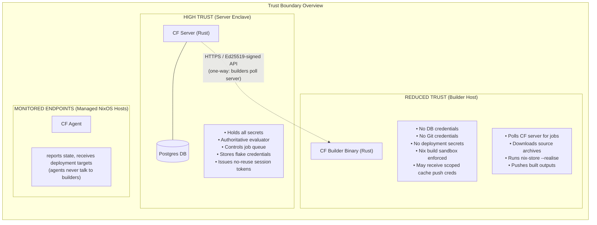

# Builder trust boundaries and component definitions

## Crystal Forge Builder Security Architecture

**Audience:** Network engineers, security architects, and cyber analysts (NSA/DoD context)  
**Classification:** Unclassified // For Official Use  
**Last updated:** 2026-07

> **Status:** The document header above is preserved from the pre-migration builder security architecture document. The date in `Last updated` is the author's date, not a verification date.

## 1. Purpose and Scope

This document defines every network boundary, data flow, credential exposure, and trust boundary that exists between the Crystal Forge server, its remote builders, and external systems. It answers the questions a network or security engineer needs to approve or deny network access rules for builder hosts.

A Crystal Forge **builder** is a host that performs Nix builds. It never talks to a database. It never receives credentials for deployment targets. It is intentionally limited to:

1. Polling the Crystal Forge server for work.
2. Pulling build inputs from authorized Nix binary caches.
3. Reporting build results back to the Crystal Forge server.
4. Optionally pushing completed build outputs to a configured cache using narrowly scoped per-job cache push credentials sent by the server.

Everything else — evaluation, policy enforcement, secret management, deployment authorization — stays on the server or on the agent running on the managed NixOS host.

---

## 2. System Components and Trust Levels

---

## 3. Component Definitions

### 3.1 Crystal Forge Server

**Role:** Central authority. Only component with database access and credential storage.

| Property | Value |
|---|---|
| Language | Rust (Axum web framework) |
| Database | PostgreSQL (private network, no external exposure) |
| Auth outbound | Ed25519 verification of builder requests; OIDC for human users |
| Network exposure | HTTPS API (configurable port, typically 443/8443) |
| Secrets held | Flake Git credentials (SSH keys / netrc); OIDC client secrets; DB password |
| Evaluator | `nix-eval-jobs` evaluates a verified Nix store source in pure mode with explicit IFD policy |
| Source mirroring | Server maintains bare Git mirrors at `source_archive_root/mirrors/` |
| Source artifacts | Canonical tracked-tree tar files at `source_archive_root/artifacts/<mirror_id>/<commit>.tar` |

**The server is the only component that touches private Git remotes or
repository credentials.** Credentials apply only to mirror fetches. The server
exports the tracked commit tree before Nix store ingestion, so credentials and
Git worktree metadata cannot enter the authorized source NAR.

### 3.2 Crystal Forge Builder

**Role:** Isolated build executor. Talks only to the CF server and Nix binary caches.

| Property | Value |
|---|---|
| Language | Rust |
| Database access | **None.** Zero DB credentials. Zero DB network access required. |
| Git access | **None** when `ServerBundledArchive` is configured (recommended for GovCloud) |
| Network outbound | CF server HTTPS; Nix binary cache HTTPS (configurable substituters) |
| Secrets held | Its own Ed25519 private key (`/var/lib/crystal-forge/builder-api.key`). When builder-side cache push is enabled, the next-job response may also include narrowly scoped cache push credentials. |
| Authentication | Per-request Ed25519 signature on all API calls to the CF server |
| Session scope | Builder session ID scoped to process lifetime; server validates ownership per job |
| Build isolation | Nix sandbox enabled; `--restrict-eval`, no impure by default |

**A builder that is compromised gives an attacker:**
- The builder's Ed25519 private key (allows claiming build jobs only)
- Per-job cache push credentials, when builder-side cache push is enabled and the server has authorized credential transport for that job
- Access to build job outputs before they reach the cache
- No DB access, no deployment credentials, no Git credentials, no other builders' keys

### 3.3 Crystal Forge Agent

**Role:** NixOS host monitor. Reports system state to the server. Receives deployment targets. Never communicates with builders.

| Property | Value |
|---|---|
| Network outbound | CF server HTTPS (heartbeat and state reports only) |
| Auth | Ed25519-signed state reports |
| Deployment | Pull-based: reads `desired_target` store path from server heartbeat response, calls `nixos-rebuild switch --flake <cache-path>` |
| Credentials | Its own private key; no Git credentials; no builder credentials |

## 14. Relationship to Other Crystal Forge Documentation

| Document | Covers |
|---|---|
| `multi-builder-api.md` | API reference: endpoints, request/response schemas, retry logic |
| `eval-build-deploy-flow.md` | End-to-end commit → eval → build → deploy flowchart |
| `architecture.md` | High-level component overview, queue notification system |
| `deployment-policies.md` | Policy evaluation (server-side), not builder-specific |
| `store-path-flow.md` | Nix store path lifecycle and cache push flow |
| `auth-session-security.md` | Human user session security (separate from builder key auth) |
| **`builder-security-architecture.md`** | **This document** — builder boundaries, trust model, firewall rules |

> **Status:** The document names in the table above are the pre-migration file names. The content of those documents now lives in the knowledge bundle; use the related concepts below.

## Related concepts

* [Remote builder execution strategies](remote-build-execution-strategies.md) - Explains the remote build execution strategies (source_re_evaluate_verified, server_derivation), the recommended default, source delivery modes, delta derivation materialization, and the forwarded-HTTPS rule for credential-bearing cache push.
* [Builder network flows by execution strategy](builder-network-flows-by-strategy.md) - Shows the network sequence diagrams for the builder job lifecycle and for ServerDerivation, SourceReEvaluateVerified with ServerBundledArchive, and LocalGitWorktree, including the delta derivation protocol security properties.
* [Builder request authentication and data in transit](../security/builder-request-authentication-and-data-in-transit.md) - Specifies the per-request Ed25519 signing protocol, replay protection, session scoping, the exact permissions of the builder private key, and the classification of every data flow between builder, server, Git, and cache.
* [Builder threat model](../security/builder-threat-model.md) - Analyzes what an attacker obtains from a compromised builder, a malicious job claim, source archive tampering, and request replay, and which defenses (digest check, derivation_mismatch, timestamp window) apply.
* [Builder filesystem layout, firewall rules, and network-constrained configuration](../operations/builder-network-and-filesystem-requirements.md) - Gives the builder host filesystem layout and cleanup guarantees, the firewall rules required per execution strategy, the server inbound rules, and example configurations for maximum isolation and for colocated deployments.
