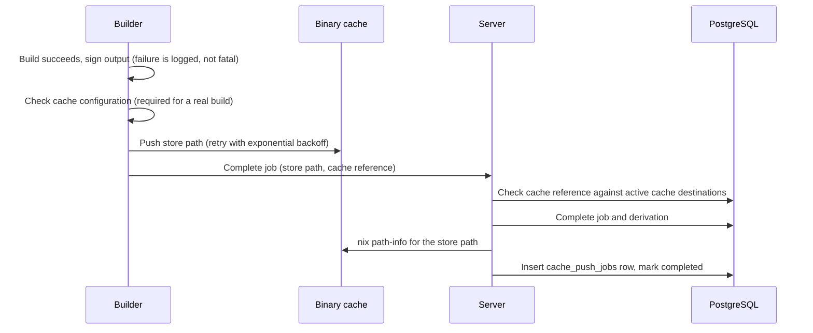

# Cache Push Process

The **builder** publishes a build output to the binary cache. The **server**
verifies the publication and records it. The record makes the artifact
deployable.

## Builder side

For a real (non-mock) build, the builder does these steps in order:

1. **Sign.** If a signing key is configured, the builder signs the output
   (`nix store sign --recursive`). A signing failure is logged and does not
   fail the job.
2. **Check the configuration.** The cache must be enabled for the target
   (`push_after_build` is true and the target name matches `push_filter`, if
   set), a push command must be derivable, and a cache reference must exist
   (`attic_cache_name` for Attic, `push_to` for the other types). If any is
   missing, the builder fails the job as a deterministic build-phase failure.
   The builder never reports a deployable build without a cache.
3. **Push with retry.** The push runs with a per-attempt timeout
   (`push_timeout_seconds`, default 3600). A failed attempt waits
   `retry_delay_seconds x 2^attempt` and tries again, up to `max_retries`
   retries. Some errors are terminal and are not retried: TLS and certificate
   errors, an unresolvable host name, and "no substituter that can build it".
   A final failure fails the job with the failure class that the error text
   gives. The job retry policy then decides whether to queue another attempt.
4. **Report.** The builder calls the complete route with the store path and the
   cache reference.

The builder checks for an operator cancellation before signing, before the
push, during the push, and before the completion report. A cancelled job does
not report success.

## Server side

The complete route (`POST /api/v1/builders/:id/jobs/:job_id/complete`) works
in this order:

1. It authenticates the signed request and checks that the builder owns the
   job. A reported cache reference must match an active cache destination.
   Otherwise the server responds `409`, before the job completes.
2. It commits the job and derivation completion. The call is idempotent for the
   same builder and session.
3. When the builder reported a push, the server loads the derivation's
   `store_path`, runs `nix path-info --store <push_to> <store_path>` with a
   30-second timeout, and requires success. A failed probe returns `409`. The
   job completion stays committed, but the artifact has no completed cache
   row, so it is not deployable.
4. It inserts a `cache_push_jobs` row (or reuses a pending, in-progress, or
   retryable failed one) and marks it `completed`. This step also promotes CVE scans that wait for cache
   publication and removes the server-local output GC root of the derivation.

A derivation is deployable only with a `completed` row whose `store_path`
equals `derivations.store_path`. See
[Store path flow](../workflows/store-path-flow.md).

### Completion without a builder-side push

If a completion carries no cache reference (a builder that predates
builder-side push, or a mock-execution builder), the server inserts a
`cache_push_jobs` row in the pending state on first completion. The server does
not start a task that processes pending rows. Such an artifact stays
undeployable until a row with the exact store path is `completed`.

## Cache types

| Type | Push command | Reference the builder reports |
| --- | --- | --- |
| `nix` | `nix copy` to the `push_to` store URL | `push_to` |
| `http` | `nix copy` to the `push_to` store URL | `push_to` |
| `s3` | `nix copy --to <push_to>`, with S3 options (region, profile, endpoint, credentials) | `push_to` |
| `attic` | `attic push <cache name> <store path>` with token authentication | `attic_cache_name` |

## Cache configuration

| Setting | Meaning |
| --- | --- |
| `push_after_build` | Enables pushing. Without it, a real build fails the cache check. |
| `push_filter` | Pushes only a target whose name contains one of these strings |
| `signing_key` | Key file for the signing step |
| `parallel_uploads` | Concurrent uploads (default 1) |
| `compression` | Passed to `nix copy` as `--compression` |
| `force_repush` | Adds a refresh flag so an existing path is pushed again |
| `push_timeout_seconds` | Timeout of one push attempt (default 3600) |
| `max_retries`, `retry_delay_seconds` | Retry count and the base of the backoff |

## The `cache_push_jobs` table

- One row records one cache publication of one derivation and store path.
- Columns include the status, attempt count, push size, push duration, and
  error text. Statuses include `pending`, `in_progress`, `completed`, and
  `failed`.
- The row is separate from the derivation status.
- Operators can list, inspect, retry, and cancel rows through
  `/api/v1/cache-push-jobs` and its bulk routes. Retrying a row does not push
  anything by itself. No started server task consumes pending rows.

## Server-side cache worker (not started)

The `cf-server` library contains a server-side cache worker
(`builder/cache_worker.rs`: `run_cache_push_workers`, `run_cache_push_loop`,
`process_cache_pushes`). It claims pending `cache_push_jobs` rows and pushes
with exponential backoff. `spawn_background_tasks` does not start it, and no
other caller exists. It is a retirement candidate. See the
[cleanup record](../meta/cleanup-record.md).

## Related concepts

- [Server background tasks and builder work loops](../architecture/derivation-processing-loops.md) - which loops run
- [Derivation status lifecycle](../concepts/derivation-status-lifecycle.md) - the cache-pushed status
- [Commit to deploy sequence](../workflows/commit-eval-build-cache-deploy-sequence.md) - the whole pipeline in order
- [S3 cache (MinIO) quickstart](s3-minio-cache-quickstart.md) - an S3 example
