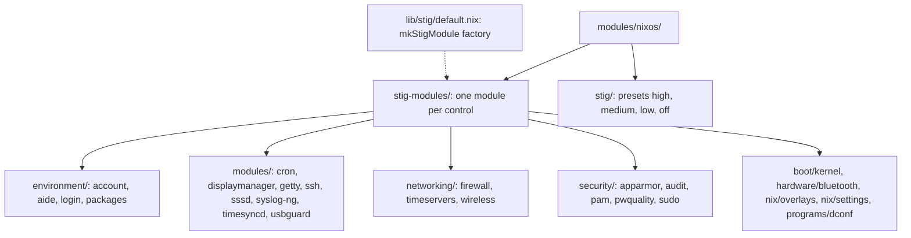

# Crystal Forge STIG Module System

## Overview

The STIG module system provides declarative compliance configuration for NixOS systems through Crystal Forge. It gives fine-grained control over individual STIG (Security Technical Implementation Guide) controls. Disabling a control requires a written justification.

## Architecture

### Core Components

The system has four layers:

1. **`mkStigModule` function** (`lib/stig/default.nix`): A factory that generates a NixOS module for one STIG control.
2. **Control modules** (`modules/nixos/stig-modules/`): One module per control. Each calls `mkStigModule`. At commit `3b23d36f` there are **25** control modules.
3. **Preset modules** (`modules/nixos/stig/`): Four modules (`high`, `medium`, `low`, `off`) that set many controls at once.
4. **Tracking structure**: Read-only options that record which controls are active and which are inactive.

### File Structure



Each control module sits at `stig-modules/<group>/<name>/default.nix`. The flake exports it as `nixosModules."stig-modules/<group>/<name>"`. The flake exports each preset as `nixosModules."stig/<level>"`. Run `nix eval .#nixosModules --apply builtins.attrNames` for the current list.

## How It Works

### 1. Declare a control

A control module calls `mkStigModule`. This is the real `login` control, shortened:

```nix
{lib, config, ...}:
with lib;
with lib.crystal-forge;
  mkStigModule {
    inherit config;
    name = "login";
    srgList = ["SRG-OS-000073-GPOS-00041" /* ... */];
    cciList = [];
    stigConfig = {
      environment.etc."login.defs".text = mkForce ''
        ENCRYPT_METHOD SHA256
        PASS_MIN_DAYS 1
        PASS_MAX_DAYS 60
        # ...
      '';
    };
  }
```

### 2. What `mkStigModule` generates

**Options:**

- `crystal-forge.stig.${name}.enable`: Boolean. **Defaults to `true`.**
- `crystal-forge.stig.${name}.justification`: List of strings that explain why the control is disabled.

**Configuration:**

- When enabled, the module applies `stigConfig` at `mkOverride 1`. That priority is stronger than `mkForce` (priority 50) and than an ordinary definition (priority 100). A user setting cannot override an enabled control, even with `mkForce`.
- When enabled, the module fills `crystal-forge.stig.active.${name}` with the SRG list, the CCI list, and the applied config.
- When disabled, the module fills `crystal-forge.stig.inactive.${name}` with the SRG list, the CCI list, the justification, and the config that it did **not** apply.
- A NixOS assertion fails the build when a control is disabled and `justification` is empty.

**Example behavior:**

```nix
# Enabled (default)
crystal-forge.stig.login.enable = true;
# Result: config.crystal-forge.stig.active.login is populated.
#         The login.defs settings apply.

# Disabled with justification
crystal-forge.stig.account = {
  enable = false;
  justification = ["Not applicable in the development environment"];
};
# Result: config.crystal-forge.stig.inactive.account is populated.
#         The useradd INACTIVE setting does NOT apply.
```

## Configuration

### Per-control configuration

Each STIG control is independently controllable. The control names are the `name` values of the control modules: `kernel`, `account`, `aide`, `login`, `packages`, `bluetooth`, `cron`, `displaymanager`, `getty`, `ssh`, `sssd`, `syslog-ng`, `timesyncd`, `usbguard`, `firewall`, `timeservers`, `wireless`, `overlays`, `settings`, `dconf`, `apparmor`, `audit`, `pam`, `pwquality`, and `sudo`.

```nix
# Enable a control (this is the default once its module is imported)
crystal-forge.stig.login.enable = true;

# Disable with justification
crystal-forge.stig.account = {
  enable = false;
  justification = [
    "Development systems don't require account expiry"
    "Reviewed and approved by security team"
  ];
};
```

### No global enable

There is **no global `crystal-forge.stig.enable`**. Each imported control defaults to enabled, so a system that imports a control is secure by default. An explicit opt-out needs a justification.

**Importing is opt-in.** A control that you do not import does not exist on the system. The `crystal-forge` NixOS module does not import the STIG controls. A system is therefore **not** hardened by STIG unless the configuration imports control modules.

### Presets

A preset sets many controls with one switch:

| Preset option | Effect |
| --- | --- |
| `crystal-forge.stig-presets.high.enable` | Enables all controls |
| `crystal-forge.stig-presets.medium.enable` | Enables most controls and disables some with a justification, for example `apparmor` |
| `crystal-forge.stig-presets.low.enable` | Enables a small essential set (`ssh`, `firewall`, `pam`, `sudo`, `timesyncd`) and disables the rest with a justification |
| `crystal-forge.stig-presets.off.enable` | Disables **all** controls and records the justification `Disabled via stig-presets.off` |

Each preset sets `crystal-forge.stig.<name>.enable` for **every** control (25 at this commit). Those options exist only when the matching control module is imported. Import every control module, or the evaluation fails.

## Audit and Reporting

The system tracks compliance state in read-only attributes.

### Active controls

```nix
config.crystal-forge.stig.active.login = {
  srg = ["SRG-OS-000073-GPOS-00041" /* ... */];
  cci = [];
  config = { /* the NixOS config that was applied */ };
};
```

### Inactive controls

```nix
config.crystal-forge.stig.inactive.account = {
  srg = ["SRG-OS-000118-GPOS-00060"];
  cci = [];
  justification = ["Not applicable in the development environment"];
  config = { /* the config that was NOT applied */ };
};
```

This structure supports:

- Automated compliance reports (what is active, and what is inactive)
- Justification tracking (why a control is disabled)
- Configuration versioning (what each control enforces)

## Adding New STIG Controls

1. Create `modules/nixos/stig-modules/<group>/<control_name>/default.nix`. Choose the group folder that fits (`security`, `networking`, `modules`, and so on).

2. Implement the control with `mkStigModule`:

```nix
{lib, config, ...}:
with lib;
with lib.crystal-forge;
  mkStigModule {
    inherit config;
    name = "control_name";
    srgList = ["SRG-xxx"];
    cciList = ["CCI-xxx"];
    stigConfig = {
      # NixOS configuration to apply when enabled
    };
  }
```

3. Snowfall exports the module automatically as `nixosModules."stig-modules/<group>/<control_name>"`. No central import list exists.

4. Add the control to all four presets in `modules/nixos/stig/`. Each preset lists every control. The `off` preset MUST list the new control, or `off` no longer disables all controls.

5. Run `nix build .#checks.x86_64-linux.stig` to exercise `mkStigModule`. See `checks/stig/README.md`.

## Key Design Principles

- **Secure by default per imported control**: An imported control is enabled unless the configuration disables it with a justification.
- **Immutable when enabled**: `mkOverride 1` prevents any other definition from changing an enabled control.
- **Mandatory justification**: Disabling a control requires explicit reasons. The build fails otherwise.
- **Fine-grained control**: Each control is independently configurable.
- **Audit trail**: All active and inactive controls are tracked with metadata.
- **Compliance automation**: The tracking structure enables automated reporting and policy enforcement.

## Using Downstream

### Import the STIG modules

In your downstream flake, add the control modules that you need, and optionally one preset, to the system modules. The example below imports every control that the flake exports. It is illustrative. Evaluate it in your own flake before you rely on it.

```nix
systems.modules.nixos = let
  stigControls = lib.attrValues (lib.filterAttrs
    (name: _: lib.hasPrefix "stig-modules/" name)
    inputs.crystal-forge.nixosModules);
in
  stigControls
  ++ [
    inputs.crystal-forge.nixosModules.crystal-forge
    inputs.crystal-forge.nixosModules."stig/medium"
  ];
```

### Configure controls

In your system configuration, enable a preset and adjust single controls. Every preset sets every control, so a manual `enable` value conflicts with the preset unless you use `lib.mkForce`:

```nix
crystal-forge.stig-presets.medium.enable = true;

# Disable one control with justification
crystal-forge.stig.account = {
  enable = lib.mkForce false;
  justification = ["Development systems don't require account expiry"];
};
```

Without `lib.mkForce`, the module system reports conflicting definitions of `enable`. Without a preset, set `enable` directly.

## Related concepts

- [CF-XCCDF interchange operator guide](cf-xccdf-interchange-operator-guide.md): how imported STIG/XCCDF content becomes Crystal Forge policies and bundles.
- The `checks/stig/README.md` file documents the check that exercises `mkStigModule` directly.
## Related concepts

- [CF-XCCDF interchange operator guide](cf-xccdf-interchange-operator-guide.md): how imported STIG/XCCDF content becomes Crystal Forge policies and bundles.
- The `checks/stig/README.md` file documents the check that exercises `mkStigModule` directly.
