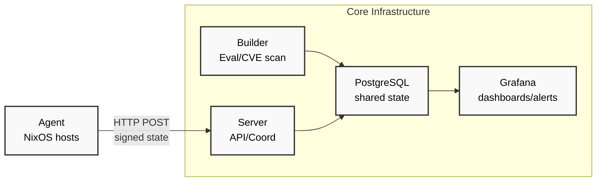

# Core Components

> **Status:** partial. Split from [ADR-000](../decisions/adr-000-architecture-overview.md). The server routes `/agent/heartbeat` and `/agent/state` exist (`packages/default/crates/cf-server/src/bin/server.rs`). The Builder interface text ("Database coordination with server") is a verification candidate: API-only builders do not access the database directly, and `packages/default/crates/cf-builder/src/builder/api_client.rs` implements the builder API client.

## Agent (Rust)

- **Location**: Runs on each monitored NixOS system
- **Responsibilities**:
  - Monitor system configuration changes via inotify
  - Collect system fingerprints (hardware, software, security status)
  - Send Ed25519-signed state reports to server
  - Heartbeat vs. state change intelligence
- **Interfaces**: HTTP POST to server `/agent/heartbeat` and `/agent/state`

## Server (Rust)

- **Location**: Central coordination node(s)
- **Responsibilities**:
  - Receive and verify agent reports
  - Process Git webhooks for configuration updates
  - Coordinate build requests
  - Provide API for compliance queries
- **Interfaces**:
  - HTTP API for agents
  - Webhook endpoints for Git repositories
  - Database read/write operations

## Builder (Rust)

- **Location**: Build coordination node(s)
- **Responsibilities**:
  - Evaluate NixOS flakes on demand
  - Build derivations for CVE scanning
  - Run vulnix for vulnerability assessment
  - Track configuration drift (current vs. latest)
- **Interfaces**:
  - Database coordination with server
  - Nix evaluation engine integration
  - vulnix CVE scanning integration

## Related concepts

- [System overview](../overview/system-overview.md) - product-level overview and web UI/API server/database view
- [Data flows](../architecture/data-flows.md) - how data moves between these components
- [Event-driven queue architecture](../architecture/event-driven-queues.md) - how the server wakes evaluation and build work
- [ADR-000 Architecture overview](../decisions/adr-000-architecture-overview.md) - the decision record these components belong to
