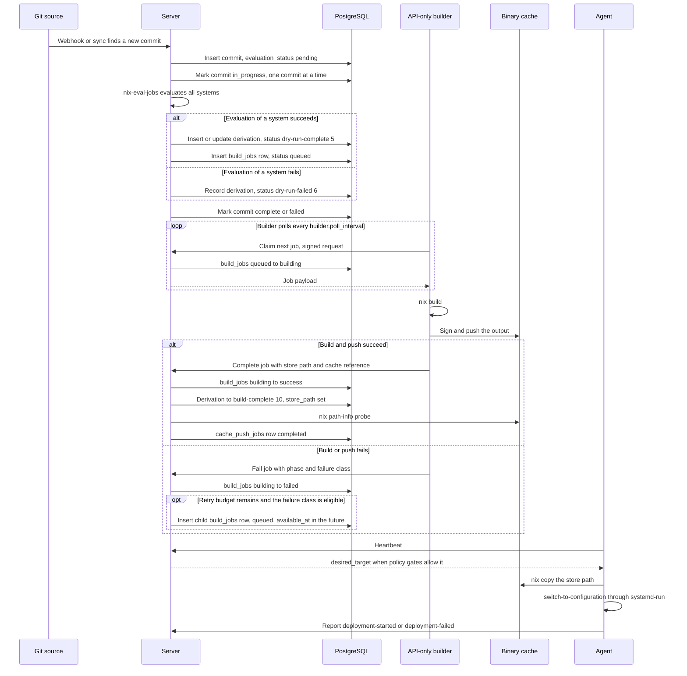

# Derivation status lifecycle

Crystal Forge tracks one unit of work in four places. Each place answers a
different question.

| Record | Column | Question it answers |
| --- | --- | --- |
| `commits` | `evaluation_status` | Has the server evaluated this commit? |
| `derivations` | `status_id` | Did evaluation produce this derivation, and did a build finish? |
| `build_jobs` | `status` | Where is the build attempt in the builder queue? |
| `cache_push_jobs` | `status` | Is the output published to a binary cache? |

> **Scope:** This document describes the code at commit `3b23d36f`. The
> `derivations.status_id` column keeps the 14 seeded statuses, but the current
> server writes only a subset of them. The tables below mark which statuses are
> written today.

## Current lifecycle

The server evaluates a commit as a whole with `nix-eval-jobs`. API-only builders
build the result and publish it to the binary cache. Agents deploy from the
cache. The database never receives writes from a builder directly.

Key properties:

- Evaluation is commit-level. The server does not run a per-derivation
  `nix build --dry-run` loop, and `dry-run-complete` means that
  `nix-eval-jobs` produced the derivation path.
- The server starts neither a build loop nor a cache push worker. A builder
  claims jobs through the API and reports results through the API. See
  [Builder architecture](../builders/builder-architecture-and-job-scheduling.md).
- Build progress lives on `build_jobs.status`. The claim and the failure
  transition do not change `derivations.status_id`.
- A completed build changes the derivation to `build-complete` in the same
  transaction that marks the job `success`.
- Deployment starts from a heartbeat response. See
  [Deployment flow](../deployment/deployment-flow.md).

## Derivation statuses

The `derivation_statuses` table holds these rows. IDs 1 to 13 come from migration
`0026`. ID 14 comes from migration `0052`. The `Name` column shows the database
spelling.

| ID | Name | Terminal in seed | Written by current code |
| --: | --- | :-: | --- |
| 1 | `pending` | No | No |
| 2 | `queued` | No | No |
| 3 | `dry-run-pending` | No | Only as an upsert starting value and by startup reset |
| 4 | `dry-run-inprogress` | No | No |
| 5 | `dry-run-complete` | No | Yes. Evaluation inserts rows directly in this status. |
| 6 | `dry-run-failed` | Yes | Yes. Evaluation failure records it. |
| 7 | `build-pending` | No | Only by startup reset |
| 8 | `build-inprogress` | No | Only by the server-side build worker code, which the server does not start |
| 9 | `in-progress` | No | No |
| 10 | `build-complete` | No | Yes. Job completion writes it with `store_path`. |
| 11 | `complete` | Yes | No |
| 12 | `build-failed` | Yes | Only by startup reset. `mark_derivation_failed` has no production caller. |
| 13 | `failed` | Yes | No |
| 14 | `cache-pushed` | Yes | Only by dormant server cache worker code |

The Rust `EvaluationStatus` enum covers IDs 3, 4, 5, 6, 7, 8, 10, and 12. The
dashboard queries (`queries/dashboard.rs`) still read IDs 10, 11, 12, and 14
when they classify a derivation as built or cached.

**The seed marks `dry-run-failed` and `build-failed` as terminal without a retry
exception.** The retry rules below are enforced by queries, not by these flags.

## Build job statuses

`build_jobs.status` accepts these values. The check constraint comes from
migration `0083` and migration `0103`.

| Status | Meaning | Next |
| --- | --- | --- |
| `queued` | Waiting for a builder. A job with a future `available_at` cannot be claimed yet. | `building`, `cancelled` |
| `building` | A builder owns the job under a session lease. | `success`, `failed`, `cancelling` |
| `cancelling` | An operator requested a stop. The builder has not stopped yet. | `cancelled` |
| `cancelled` | Stopped by an operator. Terminal. | None |
| `success` | The builder completed the job. Terminal. | None |
| `failed` | The attempt failed. Terminal for this attempt. | A new child job, if retry applies |

## Retry rules

### Automatic build retry

When a builder fails a job, one transaction marks that attempt `failed` and
decides on a retry. The decision reads the singleton `automatic_retry_policy`
row (migration `0189`):

| Column | Default | Allowed values | Effect |
| --- | --- | --- | --- |
| `max_build_retries` | 2 | 0 to 5 | Number of child attempts after the first attempt |
| `max_evaluation_retries` | 1 | 0 to 5 | Same limit for evaluation retries |
| `backoff_seconds` | 30 | 0, 10, 30, 60, 120, 300 | Delay before the child job becomes claimable |
| `transient_only` | true | true or false | When true, only failure classes that can recover cause a retry |

A retry inserts a **new** `build_jobs` row with `parent_job_id`, `root_job_id`,
`attempt_number + 1`, and a future `available_at`. It does not reopen the failed
row. A unique key on `automatic_retry_source_id` prevents duplicate children.
When no retry applies, the server also opens an attention item for the failed
job.

### Startup reset

At server start, `reset_non_terminal_derivations` runs once. It changes
derivations as follows:

- A derivation with `attempt_count >= 5` becomes `dry-run-failed` (6) when it
  has no `derivation_path`, or `build-failed` (12) when it has one.
- A derivation with `attempt_count < 5` and a status other than
  `dry-run-complete` (5) and `build-complete` (10) returns to `dry-run-pending`
  (3) without a path, or `build-pending` (7) with a path.

The API builder path does not increment `attempt_count`, so this reset mostly
affects rows that the older server-side build path touched. The evaluation loop
runs its own startup recovery. See
[Evaluation and build queue pipeline](../workflows/evaluation-and-build-queue-pipeline.md).

### Manual intervention

- Requeue or cancel a build job through the build job API.
- Re-evaluate a commit to produce a fresh derivation row.
- Change the retry policy with `PUT /api/v1/admin/automatic-retry-policy`.

## Terminal states

- **Derivation `build-complete` (10):** The artifact exists. It is deployable
  only when a `completed` `cache_push_jobs` row matches `derivations.store_path`.
  See [Store path flow](../workflows/store-path-flow.md).
- **Derivation `dry-run-failed` (6):** Evaluation failed. A new evaluation of the
  commit is required.
- **Build job `failed` with no child job:** The retry budget is spent or the
  failure class is not eligible. An operator may requeue the job.
- **Build job `success` and `cancelled`:** Final. No transition leaves them.

## Related concepts

- [Derivation processing loops](../architecture/derivation-processing-loops.md) - the loops that run on the server
- [Cache push process](../caches/cache-push-process.md) - builder-side publication and the server probe
- [Evaluation and build queue pipeline](../workflows/evaluation-and-build-queue-pipeline.md) - the two-stage pipeline and its queue APIs
- [Deployment flow](../deployment/deployment-flow.md) - how an agent applies a target
- [Observability and troubleshooting](../operations/observability-and-troubleshooting.md) - diagnosing work stuck in a status
