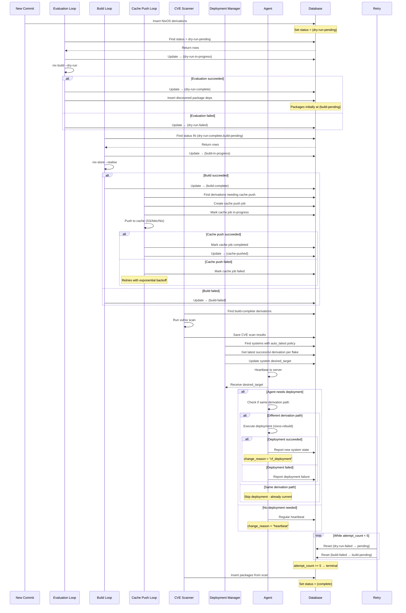

# Crystal Forge Derivation Status Flow

This document explains the statuses that derivations go through in Crystal Forge and how they transition during processing, including deployment and cache operations.

> **Status:** partial. IDs 1 to 13 match the seeded `derivation_statuses` rows (`packages/default/crates/cf-server/migrations/0026_make_derivation_statuses.sql`). The database names are `dry-run-inprogress`, `build-inprogress`, and `in-progress`, while this document writes `dry-run-in-progress`, `build-in-progress`, and `in-progress (legacy)`. The seed also marks `dry-run-failed` and `build-failed` terminal without the retry exception, and does not seed `cache-pushed (14)` in that migration. These are verification candidates. `reset_non_terminal_derivations()` exists in `packages/default/crates/cf-server/src/queries/derivations.rs`.

## Combined Lifecycle (Sequence)

## Status Table

|  ID | Name                 | Description               | Terminal | Next Step |
| --: | -------------------- | ------------------------- | -------- | --------- |
|   1 | pending              | Should not be used        | ❌       | → dry-run-pending |
|   2 | queued               | Reserved for future use   | ❌       | → dry-run-pending |
|   3 | dry-run-pending      | Ready for dry-run         | ❌       | → evaluation loop |
|   4 | dry-run-in-progress  | Running nix dry-run       | ❌       | → dry-run-complete/failed |
|   5 | dry-run-complete     | Dry-run succeeded         | ❌       | → build loop |
|   6 | dry-run-failed       | Dry-run failed            | ✅\*     | → retry or terminal |
|   7 | build-pending        | Ready for build           | ❌       | → build loop |
|   8 | build-in-progress    | Building                  | ❌       | → build-complete/failed |
|   9 | in-progress (legacy) | Generic in-progress       | ❌       | → legacy handling |
|  10 | build-complete       | Build succeeded           | ❌       | → cache push |
|  11 | complete             | Fully complete (packages) | ✅       | → CVE scanning |
|  12 | build-failed         | Build failed              | ✅\*     | → retry or terminal |
|  13 | failed               | Generic failure           | ✅       | N/A |
|  14 | cache-pushed         | Pushed to binary cache    | ✅       | → CVE scanning |

\* Terminal only if maximum retry attempts reached.

## Retry Logic

### **Automatic Retries**
- **Max attempts:** 5 (configurable)
- **Reset conditions:**
  - `dry-run-failed` → `dry-run-pending` if attempts < 5
  - `build-failed` → `build-pending` if attempts < 5
- **Reset trigger:** `reset_non_terminal_derivations()` on startup
- **Backoff:** Exponential delay between retries for cache operations

### **Manual Intervention**
- Reset attempt count to force retry
- Update derivation target for different commit
- Modify build configuration for resource issues

## Terminal States

### **Successful Completion**
- **build-complete (10)**: Ready for cache push and CVE scanning
- **cache-pushed (14)**: Successfully cached, ready for deployment
- **complete (11)**: Fully processed (typically for packages)

### **Failure States**
- **dry-run-failed (6)**: Configuration invalid, requires code fix
- **build-failed (12)**: Build errors, may need dependency updates
- **failed (13)**: Generic failure state

## Related concepts

- [Derivation processing loops](../architecture/derivation-processing-loops.md) - the loops that move derivations between statuses
- [Cache push process](../caches/cache-push-process.md) - the cache-pushed transition
- [Evaluation and build queue pipeline](../workflows/evaluation-and-build-queue-pipeline.md) - status IDs in the two-stage pipeline
- [Observability and troubleshooting](../operations/observability-and-troubleshooting.md) - diagnosing derivations stuck in a status
