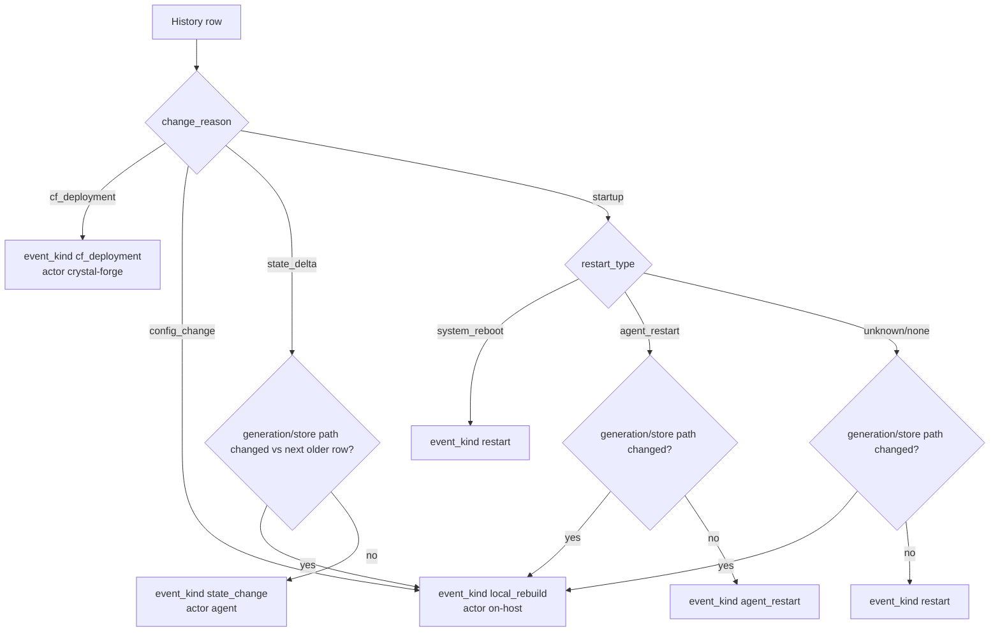

# Restart and activation classification

In this document, a deployment that happens outside Crystal Forge (an on-host `nixos-rebuild switch`, reported with `change_reason = config_change` or detected as a generation or store-path change without pending Crystal Forge context) is called a local rebuild. The source tables below use that term for the out-of-band case.

The server uses `boot_id` and generation/store-path transitions to classify
events.

## Why startup can be a local rebuild

During `nixos-rebuild switch`, systemd stops and starts services as part of
activation. That commonly restarts `crystal-forge-agent.service`. The first POST
containing the new generation can therefore have:

- `change_reason = startup`
- same `boot_id`
- new generation/store path

That is not just an agent restart. The agent restart is incidental to the
activation. The history API should classify this as `local_rebuild` when the
generation/store path differs from the next older history row.

## Why unchanged periodic rows are not local rebuilds

If the current row and the next older row have the same generation/store path,
there was no activation. Even if the raw `change_reason` says `state_delta`, the
history API should classify it as `state_change` or the server should have stored
it as an `agent_heartbeats` row in the first place.

## Related concepts

- [Agent heartbeat, state, deployment, and history logic](../deployment/agent-heartbeat-vs-state-persistence.md)
- [Authoritative system_events timeline](../data-model/system-events-timeline.md)
- [Web UI history rendering rules](../ui/deployment-history-rendering-rules.md)
- [Deployment history tests, debug checklist, and known pitfalls](../operations/deployment-history-debugging-and-tests.md)
