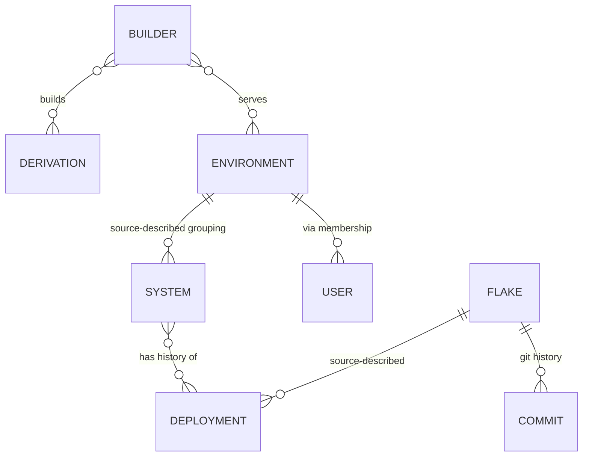

# Data Model

## Core Entities

| Entity | Description |
|--------|-------------|
| **System** | A NixOS machine (physical or virtual) that reports to CF |
| **Environment** | Grouping for systems (prod, staging, dev) |
| **Flake** | A Nix flake registry entry (git repo + branch) |
| **Builder** | Worker that builds derivations |
| **User** | Admin/Operator/Viewer accounts |
| **Deployment** | Record of a system being deployed |
| **Derivation** | A Nix derivation being built |
| **Cache** | Binary cache for built derivations |

## Relationships

> The diagram encodes the source document's conceptual relationship sketch.
> Its cardinality notation is not derived from migrations and MUST NOT be read
> as a statement of current database constraints.

## Related concepts

- [System overview](../overview/system-overview.md) - product orientation
- [Derivation status lifecycle](../concepts/derivation-status-lifecycle.md) - states of the derivation entity
