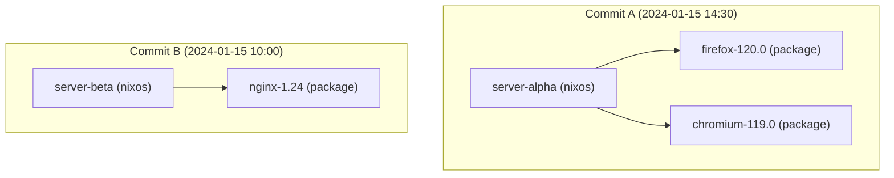

# NixOS Derivation Build Queue View (`view_nixos_derivation_build_queue`)

## Status

The view exists in the schema. Migration `0056_build_queue.sql` defines it, and
no later migration redefines or drops it. No Rust code in the server, builder,
or UI reads it. Its only reader is the database test
`packages/cf-test-suite/cf_test/tests/database/test_view_nixos_derivation_build_queue.py`.

The view is the earliest queue design. Later work replaced it:

1. [`view_buildable_derivations`](view-buildable-derivations.md) served the
   legacy build-reservation worker. The server does not start that worker.
2. The live build queue is `build_jobs`, claimed by API-only builders. See
   [Wakeups and polling](../../architecture/event-driven-queues.md#claim-eligibility-and-ordering).

Use the view only as a SQL report of derivations that are waiting for a first
build or a retry.

## Overview

For each NixOS system derivation that matches the filter, the view lists the
package derivations that the system depends on, then the system derivation. The
design intent was to build large package dependencies before the system closure.
The rows sort newest commit first.

## Example output

Two NixOS systems, each with package dependencies, all in `dry-run-complete`:



An arrow means "depends on". The view returns:

| id  | derivation_name | derivation_type | nixos_id | nixos_commit_ts     | group_order |
| --- | --------------- | --------------- | -------- | ------------------- | ----------- |
| 102 | firefox-120.0   | package         | 101      | 2024-01-15 14:30:00 | 0           |
| 103 | chromium-119.0  | package         | 101      | 2024-01-15 14:30:00 | 0           |
| 101 | server-alpha    | nixos           | 101      | 2024-01-15 14:30:00 | 1           |
| 202 | nginx-1.24      | package         | 201      | 2024-01-15 10:00:00 | 0           |
| 201 | server-beta     | nixos           | 201      | 2024-01-15 10:00:00 | 1           |

## Definition

The view builds three sets from `derivations` rows with `status_id IN (5, 12)`:

- Status `5` is `dry-run-complete`. Status `12` is `build-failed`. Migration
  `0026_make_derivation_statuses.sql` defines both ids.
- `roots` are the filtered `nixos` derivations with their commit timestamp.
- `pkg_rows` are the filtered `package` derivations that a root depends on,
  through `derivation_dependencies`.
- `nixos_rows` are the roots themselves.

The view returns the union of `pkg_rows` and `nixos_rows` where
`attempt_count <= 5`. A failed derivation therefore returns to the list until it
reaches six attempts. A `build-pending` derivation (status `7`) is **not**
listed, because the filter excludes it.

A package that two systems share appears once for each system, with a different
`nixos_id`.

### Columns

| Field             | Description                                        |
| ----------------- | -------------------------------------------------- |
| `id`              | Derivation id                                      |
| `commit_id`       | Commit id                                          |
| `derivation_type` | `nixos` or `package`                               |
| `derivation_name` | Derivation name                                    |
| `derivation_path` | Store derivation path                              |
| `status_id`       | `5` or `12` only                                   |
| `attempt_count`   | Previous build attempts, at most 5                 |
| `nixos_id`        | Id of the parent NixOS derivation (group key)      |
| `nixos_commit_ts` | Commit timestamp of the parent NixOS derivation    |
| `group_order`     | `0` for a package, `1` for the NixOS derivation    |

The view also exposes the remaining `derivations` columns that migration `0056`
lists (timestamps, error message, build progress fields, `cf_agent_enabled`,
`store_path`).

### Ordering

The view orders rows as follows:

| Level | Sort field        | Direction | Purpose                                |
| ----- | ----------------- | --------- | -------------------------------------- |
| 1     | `nixos_commit_ts` | DESC      | Newest commit first                    |
| 2     | `nixos_id`        | ASC       | Keep one system's rows together        |
| 3     | `group_order`     | ASC       | Packages before the NixOS derivation   |
| 4     | `pname`, `id`     | ASC       | Stable order inside the group          |

The view only sorts rows. It does not check that a package is built before its
system, and it does not hide a system row while its packages are still listed.
A consumer that needs that guarantee must check dependency status itself. The
claim query of the live `build_jobs` queue has no dependency condition either.
See [Wakeups and polling](../../architecture/event-driven-queues.md#claim-eligibility-and-ordering).

## Example queries

```sql
SELECT id, derivation_name, derivation_type, nixos_id, nixos_commit_ts
FROM view_nixos_derivation_build_queue
ORDER BY nixos_commit_ts DESC, nixos_id, group_order, pname NULLS LAST, id
LIMIT 1;
```

```sql
SELECT derivation_name, derivation_type, nixos_id, group_order
FROM view_nixos_derivation_build_queue
WHERE nixos_id = (
  SELECT nixos_id
  FROM view_nixos_derivation_build_queue
  ORDER BY nixos_commit_ts DESC
  LIMIT 1
)
ORDER BY group_order, pname;
```

## Related views

- [`view_buildable_derivations`](view-buildable-derivations.md): the later
  legacy queue view
- [`view_build_queue_status`](view-build-queue-status.md): system-level progress
  for the legacy reservation queue
- [`view_commit_nixos_table`](view-commit-nixos-table.md): compact NixOS-only
  progress per commit

## Related concepts

- [Buildable Derivations View](view-buildable-derivations.md)
- [Derivation Status Breakdown View](view-derivation-status-breakdown.md)
- [Commit Build Status View](view-commit-build-status.md)
- [System Deployment Status View](view-system-deployment-status.md)
