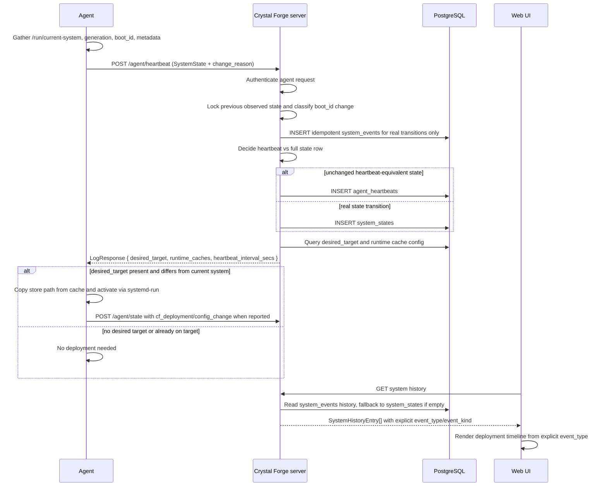
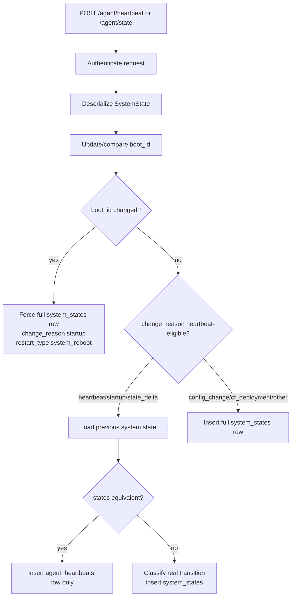

# Agent heartbeat, state, deployment, and history logic

This document describes how Crystal Forge agents report state, how the server
decides whether to persist a lightweight heartbeat or a full system-state row,
how deployment commands are returned, and how event-backed history entries are
classified for the UI.

`system_events` is the authoritative source for user-facing Deployment History.
`system_states` remains available as raw observation/audit/debug data and as a
legacy fallback for systems that do not yet have event rows.

It is intentionally focused on the bugs seen during TASK-378:

- manual `nixos-rebuild switch` rows showing as Crystal Forge deploys
- the latest generation being hidden behind `Agent restarted`
- unchanged periodic heartbeats filling history with fake `Local rebuild` rows
- compatibility with older agents that send `state_delta` periodically

## Source files

- Agent loop and POST handling: `packages/default/src/bin/agent.rs`
- Agent deployment response handling: `packages/default/src/deployment/agent.rs`
- Server heartbeat route: `packages/default/src/handlers/agent/heartbeat.rs`
- Heartbeat-vs-state equivalence logic: `packages/default/src/models/agent_heartbeats.rs`
- System state insert/query logic: `packages/default/src/queries/system_states.rs`
- System history API classification: `packages/default/src/handlers/api/systems.rs`
- Web UI history rendering: `packages/web-ui/src/views/system_detail.rs`

> **Status:** The source file list above uses paths under `packages/default/src/`. In the repository at the migration base the same files live under `packages/default/crates/`: `cf-agent/src/bin/agent.rs`, `cf-agent/src/deployment/agent.rs`, `cf-server/src/handlers/agent/heartbeat.rs`, `cf-server/src/models/agent_heartbeats.rs`, `cf-server/src/queries/system_states.rs`, and `cf-server/src/handlers/api/systems.rs`. The Web UI path `packages/web-ui/src/views/system_detail.rs` is unchanged.

## High-level flow

## Server heartbeat-vs-state decision

The server should not blindly insert `system_states` for every POST. It should
first decide whether the POST represents a real state transition or just
heartbeat telemetry.

### Equivalence check

The server compares fields that represent meaningful system identity/config:

- hostname
- store path
- OS/kernel
- hardware identifiers
- network identifiers
- secure boot/FIPS/TPM fields
- agent version/build hash
- NixOS version

It intentionally ignores fields that naturally change every heartbeat:

- timestamp
- uptime

If the state is equivalent, the POST must become an `agent_heartbeats` row, not
a `system_states` row.

## Related concepts

- [Agent POST types and deployment command response](../api/agent-post-types-and-deployment-response.md)
- [Authoritative system_events timeline](../data-model/system-events-timeline.md)
- [Restart and activation classification](../concepts/restart-and-activation-classification.md)
- [Web UI history rendering rules](../ui/deployment-history-rendering-rules.md)
- [Deployment history tests, debug checklist, and known pitfalls](../operations/deployment-history-debugging-and-tests.md)
- [System Deployment Status View](../data-model/views/view-system-deployment-status.md)
