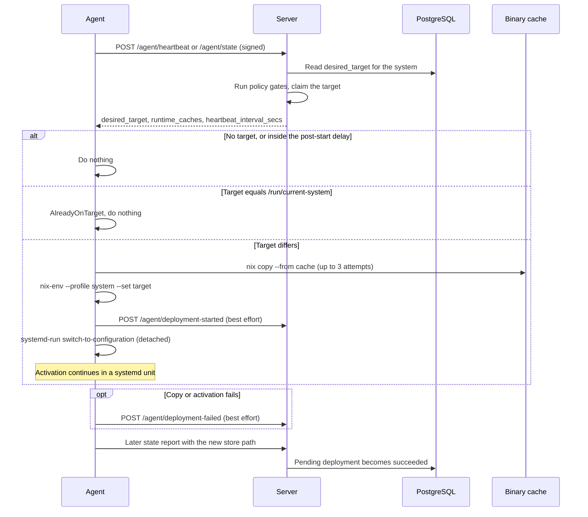

# Deployment Flow

The server decides **what** a system should run. The agent decides **when it can
apply** that target and applies it. The agent does not build. It copies a
built store path from a binary cache and activates it.

## Agent heartbeat process

`AgentDeploymentManager::process_heartbeat_response` handles each heartbeat
response in this order:

1. The agent reads `desired_target`, `runtime_caches`, and
   `heartbeat_interval_secs` from the response. It keeps the runtime cache list
   for the next copy.
2. With no `desired_target`, the result is `NoDeploymentNeeded`.
3. While the agent process is younger than `post_agent_start_deployment_delay`
   (default 60 seconds), the agent defers the target. The result is
   `NoDeploymentNeeded`.
4. The agent reads `/run/current-system`. It does not trust cached state. A
   detached deployment, a restart, or a manual switch therefore cannot fool it.
5. If `/run/current-system` equals the target, the result is `AlreadyOnTarget`.
6. Otherwise the agent runs the deployment. It holds a one-permit semaphore, so
   two deployments never run in parallel.

The server sends a target only when its rules allow it:

- For `auto_latest` and `pinned` systems the server sends the stored target.
- For `manual` systems the server sends a target only for 30 minutes after an
  operator set it. After that the server clears the target. A manual system
  therefore does not revert after an out-of-band `nixos-rebuild`.
- For `manual` and `pinned` systems, a pending deployment that already reached
  a terminal status clears the stored target.
- Composite policy enforcement (`authorize_and_claim_desired_target`) runs
  before the server delivers the target. A blocked target becomes `None`. An
  error in that check also becomes `None`, so the check fails closed.

## Applying the target

`execute_deployment` accepts only a store path that starts with `/nix/store/`.
It fails for any other target. It also fails when no cache is available. The
agent picks the cache from the first `runtime_caches` entry, or else from its
own `cache_url` setting.

1. **Copy.** The agent runs `nix copy --from <cache_url> <store_path>`.
   - It tries up to 3 times. The delay base is 5 seconds.
   - Attempt 2 adds `--refresh` to bypass stale cache metadata.
   - Attempt 3 clears the local Nix cache directory first.
   - For an Attic cache it sets `http2 false`.
   - When the cache has a public key, it passes `trusted-public-keys`.
   - Each attempt stops after `deployment_timeout_minutes` (default 60).
2. **Check the script.** The agent requires
   `<store_path>/bin/switch-to-configuration`.
3. **Create a generation.** The agent runs
   `nix-env --profile /nix/var/nix/profiles/system --set <store_path>`. It then
   waits up to 10 seconds (20 checks, 500 ms apart) until the profile or
   `/run/current-system` resolves to the target.
4. **Report the start.** The agent posts `/agent/deployment-started`. A failure
   to report does not stop the deployment.
5. **Activate.** The agent starts `switch-to-configuration` in a detached
   systemd unit named `crystal-forge-deploy-<unix_time>` with
   `systemd-run --no-block`. The agent does not wait for activation to finish.

The deployment strategy selects the activation action:

| `deployment.strategy` | Action | Effect |
| --- | --- | --- |
| `immediate_persist` (default) | `switch` | Activates now and persists across reboots |
| `boot_only` | `boot` | Activates at the next boot |

The agent never calls `nixos-rebuild`.

### Deployment result types

| Result | Meaning |
| --- | --- |
| `NoDeploymentNeeded` | No target, or the post-start delay is active |
| `AlreadyOnTarget` | `/run/current-system` matches the target |
| `Started { unit_name }` | The detached activation unit started. This is the normal success result. |
| `SuccessFromCache` and `SuccessLocalBuild` | Defined result variants. The deploy path at this commit does not produce them. |
| `Failed { error, desired_target }` | Copy, check, or activation setup failed |

A started deployment reports `change_reason = "cf_deployment"` in the next state
report. Other results report `heartbeat`.

### Deployment configuration

The agent reads these keys from `DeploymentConfig`:

- `deployment_timeout_minutes`: time limit for each cache copy. Default 60.
- `post_agent_start_deployment_delay`: wait after agent start. Default 60 seconds.
- `cache_url`, `cache_type`, `cache_public_key`, `attic_cache_name`: the
  fallback cache when the heartbeat sends no runtime cache.
- `strategy`: `immediate_persist` or `boot_only`.

`DeploymentConfig` also defines `dry_run_first`, `fallback_to_local_build`,
`max_deployment_age_minutes`, `deployment_poll_interval`, and `require_sigs`.
The agent code at commit `3b23d36f` does not read them in the deploy path. Do
not rely on them to change agent behavior.

## Reporting to the server

Both reports are signed agent requests with the same authentication as the
heartbeat. Each report has a 5-second timeout and is best effort. The agent logs
a failed report and continues.

| Route | Body | Server effect |
| --- | --- | --- |
| `POST /agent/deployment-started` | `hostname`, `target_store_path` | Marks the matching pending deployment as applying and writes a deployment-started system event |
| `POST /agent/deployment-failed` | `hostname`, `target_store_path`, `error` | Marks the matching pending deployment `failed` and writes a deployment-failed system event. The server stores at most 2000 characters of `error`. |

Both routes require a `target_store_path` that starts with `/nix/store/`. A
non-empty `hostname` must match the authenticated system, otherwise the server
answers 403. When no pending deployment matches, the server answers 200 with the
message `No matching pending deployment` and changes nothing.

The server marks the pending deployment `succeeded` later, when a state report
shows a changed generation or store path that matches the target. The agent has
no route to report a successful completion. The
`pending_system_deployments.status` values are `pending`, `succeeded`, `failed`,
`superseded`, and `expired`. A pending row has an `expires_at` time, which
defaults to 2 hours after issue.

## Automatic deployment

1. A commit is detected, evaluated, built by an API-only builder, and published
   to the binary cache. See
   [Commit to deploy sequence](../workflows/commit-eval-build-cache-deploy-sequence.md).
2. For systems with the `auto_latest` policy, the server's policy manager sets
   `desired_target` to the newest deployable store path. See
   [Derivation processing loops](../architecture/derivation-processing-loops.md).
3. The next heartbeat delivers the target if the policy gates allow it.
4. The agent copies and activates it.

## Manual deployment

`POST /api/v1/systems/:id/deploy` requests a deployment.

Request fields:

- `commit_sha`: the target commit. It must belong to the system's flake.
- `action`: one of `legacy` (default), `deploy`, `continue_auto_latest`, or
  `convert_to_manual`.
- `request_id`: optional UUID that makes the request idempotent.

The route checks, in order: a session with a role that can change systems, the
CSRF token, and access to the system's environment. Only then does it validate
the commit, so a hidden system does not reveal request details.

The `action` value must match the system's policy:

| System policy | Accepted `action` |
| --- | --- |
| `manual` | `deploy`, `legacy`, `convert_to_manual` |
| `pinned` | `deploy`, `legacy` |
| `auto_latest` | `continue_auto_latest`, `convert_to_manual` |

After the policy plan, the server runs composite policy authorization for the
target. When the target has no cached store path, the server answers with a
target-unavailable result and queues the missing build as a prerequisite. When
authorization passes, one transaction supersedes any earlier pending deployment
of the system, records a new `pending_system_deployments` row, and sets the
system's `desired_target`. A repeated request with the same
`request_id` and the same commit and action returns the existing deployment. A
`request_id` bound to a different commit or action gets `409`.

`convert_to_manual` commits the policy change before the server resolves the
target. A missing target therefore does not roll the conversion back.

## Related concepts

- [Commit to deploy sequence](../workflows/commit-eval-build-cache-deploy-sequence.md) - desired_target and agent heartbeat in sequence form
- [Derivation processing loops](../architecture/derivation-processing-loops.md) - the policy manager that sets desired_target
- [Authentication, authorization, and system registration](../security/authentication-and-authorization-overview.md) - who may deploy
- [Derivation status lifecycle](../concepts/derivation-status-lifecycle.md) - status values before deployment
