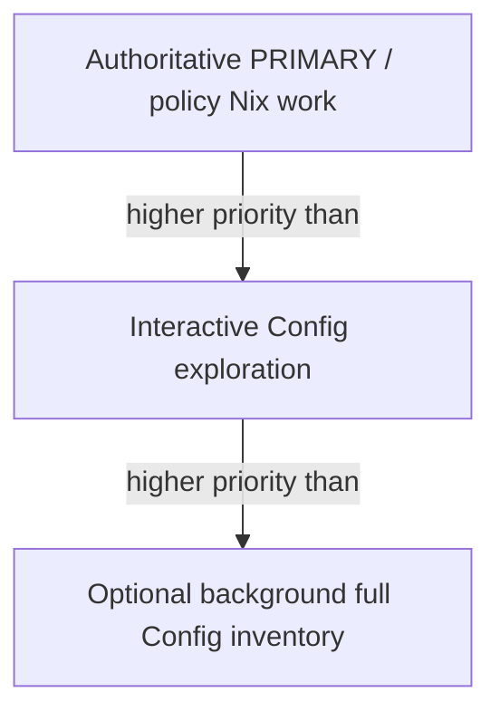
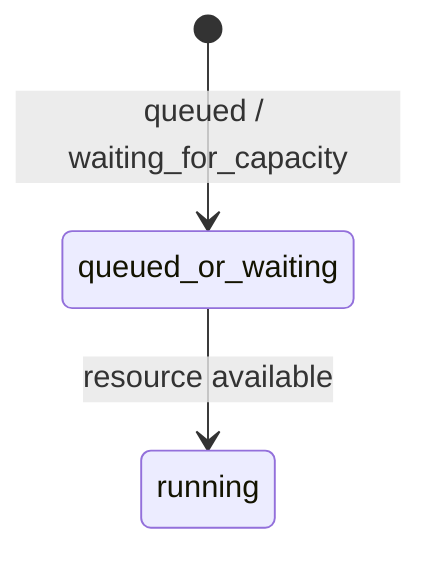
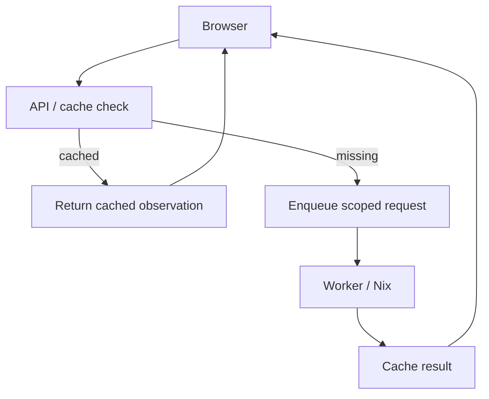
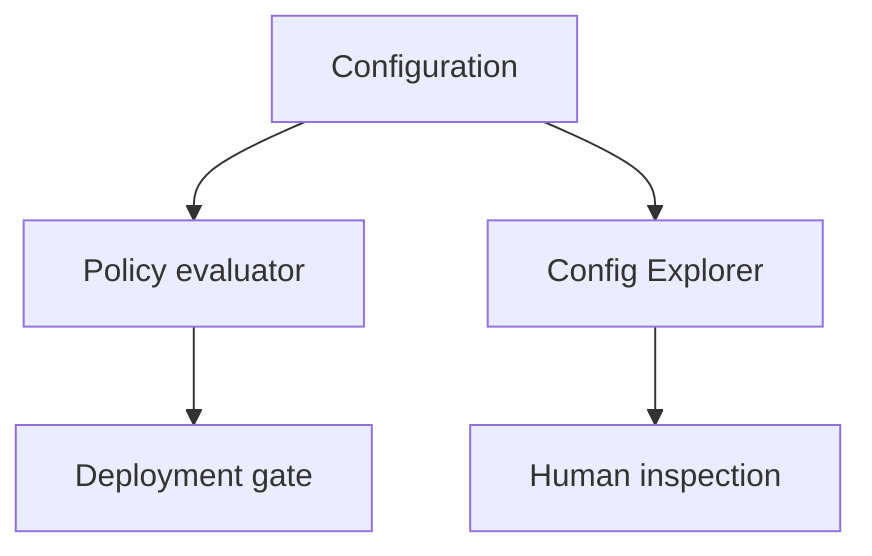

# Config Explorer failure containment, scheduling, security, and API principles

## Failure containment

Failures are local to the narrowest affected prefix whenever possible. For
example:

```text
networking                 works
services                   works
crystal-forge.stig         works
crystal-forge.stig.active  unavailable
```

One bad branch MUST NOT destroy healthy siblings. The Explorer MUST NOT
fabricate children below an unreadable prefix. A root failure MAY prevent
browsing when no trustworthy root hierarchy can be established.

## Resource scheduling

The priority relationship is:



Config exploration MUST NOT delay deployment authority unnecessarily. The
historical failure mode was a job reported as `claimed` or `running` while it
indefinitely waited for `pg_advisory_xact_lock`. The required state model is:



The system MUST NOT hold a long-lived database transaction merely to wait for
evaluator capacity. This rule applies to scoped observations and optional
complete-V2 enrichment. A capacity miss does not increment the durable attempt
count. Root, prefix, option, and provenance requests use a dedicated
cross-process advisory lock and a one-per-process semaphore. The configured
index and other full-inventory work retain separate heavy-Nix capacity. A
complete-V2 worker holds the acquired capacity across both Nix stages and
refreshes its execution heartbeat every 10 seconds while either stage runs. It
releases global and local heavy-Nix capacity before it acquires the snapshot
writer lock for persistence. Its execution-session lock remains held through
persistence or terminalization so stale recovery cannot replace the owner.

## Lifecycle and progress

Conceptual request states are:

- `queued`
- `waiting_for_capacity`
- `running` / `inspecting`
- `succeeded`
- `failed`

Useful sub-phases include `inspecting_tree`, `inspecting_option`,
`inspecting_provenance`, and `finalizing`. A request marked `running` MUST
have a live execution heartbeat. Waiting for capacity is not running. The UI
MUST NOT display a fabricated percentage when the total corpus is unknown.

## Security model

Config inspection follows these security rules:

- Browsers MUST NOT provide arbitrary Nix source or expressions.
- Path components are structured, validated, and bounded.
- Path depth, output size, and result counts are bounded.
- Existing authorization applies to every exact target and observation.
- POST mutations require CSRF protection.
- Credentials remain server-side.
- Exact revision inspection is read-only.
- Config inspection MUST NOT mutate `flake.lock`. Shallow requests use
  `nix eval --json --no-write-lock-file` against the NAR-qualified immutable
  store source. Configured-index work uses `nix-eval-jobs` against the same
  immutable source contract. The real-Nix regression uses a read-only store
  fixture without a lock file and verifies that no lock file appears.
- Repository credentials exist only during immutable source materialization.
  Evaluator subprocesses do not receive `NETRC` or `GIT_SSH_COMMAND`.
- Secret values and traces MUST follow the existing redaction rules before
  persistence, indexing, comparison, logging, or API serialization.

## Process and timeout model

Every evaluator subprocess MUST be bounded by a timeout and an output limit.
Immutable source Git and Nix helpers run in dedicated process groups under the
same cleanup rule. Timeout, cancellation, or future drop terminates descendants
before evaluation capacity and repository locks are released.
Each complete Config Inspector stage has a 300-second default deadline. An
operator MAY set
`CRYSTAL_FORGE_CONFIG_INSPECTION_STAGE_DEADLINE_SECONDS` to an integer from 1
through 3600. An invalid, non-Unicode, zero, or larger value fails the
inspection; the server does not silently use the default. The override does not
change heartbeat, cancellation, or process-tree cleanup behavior, and each
stage remains bounded independently.
Timeout and cancellation handling MUST clean up the complete process tree,
reap child processes, and prevent escaped `nix-eval-jobs` workers. A timeout
affects only the current scoped Explorer request or optional complete-inventory
job. Previously cached, unrelated observations remain valid.

## Optional complete inventory

A complete inventory MAY be explicitly requested, generated as low-priority
background enrichment, or reused when already available. It supports Changed,
Drift, complete search, corpus statistics, and complete provenance comparison.
It is not required to open or browse Config.

Successful primary evaluation MUST NOT automatically schedule an expensive
full Config inventory. Primary success and Explorer enrichment are separate
decisions.

## API principles

The semantic operations are more stable than concrete route names:

- inspect root;
- inspect prefix;
- inspect an exact option;
- inspect provenance or detail;
- retrieve a cached observation; and
- request a complete inventory.

HTTP handlers MUST NOT synchronously perform expensive Nix work. They resolve
authorization and exact target identity, return cached observations when
available, and enqueue or reuse bounded work when an observation is missing.
Every operation accepts structured path input only and preserves exact target
identity through the worker and cache.

## Performance expectations

The design targets are qualitative rather than brittle absolute limits:

- Shallow browsing should normally complete in seconds.
- Cached browsing should require no Nix process.
- Expanding one branch MUST NOT secretly force the whole configuration.
- Provenance MAY cost more than tree navigation.
- Large full-corpus work is explicit or background work.

## Data flow

### Interactive Explorer



### Authoritative separation



There MUST be no arrow from the Config Explorer cache into the deployment gate.

## Non-goals

Config Explorer does not:

- replace policy evaluation;
- become a generic arbitrary Nix evaluator;
- require a persistent interactive Nix REPL;
- guarantee a complete inventory merely because a user opened the tab;
- authorize Changed or Drift claims from lazy observations; or
- redesign every heavy-Nix workload scheduler in TASK-440.

## Future evolution

The following are possible future improvements, not current authority or
requirements:

- a warm internal evaluator/session if it is proven safe;
- smarter subtree prefetch;
- complete-inventory background scheduling;
- richer comparison after complete V2 artifacts exist;
- more precise progress reporting;
- cache retention and garbage-collection policies; and
- multi-slot interactive Nix concurrency if measurements prove it safe.

Any change that weakens the authority boundaries in this document requires an
architecture decision update before implementation.

> **Status:** proposed. The `Future evolution` list above is not current authority or requirement, as the source states. The sections before it state the design as accepted for TASK-440; the code map is in [config-explorer-implementation-status.md](config-explorer-implementation-status.md).

## Related concepts

* [Config Explorer Architecture](config-explorer-architecture.md) - Specifies the Config Explorer design: why full option crawls are the wrong prerequisite, the three-evaluator authority invariants, the phased lazy inspection model, the Configured options classifier, and the benchmark record.
* [Config Explorer target identity, cache contract, and snapshot semantics](config-explorer-target-identity-and-snapshot-semantics.md) - Specifies upgraded-fleet current revision recovery, the immutable target identity and cache contract, the split between Explorer observations and certified V2 snapshots, and the Changed, Drift, and search semantics.
* [Config Explorer decision record](../decisions/config-explorer-decisions.md) - Records the ten accepted Config Explorer decisions (observational only, lazy scoped browsing, optional V2 snapshots, exact-identity caching, no client Nix expressions) and the rule that violating work must amend the architecture.
