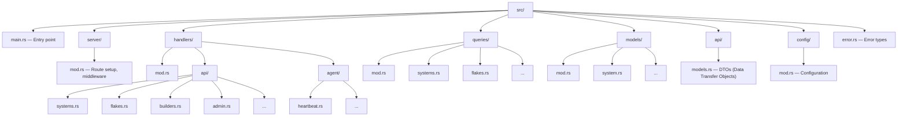

# Adding a New API Endpoint

## Step 1: Define the DTO

In `src/api/models.rs`:

```rust
#[derive(Serialize, Deserialize)]
pub struct NewWidget {
    pub name: String,
    pub description: Option<String>,
}

#[derive(Serialize, Deserialize)]
pub struct WidgetResponse {
    pub id: String,
    pub name: String,
    pub description: Option<String>,
    pub created_at: DateTime<Utc>,
}
```

## Step 2: Add Query (if database needed)

In `src/queries/widgets.rs`:

```rust
pub async fn create_widget(
    pool: &PgPool,
    data: NewWidget,
) -> Result<WidgetResponse> {
    let row = sqlx::query_as!(
        WidgetResponse,
        "INSERT INTO widgets (name, description) 
         VALUES ($1, $2) 
         RETURNING id, name, description, created_at",
        data.name,
        data.description
    )
    .fetch_one(pool)
    .await?;

    Ok(row)
}
```

## Step 3: Add Handler

In `src/handlers/api/widgets.rs`:

```rust
pub async fn create_widget(
    State(state): State<AppState>,
    Json(data): Json<NewWidget>,
    require_operator: RequireOperator,  // Middleware
) -> Result<Json<WidgetResponse>, Error> {
    let widget = queries::widgets::create_widget(&state.pool, data)
        .await
        .map_err(Error::from)?;

    Ok(Json(WidgetResponse { data: widget }))
}
```

## Step 4: Register Route

In `src/server/mod.rs`:

```rust
Router::new()
    .route("/api/v1/widgets", post(handlers::widgets::create_widget))
    // ... other routes
```

## Step 5: Add Authorization

```rust
// In server/mod.rs
.route(
    "/api/v1/widgets",
    post(handlers::widgets::create_widget)
        .layer(RequireOperator::new())  // Only Operator/Admin
)
```

## File Organization



> **Status:** The examples and the file tree above use the original document's `src/...` paths and a `RequireOperator` middleware layer. The crate lives under `packages/default/crates/cf-server/src/` (with `handlers/api/`, `queries/`, `models/`, `api/`, `auth/`, and `bin/server.rs` where routes are registered), and the authorization extractors are in `auth/extractors.rs`. The example code was not compiled against the current code. Not reconciled in this migration.

## Related concepts

- [Backend API overview, error codes, and WebSocket streaming](../api/api-overview-errors-and-streaming.md)
- [API authentication, sessions, and role-based authorization](../security/api-authentication-and-authorization.md)
