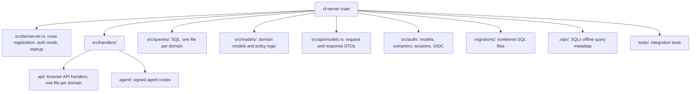

# Adding a New API Endpoint

This guide adds a `widgets` endpoint to the server. The names `widgets`, `NewWidget`, and `WidgetResponse` are placeholders. Replace them with your own names.

All server code lives in one crate: `packages/default/crates/cf-server/`. Paths below are relative to that crate unless stated otherwise. The example code shows the shape of each piece. Compile it against your own types before you rely on it.

## Where things live



## Step 1: Define the DTOs

Put request and response types in `src/api/models.rs`. A handler returns its response DTO directly. Do not wrap it in `{"data": ...}`.

```rust
#[derive(Debug, Clone, Serialize, Deserialize)]
pub struct NewWidget {
    pub name: String,
    pub description: Option<String>,
}

#[derive(Debug, Clone, Serialize, Deserialize)]
pub struct WidgetResponse {
    pub id: Uuid,
    pub name: String,
    pub description: Option<String>,
    pub created_at: DateTime<Utc>,
}
```

Errors use the existing `ApiError { error, message, details }` DTO. See [API overview](../api/api-overview-errors-and-streaming.md).

If the Web UI uses the endpoint, add a matching type to `packages/web-ui/src/api/models.rs`. Keep both sides aligned.

## Step 2: Add a migration (if the schema changes)

Create the next numbered file in `migrations/`. At commit `3b23d36f` the highest number is `0298`, so the next file is `0299_create_widgets.sql`. Always add a new file. Never edit a migration that has been applied.

```sql
CREATE TABLE widgets (
    id uuid PRIMARY KEY DEFAULT gen_random_uuid(),
    name text NOT NULL UNIQUE,
    description text,
    created_at timestamptz NOT NULL DEFAULT now()
);
```

## Step 3: Add the query

Create `src/queries/widgets.rs` and add `pub mod widgets;` to `src/queries/mod.rs`.

```rust
pub async fn create_widget(pool: &PgPool, data: &NewWidget) -> anyhow::Result<WidgetResponse> {
    let row = sqlx::query_as!(
        WidgetResponse,
        "INSERT INTO widgets (name, description)
         VALUES ($1, $2)
         RETURNING id, name, description, created_at",
        data.name,
        data.description
    )
    .fetch_one(pool)
    .await?;
    Ok(row)
}
```

`query!` and `query_as!` are checked at compile time. After you change a migration or a checked query, you MUST update the SQLx offline metadata. Two `.sqlx` directories exist today (`packages/default/.sqlx` and `packages/default/crates/cf-server/.sqlx`). See [Backend Cargo workspace](../architecture/backend-cargo-workspace.md) for which one applies. Run SQLx preparation only against an isolated local database that this repository started.

## Step 4: Add the handler

Create `src/handlers/api/widgets.rs` and add `pub mod widgets;` to `src/handlers/api/mod.rs`. Handlers take their dependencies as Axum extractors. `State<PgPool>` and `State<CFState>` both work, because `CFState` provides the pool and the server configuration.

The server uses two authorization patterns. Both are valid. See [API authentication and authorization](../security/api-authentication-and-authorization.md) for the full rules.

**Pattern 1: role guard extractor.** Use it when the endpoint needs only a role check.

```rust
pub async fn create_widget(
    RequireOperator(_user): RequireOperator,
    State(pool): State<PgPool>,
    Json(payload): Json<NewWidget>,
) -> impl IntoResponse {
    if payload.name.trim().is_empty() {
        return (
            StatusCode::BAD_REQUEST,
            Json(ApiError {
                error: "validation_error".to_string(),
                message: "Widget name is required".to_string(),
                details: None,
            }),
        )
            .into_response();
    }
    match queries::widgets::create_widget(&pool, &payload).await {
        Ok(widget) => (StatusCode::CREATED, Json(widget)).into_response(),
        Err(error) => {
            tracing::error!(error = %error, "failed to create widget");
            (
                StatusCode::INTERNAL_SERVER_ERROR,
                Json(ApiError {
                    error: "internal_error".to_string(),
                    message: "Failed to create widget".to_string(),
                    details: None,
                }),
            )
                .into_response()
        }
    }
}
```

The extractors are `RequireAuth` (any user), `RequireOperator` (Operator or Admin), and `RequireAdmin`. An unauthenticated request gets 401. A request without the role gets 403.

**Pattern 2: rbac helpers.** Use them when the handler needs the caller's roles, for example to limit results to the caller's environments.

```rust
pub async fn list_widgets(
    State(pool): State<PgPool>,
    headers: HeaderMap,
) -> impl IntoResponse {
    let Some((user_id, roles)) = authenticated_user_roles(&pool, &headers).await else {
        return forbidden();
    };
    if !has_viewer_or_above_role(&roles) {
        return forbidden();
    }
    let visibility_user = (!has_admin_role(&roles)).then_some(user_id);
    // Pass `visibility_user` to the query so a non-Admin sees only permitted rows.
    // ...
}
```

Each handler file defines small local helpers such as `forbidden()` and `internal_error()` that build an `ApiError` response. Follow the neighbors in the same file.

### Rules for every handler

- **Authorize before you reveal.** Check the session and role first. Then validate the request. A caller who may not see a resource MUST get the same `not_found` answer as for a missing resource.
- **Scope by environment.** A non-Admin sees only resources in the user's environments. Use `Role::can_access_system_environment` or a `visibility_user` query filter.
- **Check CSRF on mutations.** A handler that changes state SHOULD call `require_csrf(&headers)` and return its error response. The guard extractors do not check CSRF, and no global layer does. Existing handlers are inconsistent here. Do not copy a missing check from another handler.
- **Do not add `unwrap` or `expect` on a reachable error path.** Return an `ApiError` with a useful message and log the cause.
- **Put domain decisions outside the handler.** The handler parses the request, authorizes it, calls a query or service, and maps the result.

## Step 5: Register the route

Routes live in `src/bin/server.rs`. Import the module in the `handlers::api::{...}` list, then add the route to the router chain.

```rust
.route(
    "/api/v1/widgets",
    get(widgets::list_widgets).post(widgets::create_widget),
)
```

Group the route with the other routes of the same domain. A route registered inside the `auth_mode` branches exists only in that mode.

## Step 6: Test

- Add unit tests for pure logic and for authorization outcomes next to the handler, in a `#[cfg(test)]` module. Existing tests call the handler with a test `CFState` and assert the status code.
- Add an integration test under `tests/` when the endpoint spans several tables or modules.
- Run the server regression check through Nix: `nix build .#checks.x86_64-linux.server-regressions`. See [Flake checks](../testing/flake-checks.md) for the full list.
- Document the endpoint in the matching API concept under `docs/knowledge/api/`, and keep its role and response notes accurate.

## Related concepts

- [Backend API overview, error codes, and WebSocket streaming](../api/api-overview-errors-and-streaming.md)
- [API authentication, sessions, and role-based authorization](../security/api-authentication-and-authorization.md)
- [Backend Cargo workspace](../architecture/backend-cargo-workspace.md)
- [Flake checks](../testing/flake-checks.md)
