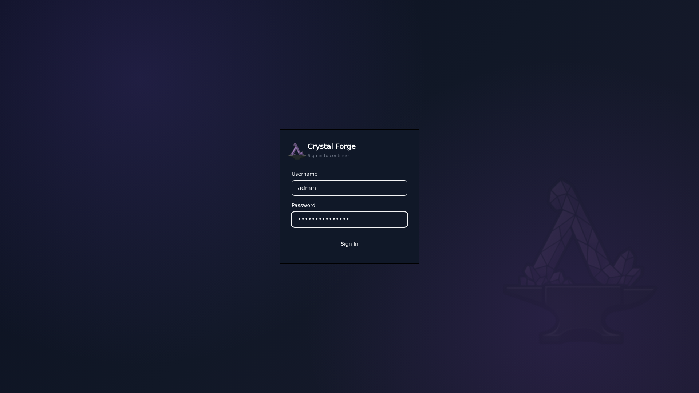

# Authentication modes and OIDC configuration examples

> **Status:** partial. This concept combines three parts of the repository `README.md`: the `Authentication Modes` section of "What's New in v0.3.0", the `OIDC Configuration Example` section, and the `Environment Variables` section. The option names, the three mode names, and the environment variable names are verification candidates. Known differences from code:
>
> - The NixOS module option `services.crystal-forge.server.auth_mode` accepts only `"local"` and `"oidc"` (default `"local"`). It has no `"dev"` value (`modules/nixos/crystal-forge/default.nix`, `auth_mode`). The server binary itself handles `"dev"` (`packages/default/crates/cf-server/src/bin/server.rs`). The comment `# Use local, not dev!` in the third example is part of the original text.
> - The module option `services.crystal-forge.server.oidc.clientSecret` (literal value) also exists. The module exports `CRYSTAL_FORGE_OIDC_CLIENT_SECRET` from `clientSecretFile` at service start.
> - The module's OIDC claim options include `preferredUsernameClaim`, which the examples do not show.
> - The environment variable list below is not a complete list. See [Server configuration reference](server-configuration-reference.md).

## Authentication Modes

The server supports three authentication modes configured via `services.crystal-forge.server.auth_mode`:

```nix
# Option 1: OIDC (default for production)
services.crystal-forge.server = {
  auth_mode = "oidc";
  oidc = {
    issuerUrl = "https://keycloak.example.com/realms/crystal-forge";
    clientId = "crystal-forge-web";
    clientSecretFile = "/run/secrets/oidc-client-secret";
    redirectUri = "https://forge.example.com/api/auth/oidc/callback";
  };
};

# Option 2: Local username/password (self-hosted)
services.crystal-forge.server.auth_mode = "local";

# Option 3: Dev mode (local development only - NEVER use in production!)
services.crystal-forge.server.auth_mode = "dev";  # Use local, not dev!
```



## OIDC Configuration Example

```nix
services.crystal-forge.server = {
  auth_mode = "oidc";
  oidc = {
    issuerUrl = "https://keycloak.company.com/realms/prod";
    clientId = "crystal-forge";
    clientSecretFile = "/run/secrets/oidc-secret";
    redirectUri = "https://forge.company.com/api/auth/oidc/callback";
    scopes = ["openid" "profile" "email"];
    # Optional: map claims from your provider
    rolesClaim = "groups";
    emailClaim = "email";
    nameClaim = "name";
  };
};
```

## Environment Variables

```bash
# Server
CRYSTAL_FORGE__SERVER__HOST=0.0.0.0
CRYSTAL_FORGE__SERVER__PORT=3000

# Auth
AUTH_MODE=local  # or "oidc"

# OIDC (when AUTH_MODE=oidc)
CRYSTAL_FORGE_OIDC_ISSUER_URL=https://keycloak.example.com/realms/crystal-forge
CRYSTAL_FORGE_OIDC_CLIENT_ID=crystal-forge-web
CRYSTAL_FORGE_OIDC_CLIENT_SECRET=secret
CRYSTAL_FORGE_OIDC_REDIRECT_URI=https://forge.example.com/api/auth/oidc/callback
```

## Related concepts

- [NixOS module configuration](nixos-module-configuration.md)
- [Server configuration reference](server-configuration-reference.md)
- [Authentication and authorization overview](../security/authentication-and-authorization-overview.md)
- [OIDC role mapping](../security/oidc-role-mapping.md)
- [OIDC provider compatibility validation](../security/oidc-provider-compatibility-validation.md)
- [Session cookies and CSRF](../security/session-cookies-and-csrf.md)
