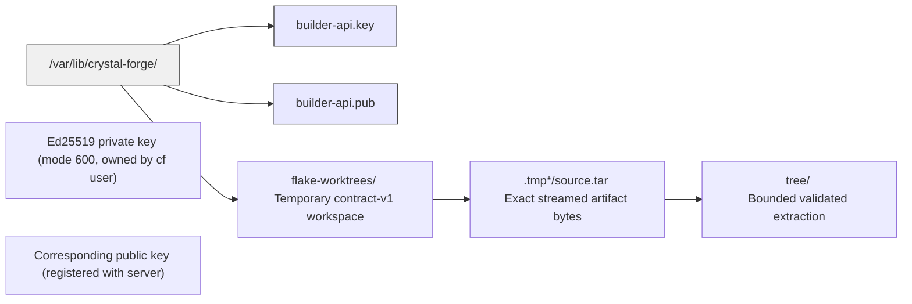

# Builder filesystem layout, firewall rules, and network-constrained configuration

## 7. Filesystem Layout on the Builder Host



**Cleanup guarantees:**
- Builder temporary artifacts and extracted trees are removed when verification completes or fails.
- Canonical server artifacts are content-bound publication records. Job completion and failure do not delete them. Retention is a server maintenance concern, not part of job finalization.

---

## 8. Firewall Rules Required per Strategy

### 8.1 ServerDerivation (Recommended Default)

> **Status:** The heading label `Recommended Default` on this subsection disagrees with the recommended default in [remote-build-execution-strategies.md](../builders/remote-build-execution-strategies.md), which recommends `source_re_evaluate_verified` with `server_bundled_archive`. The migration kept both statements. Section 8.2 below carries the same firewall rules for the recommended default.

```
# Builder host outbound rules
ALLOW TCP  <builder>  →  <cf_server>:443     # API polling, drv archive download
ALLOW TCP  <builder>  →  <cache_host>:443    # Nix substituter pulls (narinfo, NAR)
DENY  ALL  <builder>  →  <database>          # Builder has no DB access
DENY  ALL  <builder>  →  <git_remote>        # No Git access in this mode
DENY  ALL  <builder>  →  <other_builders>    # Builders don't talk to each other
DENY  ALL  <builder>  →  <managed_hosts>     # Builder never touches managed NixOS hosts
```

### 8.2 SourceReEvaluateVerified + ServerBundledArchive

Same as 8.1. The builder never contacts Git remotes in this mode.

```
ALLOW TCP  <builder>  →  <cf_server>:443     # API + source archive download
ALLOW TCP  <builder>  →  <cache_host>:443    # Nix substituter pulls
DENY  ALL  <builder>  →  <git_remote>        # Source arrives from CF server
DENY  ALL  <builder>  →  <database>
DENY  ALL  <builder>  →  <other_builders>
DENY  ALL  <builder>  →  <managed_hosts>
```

### 8.3 SourceReEvaluateVerified + LocalGitWorktree

```
ALLOW TCP  <builder>  →  <cf_server>:443     # API calls
ALLOW TCP  <builder>  →  <git_remote>:22     # SSH git clone/fetch  ← ADDITIONAL
# OR
ALLOW TCP  <builder>  →  <git_remote>:443    # HTTPS git clone/fetch
ALLOW TCP  <builder>  →  <cache_host>:443    # Nix substituter pulls
DENY  ALL  <builder>  →  <database>
DENY  ALL  <builder>  →  <other_builders>
DENY  ALL  <builder>  →  <managed_hosts>
```

**Note for security reviewers:** LocalGitWorktree requires the builder to hold or discover Git credentials for the repository URL embedded in the job manifest. For private repositories this means SSH keys or netrc on the builder. ServerBundledArchive eliminates this requirement.

### 8.4 CF Server Inbound Rules

```
# Server host inbound rules
ALLOW TCP  <builders>          →  <cf_server>:443   # Builder API
ALLOW TCP  <agents>            →  <cf_server>:443   # Agent heartbeat/state
ALLOW TCP  <admin_workstations> →  <cf_server>:443  # Web UI / admin API
ALLOW TCP  <git_webhooks>      →  <cf_server>:443   # Git push webhooks
DENY  ALL  EXTERNAL            →  <cf_server>:5432  # DB never exposed externally
```

## 11. Configuration Reference for Network-Constrained Environments

### 11.1 Maximum Isolation (GovCloud / Air-Gap Adjacent)

```toml
# /etc/crystal-forge/server.toml
[server]
remote_build_execution_strategy = "source_re_evaluate_verified"
source_delivery_mode             = "server_bundled_archive"
source_archive_root              = "/var/lib/crystal-forge/source-archives"

# /etc/crystal-forge/builder.toml
[builder]
supported_execution_strategies = ["server_derivation", "source_re_evaluate_verified"]
source_worktree_root            = "/var/lib/crystal-forge/flake-worktrees"
allow_import_from_derivation    = true

# No git credentials on the builder. Server holds all repo credentials.
```

**Remaining builder network requirements:**
- Outbound HTTPS to CF server
- Outbound HTTPS to Nix binary caches (or air-gapped store path pre-seeded)

**Builder network requirements that are eliminated:**
- Any access to Git remotes
- Any database access
- Any access to OIDC providers

### 11.2 Colocated / Internal Deployment (Relaxed)

```toml
# /etc/crystal-forge/server.toml
[server]
remote_build_execution_strategy = "server_derivation"
# evaluator contract version 1 requires server_bundled_archive

# /etc/crystal-forge/builder.toml
[builder]
supported_execution_strategies = ["server_derivation"]
# No source mirror or worktree needed for server_derivation
```

## Related concepts

* [Remote builder execution strategies](../builders/remote-build-execution-strategies.md) - Explains the remote build execution strategies (source_re_evaluate_verified, server_derivation), the recommended default, source delivery modes, delta derivation materialization, and the forwarded-HTTPS rule for credential-bearing cache push.
* [Builder network flows by execution strategy](../builders/builder-network-flows-by-strategy.md) - Shows the network sequence diagrams for the builder job lifecycle and for ServerDerivation, SourceReEvaluateVerified with ServerBundledArchive, and LocalGitWorktree, including the delta derivation protocol security properties.
* [Builder trust boundaries and component definitions](../builders/builder-trust-boundaries-and-components.md) - Defines the purpose, trust levels, and component definitions (server, builder, agent) that bound what a Crystal Forge remote builder can reach, hold, and compromise; open it to approve or review builder network and credential exposure.
* [Builder deployment, configuration, and troubleshooting](builder-deployment-and-troubleshooting.md) - Explains how to register and deploy a builder (prerequisites, keypair generation, builder configuration, polling loop pseudocode) and how to troubleshoot missing jobs, authentication failures, and jobs that do not retry.
