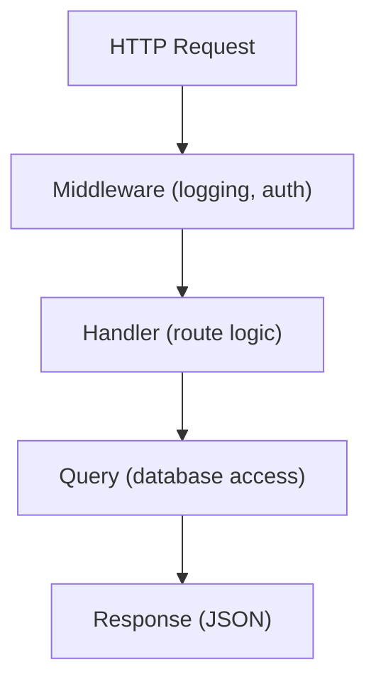

# Local Development Workflow, Patterns, and Common Tasks

## Development Workflow

### Running Locally

Enter the repository's Nix development shell, then use the supported local
stack commands:

```bash
nix develop
run-ui-dev
```

`run-ui-dev` starts the local PostgreSQL service, seeds its configured fixture
data, starts the API server, and runs the Dioxus hot-reload frontend. To run
only the frontend against an already-running development server, use
`run-ui-frontend`. See [Fixture seeding](../testing/fixture-seeding.md) for the
fixture and port details.

### Key Directories

| Path | Purpose |
|------|---------|
| `packages/default/crates/cf-server/src/` | Server code |
| `packages/default/crates/cf-server/src/handlers/api/` | API handlers |
| `packages/default/crates/cf-server/src/queries/` | Server database queries |
| `packages/default/crates/cf-server/src/models/` | Server domain and persistence models |
| `packages/default/crates/cf-builder/src/` | API-only builder process |
| `packages/default/crates/cf-agent/src/` | Agent process |
| `packages/web-ui/src/` | Frontend code |
| `packages/web-ui/src/views/` | Page components |
| `packages/web-ui/src/components/` | Reusable UI components |
| `packages/default/crates/cf-server/migrations/` | Database migrations |

### Database

- **PostgreSQL** is the single source of truth
- All data flows through the API (no direct DB access from UI)
- Migrations live in `packages/default/crates/cf-server/migrations/`.
- Database reset and migration commands must target the local development
  database started by this repository. See [Database safety](../../agents/database-safety.md).

## Important Patterns

### Request Flow



### Error Handling

- All errors return JSON: `{"error": {"code": "...", "message": "..."}}`
- Use `anyhow::Result` for fallible operations
- `?` operator for error propagation
- No `unwrap()` in production code

### Testing

- Unit tests in `tests/` modules
- Integration tests with test database
- Run with: `cargo test`

## Common Tasks

### Adding a New API Endpoint

1. Follow [Adding a backend API endpoint](adding-a-backend-api-endpoint.md).
2. Register the route in `packages/default/crates/cf-server/src/bin/server.rs`.
3. Add or update the corresponding client code only when the endpoint has a UI consumer.

### Adding a New UI View

1. **Create component** in `views/`
2. **Add route** in `packages/web-ui/src/routes.rs`
3. **Add navigation** in `AppShell`
4. **Add API calls** in `api/client.rs`

### Database Migration

1. Create a new migration in `packages/default/crates/cf-server/migrations/`.
2. Follow the repository's SQLx metadata and database safety requirements.
   See [Database safety](../../agents/database-safety.md).

## Key Files Reference

| File | Purpose |
|------|---------|
| `packages/default/crates/cf-server/src/bin/server.rs` | HTTP route registration |
| `packages/default/crates/cf-server/src/handlers/api/` | Server API handlers |
| `packages/default/crates/cf-server/src/queries/` | Database query modules |
| `packages/default/crates/cf-server/src/models/` | Server models |
| `packages/default/crates/cf-config/src/` | Shared configuration types |
| `packages/default/crates/cf-builder/src/` | API-only builder implementation |
| `packages/default/crates/cf-agent/src/deployment/agent.rs` | Agent-side deployment implementation |

## Related concepts

- [Backend Cargo workspace](../architecture/backend-cargo-workspace.md) - current crate layout and targeted checks
- [Server configuration reference](server-configuration-reference.md) - configuration used when running locally
- [System overview](../overview/system-overview.md) - product orientation
