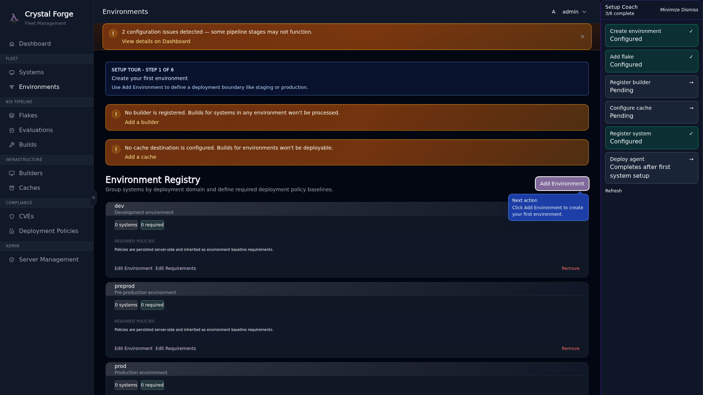
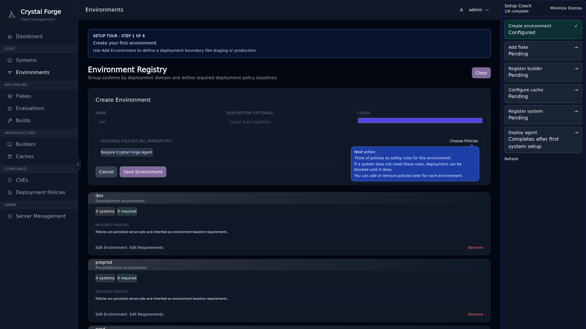
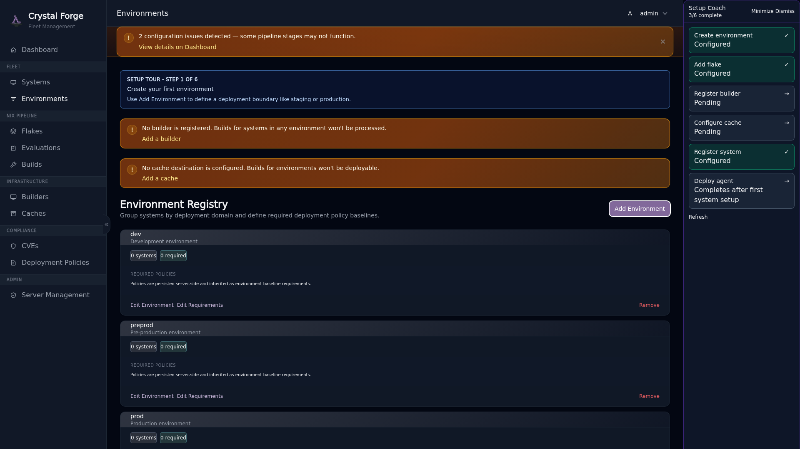

# Step 1: Create Environment

**Environments** in Crystal Forge are logical groupings for your NixOS systems. They represent deployment contexts like `production`, `staging`, or `development`. Each environment can have different deployment policies and binary cache configurations.

## Why Environments Matter

- **Deployment Control**: Assign deployment policies per environment (manual, auto, or pinned)
- **Cache Isolation**: Route builds to different binary caches based on environment
- **Access Control**: Future RBAC will scope permissions by environment
- **Compliance Tracking**: Monitor STIG compliance and CVE status per environment

## Guided Tour: Environments Page

Click the "Create environment" step in the coach panel. You'll be taken to the Environments page, where you'll see a callout guiding you to the "Add Environment" button.



Click **Add Environment** to open the creation modal.

## Guided Tour: Create Environment Form

The form shows progressive field callouts and a **Required Policies** section with guidance.



**Fill in:**

- **Name**: A short identifier (e.g., `production`, `staging`, `dev`)
- **Deployment Policy**:
  - `manual`: Admin must approve each deployment
  - `auto_latest`: Automatically deploy the newest successfully deployable derivation for this system configuration; pending or failed newer commits do not replace it
  - `pinned`: Deploy a specific commit/derivation
- **Deployment Strategy**:
  - `immediate_persist`: Activate and set as boot default (recommended)
  - `boot_only`: Queue for next boot (safe rollback option)
- **Required Policies**: Choose STIG controls that must be enabled on all systems in this environment

### What Are Required Policies?

Required policies are **hard configuration requirements**. Systems in this environment **must** have these STIG controls enabled in their NixOS configuration. If a system's config doesn't include a required policy, Crystal Forge will block deployment to prevent compliance drift.

You can adjust required policies later per environment.



**Example environment configuration:**

```yaml
Name: production
Deployment Policy: manual
Deployment Strategy: immediate_persist
Required Policies:
  - Account Expiry
  - Login Banner
  - Password Complexity
```

After creating your first environment, the coach will mark **Step 1** complete.

## Related concepts

- [Onboarding guide: first-time server setup prerequisites](onboarding-first-time-setup-prerequisites.md)
- [Guided setup coach, POA&M dashboard notes, and security workflows track](../ui/guided-setup-coach.md)
- [Onboarding troubleshooting](onboarding-troubleshooting.md)
- [Step 2: Add Flake](onboarding-step-2-flake.md)
